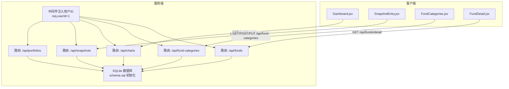
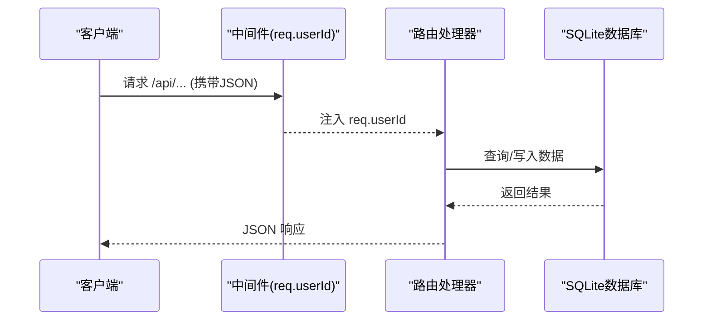
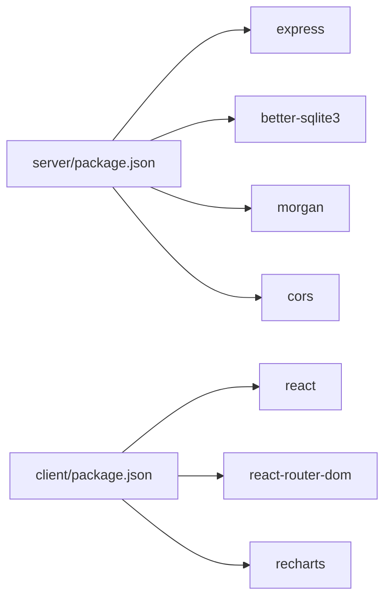
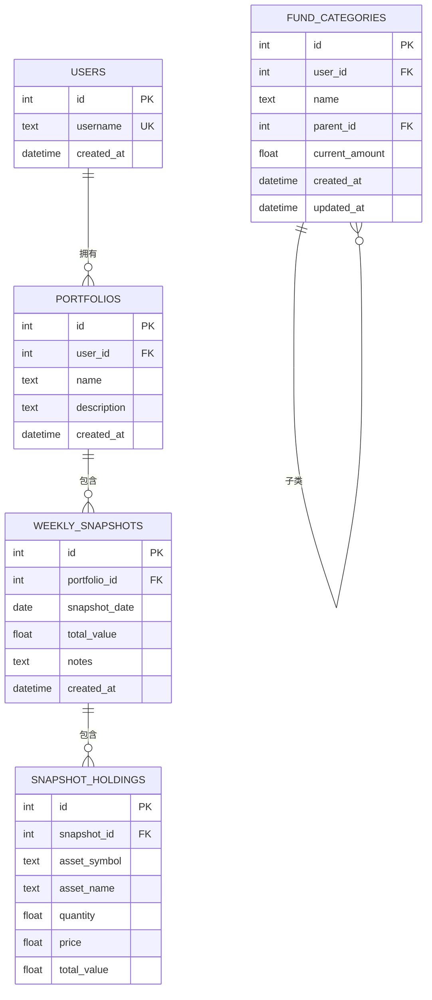
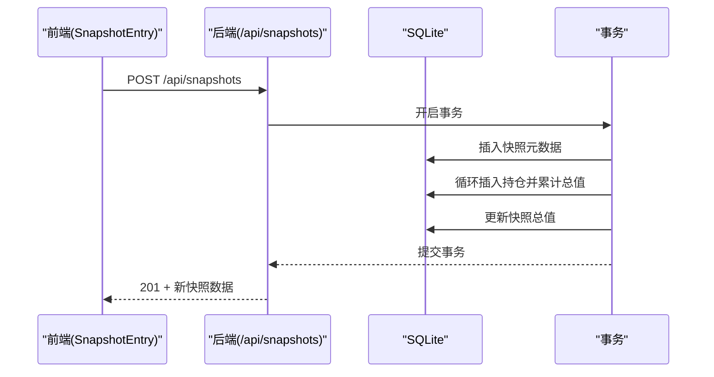
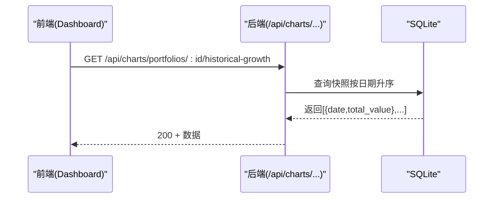

# API接口文档

<cite>
**本文引用的文件**
- [server/index.js](file://server/index.js)
- [server/db/index.js](file://server/db/index.js)
- [server/db/schema.sql](file://server/db/schema.sql)
- [server/routes/portfolios.js](file://server/routes/portfolios.js)
- [server/routes/snapshots.js](file://server/routes/snapshots.js)
- [server/routes/charts.js](file://server/routes/charts.js)
- [server/routes/fundCategories.js](file://server/routes/fundCategories.js)
- [server/routes/funds.js](file://server/routes/funds.js)
- [client/src/App.jsx](file://client/src/App.jsx)
- [client/src/pages/Dashboard.jsx](file://client/src/pages/Dashboard.jsx)
- [client/src/pages/SnapshotEntry.jsx](file://client/src/pages/SnapshotEntry.jsx)
- [client/src/pages/FundCategories.jsx](file://client/src/pages/FundCategories.jsx)
- [client/src/pages/FundDetail.jsx](file://client/src/pages/FundDetail.jsx)
- [server/package.json](file://server/package.json)
- [client/package.json](file://client/package.json)
</cite>

## 目录
1. [简介](#简介)
2. [项目结构](#项目结构)
3. [核心组件](#核心组件)
4. [架构总览](#架构总览)
5. [详细接口规范](#详细接口规范)
6. [依赖关系分析](#依赖关系分析)
7. [性能与可扩展性](#性能与可扩展性)
8. [故障排查指南](#故障排查指南)
9. [结论](#结论)
10. [附录](#附录)

## 简介
本项目是一个个人投资追踪系统，提供RESTful API用于：
- 投资组合查询与快照管理
- 图表数据（历史增长、最新持仓）
- 资金分类树形管理
- 资金汇总与明细

系统采用前后端分离架构：前端使用React + Vite，后端基于Express + better-sqlite3，数据库通过SQLite文件持久化，并在启动时自动初始化表结构与默认数据。

## 项目结构
后端服务通过中间件注入用户上下文（硬编码用户ID），并按模块挂载路由：
- 投资组合：/api/portfolios
- 快照：/api/snapshots
- 图表：/api/charts
- 资金分类：/api/fund-categories
- 资金：/api/funds

**图示来源**
- [server/index.js:17-28](file://server/index.js#L17-L28)
- [server/db/schema.sql:14-79](file://server/db/schema.sql#L14-L79)

**章节来源**
- [server/index.js:17-28](file://server/index.js#L17-L28)
- [server/db/index.js:1-19](file://server/db/index.js#L1-L19)
- [server/db/schema.sql:14-79](file://server/db/schema.sql#L14-L79)

## 核心组件
- 中间件注入用户ID：所有路由通过中间件将用户标识注入到请求对象，便于后续权限与数据隔离。
- 路由模块：按功能拆分，职责清晰，便于维护与扩展。
- 数据层：SQLite文件存储，启动时执行schema初始化，确保表存在与默认数据。

**章节来源**
- [server/index.js:17-21](file://server/index.js#L17-L21)
- [server/db/index.js:12-17](file://server/db/index.js#L12-L17)
- [server/db/schema.sql:14-79](file://server/db/schema.sql#L14-L79)

## 架构总览
系统遵循REST风格，统一前缀/api，资源按领域划分。认证采用“伪认证”（硬编码用户ID），生产环境应替换为真实鉴权方案。

**图示来源**
- [server/index.js:17-28](file://server/index.js#L17-L28)
- [server/db/index.js:12-17](file://server/db/index.js#L12-L17)

## 详细接口规范

### 认证与上下文
- 当前实现：中间件将 req.userId 固定为 1，所有请求均以该用户身份访问数据。
- 生产建议：替换为JWT或会话认证，校验用户令牌并在中间件中设置 req.userId。

**章节来源**
- [server/index.js:17-21](file://server/index.js#L17-L21)

### 投资组合 API
- 路径与方法
  - GET /api/portfolios
    - 描述：获取当前用户的投资组合列表
    - 成功响应：数组，元素为组合对象
    - 状态码：200
    - 错误：500
  - POST /api/portfolios
    - 描述：新建投资组合
    - 请求体字段：name（必填）、description（可选）
    - 成功响应：新建组合对象
    - 状态码：201；400：缺少必要字段；500：内部错误
  - GET /api/portfolios/:id/snapshots
    - 描述：获取指定组合的所有快照（按日期倒序）
    - 成功响应：数组，元素为快照对象
    - 状态码：200；500：内部错误
  - GET /api/portfolios/:id/snapshots/latest
    - 描述：获取指定组合的最新快照及持仓
    - 成功响应：快照对象（含 holdings 数组）；若无快照返回 null
    - 状态码：200；500：内部错误

- 请求示例
  - POST /api/portfolios
    - Body: {"name":"退休账户","description":"长期定投"}
- 响应示例
  - 201 Created: {"id":..., "user_id":1, "name":"退休账户", "description":"..."}
  - 200 OK: [{"id":1,"portfolio_id":1,"snapshot_date":"2025-01-01","total_value":123456.78,"notes":null},...]

- 错误处理
  - 400：请求体缺失必要字段
  - 500：数据库异常

**章节来源**
- [server/routes/portfolios.js:6-15](file://server/routes/portfolios.js#L6-L15)
- [server/routes/portfolios.js:17-30](file://server/routes/portfolios.js#L17-L30)
- [server/routes/portfolios.js:32-62](file://server/routes/portfolios.js#L32-L62)
- [server/routes/portfolios.js:64-79](file://server/routes/portfolios.js#L64-L79)

### 快照管理 API
- 路径与方法
  - POST /api/snapshots
    - 描述：创建新快照
    - 请求体字段：portfolio_id（必填）、snapshot_date（必填）、notes（可选）、holdings（必填，数组）
    - 成功响应：快照元数据（含计算后的 total_value）
    - 状态码：201；400：缺少必要字段；409：同日重复；500：内部错误
  - PUT /api/snapshots/:id
    - 描述：更新现有快照
    - 请求体字段：snapshot_date（必填）、notes（可选）、holdings（必填，数组）
    - 成功响应：更新后的快照元数据
    - 状态码：200；400：缺少必要字段；500：内部错误
  - GET /api/snapshots/:id
    - 描述：获取单个快照详情（含持仓）
    - 成功响应：快照对象（含 holdings 数组）
    - 状态码：200；404：未找到；500：内部错误

- 请求示例
  - POST /api/snapshots
    - Body: {"portfolio_id":1,"snapshot_date":"2025-01-05","notes":"市场反弹","holdings":[{"asset_symbol":"AAPL","asset_name":"Apple","quantity":10,"price":180.0},{"asset_symbol":"MSFT","asset_name":"Microsoft","quantity":5,"price":300.0}]}
- 响应示例
  - 201 Created: {"id":..., "portfolio_id":1, "snapshot_date":"2025-01-05","total_value":2700.0,"notes":"..."}
  - 200 OK: {"id":1,"portfolio_id":1,"snapshot_date":"2025-01-05","total_value":2700.0,"notes":"...","holdings":[{"id":1,"snapshot_id":1,"asset_symbol":"AAPL","asset_name":"Apple","quantity":10,"price":180.0,"total_value":1800.0},...]}

- 错误处理
  - 400：缺少必要字段或 holdings 不是数组
  - 409：同日重复（UNIQUE冲突）
  - 500：数据库异常

**章节来源**
- [server/routes/snapshots.js:33-72](file://server/routes/snapshots.js#L33-L72)
- [server/routes/snapshots.js:74-106](file://server/routes/snapshots.js#L74-L106)
- [server/routes/snapshots.js:108-121](file://server/routes/snapshots.js#L108-L121)

### 图表数据 API
- 路径与方法
  - GET /api/charts/portfolios/:portfolioId/historical-growth
    - 描述：获取指定组合的历史总值增长曲线（按日期升序）
    - 成功响应：数组，元素为 {date, total_value}
    - 状态码：200；500：内部错误
  - GET /api/charts/portfolios/:portfolioId/current-holdings
    - 描述：获取指定组合最新快照的有效持仓（quantity>0 且 total_value>0，按价值降序）
    - 成功响应：对象 {snapshot_date, data:[...]}
    - 状态码：200；500：内部错误

- 请求示例
  - GET /api/charts/portfolios/1/historical-growth
  - GET /api/charts/portfolios/1/current-holdings
- 响应示例
  - 历史增长：[{"date":"2024-12-25","total_value":120000.0},{"date":"2025-01-01","total_value":123456.78}]
  - 最新持仓：{"snapshot_date":"2025-01-05","data":[{"asset_symbol":"AAPL","asset_name":"Apple","quantity":10,"price":180.0,"total_value":1800.0},...]}

- 错误处理
  - 500：内部错误

**章节来源**
- [server/routes/charts.js:10-27](file://server/routes/charts.js#L10-L27)
- [server/routes/charts.js:33-72](file://server/routes/charts.js#L33-L72)

### 资金分类 API
- 路径与方法
  - GET /api/fund-categories/tree
    - 描述：获取当前用户的资金分类树（仅根节点与直接子节点）
    - 成功响应：树形结构数组
    - 状态码：200；500：内部错误
  - POST /api/fund-categories
    - 描述：创建分类（支持一级/二级）
    - 请求体字段：name（必填）、parent_id（可选）、current_amount（可选，默认0）
    - 成功响应：新建分类对象
    - 状态码：201；400：name缺失或层级限制；404：父分类不存在；409：同级名称重复；500：内部错误
  - PUT /api/fund-categories/:id
    - 描述：更新分类（支持修改名称、父类、金额）
    - 请求体字段：name（可选）、parent_id（可选）、current_amount（可选）
    - 成功响应：更新后的分类对象
    - 状态码：200；400：自身为父、层级限制或名称重复；404：未找到；500：内部错误

- 请求示例
  - POST /api/fund-categories
    - Body: {"name":"指数基金","parent_id":1,"current_amount":50000}
  - PUT /api/fund-categories/2
    - Body: {"name":"增强版指数基金","current_amount":55000}
- 响应示例
  - 201 Created: {"id":..., "user_id":1, "name":"指数基金","parent_id":1,"current_amount":50000.0,...}
  - 200 OK: {"id":2,"user_id":1,"name":"增强版指数基金","parent_id":1,"current_amount":55000.0,...}

- 错误处理
  - 400：name缺失、自身为父、层级限制、名称重复
  - 404：父分类不存在或目标不存在
  - 409：同级名称重复
  - 500：内部错误

**章节来源**
- [server/routes/fundCategories.js:29-43](file://server/routes/fundCategories.js#L29-L43)
- [server/routes/fundCategories.js:45-81](file://server/routes/fundCategories.js#L45-L81)
- [server/routes/fundCategories.js:83-136](file://server/routes/fundCategories.js#L83-L136)

### 资金汇总 API
- 路径与方法
  - GET /api/funds/summary
    - 描述：首页展示的资金汇总（仅顶级分类，含子项合计）
    - 成功响应：对象 {total_amount, categories:[{id,name,amount}]}
    - 状态码：200；500：内部错误
  - GET /api/funds/detail
    - 描述：详情页展示的完整树形明细（顶级+二级）
    - 成功响应：对象 {total_amount, categories:树形}
    - 状态码：200；500：内部错误

- 请求示例
  - GET /api/funds/summary
  - GET /api/funds/detail
- 响应示例
  - summary: {"total_amount":123456.78,"categories":[{"id":1,"name":"投资理财","amount":60000.0},{"id":2,"name":"公积金","amount":40000.0}]}
  - detail: {"total_amount":123456.78,"categories":[{"id":1,"name":"投资理财","amount":60000.0,"total_amount":65000.0,"children":[{"id":3,"name":"指数基金","amount":50000.0,"total_amount":50000.0}]},...]}

- 错误处理
  - 500：内部错误

**章节来源**
- [server/routes/funds.js:6-45](file://server/routes/funds.js#L6-L45)
- [server/routes/funds.js:47-92](file://server/routes/funds.js#L47-L92)

## 依赖关系分析
- 服务端依赖
  - Express：Web框架
  - better-sqlite3：SQLite驱动
  - morgan：日志
  - cors：跨域
- 客户端依赖
  - react/react-router-dom：前端框架与路由
  - recharts：图表渲染

**图示来源**
- [server/package.json:11-16](file://server/package.json#L11-L16)
- [client/package.json:11-22](file://client/package.json#L11-L22)

**章节来源**
- [server/package.json:11-16](file://server/package.json#L11-L16)
- [client/package.json:11-22](file://client/package.json#L11-L22)

## 性能与可扩展性
- 数据库索引
  - 快照唯一索引：(portfolio_id, snapshot_date)，避免重复快照
  - 资金分类唯一索引：顶级分类同名唯一、二级分类在同一父类下唯一
- 建议优化
  - 对高频查询添加合适索引（如按日期范围查询快照）
  - 分页与缓存：对大列表与图表数据增加分页或短期缓存
  - 连接池：生产环境可引入连接池管理
  - 并发控制：对写操作加锁或事务封装，保证一致性

**章节来源**
- [server/db/schema.sql:32](file://server/db/schema.sql#L32)
- [server/db/schema.sql:61-68](file://server/db/schema.sql#L61-L68)

## 故障排查指南
- 常见问题
  - 400 错误：检查请求体字段是否齐全，数组类型是否正确
  - 404 错误：确认资源ID是否存在，父分类是否存在
  - 409 冲突：检查是否已有同日快照或同级重复名称
  - 500 错误：查看服务端日志定位SQL异常
- 前端调试
  - 使用浏览器开发者工具观察网络请求与响应
  - 在页面中打印关键数据结构，核对字段与类型

**章节来源**
- [server/routes/snapshots.js:37-40](file://server/routes/snapshots.js#L37-L40)
- [server/routes/fundCategories.js:49-51](file://server/routes/fundCategories.js#L49-L51)
- [server/routes/snapshots.js:66-71](file://server/routes/snapshots.js#L66-L71)

## 结论
本API文档覆盖了投资组合、快照、图表、资金分类与资金汇总等核心能力。当前实现采用伪认证与本地SQLite，适合开发与演示；生产部署需完善鉴权、日志、监控与数据库优化。建议在保持现有接口稳定的同时，逐步引入版本控制与向后兼容策略，保障演进过程中的客户端兼容。

## 附录

### 数据模型概览

**图示来源**
- [server/db/schema.sql:14-79](file://server/db/schema.sql#L14-L79)

### API调用流程示例

#### 新建快照（序列图）

**图示来源**
- [server/routes/snapshots.js:34-72](file://server/routes/snapshots.js#L34-L72)

#### 获取历史增长（序列图）

**图示来源**
- [server/routes/charts.js:10-27](file://server/routes/charts.js#L10-L27)

### 客户端集成指南与最佳实践
- 集成步骤
  - 在应用入口配置基础URL（如使用代理或统一拦截器）
  - 统一处理鉴权：当前实现固定用户ID，生产需替换为真实令牌
  - 错误处理：对4xx/5xx进行提示与重试
  - 数据缓存：对静态或低频数据做本地缓存
- 最佳实践
  - 前端表单校验：在提交前校验必填与数值范围
  - 批量操作：对快照持仓采用一次性提交，减少往返
  - 图表性能：对历史数据分段加载，避免一次性渲染过多点位

**章节来源**
- [client/src/pages/Dashboard.jsx:14-32](file://client/src/pages/Dashboard.jsx#L14-L32)
- [client/src/pages/SnapshotEntry.jsx:42-66](file://client/src/pages/SnapshotEntry.jsx#L42-L66)
- [client/src/pages/FundCategories.jsx:35-65](file://client/src/pages/FundCategories.jsx#L35-L65)
- [client/src/pages/FundDetail.jsx:6-14](file://client/src/pages/FundDetail.jsx#L6-L14)

### 版本控制与向后兼容
- 当前版本
  - 服务端版本号：参见 [server/package.json:3](file://server/package.json#L3)
- 版本策略建议
  - URL版本：/api/v1/... 或 /api/v2/...
  - 头部版本：Accept: application/vnd.company.v1+json
  - 语义化变更：破坏性变更升级大版本，非破坏性变更小版本
  - 文档同步：变更时同步更新接口文档与迁移指南

**章节来源**
- [server/package.json:3](file://server/package.json#L3)