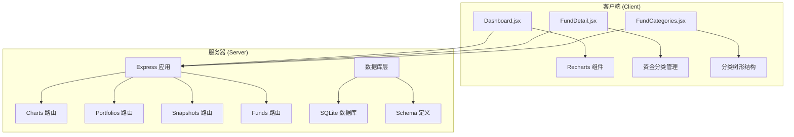
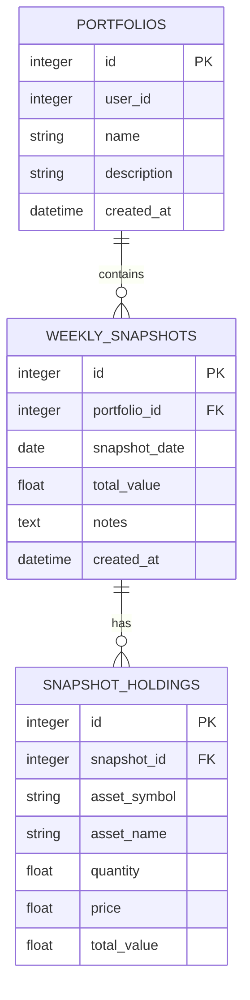
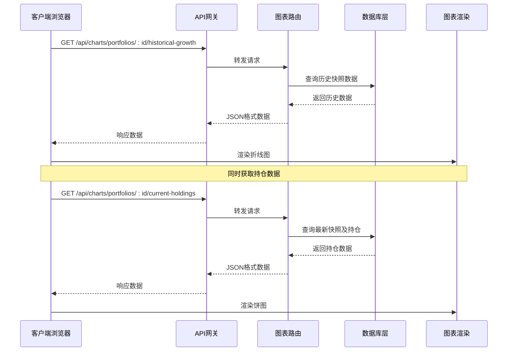
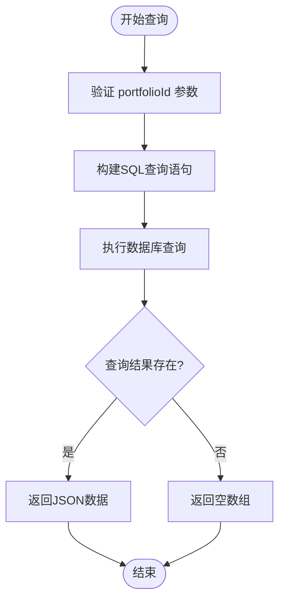
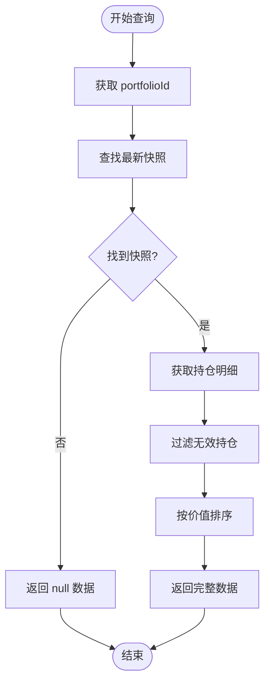
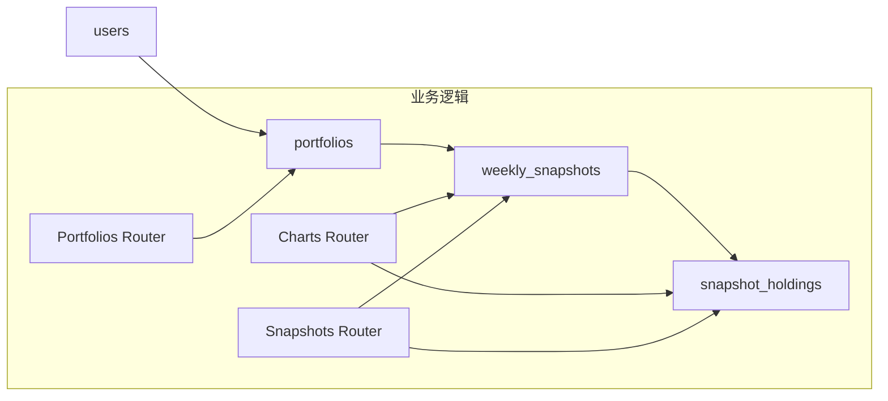
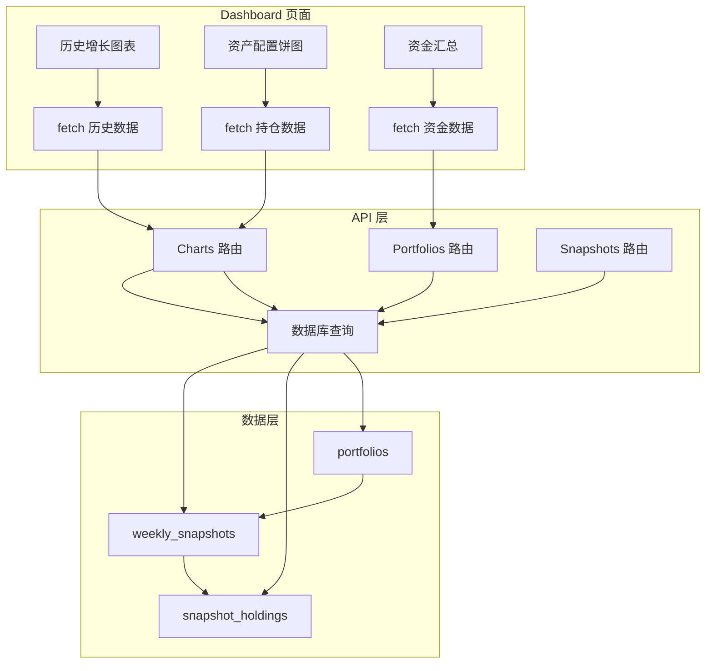

# 图表数据API

<cite>
**本文档引用的文件**
- [server/routes/charts.js](file://server/routes/charts.js)
- [server/db/index.js](file://server/db/index.js)
- [server/db/schema.sql](file://server/db/schema.sql)
- [server/index.js](file://server/index.js)
- [client/src/pages/Dashboard.jsx](file://client/src/pages/Dashboard.jsx)
- [server/routes/snapshots.js](file://server/routes/snapshots.js)
- [server/routes/portfolios.js](file://server/routes/portfolios.js)
- [server/routes/funds.js](file://server/routes/funds.js)
</cite>

## 目录
1. [简介](#简介)
2. [项目结构](#项目结构)
3. [核心组件](#核心组件)
4. [架构概览](#架构概览)
5. [详细组件分析](#详细组件分析)
6. [依赖关系分析](#依赖关系分析)
7. [性能考虑](#性能考虑)
8. [故障排除指南](#故障排除指南)
9. [结论](#结论)

## 简介

本文件为数据可视化功能的API文档，专注于历史增长图表、资产配置饼图、收益统计等图表数据的获取接口。系统基于Node.js + Express后端和React前端构建，使用SQLite作为数据存储，通过RESTful API提供图表数据服务。

## 项目结构

项目采用前后端分离架构，主要包含以下模块：



**图表来源**
- [server/index.js:1-32](file://server/index.js#L1-L32)
- [server/routes/charts.js:1-74](file://server/routes/charts.js#L1-L74)

**章节来源**
- [server/index.js:1-32](file://server/index.js#L1-L32)
- [server/db/schema.sql:1-79](file://server/db/schema.sql#L1-L79)

## 核心组件

### 图表路由模块

图表功能主要通过`charts.js`路由模块提供，包含两个核心接口：

1. **历史增长数据接口** - 获取投资组合的总资产历史变化
2. **当前持仓数据接口** - 获取最新快照的投资组合资产配置

### 数据模型

系统使用以下核心数据表：



**图表来源**
- [server/db/schema.sql:13-45](file://server/db/schema.sql#L13-L45)

**章节来源**
- [server/routes/charts.js:6-72](file://server/routes/charts.js#L6-L72)
- [server/db/schema.sql:13-45](file://server/db/schema.sql#L13-L45)

## 架构概览

系统采用分层架构设计，确保图表数据的高效获取和展示：



**图表来源**
- [server/routes/charts.js:10-72](file://server/routes/charts.js#L10-L72)
- [client/src/pages/Dashboard.jsx:14-32](file://client/src/pages/Dashboard.jsx#L14-L32)

## 详细组件分析

### 历史增长图表接口

#### 接口定义

**GET** `/api/charts/portfolios/{portfolioId}/historical-growth`

##### 请求参数
- `portfolioId` (路径参数): 投资组合ID，整数类型

##### 响应数据结构
```javascript
[
  {
    "date": "YYYY-MM-DD",           // 快照日期
    "total_value": number           // 总资产价值
  },
  // ... 更多数据点
]
```

##### 数据聚合算法
- **时间序列聚合**: 按周快照日期排序，确保时间序列连续性
- **数据完整性**: 直接从`weekly_snapshots`表获取，保证数据一致性
- **排序规则**: 按`snapshot_date`升序排列

##### 示例请求
```bash
curl -X GET "http://localhost:5000/api/charts/portfolios/1/historical-growth"
```

##### 示例响应
```json
[
  {"date": "2024-01-01", "total_value": 100000.00},
  {"date": "2024-01-08", "total_value": 105000.00},
  {"date": "2024-01-15", "total_value": 102500.00}
]
```

**章节来源**
- [server/routes/charts.js:6-27](file://server/routes/charts.js#L6-L27)

### 当前持仓配置接口

#### 接口定义

**GET** `/api/charts/portfolios/{portfolioId}/current-holdings`

##### 请求参数
- `portfolioId` (路径参数): 投资组合ID，整数类型

##### 响应数据结构
```javascript
{
  "snapshot_date": "YYYY-MM-DD",       // 最新快照日期
  "data": [
    {
      "asset_symbol": string,          // 资产代码
      "asset_name": string,            // 资产名称
      "quantity": number,              // 数量
      "price": number,                 // 单价
      "total_value": number            // 总价值
    }
  ]
}
```

##### 数据聚合算法
- **最新快照识别**: 通过`ORDER BY snapshot_date DESC LIMIT 1`获取最新快照
- **持仓过滤**: 自动过滤掉数量为0或总价值为0的资产
- **排序规则**: 按`total_value`降序排列，突出显示主要持仓

##### 数据计算规则
- **总价值计算**: `total_value = quantity × price`
- **异常值处理**: 过滤无效数据（quantity ≤ 0 或 total_value ≤ 0）
- **数据精度**: 使用数据库的REAL类型存储浮点数

##### 示例请求
```bash
curl -X GET "http://localhost:5000/api/charts/portfolios/1/current-holdings"
```

##### 示例响应
```json
{
  "snapshot_date": "2024-01-15",
  "data": [
    {
      "asset_symbol": "AAPL",
      "asset_name": "Apple Inc.",
      "quantity": 10,
      "price": 150.00,
      "total_value": 1500.00
    }
  ]
}
```

**章节来源**
- [server/routes/charts.js:29-72](file://server/routes/charts.js#L29-L72)

### 数据处理流程

#### 历史数据处理流程



#### 持仓数据处理流程



**图表来源**
- [server/routes/charts.js:33-67](file://server/routes/charts.js#L33-L67)

**章节来源**
- [server/routes/charts.js:10-72](file://server/routes/charts.js#L10-L72)

## 依赖关系分析

### 数据库依赖关系



**图表来源**
- [server/db/schema.sql:13-45](file://server/db/schema.sql#L13-L45)
- [server/routes/charts.js:1-2](file://server/routes/charts.js#L1-L2)

### 前端集成关系



**图表来源**
- [client/src/pages/Dashboard.jsx:14-32](file://client/src/pages/Dashboard.jsx#L14-L32)
- [server/routes/charts.js:10-72](file://server/routes/charts.js#L10-L72)

**章节来源**
- [client/src/pages/Dashboard.jsx:14-32](file://client/src/pages/Dashboard.jsx#L14-L32)
- [server/routes/charts.js:10-72](file://server/routes/charts.js#L10-L72)

## 性能考虑

### 数据库优化策略

1. **索引优化**
   - `weekly_snapshots`: 基于`(portfolio_id, snapshot_date)`的唯一索引
   - `snapshot_holdings`: 基于`snapshot_id`的外键索引

2. **查询优化**
   - 使用`LIMIT 1`获取最新快照，避免全表扫描
   - 通过`ORDER BY`直接在数据库层面排序

3. **事务处理**
   - 快照创建和更新使用事务确保数据一致性
   - 批量插入持仓数据减少数据库往返

### 前端性能优化

1. **数据缓存**
   - React状态管理避免重复请求
   - 组件卸载时清理定时器和事件监听器

2. **渲染优化**
   - Recharts组件自动处理数据更新
   - ResponsiveContainer自适应图表尺寸

3. **错误处理**
   - 统一的错误边界处理
   - 网络请求超时和重试机制

## 故障排除指南

### 常见问题及解决方案

#### 数据为空问题
**症状**: 图表显示空白
**可能原因**:
- 投资组合不存在
- 缺少快照数据
- 持仓全部为0

**解决方法**:
- 检查`/api/portfolios`确认投资组合存在
- 确认至少有一个快照记录
- 验证持仓数据的有效性

#### 数据库连接问题
**症状**: API返回500错误
**可能原因**:
- SQLite文件权限问题
- Schema初始化失败
- 数据库文件损坏

**解决方法**:
- 检查数据库文件权限
- 重新初始化数据库
- 验证数据库文件完整性

#### 前端渲染问题
**症状**: 图表无法正确显示
**可能原因**:
- 数据格式不符合预期
- Recharts版本兼容性问题
- 内存泄漏导致性能下降

**解决方法**:
- 验证API响应格式
- 更新Recharts到最新版本
- 使用React DevTools检查组件状态

**章节来源**
- [server/routes/charts.js:23-26](file://server/routes/charts.js#L23-L26)
- [server/routes/charts.js:68-71](file://server/routes/charts.js#L68-L71)

## 结论

本图表数据API提供了完整的历史增长图表和资产配置饼图数据服务。系统采用简洁高效的架构设计，通过合理的数据模型和查询优化确保了良好的性能表现。前端使用Recharts进行数据可视化，提供了直观的用户体验。

主要特点包括：
- **数据完整性**: 通过外键约束和事务处理确保数据一致性
- **查询效率**: 合理的索引设计和查询优化
- **扩展性**: 模块化的路由设计便于功能扩展
- **易用性**: 清晰的API接口和错误处理机制

未来可以考虑的改进方向：
- 添加缓存机制提升查询性能
- 实现数据分页处理大量历史数据
- 增加数据验证和异常值检测
- 提供更灵活的时间范围筛选功能