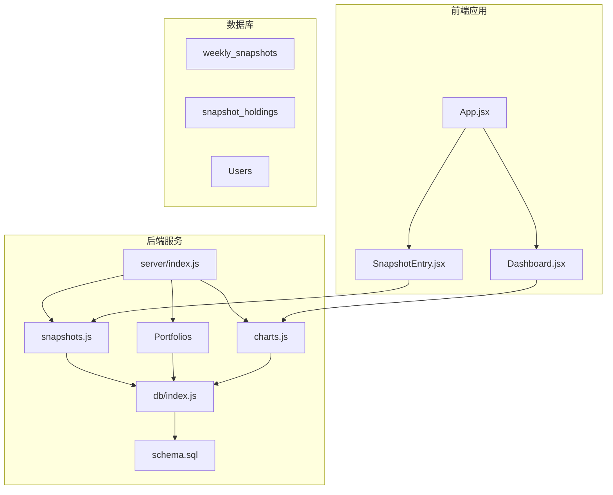
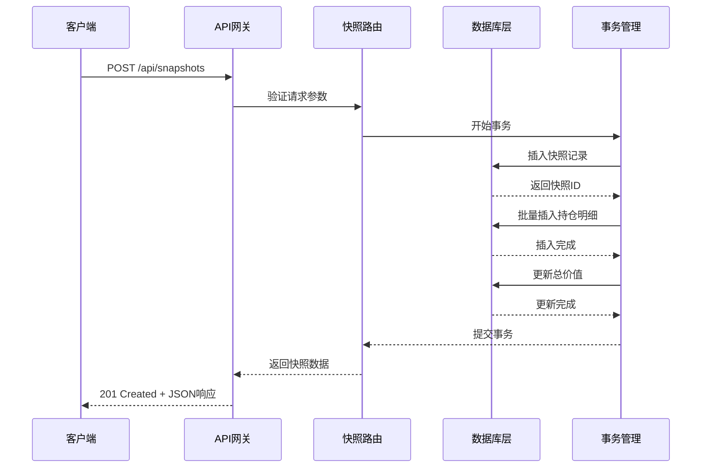
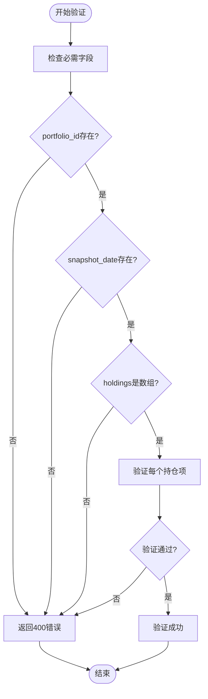
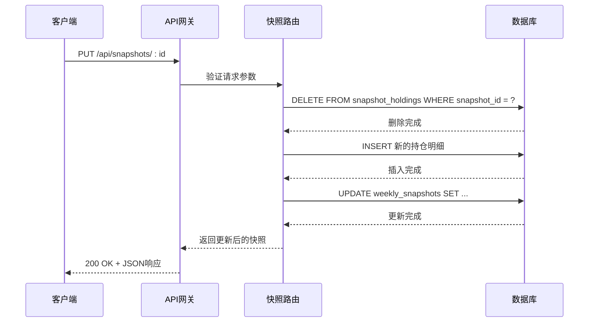
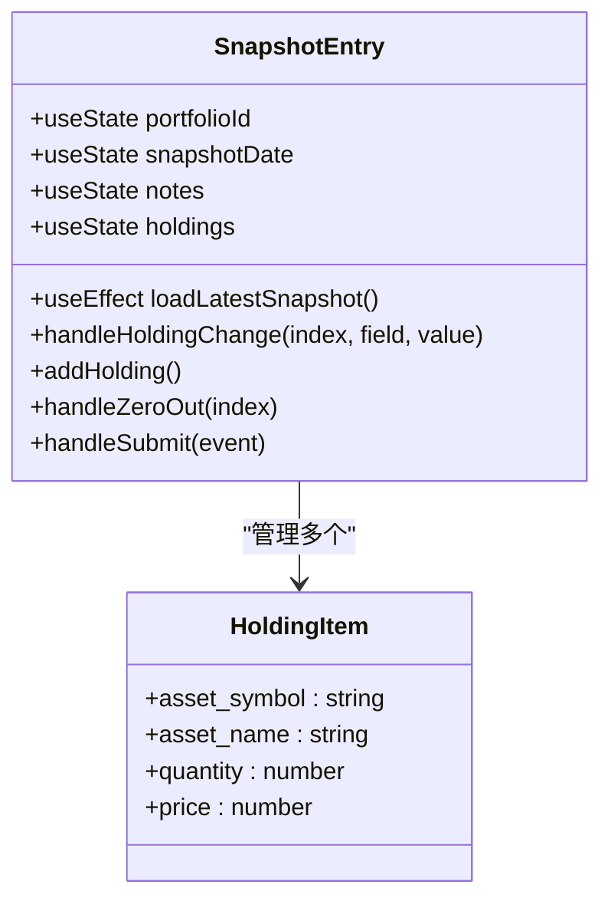
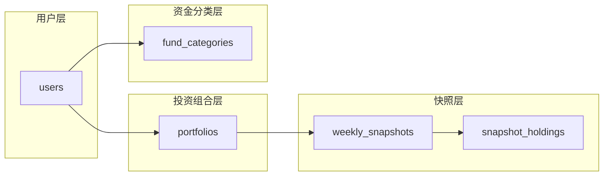
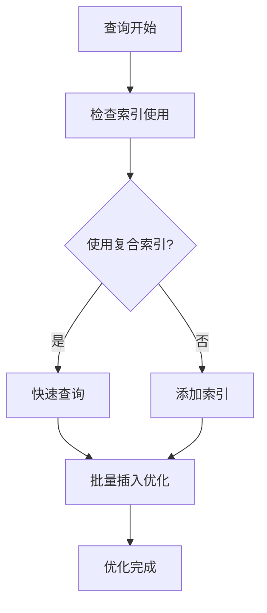
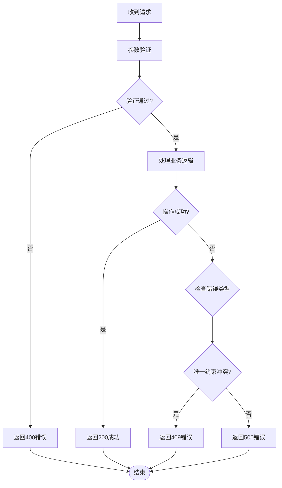

# 快照管理API

<cite>
**本文档引用的文件**
- [server/routes/snapshots.js](file://server/routes/snapshots.js)
- [server/routes/portfolios.js](file://server/routes/portfolios.js)
- [server/routes/charts.js](file://server/routes/charts.js)
- [server/db/schema.sql](file://server/db/schema.sql)
- [server/db/index.js](file://server/db/index.js)
- [server/index.js](file://server/index.js)
- [client/src/pages/SnapshotEntry.jsx](file://client/src/pages/SnapshotEntry.jsx)
- [client/src/pages/Dashboard.jsx](file://client/src/pages/Dashboard.jsx)
- [client/src/App.jsx](file://client/src/App.jsx)
</cite>

## 目录
1. [简介](#简介)
2. [项目结构](#项目结构)
3. [核心组件](#核心组件)
4. [架构概览](#架构概览)
5. [详细组件分析](#详细组件分析)
6. [依赖关系分析](#依赖关系分析)
7. [性能考虑](#性能考虑)
8. [故障排除指南](#故障排除指南)
9. [结论](#结论)

## 简介

快照管理API是投资组合管理系统中的核心功能模块，用于记录和管理投资组合在特定时间点的财务状况。该系统通过快照机制跟踪投资组合的总资产价值、持仓分布和历史变化趋势，为用户提供全面的投资组合分析和决策支持。

系统采用前后端分离架构，后端基于Express.js和SQLite数据库，前端使用React构建用户界面。快照数据结构包括投资组合基本信息、时间戳、总资产价值以及详细的持仓明细。

## 项目结构

快照管理功能分布在以下主要模块中：



**图表来源**
- [server/index.js:1-32](file://server/index.js#L1-L32)
- [server/routes/snapshots.js:1-124](file://server/routes/snapshots.js#L1-L124)
- [server/routes/portfolios.js:1-81](file://server/routes/portfolios.js#L1-L81)
- [server/routes/charts.js:1-74](file://server/routes/charts.js#L1-L74)

**章节来源**
- [server/index.js:1-32](file://server/index.js#L1-L32)
- [server/db/schema.sql:1-79](file://server/db/schema.sql#L1-L79)

## 核心组件

### 数据模型设计

快照管理系统的数据模型基于以下核心表结构：

```mermaid
erDiagram
USERS {
INTEGER id PK
TEXT username UK
DATETIME created_at
}
PORTFOLIOS {
INTEGER id PK
INTEGER user_id FK
TEXT name
TEXT description
DATETIME created_at
}
WEEKLY_SNAPSHOTS {
INTEGER id PK
INTEGER portfolio_id FK
DATE snapshot_date
REAL total_value
TEXT notes
DATETIME created_at
UNIQUE portfolio_id, snapshot_date
}
SNAPSHOT_HOLDINGS {
INTEGER id PK
INTEGER snapshot_id FK
TEXT asset_symbol
TEXT asset_name
REAL quantity
REAL price
REAL total_value
}
USERS ||--o{ PORTFOLIOS : "owns"
PORTFOLIOS ||--o{ WEEKLY_SNAPSHOTS : "contains"
WEEKLY_SNAPSHOTS ||--o{ SNAPSHOT_HOLDINGS : "has"
```

**图表来源**
- [server/db/schema.sql:14-45](file://server/db/schema.sql#L14-L45)

### 快照数据结构

每个快照包含以下关键字段：

| 字段名 | 类型 | 描述 | 约束 |
|--------|------|------|------|
| id | INTEGER | 快照唯一标识符 | 主键，自增 |
| portfolio_id | INTEGER | 关联的投资组合ID | 外键，必填 |
| snapshot_date | DATE | 快照日期 | 必填，唯一约束 |
| total_value | REAL | 总资产价值 | 默认0，必填 |
| notes | TEXT | 备注信息 | 可选 |
| created_at | DATETIME | 创建时间 | 默认当前时间 |

**章节来源**
- [server/db/schema.sql:23-33](file://server/db/schema.sql#L23-L33)

## 架构概览

快照管理API采用RESTful架构设计，提供完整的CRUD操作和业务逻辑处理：



**图表来源**
- [server/routes/snapshots.js:34-72](file://server/routes/snapshots.js#L34-L72)

### 核心业务流程

系统实现了以下核心业务流程：

1. **快照创建流程**：验证输入参数 → 开启数据库事务 → 插入快照记录 → 计算并插入持仓明细 → 更新总价值 → 提交事务
2. **快照更新流程**：删除旧持仓 → 插入新持仓 → 更新快照元数据 → 自动重新计算总价值
3. **数据一致性保证**：使用SQLite事务确保快照创建和更新的原子性

**章节来源**
- [server/routes/snapshots.js:10-31](file://server/routes/snapshots.js#L10-L31)
- [server/routes/snapshots.js:42-61](file://server/routes/snapshots.js#L42-L61)

## 详细组件分析

### 快照创建API

#### 接口定义

**POST /api/snapshots**
- **功能**：创建新的快照记录
- **请求体**：包含投资组合ID、快照日期、备注和持仓明细数组
- **响应**：返回创建的快照完整信息

#### 请求参数验证

系统对请求参数进行严格验证：



**图表来源**
- [server/routes/snapshots.js:35-39](file://server/routes/snapshots.js#L35-L39)

#### 数据处理逻辑

快照创建过程包含以下关键步骤：

1. **参数验证**：确保必需字段存在且类型正确
2. **事务处理**：使用数据库事务确保数据一致性
3. **快照插入**：向`weekly_snapshots`表插入基础信息
4. **持仓计算**：遍历持仓明细，计算每项的总价值
5. **明细插入**：向`snapshot_holdings`表批量插入持仓信息
6. **总值更新**：更新快照的总资产价值

**章节来源**
- [server/routes/snapshots.js:34-72](file://server/routes/snapshots.js#L34-L72)

### 快照更新API

#### 接口定义

**PUT /api/snapshots/:id**
- **功能**：更新指定ID的快照记录
- **路径参数**：`:id` - 快照唯一标识符
- **请求体**：包含快照日期、备注和新的持仓明细数组

#### 更新流程

快照更新采用"替换式"更新策略：



**图表来源**
- [server/routes/snapshots.js:74-106](file://server/routes/snapshots.js#L74-L106)

### 快照查询API

#### 单个快照查询

**GET /api/snapshots/:id**
- **功能**：获取指定ID的快照详情
- **响应**：返回快照基本信息及关联的持仓明细

#### 投资组合快照查询

**GET /api/portfolios/:id/snapshots**
- **功能**：获取指定投资组合的所有快照记录
- **响应**：按时间倒序排列的快照列表

**章节来源**
- [server/routes/snapshots.js:108-121](file://server/routes/snapshots.js#L108-L121)
- [server/routes/portfolios.js:64-79](file://server/routes/portfolios.js#L64-L79)

### 前端集成组件

#### 快照录入页面

快照录入页面提供了直观的用户界面：



**图表来源**
- [client/src/pages/SnapshotEntry.jsx:4-132](file://client/src/pages/SnapshotEntry.jsx#L4-L132)

**章节来源**
- [client/src/pages/SnapshotEntry.jsx:1-132](file://client/src/pages/SnapshotEntry.jsx#L1-L132)

## 依赖关系分析

### 数据库依赖关系

快照管理功能涉及以下数据库表的复杂依赖关系：



**图表来源**
- [server/db/schema.sql:14-79](file://server/db/schema.sql#L14-L79)

### 外键约束和级联操作

系统通过外键约束确保数据完整性：

| 约束类型 | 源表 | 目标表 | 级联操作 |
|----------|------|--------|----------|
| 用户-投资组合 | users.id | portfolios.user_id | CASCADE |
| 投资组合-快照 | portfolios.id | weekly_snapshots.portfolio_id | CASCADE |
| 快照-持仓明细 | weekly_snapshots.id | snapshot_holdings.snapshot_id | CASCADE |

**章节来源**
- [server/db/schema.sql:20-45](file://server/db/schema.sql#L20-L45)

## 性能考虑

### 数据库优化策略

1. **索引优化**：在`weekly_snapshots`表上建立`(portfolio_id, snapshot_date)`复合索引，支持快速查询和去重约束
2. **事务批处理**：使用SQLite事务批量插入持仓明细，减少磁盘I/O操作
3. **连接池管理**：合理配置数据库连接，避免并发访问冲突

### 查询性能优化



**图表来源**
- [server/db/schema.sql:32](file://server/db/schema.sql#L32)

### 内存管理

前端应用采用以下内存管理策略：
- 使用React hooks进行状态管理
- 合理的数据缓存和清理
- 避免不必要的组件重渲染

## 故障排除指南

### 常见错误类型

#### 参数验证错误

**错误码：400 Bad Request**
- **原因**：缺少必需字段或数据类型不正确
- **解决方案**：检查请求体中的`portfolio_id`、`snapshot_date`和`holdings`字段

#### 数据冲突错误

**错误码：409 Conflict**
- **原因**：同一投资组合在同一天已有快照记录
- **解决方案**：使用PUT方法更新现有快照，或修改快照日期

#### 数据库错误

**错误码：500 Internal Server Error**
- **原因**：数据库操作失败或事务回滚
- **解决方案**：检查数据库连接状态和表结构完整性

### 错误处理流程



**图表来源**
- [server/routes/snapshots.js:65-71](file://server/routes/snapshots.js#L65-L71)

**章节来源**
- [server/routes/snapshots.js:65-71](file://server/routes/snapshots.js#L65-L71)

## 结论

快照管理API为投资组合管理系统提供了完整的时间序列数据管理能力。通过精心设计的数据模型、严格的参数验证和完善的错误处理机制，系统能够可靠地记录和分析投资组合的历史表现。

系统的主要优势包括：
- **数据完整性**：通过外键约束和事务处理确保数据一致性
- **性能优化**：合理的索引设计和批量操作提升查询效率
- **用户体验**：直观的前端界面和清晰的错误反馈
- **扩展性**：模块化的架构设计便于功能扩展和维护

未来可以考虑的功能增强包括：批量导入功能、数据导出能力、更丰富的统计分析工具等。