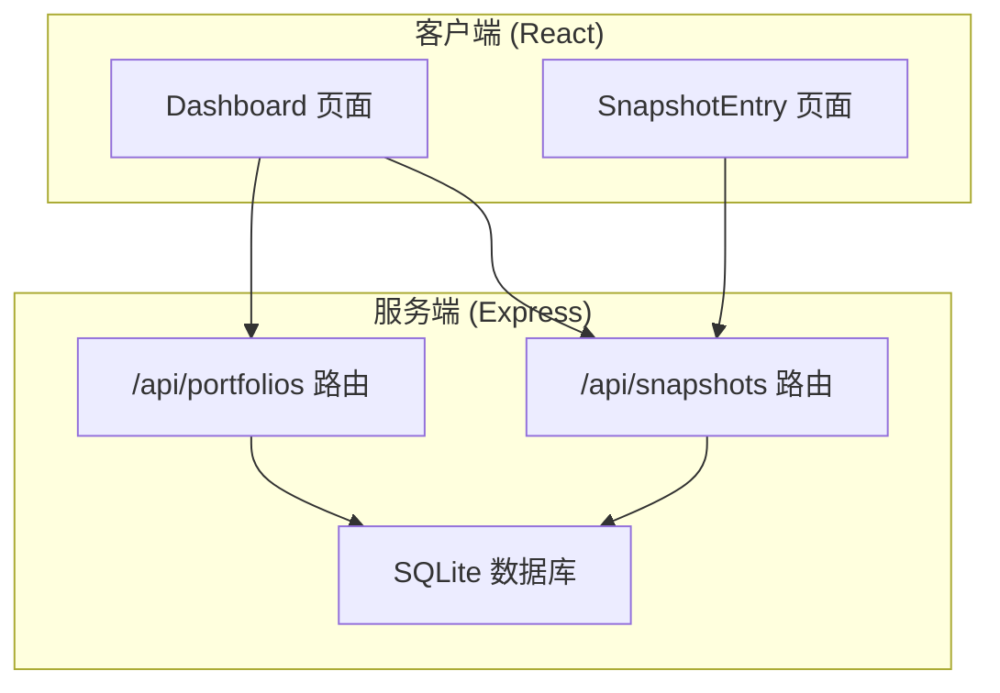
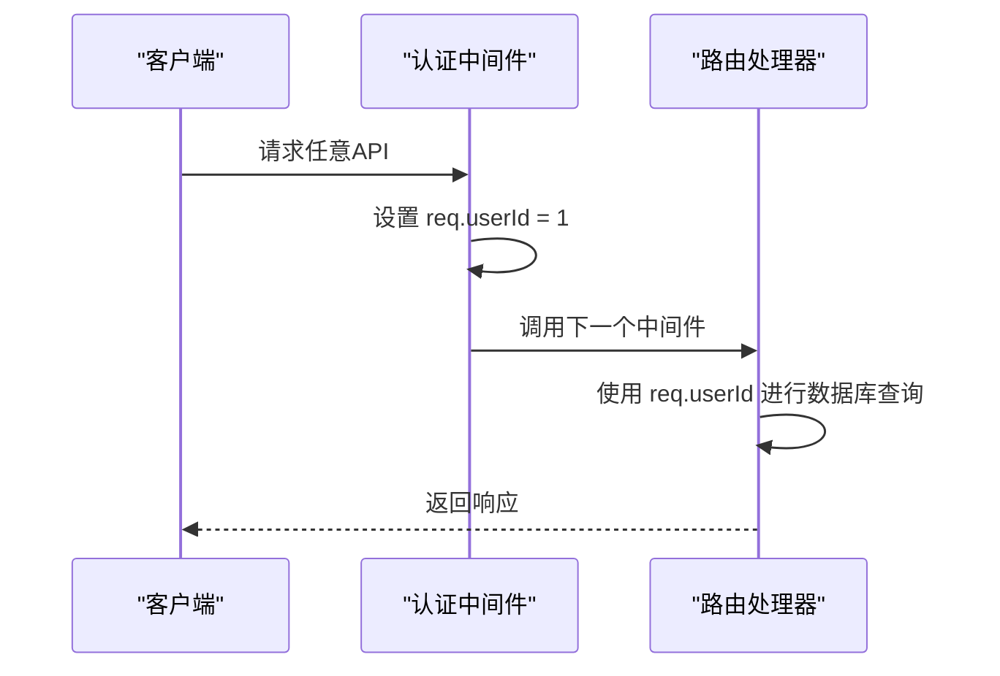
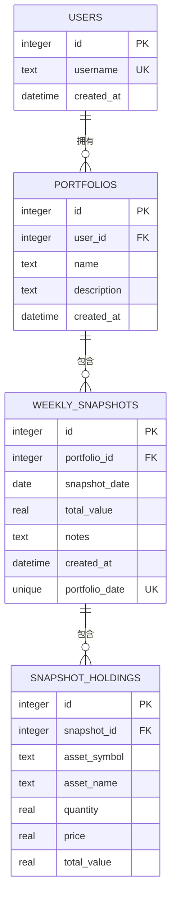
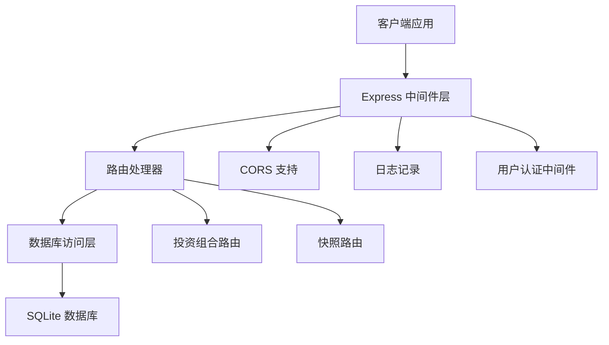
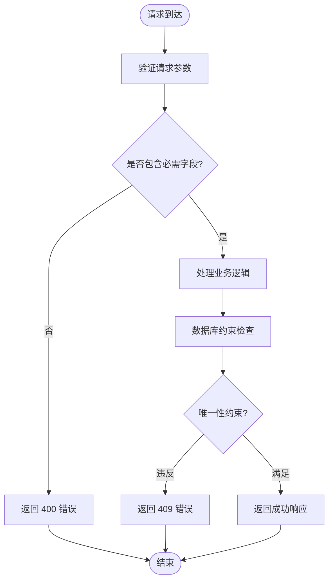
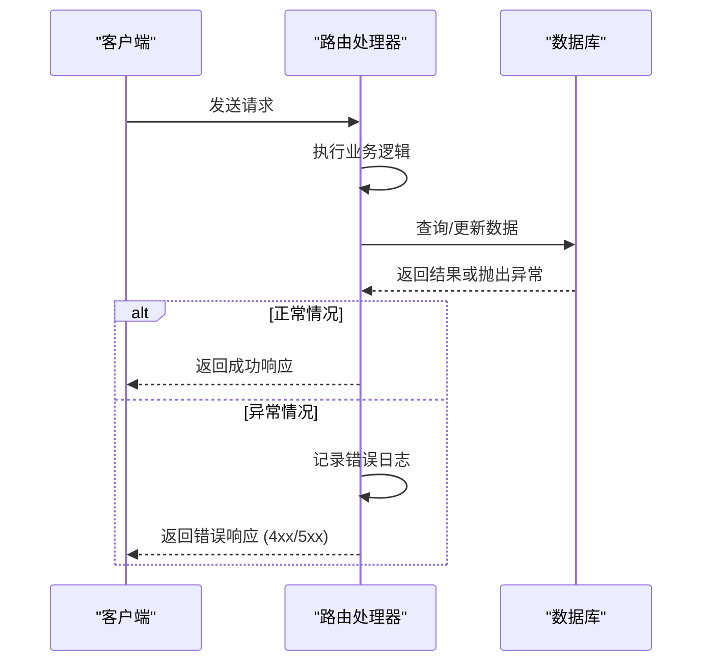
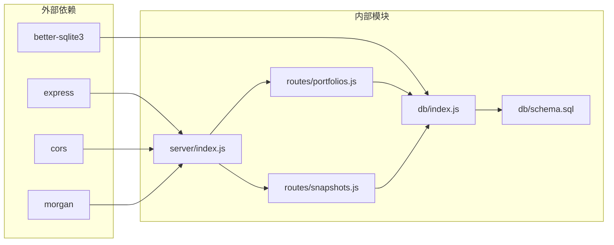

# 投资组合API

<cite>
**本文档引用的文件**
- [server/index.js](file://server/index.js)
- [server/routes/portfolios.js](file://server/routes/portfolios.js)
- [server/routes/snapshots.js](file://server/routes/snapshots.js)
- [server/db/index.js](file://server/db/index.js)
- [server/db/schema.sql](file://server/db/schema.sql)
- [client/src/pages/Dashboard.jsx](file://client/src/pages/Dashboard.jsx)
- [client/src/pages/SnapshotEntry.jsx](file://client/src/pages/SnapshotEntry.jsx)
</cite>

## 目录
1. [简介](#简介)
2. [项目结构](#项目结构)
3. [核心组件](#核心组件)
4. [架构概览](#架构概览)
5. [详细组件分析](#详细组件分析)
6. [依赖分析](#依赖分析)
7. [性能考虑](#性能考虑)
8. [故障排除指南](#故障排除指南)
9. [结论](#结论)

## 简介

本文件为投资组合管理功能的详细API文档，涵盖以下核心接口：
- 获取所有投资组合
- 创建新投资组合  
- 获取最新快照
- 获取所有快照

文档详细说明了每个接口的HTTP方法、URL路径、请求参数、响应格式和状态码，包含用户ID认证机制、数据验证规则和错误处理策略。同时解释投资组合与快照之间的关联关系和数据流转过程，并提供具体的请求示例、响应示例和常见错误场景的解决方案。

## 项目结构

该系统采用前后端分离架构，后端基于Express.js和SQLite数据库，前端使用React构建用户界面。



**图表来源**
- [server/index.js:17-21](file://server/index.js#L17-L21)
- [server/routes/portfolios.js:1-81](file://server/routes/portfolios.js#L1-L81)
- [server/routes/snapshots.js:1-124](file://server/routes/snapshots.js#L1-L124)

**章节来源**
- [server/index.js:1-32](file://server/index.js#L1-L32)
- [server/db/schema.sql:1-79](file://server/db/schema.sql#L1-L79)

## 核心组件

### 认证机制

系统采用中间件方式实现用户认证，通过硬编码的用户ID进行身份验证：



**图表来源**
- [server/index.js:17-21](file://server/index.js#L17-L21)

### 数据库架构

系统使用SQLite作为数据存储，核心表结构如下：



**图表来源**
- [server/db/schema.sql:14-45](file://server/db/schema.sql#L14-L45)

**章节来源**
- [server/db/schema.sql:1-79](file://server/db/schema.sql#L1-L79)
- [server/db/index.js:1-19](file://server/db/index.js#L1-L19)

## 架构概览

系统采用RESTful API设计，遵循HTTP标准和JSON数据格式。整体架构包括三层：



**图表来源**
- [server/index.js:13-28](file://server/index.js#L13-L28)
- [server/routes/portfolios.js:1-81](file://server/routes/portfolios.js#L1-L81)
- [server/routes/snapshots.js:1-124](file://server/routes/snapshots.js#L1-L124)

## 详细组件分析

### 投资组合管理API

#### 获取所有投资组合

**接口定义**
- 方法: GET
- 路径: `/api/portfolios`
- 认证: 需要用户ID (req.userId)
- 响应: 投资组合数组

**请求参数**
- 无查询参数

**响应格式**
```json
[
  {
    "id": 1,
    "user_id": 1,
    "name": "示例投资组合",
    "description": "投资组合描述",
    "created_at": "2024-01-01T00:00:00.000Z"
  }
]
```

**状态码**
- 200: 成功获取投资组合列表
- 500: 服务器内部错误

**章节来源**
- [server/routes/portfolios.js:6-15](file://server/routes/portfolios.js#L6-L15)

#### 创建新投资组合

**接口定义**
- 方法: POST
- 路径: `/api/portfolios`
- 认证: 需要用户ID (req.userId)
- 请求体: JSON对象

**请求参数**
- name: 字符串，必填
- description: 字符串，可选

**响应格式**
```json
{
  "id": 2,
  "user_id": 1,
  "name": "新投资组合",
  "description": null,
  "created_at": "2024-01-01T00:00:00.000Z"
}
```

**状态码**
- 201: 成功创建投资组合
- 500: 服务器内部错误

**章节来源**
- [server/routes/portfolios.js:17-30](file://server/routes/portfolios.js#L17-L30)

#### 获取最新快照

**接口定义**
- 方法: GET
- 路径: `/api/portfolios/:id/snapshots/latest`
- 认证: 需要用户ID (req.userId)
- 参数: id (投资组合ID)

**请求参数**
- id: 路径参数，整数类型

**响应格式**
```json
{
  "id": 1,
  "portfolio_id": 1,
  "snapshot_date": "2024-01-01",
  "total_value": 100000.00,
  "notes": "备注信息",
  "created_at": "2024-01-01T00:00:00.000Z",
  "holdings": [
    {
      "id": 1,
      "snapshot_id": 1,
      "asset_symbol": "AAPL",
      "asset_name": "Apple Inc.",
      "quantity": 100,
      "price": 150.00,
      "total_value": 15000.00
    }
  ]
}
```

**状态码**
- 200: 成功获取最新快照
- 404: 未找到快照
- 500: 服务器内部错误

**章节来源**
- [server/routes/portfolios.js:32-62](file://server/routes/portfolios.js#L32-L62)

#### 获取所有快照

**接口定义**
- 方法: GET
- 路径: `/api/portfolios/:id/snapshots`
- 认证: 需要用户ID (req.userId)
- 参数: id (投资组合ID)

**请求参数**
- id: 路径参数，整数类型

**响应格式**
```json
[
  {
    "id": 1,
    "portfolio_id": 1,
    "snapshot_date": "2024-01-01",
    "total_value": 100000.00,
    "notes": "备注信息",
    "created_at": "2024-01-01T00:00:00.000Z"
  }
]
```

**状态码**
- 200: 成功获取快照列表
- 500: 服务器内部错误

**章节来源**
- [server/routes/portfolios.js:64-79](file://server/routes/portfolios.js#L64-L79)

### 快照管理API

#### 创建快照

**接口定义**
- 方法: POST
- 路径: `/api/snapshots`
- 认证: 需要用户ID (req.userId)
- 请求体: JSON对象

**请求参数**
- portfolio_id: 整数，必填
- snapshot_date: 日期字符串，必填
- notes: 字符串，可选
- holdings: 数组，必填

**响应格式**
```json
{
  "id": 1,
  "portfolio_id": 1,
  "snapshot_date": "2024-01-01",
  "total_value": 100000.00,
  "notes": "备注信息"
}
```

**状态码**
- 201: 成功创建快照
- 400: 缺少必需字段
- 409: 该日期已存在快照
- 500: 服务器内部错误

**章节来源**
- [server/routes/snapshots.js:33-72](file://server/routes/snapshots.js#L33-L72)

#### 更新快照

**接口定义**
- 方法: PUT
- 路径: `/api/snapshots/:id`
- 认证: 需要用户ID (req.userId)
- 参数: id (快照ID)

**请求参数**
- id: 路径参数，整数类型
- snapshot_date: 日期字符串，必填
- notes: 字符串，可选
- holdings: 数组，必填

**响应格式**
```json
{
  "id": 1,
  "snapshot_date": "2024-01-01",
  "total_value": 100000.00,
  "notes": "更新后的备注"
}
```

**状态码**
- 200: 成功更新快照
- 400: 缺少必需字段
- 500: 服务器内部错误

**章节来源**
- [server/routes/snapshots.js:74-106](file://server/routes/snapshots.js#L74-L106)

### 数据验证规则

系统在多个层面实施数据验证：



**图表来源**
- [server/routes/snapshots.js:37-39](file://server/routes/snapshots.js#L37-L39)
- [server/routes/snapshots.js:66-71](file://server/routes/snapshots.js#L66-L71)

**章节来源**
- [server/routes/snapshots.js:37-39](file://server/routes/snapshots.js#L37-L39)
- [server/routes/snapshots.js:66-71](file://server/routes/snapshots.js#L66-L71)

### 错误处理策略

系统采用统一的错误处理模式：



**图表来源**
- [server/routes/portfolios.js:11-14](file://server/routes/portfolios.js#L11-L14)
- [server/routes/snapshots.js:65-71](file://server/routes/snapshots.js#L65-L71)

**章节来源**
- [server/routes/portfolios.js:11-14](file://server/routes/portfolios.js#L11-L14)
- [server/routes/snapshots.js:65-71](file://server/routes/snapshots.js#L65-L71)

## 依赖分析

系统依赖关系图：



**图表来源**
- [server/package.json](file://server/package.json)
- [server/index.js:1-32](file://server/index.js#L1-L32)
- [server/db/index.js:1-19](file://server/db/index.js#L1-L19)

**章节来源**
- [server/package.json](file://server/package.json)
- [server/index.js:1-32](file://server/index.js#L1-L32)

## 性能考虑

### 数据库优化建议

1. **索引优化**: 考虑为常用查询字段添加索引
2. **连接池**: 在生产环境中使用连接池管理数据库连接
3. **查询优化**: 对复杂查询进行性能分析和优化
4. **缓存策略**: 实现适当的缓存机制减少数据库负载

### API性能优化

1. **分页**: 对大量数据的查询实现分页机制
2. **批量操作**: 提供批量数据导入导出功能
3. **压缩**: 启用Gzip压缩减少传输数据量
4. **CDN**: 静态资源使用CDN加速

## 故障排除指南

### 常见问题及解决方案

**问题1: 400 Bad Request**
- 可能原因: 缺少必需字段或数据格式不正确
- 解决方案: 检查请求体中的必需字段是否完整且格式正确

**问题2: 409 Conflict**
- 可能原因: 快照日期重复
- 解决方案: 使用不同的快照日期或更新现有快照

**问题3: 500 Internal Server Error**
- 可能原因: 数据库连接失败或SQL执行错误
- 解决方案: 检查数据库状态和连接配置

**问题4: 认证失败**
- 可能原因: 用户ID验证失败
- 解决方案: 确认认证中间件正常工作

**章节来源**
- [server/routes/snapshots.js:37-39](file://server/routes/snapshots.js#L37-L39)
- [server/routes/snapshots.js:66-71](file://server/routes/snapshots.js#L66-L71)

## 结论

本投资组合管理API提供了完整的投资组合和快照管理功能，具有以下特点：

1. **简洁明了**: API设计遵循RESTful原则，易于理解和使用
2. **数据完整性**: 通过数据库约束确保数据一致性
3. **错误处理**: 统一的错误处理机制提供清晰的错误信息
4. **扩展性**: 模块化设计便于功能扩展和维护

系统当前使用硬编码的用户认证机制，实际部署时需要替换为真实的用户认证系统。数据库采用SQLite，适合小型应用，对于大规模应用建议迁移到更强大的数据库系统。