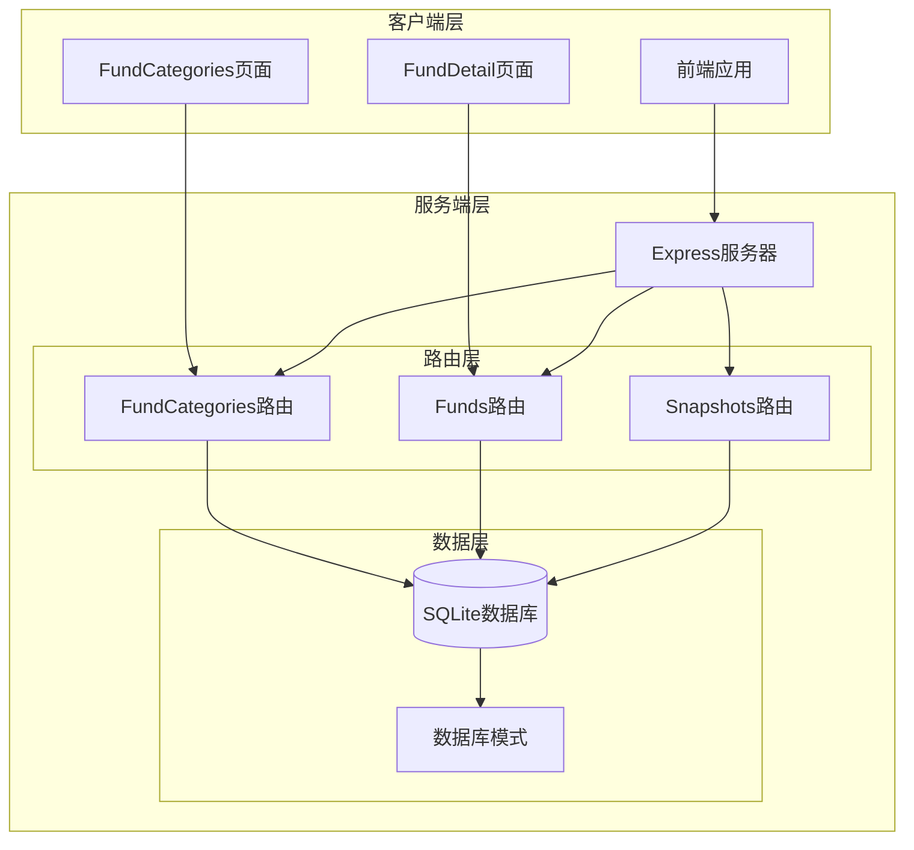
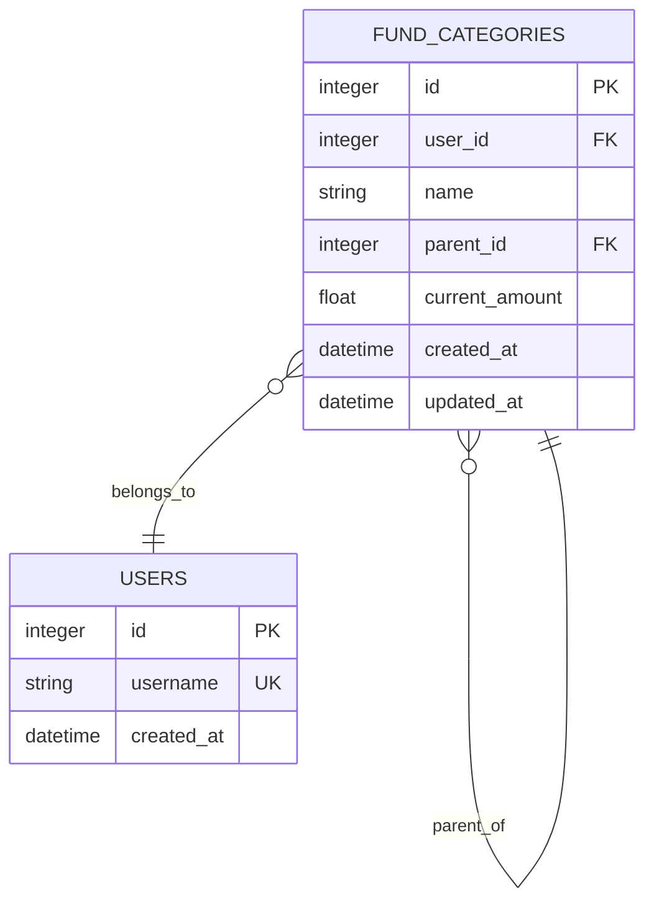
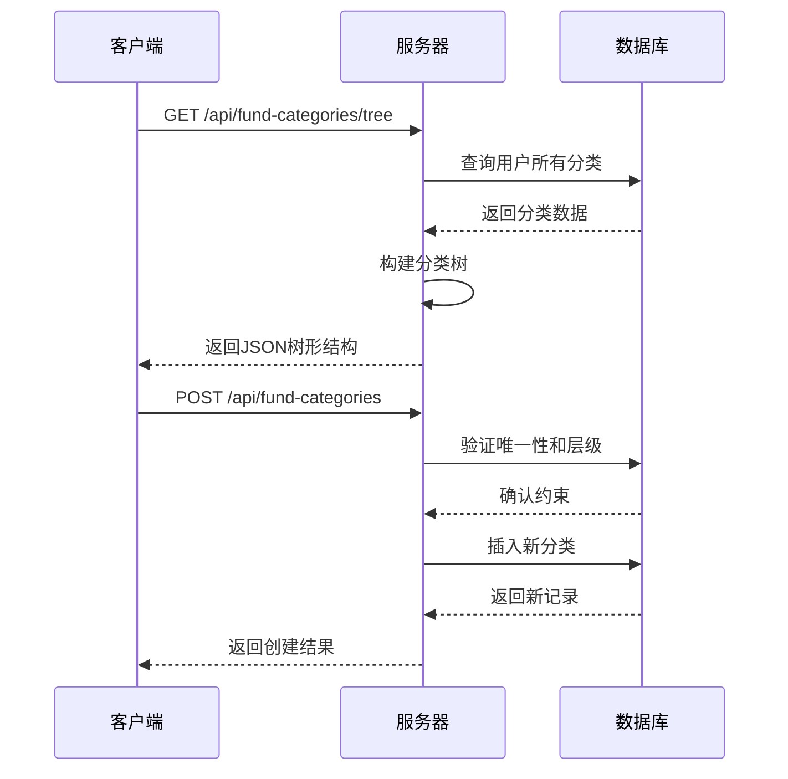
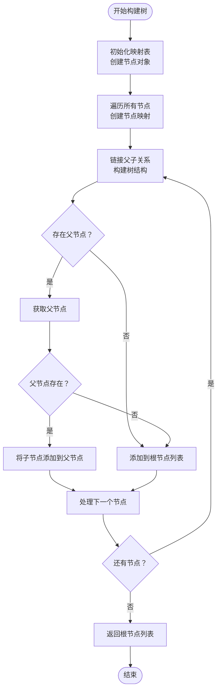
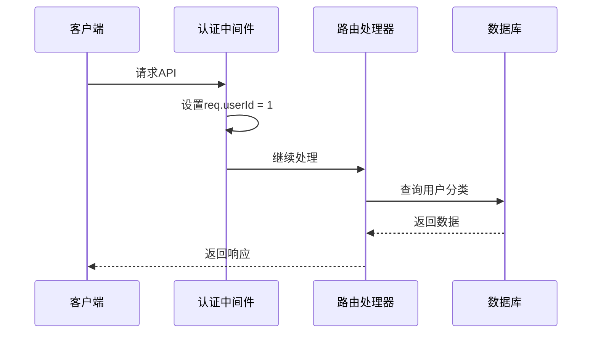
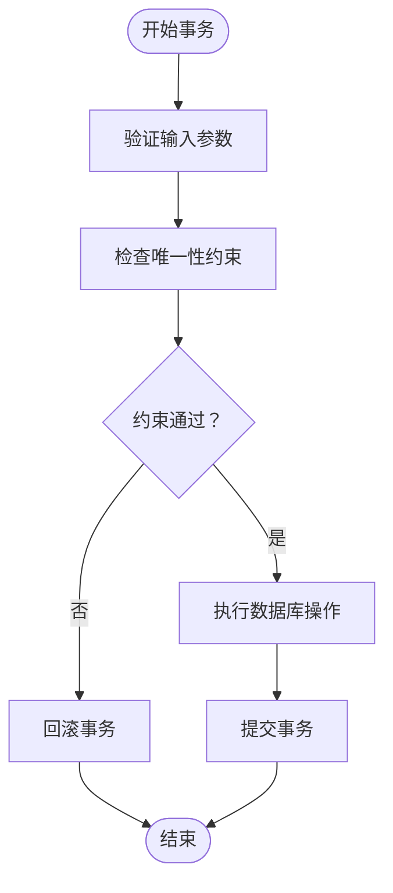
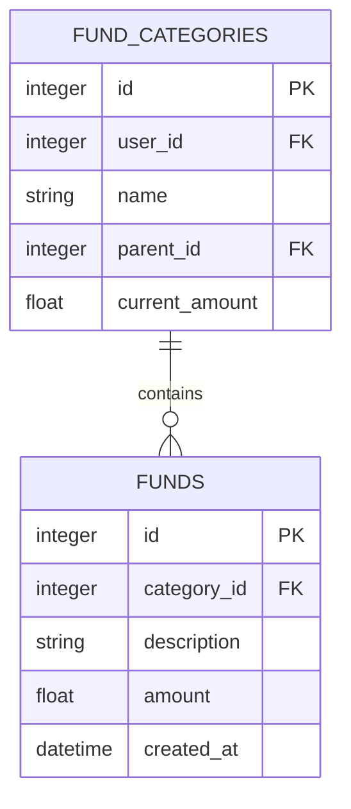
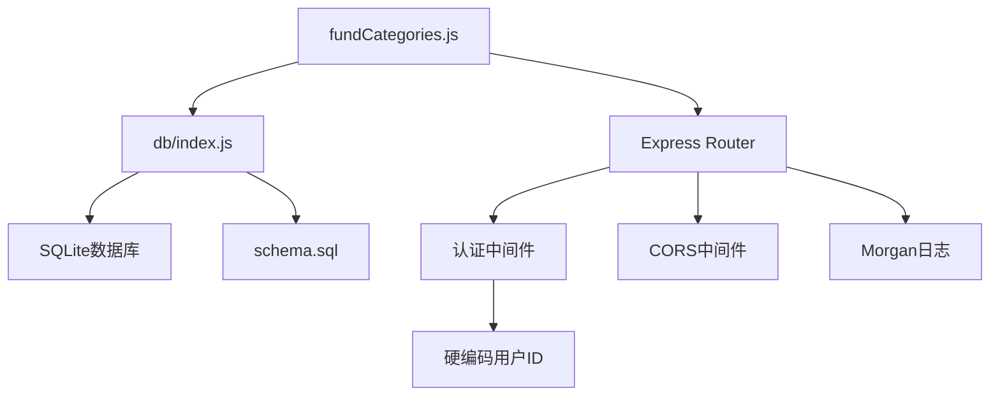
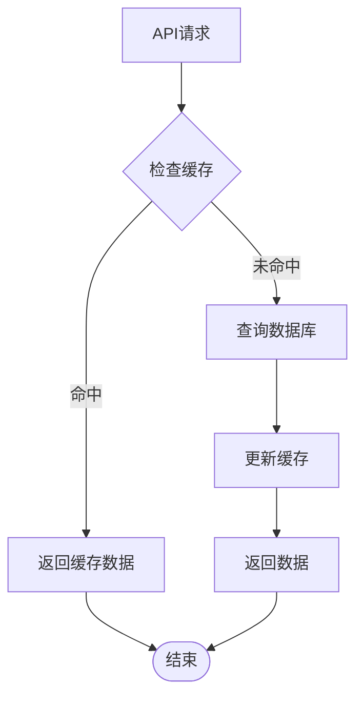

# 资金分类API

<cite>
**本文档引用的文件**
- [server/routes/fundCategories.js](file://server/routes/fundCategories.js)
- [server/db/schema.sql](file://server/db/schema.sql)
- [client/src/pages/FundCategories.jsx](file://client/src/pages/FundCategories.jsx)
- [server/index.js](file://server/index.js)
- [server/db/index.js](file://server/db/index.js)
- [server/routes/funds.js](file://server/routes/funds.js)
- [server/routes/snapshots.js](file://server/routes/snapshots.js)
</cite>

## 目录
1. [简介](#简介)
2. [项目结构](#项目结构)
3. [核心组件](#核心组件)
4. [架构概览](#架构概览)
5. [详细组件分析](#详细组件分析)
6. [依赖关系分析](#依赖关系分析)
7. [性能考虑](#性能考虑)
8. [故障排除指南](#故障排除指南)
9. [结论](#结论)

## 简介

资金分类管理功能是个人财务管理系统的核心模块，负责管理用户的资金分类体系。该系统采用两级分类架构，支持一级分类（顶级分类）和二级分类（子分类），通过RESTful API提供完整的CRUD操作能力。

系统设计遵循以下核心原则：
- **两级分类体系**：严格限制为一级和二级两个层级
- **唯一性约束**：确保同级分类名称的唯一性
- **层级结构验证**：防止循环引用和非法层级关系
- **数据一致性**：通过数据库事务保证操作的原子性
- **权限控制**：基于用户ID的访问控制机制

## 项目结构

项目采用前后端分离的架构设计，主要分为以下层次：



**图表来源**
- [server/index.js:1-32](file://server/index.js#L1-L32)
- [server/routes/fundCategories.js:1-139](file://server/routes/fundCategories.js#L1-L139)
- [server/db/schema.sql:1-79](file://server/db/schema.sql#L1-L79)

**章节来源**
- [server/index.js:1-32](file://server/index.js#L1-L32)
- [server/db/index.js:1-19](file://server/db/index.js#L1-L19)

## 核心组件

### 数据模型

资金分类系统的核心数据模型围绕`fund_categories`表构建，支持两级分类结构：



**图表来源**
- [server/db/schema.sql:47-58](file://server/db/schema.sql#L47-L58)

### 唯一性约束

系统通过数据库索引确保分类名称的唯一性：

- **顶级分类唯一性**：同一用户下顶级分类名称必须唯一
- **二级分类唯一性**：同一父分类下的子分类名称必须唯一

**章节来源**
- [server/db/schema.sql:60-68](file://server/db/schema.sql#L60-L68)

## 架构概览

系统采用RESTful API设计，提供完整的资金分类管理功能：



**图表来源**
- [server/routes/fundCategories.js:29-43](file://server/routes/fundCategories.js#L29-L43)
- [server/routes/fundCategories.js:45-81](file://server/routes/fundCategories.js#L45-L81)

## 详细组件分析

### 分类树构建算法

系统实现了高效的分类树构建算法，支持从扁平数据结构到树形结构的转换：



**图表来源**
- [server/routes/fundCategories.js:6-27](file://server/routes/fundCategories.js#L6-L27)

**章节来源**
- [server/routes/fundCategories.js:6-27](file://server/routes/fundCategories.js#L6-L27)

### API接口定义

#### 获取分类树

**请求**
```
GET /api/fund-categories/tree
```

**响应**
```json
[
  {
    "id": 1,
    "name": "投资理财",
    "parent_id": null,
    "current_amount": 0,
    "children": [
      {
        "id": 2,
        "name": "股票账户",
        "parent_id": 1,
        "current_amount": 0,
        "children": []
      }
    ]
  }
]
```

**章节来源**
- [server/routes/fundCategories.js:29-43](file://server/routes/fundCategories.js#L29-L43)

#### 创建分类

**请求**
```
POST /api/fund-categories
Content-Type: application/json
```

请求体参数：
- `name` (string, 必需): 分类名称
- `parent_id` (integer, 可选): 父分类ID，为空表示顶级分类
- `current_amount` (number, 可选): 当前金额，默认0

**响应**
```json
{
  "id": 3,
  "user_id": 1,
  "name": "新分类",
  "parent_id": null,
  "current_amount": 0,
  "created_at": "2024-01-01T00:00:00Z",
  "updated_at": "2024-01-01T00:00:00Z"
}
```

**错误处理**
- 400: 名称为空或层级验证失败
- 404: 指定的父分类不存在
- 409: 同级分类名称已存在
- 500: 服务器内部错误

**章节来源**
- [server/routes/fundCategories.js:45-81](file://server/routes/fundCategories.js#L45-L81)

#### 更新分类

**请求**
```
PUT /api/fund-categories/:id
Content-Type: application/json
```

路径参数：
- `id` (integer, 必需): 分类ID

请求体参数：
- `name` (string, 可选): 分类名称
- `parent_id` (integer, 可选): 父分类ID
- `current_amount` (number, 可选): 当前金额

**响应**
```json
{
  "id": 1,
  "user_id": 1,
  "name": "更新后的分类",
  "parent_id": null,
  "current_amount": 1000,
  "created_at": "2024-01-01T00:00:00Z",
  "updated_at": "2024-01-02T00:00:00Z"
}
```

**错误处理**
- 400: 自引用或层级验证失败
- 404: 分类不存在
- 409: 同级分类名称冲突
- 500: 服务器内部错误

**章节来源**
- [server/routes/fundCategories.js:83-136](file://server/routes/fundCategories.js#L83-L136)

### 权限控制机制

系统采用中间件实现基于用户ID的权限控制：



**图表来源**
- [server/index.js:17-21](file://server/index.js#L17-L21)

**章节来源**
- [server/index.js:17-21](file://server/index.js#L17-L21)

### 数据同步机制

系统通过数据库事务确保数据一致性：



**图表来源**
- [server/routes/fundCategories.js:53-80](file://server/routes/fundCategories.js#L53-L80)

**章节来源**
- [server/routes/fundCategories.js:53-80](file://server/routes/fundCategories.js#L53-L80)

### 分类与资金明细关联

资金分类与资金明细之间存在直接的关联关系：



**图表来源**
- [server/db/schema.sql:47-58](file://server/db/schema.sql#L47-L58)

**章节来源**
- [server/db/schema.sql:47-58](file://server/db/schema.sql#L47-L58)

## 依赖关系分析

### 前端组件依赖

```mermaid
graph LR
FundCategories[FundCategories.jsx] --> API[API调用]
FundCategories --> TreeBuilder[分类树构建]
FundCategories --> FormValidation[表单验证]
API --> Fetch[/api/fund-categories/tree]
API --> Post[POST /api/fund-categories]
API --> Put[PUT /api/fund-categories/:id]
TreeBuilder --> BuildTree[buildTree函数]
FormValidation --> ValidationRules[验证规则]
```

**图表来源**
- [client/src/pages/FundCategories.jsx:16-29](file://client/src/pages/FundCategories.jsx#L16-L29)
- [client/src/pages/FundCategories.jsx:35-65](file://client/src/pages/FundCategories.jsx#L35-L65)

**章节来源**
- [client/src/pages/FundCategories.jsx:16-29](file://client/src/pages/FundCategories.jsx#L16-L29)
- [client/src/pages/FundCategories.jsx:35-65](file://client/src/pages/FundCategories.jsx#L35-L65)

### 后端服务依赖



**图表来源**
- [server/routes/fundCategories.js:1-2](file://server/routes/fundCategories.js#L1-L2)
- [server/db/index.js:13-17](file://server/db/index.js#L13-L17)
- [server/index.js:17-21](file://server/index.js#L17-L21)

**章节来源**
- [server/routes/fundCategories.js:1-2](file://server/routes/fundCategories.js#L1-L2)
- [server/db/index.js:13-17](file://server/db/index.js#L13-L17)
- [server/index.js:17-21](file://server/index.js#L17-L21)

## 性能考虑

### 查询优化

系统通过以下方式优化查询性能：

1. **索引优化**：为`user_id`和`parent_id`字段建立索引
2. **唯一性约束**：通过数据库约束减少重复查询
3. **分页处理**：对于大量数据采用分页策略

### 缓存策略



### 并发控制

系统通过以下机制处理并发访问：
- **数据库事务**：确保操作的原子性
- **唯一性约束**：防止并发冲突
- **乐观锁**：在更新时检查数据版本

## 故障排除指南

### 常见错误及解决方案

| 错误类型 | HTTP状态码 | 错误原因 | 解决方案 |
|---------|-----------|----------|----------|
| 参数验证失败 | 400 | 缺少必需参数或参数格式错误 | 检查请求体格式，确保必填字段完整 |
| 分类不存在 | 404 | 指定的分类ID不存在 | 验证分类ID是否正确，确认用户权限 |
| 唯一性冲突 | 409 | 同级分类名称已存在 | 修改分类名称，确保在同级下唯一 |
| 数据库错误 | 500 | 服务器内部错误 | 检查数据库连接，查看服务器日志 |

### 调试建议

1. **启用详细日志**：使用`morgan`中间件记录API请求
2. **参数验证**：在路由层添加详细的参数验证逻辑
3. **错误捕获**：统一的错误处理机制
4. **数据库监控**：监控SQL查询性能和约束冲突

**章节来源**
- [server/routes/fundCategories.js:49-80](file://server/routes/fundCategories.js#L49-L80)
- [server/routes/fundCategories.js:131-135](file://server/routes/fundCategories.js#L131-L135)

## 结论

资金分类管理功能提供了完整的两级分类管理体系，具有以下特点：

**优势**
- **简洁的两级架构**：满足大多数个人财务管理需求
- **强约束保证**：通过数据库约束确保数据完整性
- **高效的数据结构**：树形结构便于前端展示和操作
- **完善的错误处理**：提供清晰的错误信息和状态码

**扩展建议**
- **批量操作**：支持批量创建、更新和删除操作
- **排序功能**：添加分类排序字段支持自定义显示顺序
- **权限细化**：支持多用户环境下的细粒度权限控制
- **审计日志**：记录所有分类变更历史

该系统为个人财务管理系统奠定了坚实的基础，通过清晰的API设计和严格的约束机制，确保了数据的一致性和系统的可靠性。