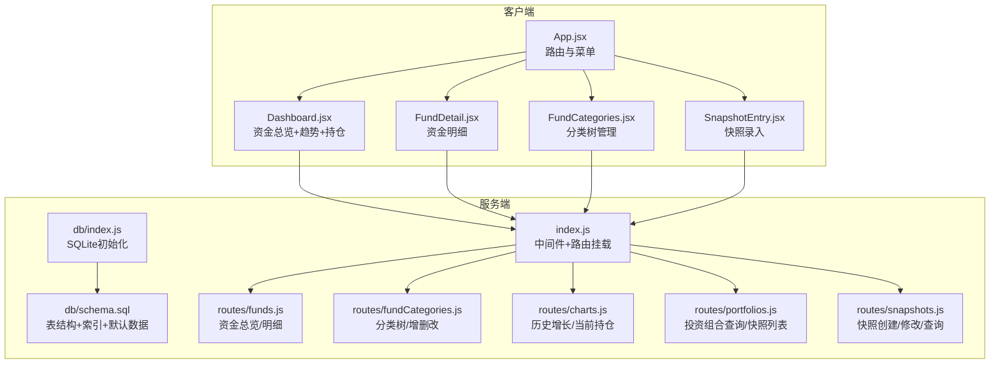
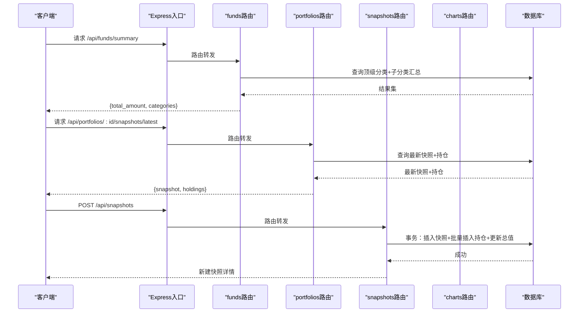
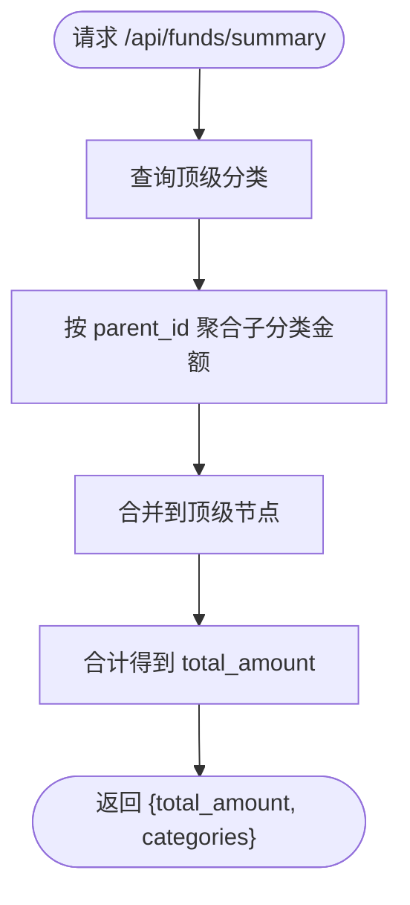
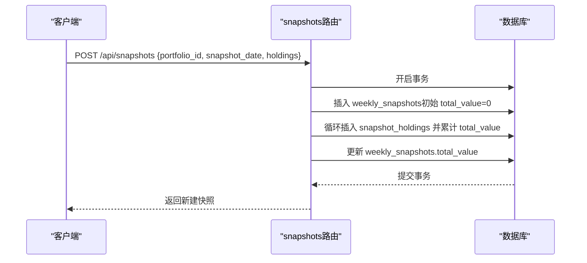
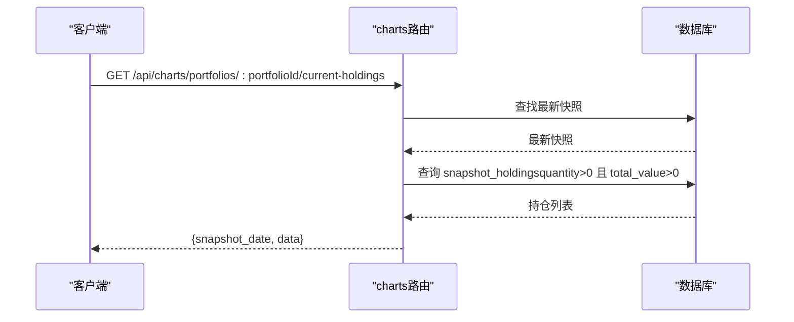
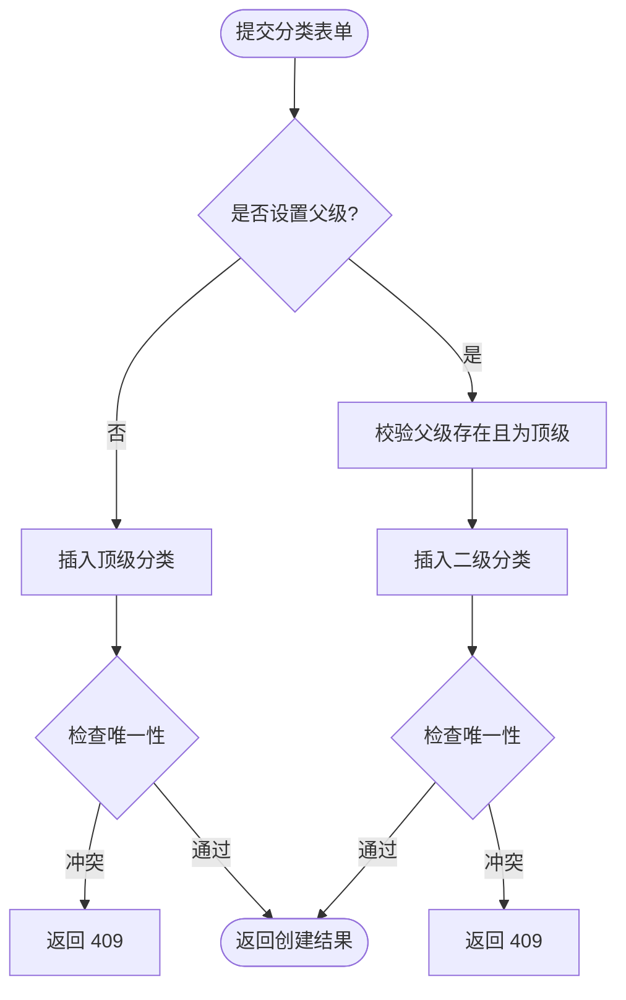
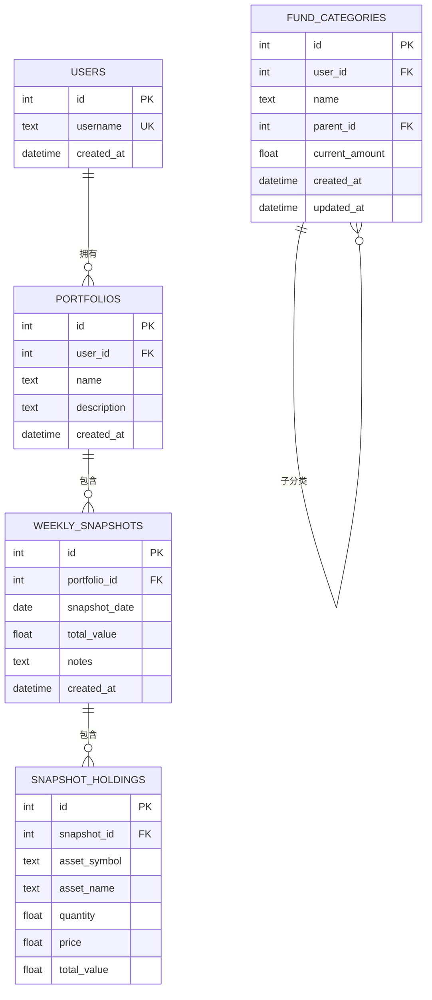
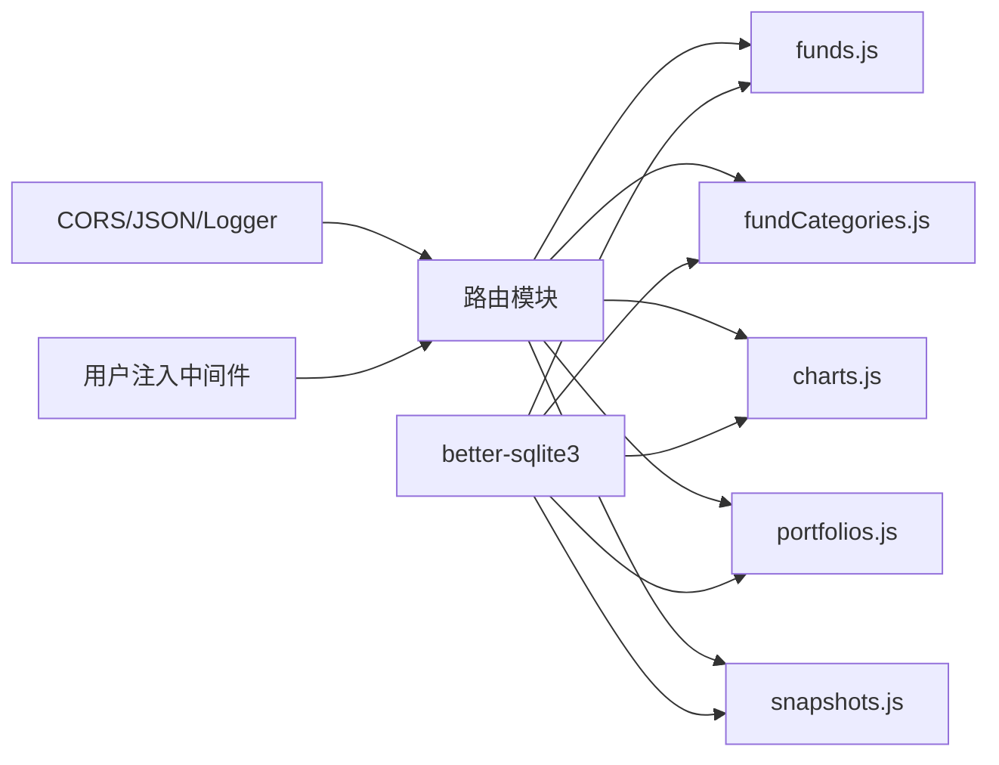

# 资金汇总API

<cite>
**本文档引用的文件**
- [server/index.js](file://server/index.js)
- [server/db/index.js](file://server/db/index.js)
- [server/db/schema.sql](file://server/db/schema.sql)
- [server/routes/funds.js](file://server/routes/funds.js)
- [server/routes/fundCategories.js](file://server/routes/fundCategories.js)
- [server/routes/charts.js](file://server/routes/charts.js)
- [server/routes/portfolios.js](file://server/routes/portfolios.js)
- [server/routes/snapshots.js](file://server/routes/snapshots.js)
- [client/src/App.jsx](file://client/src/App.jsx)
- [client/src/pages/Dashboard.jsx](file://client/src/pages/Dashboard.jsx)
- [client/src/pages/FundDetail.jsx](file://client/src/pages/FundDetail.jsx)
- [client/src/pages/FundCategories.jsx](file://client/src/pages/FundCategories.jsx)
- [client/src/pages/SnapshotEntry.jsx](file://client/src/pages/SnapshotEntry.jsx)
</cite>

## 目录
1. [简介](#简介)
2. [项目结构](#项目结构)
3. [核心组件](#核心组件)
4. [架构总览](#架构总览)
5. [详细组件分析](#详细组件分析)
6. [依赖关系分析](#依赖关系分析)
7. [性能考量](#性能考量)
8. [故障排查指南](#故障排查指南)
9. [结论](#结论)
10. [附录](#附录)

## 简介
本项目提供资金汇总统计能力，覆盖资金总览、分类汇总、时间段统计与趋势分析等核心场景。后端基于 Express + better-sqlite3，前端采用 React + Ant Design + Recharts，通过 RESTful 接口实现数据采集、聚合与可视化。系统支持：
- 资金总览与分类汇总（两级分类）
- 投资组合快照与历史增长趋势
- 当前持仓分布饼图
- 资金分类树形管理
- 基于快照的资产明细与总值计算

## 项目结构
后端采用路由分层设计，按功能模块划分接口；数据库采用 SQLite 并在启动时自动初始化表结构与索引；前端通过页面组件调用后端接口，完成数据展示与交互。

图表来源
- [server/index.js:1-32](file://server/index.js#L1-L32)
- [server/db/index.js:1-19](file://server/db/index.js#L1-L19)
- [server/db/schema.sql:1-79](file://server/db/schema.sql#L1-L79)
- [server/routes/funds.js:1-95](file://server/routes/funds.js#L1-L95)
- [server/routes/fundCategories.js:1-139](file://server/routes/fundCategories.js#L1-L139)
- [server/routes/charts.js:1-74](file://server/routes/charts.js#L1-L74)
- [server/routes/portfolios.js:1-81](file://server/routes/portfolios.js#L1-L81)
- [server/routes/snapshots.js:1-124](file://server/routes/snapshots.js#L1-L124)
- [client/src/App.jsx:1-73](file://client/src/App.jsx#L1-L73)
- [client/src/pages/Dashboard.jsx:1-101](file://client/src/pages/Dashboard.jsx#L1-L101)
- [client/src/pages/FundDetail.jsx:1-60](file://client/src/pages/FundDetail.jsx#L1-L60)
- [client/src/pages/FundCategories.jsx:1-184](file://client/src/pages/FundCategories.jsx#L1-L184)
- [client/src/pages/SnapshotEntry.jsx:1-148](file://client/src/pages/SnapshotEntry.jsx#L1-L148)

章节来源
- [server/index.js:1-32](file://server/index.js#L1-L32)
- [server/db/index.js:1-19](file://server/db/index.js#L1-L19)
- [server/db/schema.sql:1-79](file://server/db/schema.sql#L1-L79)

## 核心组件
- 资金总览与分类汇总：提供首页资金总览与顶级分类汇总，支持二级分类金额累加。
- 投资组合与快照：支持创建/修改/查询快照，计算快照总值并生成历史增长曲线。
- 当前持仓分布：返回最新快照的有效持仓，用于饼图展示。
- 分类树管理：支持两级分类的增删改查与唯一性约束。
- 数据库初始化：自动创建表、索引与默认顶级分类。

章节来源
- [server/routes/funds.js:6-45](file://server/routes/funds.js#L6-L45)
- [server/routes/snapshots.js:33-72](file://server/routes/snapshots.js#L33-L72)
- [server/routes/charts.js:6-72](file://server/routes/charts.js#L6-L72)
- [server/routes/fundCategories.js:29-81](file://server/routes/fundCategories.js#L29-L81)
- [server/db/schema.sql:47-79](file://server/db/schema.sql#L47-L79)

## 架构总览
后端通过中间件注入用户标识，统一挂载各模块路由；数据库在启动时读取 SQL 文件并执行，确保表结构与索引存在。前端页面通过 fetch 请求后端接口，完成数据加载与展示。

图表来源
- [server/index.js:17-28](file://server/index.js#L17-L28)
- [server/routes/funds.js:8-45](file://server/routes/funds.js#L8-L45)
- [server/routes/portfolios.js:32-62](file://server/routes/portfolios.js#L32-L62)
- [server/routes/snapshots.js:33-72](file://server/routes/snapshots.js#L33-L72)
- [server/db/index.js:12-17](file://server/db/index.js#L12-L17)

## 详细组件分析

### 资金总览与分类汇总
- 接口
  - GET /api/funds/summary：首页展示，返回资金总量与顶级分类汇总（不展示二级子项）。
  - GET /api/funds/detail：详情页展示，返回顶级+二级分类完整明细树。
- 计算逻辑
  - 顶级分类汇总：查询顶级分类 current_amount，同时按 parent_id 聚合子分类金额，两者相加得到每个顶级分类的合计。
  - 总资金：对顶级分类合计求和。
- 错误处理
  - 数据库异常返回 500；请求参数缺失或非法返回 4xx。

图表来源
- [server/routes/funds.js:8-45](file://server/routes/funds.js#L8-L45)

章节来源
- [server/routes/funds.js:6-45](file://server/routes/funds.js#L6-L45)

### 投资组合与快照
- 接口
  - GET /api/portfolios：列出当前用户的投资组合。
  - POST /api/portfolios：创建新组合。
  - GET /api/portfolios/:id/snapshots/latest：获取最新快照及持仓。
  - GET /api/portfolios/:id/snapshots：获取某组合全部快照。
  - POST /api/snapshots：创建快照（含 holdings 数组），自动计算 total_value。
  - PUT /api/snapshots/:id：修改快照（先删除旧持仓，再插入新持仓并重新计算 total_value）。
  - GET /api/snapshots/:id：获取指定快照详情（包含 holdings）。
- 计算逻辑
  - 快照总值：遍历 holdings，按 quantity × price 计算单项 total_value 并累加。
  - 事务保障：创建/修改快照使用事务，确保数据一致性。
- 错误处理
  - 必填字段缺失返回 400；重复日期冲突返回 409；其他异常返回 500。

图表来源
- [server/routes/snapshots.js:33-72](file://server/routes/snapshots.js#L33-L72)

章节来源
- [server/routes/portfolios.js:6-81](file://server/routes/portfolios.js#L6-L81)
- [server/routes/snapshots.js:33-124](file://server/routes/snapshots.js#L33-L124)

### 当前持仓分布与历史增长
- 接口
  - GET /api/charts/portfolios/:portfolioId/historical-growth：返回每周快照的 total_value 时间序列。
  - GET /api/charts/portfolios/:portfolioId/current-holdings：返回最新快照的有效持仓（quantity>0 且 total_value>0）。
- 数据来源
  - 历史增长：weekly_snapshots 表按 snapshot_date 升序排列。
  - 当前持仓：snapshot_holdings 表中筛选有效持仓并按 total_value 降序。
- 可视化
  - 前端使用折线图展示历史增长，使用饼图展示当前持仓分布。

图表来源
- [server/routes/charts.js:29-72](file://server/routes/charts.js#L29-L72)

章节来源
- [server/routes/charts.js:6-72](file://server/routes/charts.js#L6-L72)

### 资金分类树管理
- 接口
  - GET /api/fund-categories/tree：返回两级分类树（顶级+二级）。
  - POST /api/fund-categories：创建分类（支持 parent_id，仅允许两级）。
  - PUT /api/fund-categories/:id：更新分类（校验父级有效性与唯一性）。
- 约束与校验
  - 顶级分类名称在同一用户下唯一；二级分类在同一父分类下唯一。
  - 仅支持两级分类，父级不可为自身。
- 错误处理
  - 父级不存在返回 404；唯一性冲突返回 409；其他异常返回 500。

图表来源
- [server/routes/fundCategories.js:45-81](file://server/routes/fundCategories.js#L45-L81)
- [server/db/schema.sql:60-68](file://server/db/schema.sql#L60-L68)

章节来源
- [server/routes/fundCategories.js:29-139](file://server/routes/fundCategories.js#L29-L139)
- [server/db/schema.sql:47-79](file://server/db/schema.sql#L47-L79)

### 数据模型与索引
- 用户表 users：硬编码用户 admin_user（id=1）。
- 投资组合 portfolios：与用户关联。
- 快照 weekly_snapshots：唯一约束 (portfolio_id, snapshot_date)，包含 total_value。
- 快照资产明细 snapshot_holdings：与快照关联，存储每项资产的数量、单价与小计。
- 资金分类 fund_categories：支持两级分类，索引保证同层级唯一性；初始化默认顶级分类。

图表来源
- [server/db/schema.sql:4-79](file://server/db/schema.sql#L4-L79)

章节来源
- [server/db/schema.sql:1-79](file://server/db/schema.sql#L1-L79)

## 依赖关系分析
- 服务端
  - 中间件：CORS、JSON 解析、日志、用户注入（固定 user_id=1）。
  - 路由挂载：统一在入口文件注册。
  - 数据库：better-sqlite3，启动时执行 schema.sql。
- 客户端
  - 页面组件通过 fetch 调用后端接口，Ant Design 组件负责 UI，Recharts 负责图表渲染。

图表来源
- [server/index.js:13-28](file://server/index.js#L13-L28)
- [server/db/index.js:12-17](file://server/db/index.js#L12-L17)

章节来源
- [server/index.js:1-32](file://server/index.js#L1-L32)
- [server/db/index.js:1-19](file://server/db/index.js#L1-L19)

## 性能考量
- 查询优化
  - 资金总览：一次查询顶级分类，一次按 parent_id 聚合子分类，时间复杂度 O(n)。
  - 快照创建：批量插入 holdings，减少往返；事务一次性提交，避免部分写入。
- 存储与索引
  - 快照按日期唯一，避免重复写入；分类唯一索引限制同级重复命名。
- 前端渲染
  - 大数据量时建议分页或虚拟滚动；图表可按需懒加载。

## 故障排查指南
- 常见错误码
  - 400：缺少必填字段（如快照创建时 missing portfolio_id/snapshot_date/holdings）。
  - 404：父级分类不存在或分类未找到。
  - 409：快照日期重复或分类名称冲突。
  - 500：数据库异常或内部错误。
- 排查步骤
  - 检查请求体格式与必填字段。
  - 核对 user_id 注入逻辑（固定为 1）。
  - 查看数据库唯一约束触发原因（快照日期、分类名称）。
  - 关注事务边界，确认快照创建/修改流程是否完整执行。

章节来源
- [server/routes/snapshots.js:37-71](file://server/routes/snapshots.js#L37-L71)
- [server/routes/fundCategories.js:49-81](file://server/routes/fundCategories.js#L49-L81)
- [server/routes/fundCategories.js:94-136](file://server/routes/fundCategories.js#L94-L136)

## 结论
本项目以轻量级架构实现了资金汇总统计的核心能力：两级分类的资金总览、投资组合快照与历史趋势、当前持仓分布以及分类树管理。通过事务与唯一约束保障数据一致性，前端以图表直观呈现统计结果。后续可在以下方面扩展：
- 支持多用户隔离与鉴权。
- 引入汇率转换与复利/复合增长率计算接口。
- 增强异常值检测与统计结果可靠性校验机制。
- 提供更丰富的多维聚合与数据透视能力。

## 附录

### API 规范总览
- 资金总览
  - GET /api/funds/summary：返回 {total_amount, categories}
  - GET /api/funds/detail：返回 {total_amount, categories}
- 资金分类
  - GET /api/fund-categories/tree：返回两级分类树
  - POST /api/fund-categories：创建分类
  - PUT /api/fund-categories/:id：更新分类
- 投资组合
  - GET /api/portfolios：列出组合
  - POST /api/portfolios：创建组合
  - GET /api/portfolios/:id/snapshots/latest：最新快照+持仓
  - GET /api/portfolios/:id/snapshots：快照列表
- 快照
  - POST /api/snapshots：创建快照（自动计算 total_value）
  - PUT /api/snapshots/:id：修改快照（重算 total_value）
  - GET /api/snapshots/:id：快照详情（含 holdings）
- 图表
  - GET /api/charts/portfolios/:portfolioId/historical-growth：历史增长
  - GET /api/charts/portfolios/:portfolioId/current-holdings：当前持仓

章节来源
- [server/routes/funds.js:6-92](file://server/routes/funds.js#L6-L92)
- [server/routes/fundCategories.js:29-139](file://server/routes/fundCategories.js#L29-L139)
- [server/routes/portfolios.js:6-81](file://server/routes/portfolios.js#L6-L81)
- [server/routes/snapshots.js:33-124](file://server/routes/snapshots.js#L33-L124)
- [server/routes/charts.js:6-72](file://server/routes/charts.js#L6-L72)