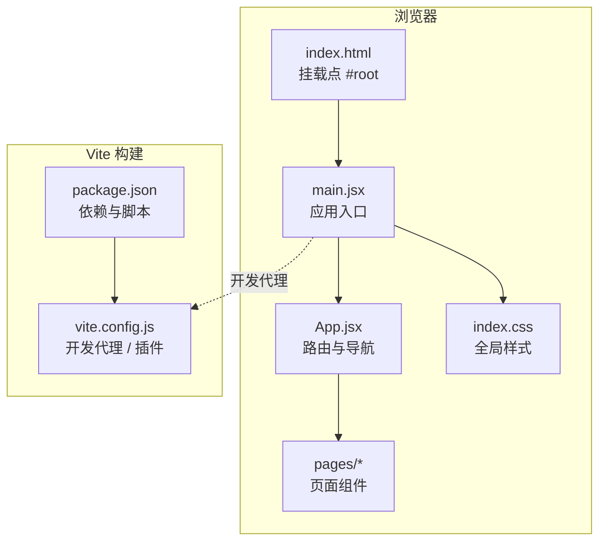
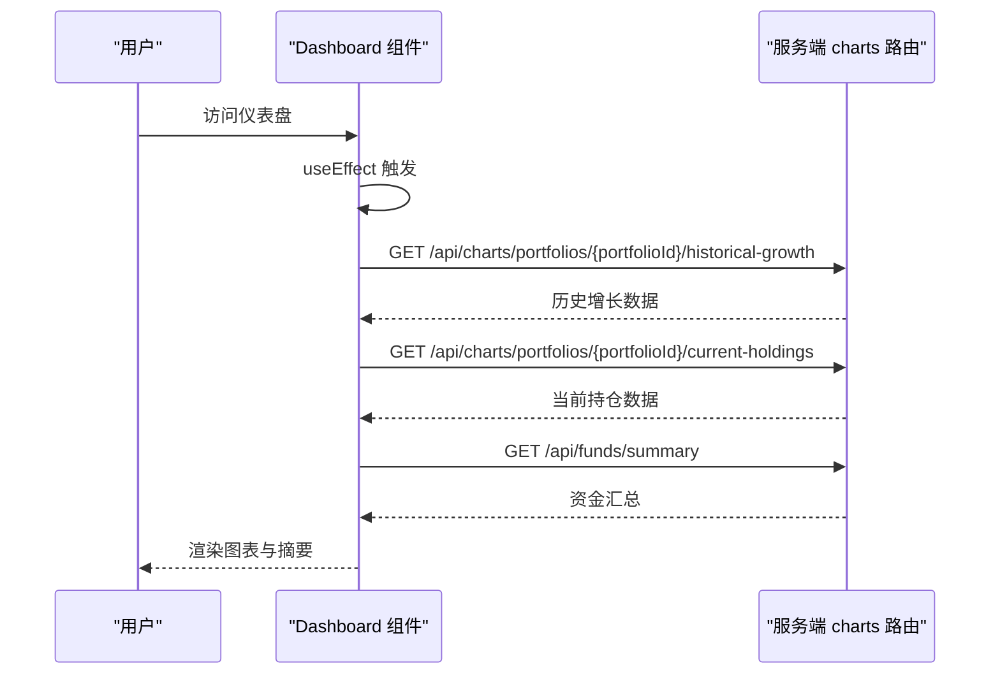
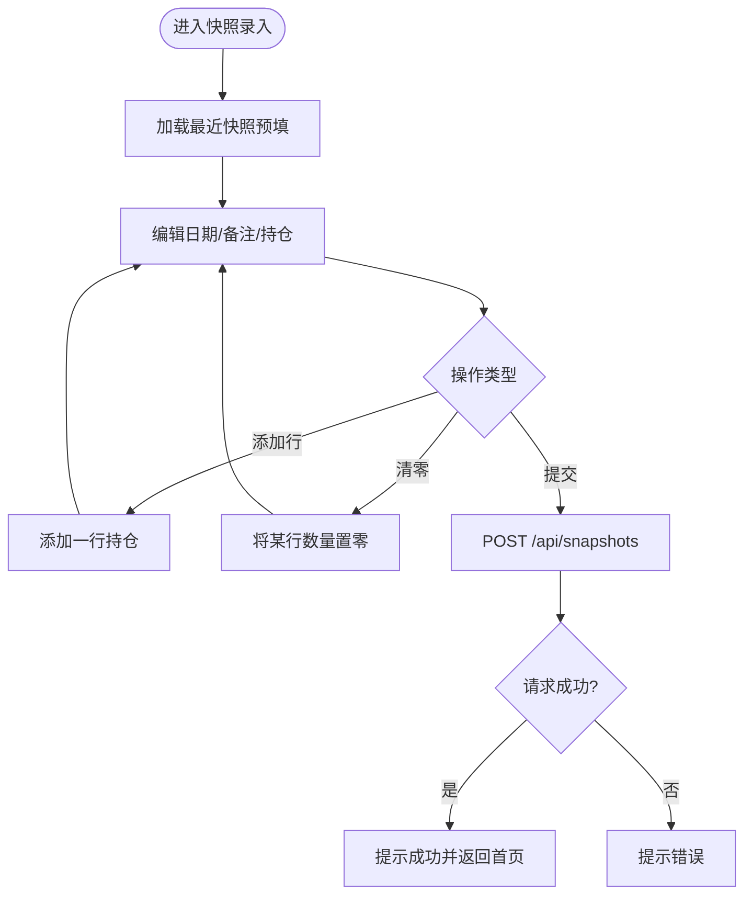
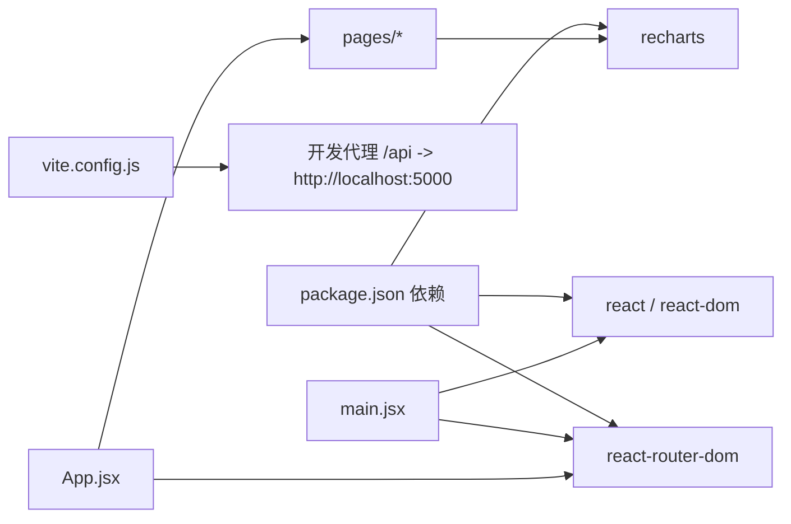
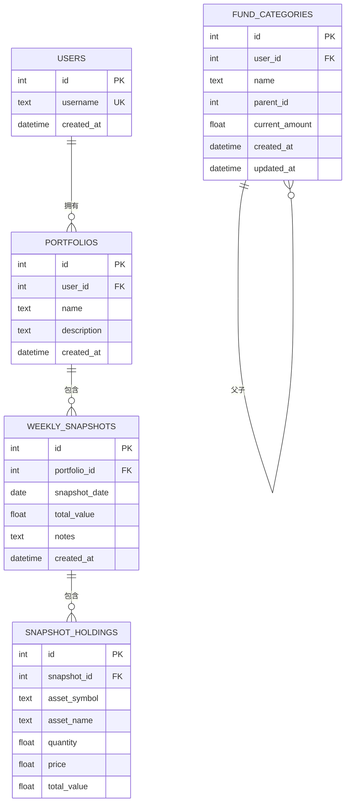

# React应用结构

<cite>
**本文引用的文件**
- [main.jsx](file://client/src/main.jsx)
- [App.jsx](file://client/src/App.jsx)
- [Dashboard.jsx](file://client/src/pages/Dashboard.jsx)
- [FundCategories.jsx](file://client/src/pages/FundCategories.jsx)
- [FundDetail.jsx](file://client/src/pages/FundDetail.jsx)
- [SnapshotEntry.jsx](file://client/src/pages/SnapshotEntry.jsx)
- [index.html](file://client/index.html)
- [package.json](file://client/package.json)
- [vite.config.js](file://client/vite.config.js)
- [index.css](file://client/src/index.css)
- [server/index.js](file://server/index.js)
- [server/db/index.js](file://server/db/index.js)
- [server/db/schema.sql](file://server/db/schema.sql)
- [server/routes/charts.js](file://server/routes/charts.js)
- [server/routes/funds.js](file://server/routes/funds.js)
</cite>

## 目录
1. [简介](#简介)
2. [项目结构](#项目结构)
3. [核心组件](#核心组件)
4. [架构总览](#架构总览)
5. [组件详解](#组件详解)
6. [依赖关系分析](#依赖关系分析)
7. [性能考量](#性能考量)
8. [故障排查指南](#故障排查指南)
9. [结论](#结论)
10. [附录](#附录)

## 简介
本文件面向个人投资追踪系统（React 前端 + Express 后端）的前端代码，聚焦于客户端 React 应用的结构与实现，重点解析：
- main.jsx 入口文件与初始化流程
- App.jsx 主组件的路由配置、导航菜单与页面布局
- React Router 的配置方式、路由路径映射与页面组件组织
- 组件树结构、生命周期管理与最佳实践
- 全局样式与构建配置对应用的影响
- 与后端接口的交互方式与数据流

## 项目结构
客户端采用 Vite + React 的现代开发栈，使用 React Router v6 进行前端路由，Recharts 提供图表渲染。服务端基于 Express，SQLite 数据库存储业务数据。



图表来源
- [index.html:1-12](file://client/index.html#L1-L12)
- [main.jsx:1-13](file://client/src/main.jsx#L1-L13)
- [App.jsx:1-28](file://client/src/App.jsx#L1-L28)
- [vite.config.js:1-12](file://client/vite.config.js#L1-L12)
- [package.json:1-24](file://client/package.json#L1-L24)

章节来源
- [index.html:1-12](file://client/index.html#L1-L12)
- [main.jsx:1-13](file://client/src/main.jsx#L1-L13)
- [vite.config.js:1-12](file://client/vite.config.js#L1-L12)
- [package.json:1-24](file://client/package.json#L1-L24)

## 核心组件
- main.jsx：应用入口，负责创建根节点、包裹 StrictMode 与 BrowserRouter，并渲染 App。
- App.jsx：应用主组件，定义导航菜单与路由规则，将页面组件按路径映射。
- 页面组件：Dashboard、SnapshotEntry、FundCategories、FundDetail，分别承担仪表盘、快照录入、资金分类管理、资金明细等职责。
- 样式：index.css 提供统一的排版、卡片、表单与图表容器样式。

章节来源
- [main.jsx:1-13](file://client/src/main.jsx#L1-L13)
- [App.jsx:1-28](file://client/src/App.jsx#L1-L28)
- [Dashboard.jsx:1-96](file://client/src/pages/Dashboard.jsx#L1-L96)
- [SnapshotEntry.jsx:1-132](file://client/src/pages/SnapshotEntry.jsx#L1-L132)
- [FundCategories.jsx:1-156](file://client/src/pages/FundCategories.jsx#L1-L156)
- [FundDetail.jsx:1-46](file://client/src/pages/FundDetail.jsx#L1-L46)
- [index.css:1-196](file://client/src/index.css#L1-L196)

## 架构总览
前端通过 BrowserRouter 将路由状态注入到组件树，App.jsx 使用 Routes/Route 定义路径到组件的映射。页面组件通过 fetch 与后端 API 交互，数据经由服务端路由返回，再在前端组件中渲染为图表或表格。

```mermaid
graph TB
subgraph "前端"
R["React Router v6"]
NAV["导航 Link"]
DASH["Dashboard"]
ENTRY["SnapshotEntry"]
CAT["FundCategories"]
DETAIL["FundDetail"]
end
subgraph "后端"
EXP["Express 服务器"]
CHRT["charts 路由"]
FUND["funds 路由"]
DB["SQLite 数据库"]
end
R --> NAV
NAV --> DASH
NAV --> ENTRY
NAV --> CAT
NAV --> DETAIL
DASH --> |"GET /api/...| EXP
ENTRY --> |"POST /api/snapshots"| EXP
CAT --> |"GET/POST/PUT /api/fund-categories"| EXP
DETAIL --> |"GET /api/funds/detail"| EXP
EXP --> CHRT
EXP --> FUND
CHRT --> DB
FUND --> DB
```

图表来源
- [App.jsx:1-28](file://client/src/App.jsx#L1-L28)
- [Dashboard.jsx:1-96](file://client/src/pages/Dashboard.jsx#L1-L96)
- [SnapshotEntry.jsx:1-132](file://client/src/pages/SnapshotEntry.jsx#L1-L132)
- [FundCategories.jsx:1-156](file://client/src/pages/FundCategories.jsx#L1-L156)
- [FundDetail.jsx:1-46](file://client/src/pages/FundDetail.jsx#L1-L46)
- [server/index.js:1-32](file://server/index.js#L1-L32)
- [server/routes/charts.js:1-74](file://server/routes/charts.js#L1-L74)
- [server/routes/funds.js:1-95](file://server/routes/funds.js#L1-L95)
- [server/db/index.js:1-19](file://server/db/index.js#L1-L19)

## 组件详解

### 入口与初始化：main.jsx
- 创建根节点并渲染应用
- 包裹 StrictMode 以启用额外的开发时检查
- 使用 BrowserRouter 提供路由上下文
- 引入全局样式

章节来源
- [main.jsx:1-13](file://client/src/main.jsx#L1-L13)

### 主组件与路由：App.jsx
- 导入 React Router 的 Link、Routes、Route
- 定义导航菜单，使用 Link to 进行页面跳转
- 在 Routes 中声明多条 Route，将路径与页面组件一一对应
- 页面区域由 main 包裹，确保内容区样式一致

章节来源
- [App.jsx:1-28](file://client/src/App.jsx#L1-L28)

### 页面组件：Dashboard
- 使用 useState 管理图表数据与摘要信息
- 使用 useEffect 在挂载后发起三次异步请求：
  - 历史增长数据
  - 最新快照的持仓分布
  - 资金汇总（不含子分类）
- 使用 Recharts 渲染折线图与饼图
- 提供“查看明细”链接跳转至资金明细页



图表来源
- [Dashboard.jsx:14-32](file://client/src/pages/Dashboard.jsx#L14-L32)
- [server/routes/charts.js:10-27](file://server/routes/charts.js#L10-L27)
- [server/routes/funds.js:8-45](file://server/routes/funds.js#L8-L45)

章节来源
- [Dashboard.jsx:1-96](file://client/src/pages/Dashboard.jsx#L1-L96)

### 页面组件：SnapshotEntry（快照录入）
- 使用 useState 管理日期、备注与持仓数组
- 在 useEffect 中拉取最近一次快照用于预填
- 支持动态增删持仓行、清零某行数量
- 提交时向 /api/snapshots 发起 POST 请求，成功后使用 useNavigate 返回首页



图表来源
- [SnapshotEntry.jsx:11-66](file://client/src/pages/SnapshotEntry.jsx#L11-L66)

章节来源
- [SnapshotEntry.jsx:1-132](file://client/src/pages/SnapshotEntry.jsx#L1-L132)

### 页面组件：FundCategories（资金分类管理）
- 使用 useState 管理树形数据、表单字段与消息提示
- 通过 useMemo 从树中筛选根节点，避免重复计算
- 加载树：GET /api/fund-categories/tree
- 新增/编辑：POST/PUT /api/fund-categories（带 id 判定）
- 成功后刷新树并重置表单

章节来源
- [FundCategories.jsx:1-156](file://client/src/pages/FundCategories.jsx#L1-L156)

### 页面组件：FundDetail（资金明细）
- 使用 useEffect 在挂载时加载资金明细
- 接口：GET /api/funds/detail
- 渲染顶级与二级分类的层级化结构

章节来源
- [FundDetail.jsx:1-46](file://client/src/pages/FundDetail.jsx#L1-L46)

### 样式与布局
- index.css 提供导航栏、卡片容器、表单、图表容器、列表行等通用样式
- Dashboard 使用响应式容器与网格布局展示摘要与图表
- 表单类页面采用统一的表单组与按钮样式

章节来源
- [index.css:1-196](file://client/src/index.css#L1-L196)

## 依赖关系分析
- 依赖管理：React、React DOM、React Router、Recharts
- 构建工具：Vite + @vitejs/plugin-react
- 开发代理：将 /api 前缀转发至本地服务端（端口 5000）



图表来源
- [package.json:11-22](file://client/package.json#L11-L22)
- [vite.config.js:7-11](file://client/vite.config.js#L7-L11)
- [main.jsx:1-13](file://client/src/main.jsx#L1-L13)
- [App.jsx:1-28](file://client/src/App.jsx#L1-L28)

章节来源
- [package.json:1-24](file://client/package.json#L1-L24)
- [vite.config.js:1-12](file://client/vite.config.js#L1-L12)

## 性能考量
- 图表渲染：Dashboard 使用响应式容器与按需数据加载，建议在数据量增大时考虑分页或虚拟化。
- 网络请求：Dashboard 在挂载时并发发起多个请求，可考虑合并或缓存策略减少重复请求。
- 表单交互：SnapshotEntry 动态增删行时应避免不必要的重渲染，可使用 React.memo 或 useMemo 优化。
- 样式体积：index.css 已集中管理，建议在生产构建中启用 CSS 压缩与按需引入。

## 故障排查指南
- 路由无法跳转
  - 检查 App.jsx 中 Link 与 Route 的路径是否一致
  - 确认 BrowserRouter 已包裹根组件
- 图表不显示
  - 检查 Dashboard 中 fetch 返回的数据格式与字段名是否匹配
  - 确认 Recharts 组件的 data 与 key 是否正确
- 快照提交失败
  - 查看控制台网络面板，确认 /api/snapshots 的请求体与状态码
  - 确认服务端路由存在且未报错
- 分类管理异常
  - 确认 /api/fund-categories/tree 的返回结构为数组
  - 提交时检查必填字段与数值类型转换
- 开发代理无效
  - 确认服务端已在 5000 端口运行
  - 检查 vite.config.js 的 proxy 配置

章节来源
- [App.jsx:1-28](file://client/src/App.jsx#L1-L28)
- [Dashboard.jsx:14-32](file://client/src/pages/Dashboard.jsx#L14-L32)
- [SnapshotEntry.jsx:42-66](file://client/src/pages/SnapshotEntry.jsx#L42-L66)
- [FundCategories.jsx:16-29](file://client/src/pages/FundCategories.jsx#L16-L29)
- [vite.config.js:7-11](file://client/vite.config.js#L7-L11)
- [server/index.js:30-32](file://server/index.js#L30-L32)

## 结论
该 React 应用采用清晰的路由分层与页面组件划分，结合 Recharts 实现数据可视化，配合 Express 服务端完成数据持久化与聚合。入口文件负责基础环境搭建，主组件承担导航与路由映射，页面组件围绕单一职责进行数据加载与渲染。通过合理的样式与交互设计，实现了简洁易用的投资追踪界面。后续可在性能优化、错误处理与状态管理方面进一步完善。

## 附录

### 组件树与生命周期要点
- 组件树
  - main.jsx -> App.jsx -> 页面组件（Dashboard / SnapshotEntry / FundCategories / FundDetail）
- 生命周期
  - 挂载阶段：App.jsx 渲染导航与路由；页面组件在 useEffect 中发起数据请求
  - 更新阶段：表单组件通过 useState 变更触发重渲染；路由切换触发新组件挂载
  - 卸载阶段：页面组件在路由切换时自动卸载，注意清理定时器与订阅（如需）

章节来源
- [main.jsx:7-12](file://client/src/main.jsx#L7-L12)
- [App.jsx:7-26](file://client/src/App.jsx#L7-L26)
- [Dashboard.jsx:14-32](file://client/src/pages/Dashboard.jsx#L14-L32)
- [SnapshotEntry.jsx:11-26](file://client/src/pages/SnapshotEntry.jsx#L11-L26)
- [FundCategories.jsx:27-29](file://client/src/pages/FundCategories.jsx#L27-L29)

### 数据模型与后端接口概览
- 数据库模式（简化）
  - users：用户表（硬编码用户 ID=1）
  - portfolios：投资组合
  - weekly_snapshots：每周快照
  - snapshot_holdings：快照资产明细
  - fund_categories：资金分类（支持父子关系）



图表来源
- [server/db/schema.sql:4-79](file://server/db/schema.sql#L4-L79)