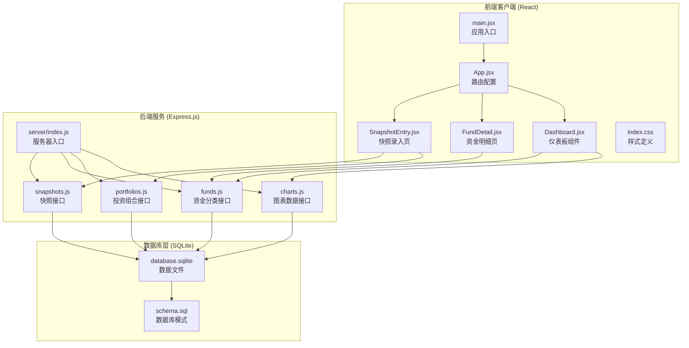
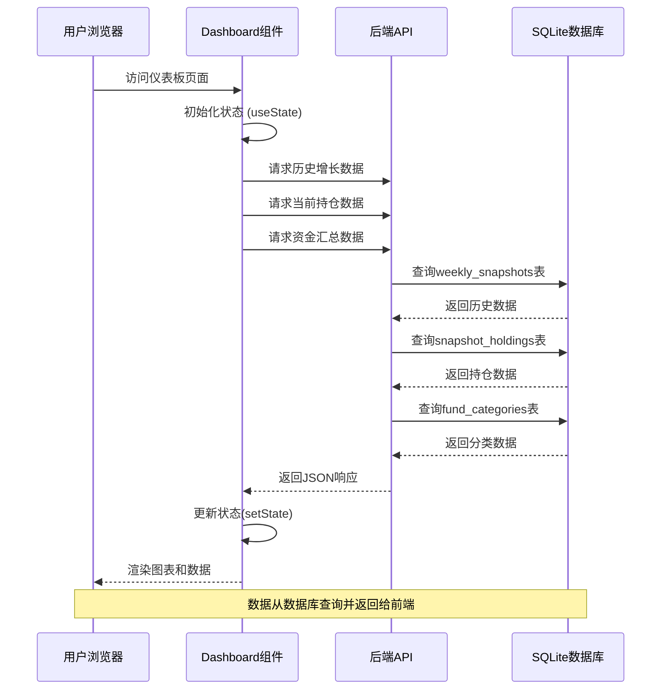
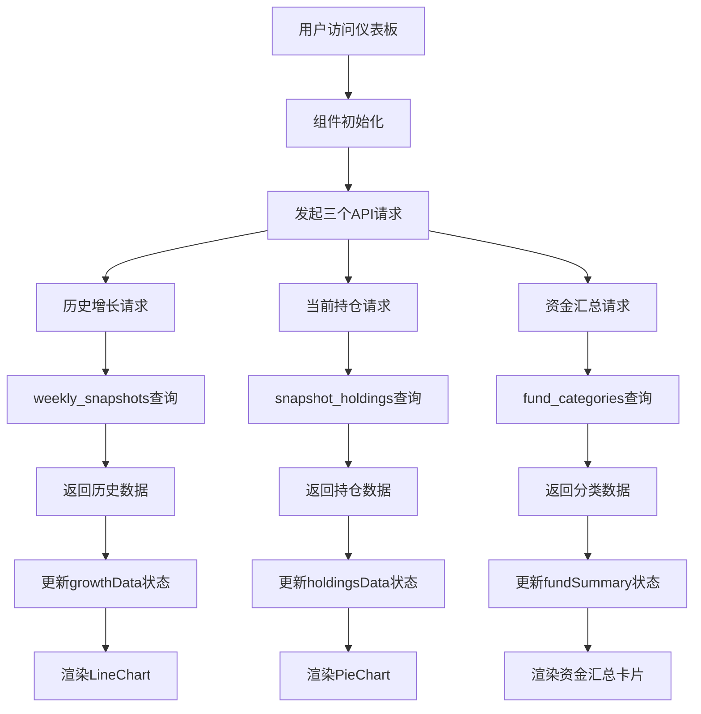
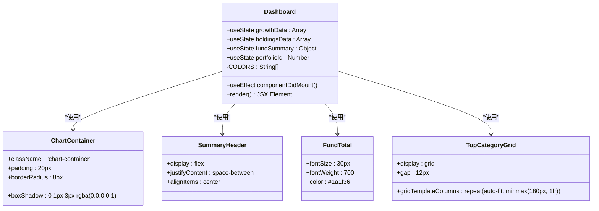
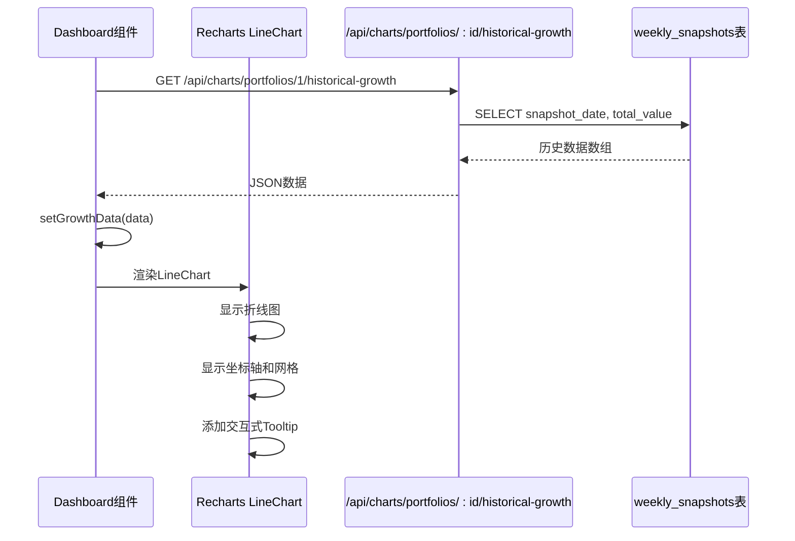
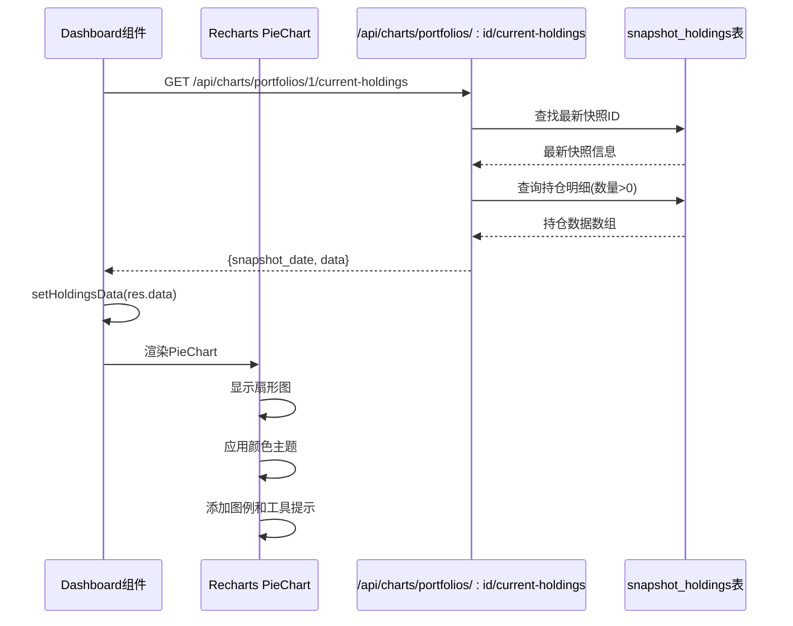
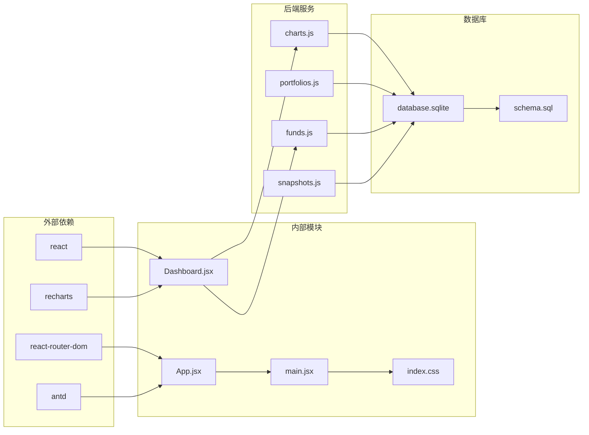
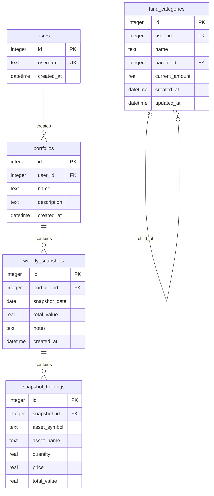

# 仪表板组件

<cite>
**本文引用的文件列表**
- [client/src/pages/Dashboard.jsx](file://client/src/pages/Dashboard.jsx)
- [client/src/App.jsx](file://client/src/App.jsx)
- [client/src/main.jsx](file://client/src/main.jsx)
- [client/src/index.css](file://client/src/index.css)
- [server/routes/charts.js](file://server/routes/charts.js)
- [server/routes/portfolios.js](file://server/routes/portfolios.js)
- [server/routes/funds.js](file://server/routes/funds.js)
- [server/db/index.js](file://server/db/index.js)
- [server/db/schema.sql](file://server/db/schema.sql)
- [client/src/pages/FundDetail.jsx](file://client/src/pages/FundDetail.jsx)
- [client/src/pages/SnapshotEntry.jsx](file://client/src/pages/SnapshotEntry.jsx)
</cite>

## 目录
1. [简介](#简介)
2. [项目结构](#项目结构)
3. [核心组件](#核心组件)
4. [架构概览](#架构概览)
5. [详细组件分析](#详细组件分析)
6. [依赖关系分析](#依赖关系分析)
7. [性能考虑](#性能考虑)
8. [故障排除指南](#故障排除指南)
9. [结论](#结论)
10. [附录](#附录)

## 简介

个人投资追踪系统仪表板组件是一个基于 React 和 Recharts 的数据可视化界面，用于展示投资组合的历史增长趋势、当前持仓分布以及资金汇总信息。该组件通过三个主要区域实现数据可视化：历史增长图表、当前持仓饼图和资金汇总卡片。

仪表板组件采用现代化的前端技术栈，包括：
- React Hooks 进行状态管理和生命周期控制
- Recharts 实现高性能的 SVG 图表渲染
- Ant Design 提供一致的 UI 组件库
- Express.js 构建 RESTful API 接口
- SQLite 数据库存储投资数据

## 项目结构

该项目采用前后端分离的架构设计，前端使用 Vite 构建工具，后端使用 Node.js 和 Express.js 框架。



**图表来源**
- [client/src/main.jsx:1-13](file://client/src/main.jsx#L1-L13)
- [client/src/App.jsx:1-73](file://client/src/App.jsx#L1-L73)
- [client/src/pages/Dashboard.jsx:1-96](file://client/src/pages/Dashboard.jsx#L1-L96)
- [server/routes/charts.js:1-74](file://server/routes/charts.js#L1-L74)
- [server/routes/funds.js:1-94](file://server/routes/funds.js#L1-L94)
- [server/db/schema.sql:1-79](file://server/db/schema.sql#L1-L79)

**章节来源**
- [client/src/main.jsx:1-13](file://client/src/main.jsx#L1-L13)
- [client/src/App.jsx:1-73](file://client/src/App.jsx#L1-L73)
- [client/src/pages/Dashboard.jsx:1-96](file://client/src/pages/Dashboard.jsx#L1-L96)

## 核心组件

仪表板组件是整个投资追踪系统的核心界面，负责整合和展示各类财务数据。该组件具有以下关键特性：

### 数据获取与状态管理

组件使用 React Hooks 实现数据获取和状态管理：
- 使用 `useState` 管理三种不同类型的数据状态
- 使用 `useEffect` 处理异步数据加载逻辑
- 通过 `fetch` API 获取后端数据

### 可视化组件集成

仪表板集成了多种 Recharts 图表组件：
- 历史增长图表：使用 LineChart 展示总资产随时间变化
- 当前持仓饼图：使用 PieChart 展示资产分配比例
- 响应式容器：使用 ResponsiveContainer 适配不同屏幕尺寸

### 样式与布局

组件采用现代化的 CSS Grid 和 Flexbox 布局：
- 使用 CSS Grid 创建自适应的分类卡片网格
- 通过阴影和圆角提升视觉层次感
- 支持移动端响应式设计

**章节来源**
- [client/src/pages/Dashboard.jsx:8-32](file://client/src/pages/Dashboard.jsx#L8-L32)
- [client/src/pages/Dashboard.jsx:34-96](file://client/src/pages/Dashboard.jsx#L34-L96)
- [client/src/index.css:13-112](file://client/src/index.css#L13-L112)

## 架构概览

仪表板组件采用分层架构设计，实现了清晰的关注点分离：



**图表来源**
- [client/src/pages/Dashboard.jsx:14-32](file://client/src/pages/Dashboard.jsx#L14-L32)
- [server/routes/charts.js:10-27](file://server/routes/charts.js#L10-L27)
- [server/routes/charts.js:33-72](file://server/routes/charts.js#L33-L72)
- [server/routes/funds.js:8-45](file://server/routes/funds.js#L8-L45)

### 数据流架构



**图表来源**
- [client/src/pages/Dashboard.jsx:14-32](file://client/src/pages/Dashboard.jsx#L14-L32)
- [server/routes/charts.js:10-72](file://server/routes/charts.js#L10-L72)
- [server/routes/funds.js:8-45](file://server/routes/funds.js#L8-L45)

## 详细组件分析

### Dashboard 组件架构

Dashboard 组件是一个函数式组件，使用 React Hooks 实现状态管理和数据获取：



**图表来源**
- [client/src/pages/Dashboard.jsx:8-96](file://client/src/pages/Dashboard.jsx#L8-L96)
- [client/src/index.css:13-112](file://client/src/index.css#L13-L112)

### 历史增长图表实现

历史增长图表使用 Recharts 的 LineChart 组件实现，展示投资组合总资产随时间的变化趋势：



**图表来源**
- [client/src/pages/Dashboard.jsx:14-19](file://client/src/pages/Dashboard.jsx#L14-L19)
- [server/routes/charts.js:10-27](file://server/routes/charts.js#L10-L27)

#### 图表配置选项

历史增长图表的关键配置包括：
- **坐标轴配置**：X轴使用日期字段，Y轴显示数值
- **网格样式**：虚线背景网格增强可读性
- **线条样式**：单调递增类型，2像素宽度
- **交互功能**：美元格式化工具提示

### 当前持仓饼图实现

当前持仓饼图展示投资组合最新快照中的资产分配情况：



**图表来源**
- [client/src/pages/Dashboard.jsx:21-25](file://client/src/pages/Dashboard.jsx#L21-L25)
- [server/routes/charts.js:33-72](file://server/routes/charts.js#L33-L72)

#### 图表配置选项

当前持仓饼图的关键配置包括：
- **数据映射**：使用 total_value 作为数据键，asset_symbol 作为名称键
- **视觉配置**：半径100像素，居中显示
- **颜色主题**：预定义的颜色数组循环使用
- **标签显示**：自动显示数值标签

### 资金汇总卡片实现

资金汇总卡片展示投资组合的总体财务状况：

```mermaid
flowchart TD
A[Dashboard组件] --> B[请求资金汇总数据]
B --> C[/api/funds/summary]
C --> D[查询顶级分类]
D --> E[计算子分类合计]
E --> F[合并顶级和子分类]
F --> G[计算总金额]
G --> H[返回JSON数据]
H --> I[更新fundSummary状态]
I --> J[渲染资金汇总卡片]
J --> K[显示总金额]
J --> L[显示分类卡片网格]
```

**图表来源**
- [client/src/pages/Dashboard.jsx:27-31](file://client/src/pages/Dashboard.jsx#L27-L31)
- [server/routes/funds.js:8-45](file://server/routes/funds.js#L8-L45)

#### 卡片布局设计

资金汇总卡片采用响应式网格布局：
- **标题区域**：包含链接到详细页面的导航
- **总金额显示**：大字体突出显示总资产
- **分类网格**：自动适应屏幕宽度的卡片网格
- **样式设计**：圆角边框、阴影效果、浅色背景

**章节来源**
- [client/src/pages/Dashboard.jsx:36-54](file://client/src/pages/Dashboard.jsx#L36-L54)
- [client/src/pages/Dashboard.jsx:56-93](file://client/src/pages/Dashboard.jsx#L56-L93)

## 依赖关系分析

仪表板组件的依赖关系体现了清晰的模块化设计：



**图表来源**
- [client/src/pages/Dashboard.jsx:1-6](file://client/src/pages/Dashboard.jsx#L1-L6)
- [client/src/App.jsx:1-12](file://client/src/App.jsx#L1-L12)
- [client/src/main.jsx:1-5](file://client/src/main.jsx#L1-L5)
- [server/routes/charts.js:1-2](file://server/routes/charts.js#L1-L2)
- [server/routes/funds.js:1-2](file://server/routes/funds.js#L1-L2)

### 组件耦合度分析

仪表板组件展现了良好的内聚性和低耦合性：
- **状态内聚**：所有状态都在单个组件中管理
- **API解耦**：通过独立的路由模块处理数据获取
- **样式分离**：CSS 类名与组件逻辑分离
- **路由独立**：导航逻辑在单独的 App 组件中处理

### 数据依赖链

```mermaid
graph TD
A[Dashboard组件] --> B[历史增长数据]
A --> C[当前持仓数据]
A --> D[资金汇总数据]
B --> E[/api/charts/portfolios/:id/historical-growth]
C --> F[/api/charts/portfolios/:id/current-holdings]
D --> G[/api/funds/summary]
E --> H[weekly_snapshots表]
F --> I[snapshot_holdings表]
G --> J[fund_categories表]
H --> K[SQLite数据库]
I --> K
J --> K
```

**图表来源**
- [client/src/pages/Dashboard.jsx:14-31](file://client/src/pages/Dashboard.jsx#L14-L31)
- [server/routes/charts.js:10-72](file://server/routes/charts.js#L10-L72)
- [server/routes/funds.js:8-45](file://server/routes/funds.js#L8-L45)

**章节来源**
- [client/src/pages/Dashboard.jsx:1-96](file://client/src/pages/Dashboard.jsx#L1-L96)
- [server/routes/charts.js:1-74](file://server/routes/charts.js#L1-L74)
- [server/routes/funds.js:1-94](file://server/routes/funds.js#L1-L94)

## 性能考虑

仪表板组件在设计时充分考虑了性能优化：

### 数据获取优化

- **并发请求**：三个 API 请求并行执行，减少总等待时间
- **错误处理**：每个请求都有独立的错误处理逻辑
- **状态更新**：分别更新对应的状态，避免不必要的重渲染

### 图表性能优化

- **响应式容器**：使用 ResponsiveContainer 自动适配容器大小
- **SVG 渲染**：Recharts 使用 SVG 渲染，支持硬件加速
- **数据格式化**：在组件内部进行数据格式化，减少重复计算

### 内存管理

- **状态清理**：组件卸载时自动清理状态
- **数据缓存**：合理使用 React 的状态缓存机制
- **事件监听**：避免内存泄漏的事件监听器

### 用户体验优化

- **加载指示**：可以添加加载状态指示器
- **错误恢复**：提供错误重试机制
- **离线支持**：考虑添加本地存储支持

## 故障排除指南

### 常见问题及解决方案

#### API 请求失败

**问题描述**：图表数据无法加载或显示为空白

**可能原因**：
- 后端服务未启动
- 数据库连接失败
- API 路由配置错误

**解决步骤**：
1. 检查后端服务是否正常运行
2. 验证数据库连接状态
3. 确认 API 路由路径正确
4. 查看浏览器开发者工具的网络面板

#### 数据格式错误

**问题描述**：图表显示异常或报错

**可能原因**：
- API 返回数据格式不符合预期
- 缺少必要的数据字段
- 数据类型不匹配

**解决步骤**：
1. 检查 API 响应数据结构
2. 验证数据字段完整性
3. 确认数据类型一致性
4. 添加数据验证逻辑

#### 样式问题

**问题描述**：图表或卡片显示样式异常

**可能原因**：
- CSS 类名冲突
- 样式优先级问题
- 媒体查询配置错误

**解决步骤**：
1. 检查 CSS 文件加载状态
2. 验证类名使用正确性
3. 确认样式作用域
4. 测试不同屏幕尺寸

**章节来源**
- [client/src/pages/Dashboard.jsx:14-32](file://client/src/pages/Dashboard.jsx#L14-L32)
- [server/routes/charts.js:23-26](file://server/routes/charts.js#L23-L26)
- [server/routes/funds.js:42-44](file://server/routes/funds.js#L42-L44)

## 结论

个人投资追踪系统的仪表板组件是一个功能完整、设计合理的数据可视化界面。该组件成功实现了以下目标：

### 技术成就

- **模块化设计**：清晰的组件分离和职责划分
- **响应式布局**：适配各种设备和屏幕尺寸
- **高性能渲染**：利用 Recharts 实现流畅的图表渲染
- **状态管理**：有效的 React Hooks 状态管理模式

### 功能完整性

- **多维度数据展示**：历史趋势、当前持仓、资金汇总
- **交互式体验**：工具提示、图例、导航链接
- **数据准确性**：严格的数据库约束和数据验证
- **扩展性**：模块化的架构便于功能扩展

### 改进建议

1. **增加加载状态**：为 API 请求添加加载指示器
2. **错误边界**：实现全局错误边界处理
3. **性能监控**：添加性能指标监控
4. **测试覆盖**：增加单元测试和集成测试
5. **国际化支持**：添加多语言支持功能

该仪表板组件为个人投资追踪系统提供了坚实的基础，通过持续的优化和改进，可以进一步提升用户体验和系统稳定性。

## 附录

### API 接口规范

#### 历史增长数据接口
- **URL**: `/api/charts/portfolios/:portfolioId/historical-growth`
- **方法**: GET
- **响应格式**: 数组对象，包含 `date` 和 `total_value` 字段

#### 当前持仓数据接口
- **URL**: `/api/charts/portfolios/:portfolioId/current-holdings`
- **方法**: GET
- **响应格式**: 对象，包含 `snapshot_date` 和 `data` 字段

#### 资金汇总数据接口
- **URL**: `/api/funds/summary`
- **方法**: GET
- **响应格式**: 对象，包含 `total_amount` 和 `categories` 字段

### 数据库模式



**图表来源**
- [server/db/schema.sql:4-79](file://server/db/schema.sql#L4-L79)