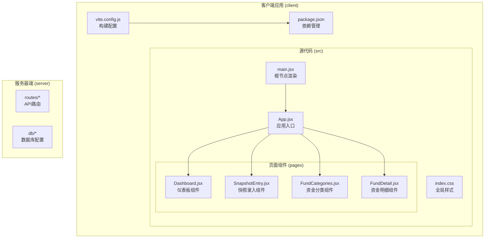
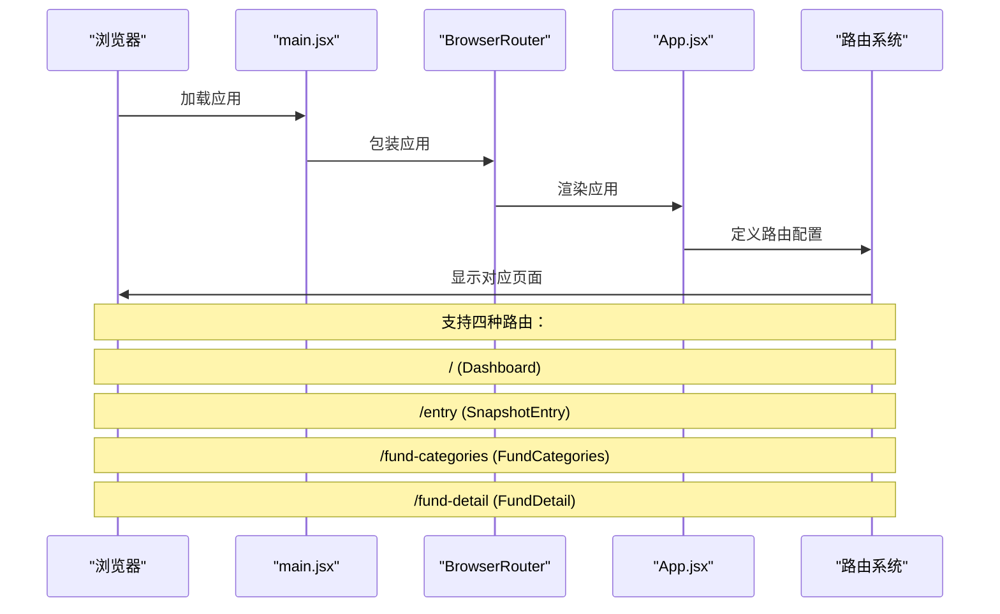
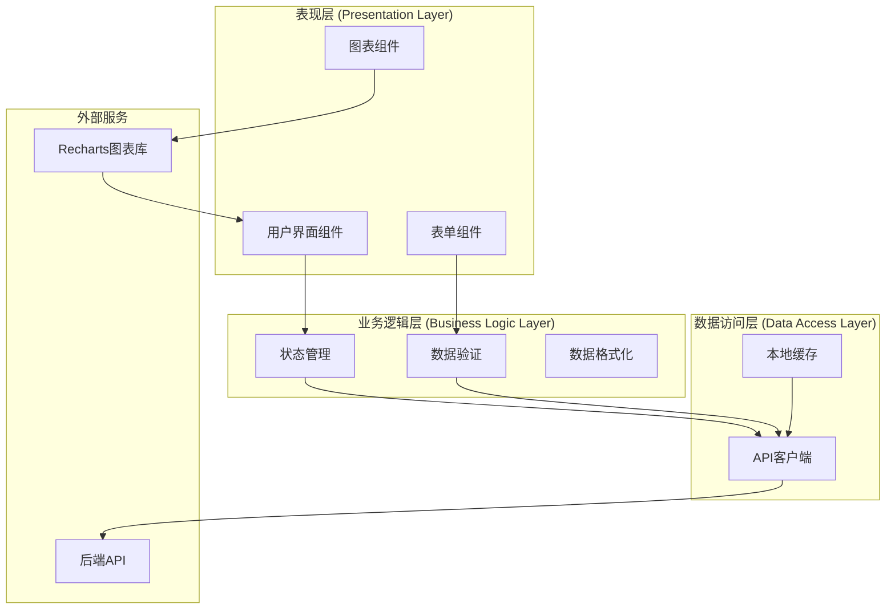
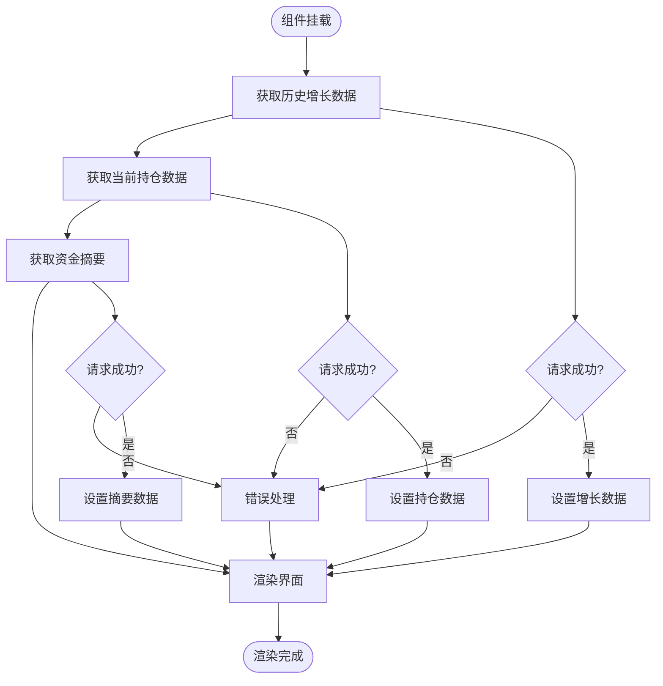
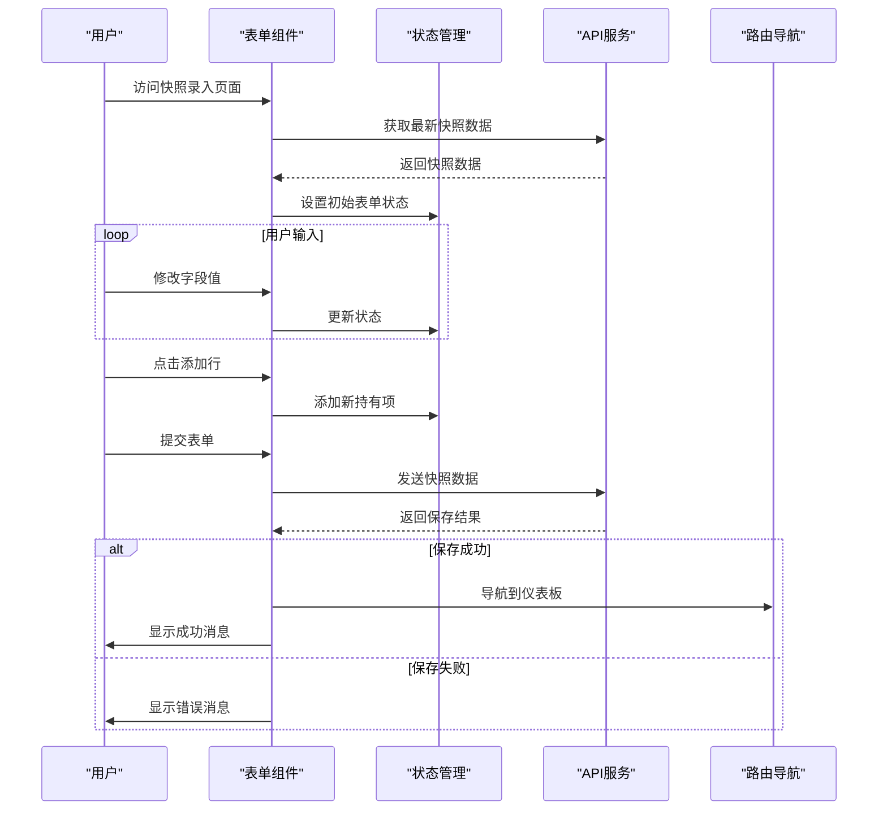
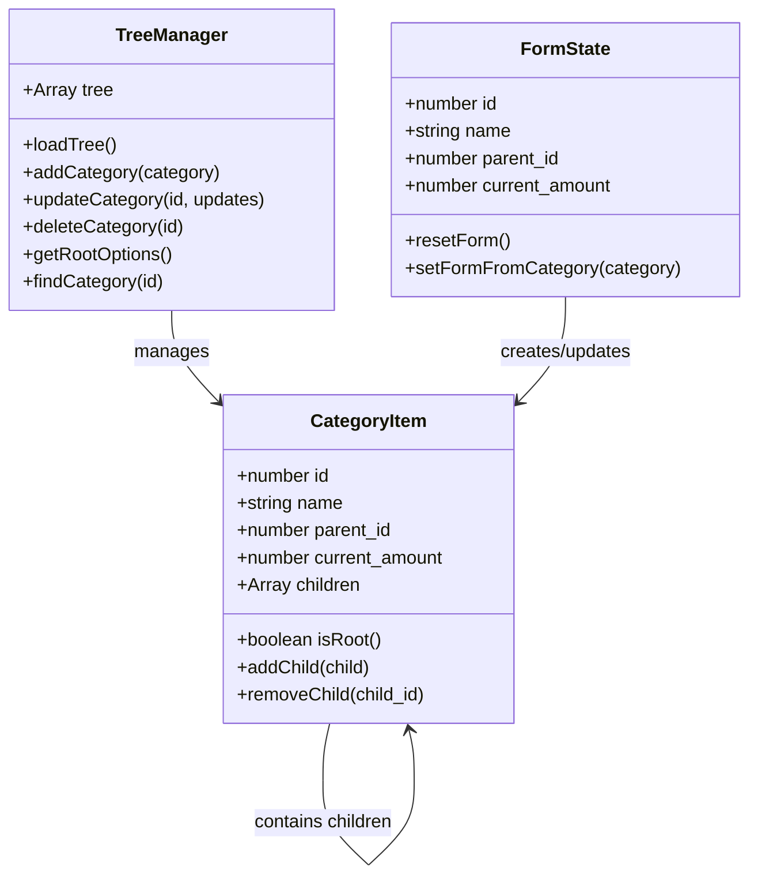
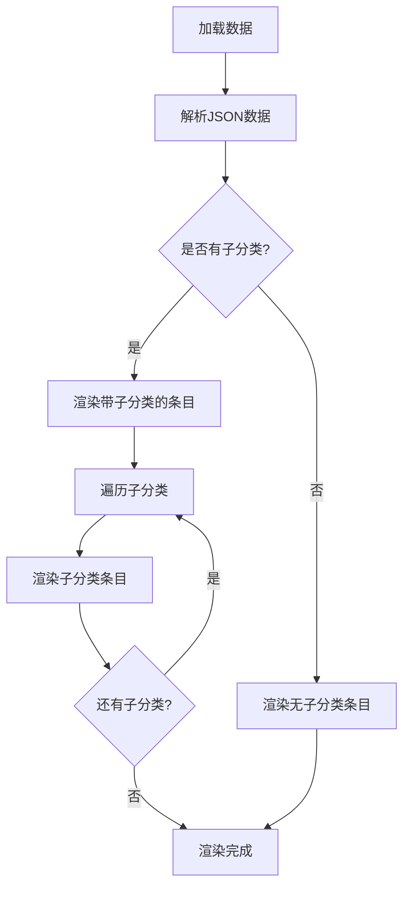
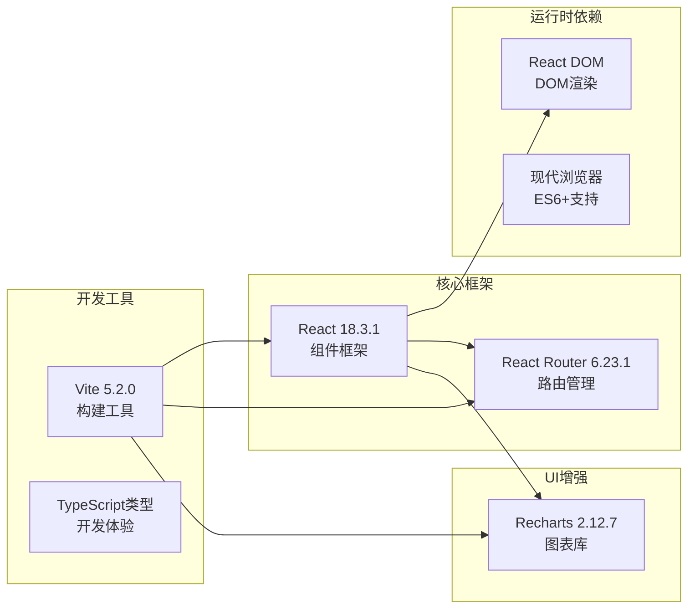

# 前端架构

<cite>
**本文档引用的文件**
- [App.jsx](file://client/src/App.jsx)
- [main.jsx](file://client/src/main.jsx)
- [Dashboard.jsx](file://client/src/pages/Dashboard.jsx)
- [SnapshotEntry.jsx](file://client/src/pages/SnapshotEntry.jsx)
- [FundCategories.jsx](file://client/src/pages/FundCategories.jsx)
- [FundDetail.jsx](file://client/src/pages/FundDetail.jsx)
- [index.css](file://client/src/index.css)
- [package.json](file://client/package.json)
- [vite.config.js](file://client/vite.config.js)
</cite>

## 目录
1. [简介](#简介)
2. [项目结构](#项目结构)
3. [核心组件](#核心组件)
4. [架构概览](#架构概览)
5. [详细组件分析](#详细组件分析)
6. [依赖关系分析](#依赖关系分析)
7. [性能考虑](#性能考虑)
8. [故障排除指南](#故障排除指南)
9. [结论](#结论)

## 简介

个人投资追踪系统是一个基于React的前端应用，专为跟踪和管理个人投资组合而设计。该系统提供了四个核心功能模块：仪表板数据可视化、快照录入、资金分类管理和资金明细展示。应用采用现代化的前端技术栈，包括React 18、React Router 6和Recharts图表库，实现了响应式设计和良好的用户体验。

## 项目结构

该项目采用按功能模块组织的目录结构，清晰分离了页面组件、样式文件和构建配置：

**图表来源**
- [main.jsx:1-13](file://client/src/main.jsx#L1-L13)
- [App.jsx:1-28](file://client/src/App.jsx#L1-L28)

**章节来源**
- [main.jsx:1-13](file://client/src/main.jsx#L1-L13)
- [App.jsx:1-28](file://client/src/App.jsx#L1-L28)
- [package.json:1-24](file://client/package.json#L1-L24)

## 核心组件

### 应用入口与路由配置

应用的启动流程从根节点开始，通过BrowserRouter提供路由支持，然后渲染App组件。App组件定义了所有页面路由和导航链接。

**图表来源**
- [main.jsx:7-12](file://client/src/main.jsx#L7-L12)
- [App.jsx:17-22](file://client/src/App.jsx#L17-L22)

### 页面组件架构

每个页面组件都遵循相似的模式：使用React Hooks管理状态、通过fetch API与后端交互、使用条件渲染处理加载状态和错误情况。

**章节来源**
- [App.jsx:7-26](file://client/src/App.jsx#L7-L26)
- [main.jsx:7-12](file://client/src/main.jsx#L7-L12)

## 架构概览

该应用采用分层架构设计，清晰分离了表现层、业务逻辑层和数据访问层：

**图表来源**
- [Dashboard.jsx:14-32](file://client/src/pages/Dashboard.jsx#L14-L32)
- [SnapshotEntry.jsx:42-66](file://client/src/pages/SnapshotEntry.jsx#L42-L66)
- [FundCategories.jsx:35-65](file://client/src/pages/FundCategories.jsx#L35-L65)

## 详细组件分析

### 仪表板组件 (Dashboard)

Dashboard组件是整个应用的核心，负责展示投资组合的综合视图和历史趋势分析。

#### 数据流架构

**图表来源**
- [Dashboard.jsx:14-32](file://client/src/pages/Dashboard.jsx#L14-L32)

#### 组件特性

- **多数据源集成**：同时管理三个不同的数据源，包括历史增长、当前持仓和资金摘要
- **响应式图表**：使用Recharts库创建可响应的折线图和饼图
- **条件渲染**：根据数据可用性动态显示内容
- **国际化格式**：使用本地化格式显示货币值

**章节来源**
- [Dashboard.jsx:8-96](file://client/src/pages/Dashboard.jsx#L8-L96)

### 快照录入组件 (SnapshotEntry)

SnapshotEntry组件提供了一个完整的表单系统，用于记录投资组合的快照数据。

#### 表单处理流程

**图表来源**
- [SnapshotEntry.jsx:11-26](file://client/src/pages/SnapshotEntry.jsx#L11-L26)
- [SnapshotEntry.jsx:42-66](file://client/src/pages/SnapshotEntry.jsx#L42-L66)

#### 表单特性

- **动态行管理**：支持添加和删除持有项
- **自动填充功能**：从最近的快照自动填充数据
- **实时验证**：在用户输入时进行基本验证
- **批量操作**：支持一键清零特定持有项

**章节来源**
- [SnapshotEntry.jsx:4-132](file://client/src/pages/SnapshotEntry.jsx#L4-L132)

### 资金分类组件 (FundCategories)

FundCategories组件实现了完整的树形结构管理功能，支持一级和二级分类的创建、编辑和删除。

#### 树形数据管理

**图表来源**
- [FundCategories.jsx:3-156](file://client/src/pages/FundCategories.jsx#L3-L156)

#### 功能特性

- **树形结构**：支持两级分类的层次化管理
- **动态表单**：根据选择的父级动态生成选项
- **实时加载**：页面加载时自动获取最新的分类树
- **状态管理**：使用useMemo优化根选项的计算

**章节来源**
- [FundCategories.jsx:3-156](file://client/src/pages/FundCategories.jsx#L3-L156)

### 资金明细组件 (FundDetail)

FundDetail组件提供了一个简洁的层次化展示界面，用于显示完整的资金分类结构。

#### 数据展示模式

**图表来源**
- [FundDetail.jsx:6-14](file://client/src/pages/FundDetail.jsx#L6-L14)

#### 展示特性

- **层次化布局**：清晰展示父子分类关系
- **货币格式化**：统一的金额显示格式
- **条件渲染**：根据是否存在子分类动态调整显示
- **简洁设计**：专注于数据展示，避免不必要的复杂性

**章节来源**
- [FundDetail.jsx:3-46](file://client/src/pages/FundDetail.jsx#L3-L46)

## 依赖关系分析

### 技术栈依赖

应用使用了现代化的前端技术栈，每个依赖都有明确的作用和价值：

**图表来源**
- [package.json:11-22](file://client/package.json#L11-L22)

### 构建配置分析

Vite配置提供了开发和生产环境的最佳实践：

- **代理配置**：将/api前缀的请求代理到后端服务器
- **React插件**：启用快速刷新和热重载
- **开发服务器**：提供本地开发环境

**章节来源**
- [package.json:11-22](file://client/package.json#L11-L22)
- [vite.config.js:5-12](file://client/vite.config.js#L5-L12)

## 性能考虑

### 状态管理优化

应用采用了多种状态管理策略来确保性能和用户体验：

1. **useState优化**：每个组件维护自己的局部状态
2. **useMemo缓存**：在FundCategories中缓存根选项计算结果
3. **条件渲染**：避免不必要的重新渲染

### 数据获取策略

- **并行请求**：Dashboard中的多个API调用可以并行执行
- **错误边界**：每个API调用都有独立的错误处理
- **加载状态**：使用loading状态改善用户体验

### 样式架构优化

应用的CSS架构采用了以下优化策略：

- **原子化设计**：使用通用类名提高复用性
- **响应式网格**：使用CSS Grid实现自适应布局
- **阴影和圆角**：统一的视觉设计语言

## 故障排除指南

### 常见问题诊断

#### API连接问题

**症状**：页面无法加载数据或显示空白
**解决方案**：
1. 检查后端服务是否正在运行
2. 验证代理配置是否正确
3. 查看浏览器开发者工具的网络面板

#### 数据格式问题

**症状**：图表不显示或数据显示异常
**解决方案**：
1. 检查API返回的数据格式
2. 验证数据转换逻辑
3. 使用console.log调试数据流

#### 表单验证问题

**症状**：表单提交失败或验证不工作
**解决方案**：
1. 检查required属性设置
2. 验证数据类型转换
3. 查看控制台错误信息

### 开发环境调试

- **React DevTools**：使用浏览器扩展调试组件状态
- **网络监控**：检查API请求和响应
- **状态检查**：验证组件状态的正确性

**章节来源**
- [Dashboard.jsx:14-32](file://client/src/pages/Dashboard.jsx#L14-L32)
- [SnapshotEntry.jsx:42-66](file://client/src/pages/SnapshotEntry.jsx#L42-L66)
- [FundCategories.jsx:35-65](file://client/src/pages/FundCategories.jsx#L35-L65)

## 结论

个人投资追踪系统的前端架构展现了现代React应用的最佳实践。通过清晰的组件分离、合理的状态管理和优雅的UI设计，该应用为用户提供了一个功能完整且易于使用的投资追踪平台。

### 主要优势

1. **模块化设计**：每个组件都有明确的职责和边界
2. **响应式架构**：支持移动设备和桌面设备
3. **性能优化**：采用多种优化策略提升用户体验
4. **可维护性**：清晰的代码结构便于后续开发

### 技术亮点

- **图表集成**：成功整合Recharts实现复杂的数据可视化
- **表单管理**：提供了灵活且用户友好的表单系统
- **路由设计**：简洁明了的路由配置和导航
- **样式架构**：一致且可扩展的CSS设计系统

该架构为类似的投资追踪应用提供了一个优秀的参考模板，展示了如何在保持代码简洁的同时实现复杂的功能需求。