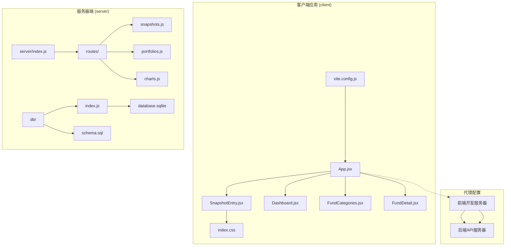
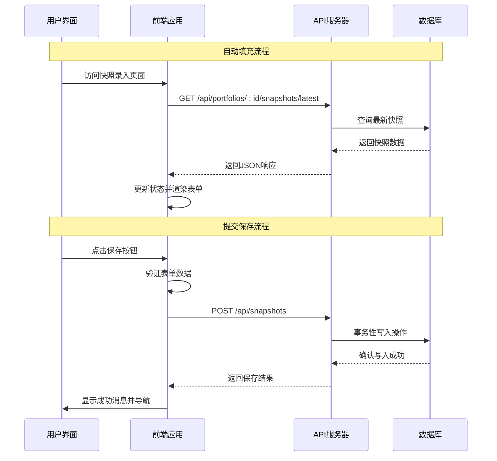
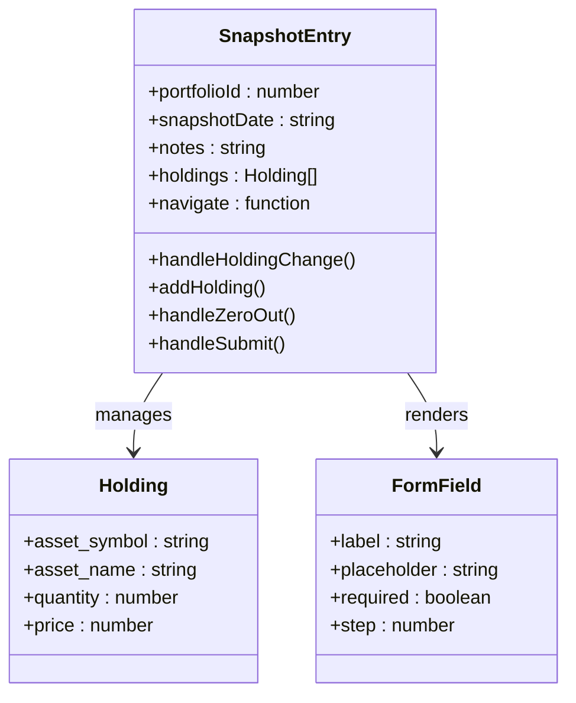
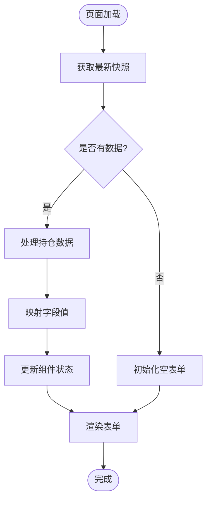
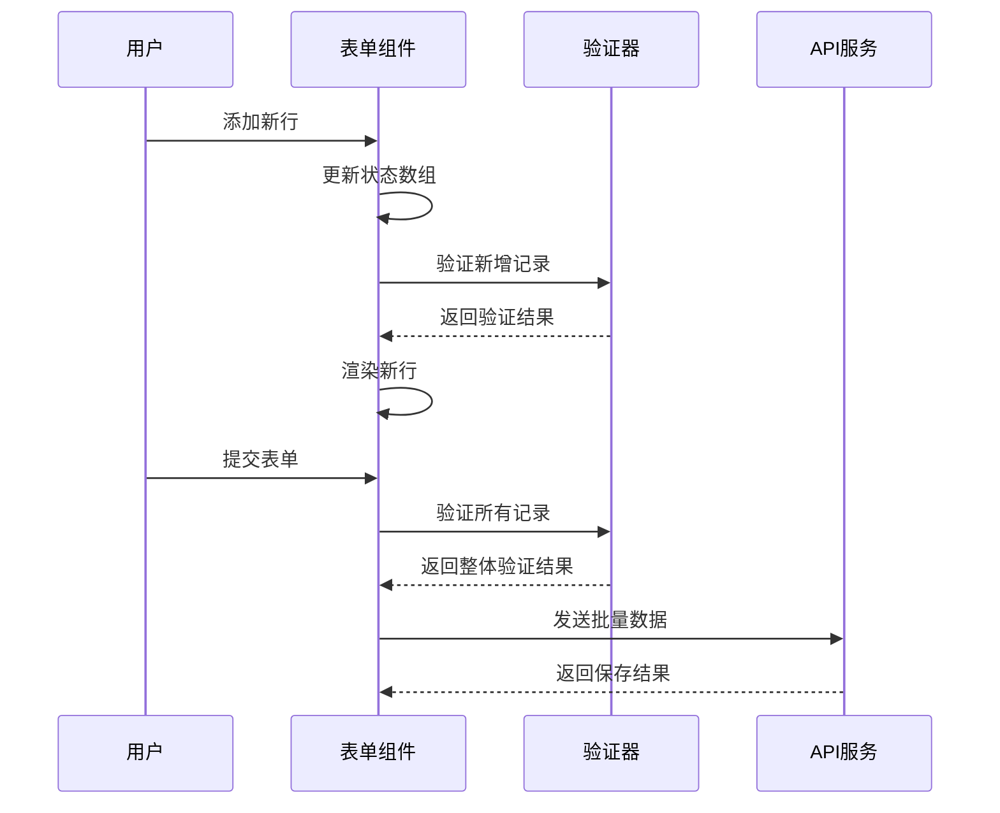
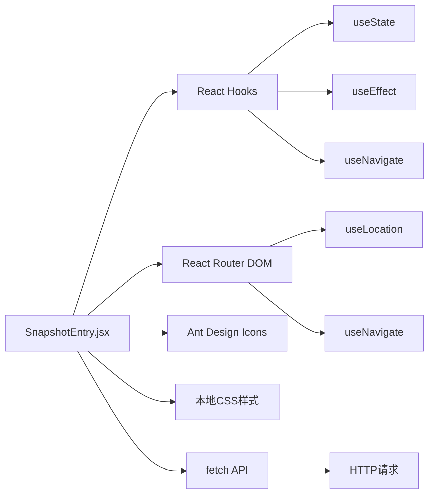
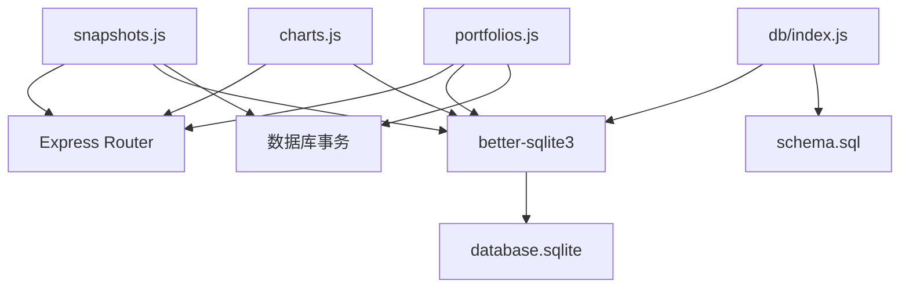
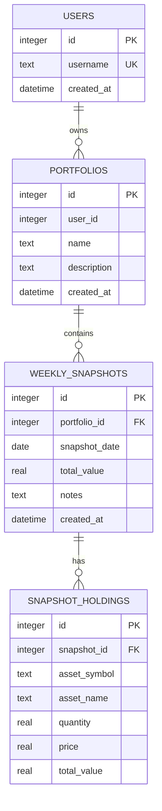

# 快照录入组件

<cite>
**本文档引用的文件**
- [SnapshotEntry.jsx](file://client/src/pages/SnapshotEntry.jsx)
- [App.jsx](file://client/src/App.jsx)
- [index.css](file://client/src/index.css)
- [vite.config.js](file://client/vite.config.js)
- [Dashboard.jsx](file://client/src/pages/Dashboard.jsx)
- [snapshots.js](file://server/routes/snapshots.js)
- [portfolios.js](file://server/routes/portfolios.js)
- [charts.js](file://server/routes/charts.js)
- [schema.sql](file://server/db/schema.sql)
- [index.js](file://server/db/index.js)
</cite>

## 目录
1. [简介](#简介)
2. [项目结构](#项目结构)
3. [核心组件](#核心组件)
4. [架构概览](#架构概览)
5. [详细组件分析](#详细组件分析)
6. [依赖关系分析](#依赖关系分析)
7. [性能考虑](#性能考虑)
8. [故障排除指南](#故障排除指南)
9. [结论](#结论)
10. [附录](#附录)

## 简介

快照录入组件是个人投资追踪系统中的核心功能模块，负责记录和管理投资组合的定期快照数据。该组件提供了直观的表单界面，支持批量录入资产持仓信息，具备智能自动填充功能，并实现了完整的数据验证和错误处理机制。

本组件采用前后端分离架构，前端使用React构建用户界面，后端基于Express.js提供RESTful API服务，数据存储采用SQLite数据库。系统支持投资组合的多期快照管理，为用户提供完整的历史投资数据分析能力。

## 项目结构

个人投资追踪系统采用模块化的项目组织方式，主要分为客户端应用和服务器端API两个部分：



**图表来源**
- [App.jsx:1-73](file://client/src/App.jsx#L1-L73)
- [vite.config.js:1-12](file://client/vite.config.js#L1-L12)
- [server/index.js](file://server/index.js)

**章节来源**
- [App.jsx:1-73](file://client/src/App.jsx#L1-L73)
- [vite.config.js:1-12](file://client/vite.config.js#L1-L12)

## 核心组件

快照录入组件是系统的核心功能模块，主要负责以下关键功能：

### 组件状态管理
- **投资组合标识**: 固定为用户ID 1的投资组合
- **快照日期**: 默认设置为当前日期
- **备注信息**: 可选的文本注释
- **持仓列表**: 动态管理的资产持有列表

### 数据绑定机制
组件使用React的useState钩子实现双向数据绑定：
- 输入字段与状态变量直接关联
- 实时更新和验证
- 支持动态添加和删除行

### 自动填充功能
系统通过查询最近一次快照数据实现智能预填充：
- 自动加载上一周的持仓配置
- 保留资产代码和名称
- 数量和价格字段保持原值

**章节来源**
- [SnapshotEntry.jsx:4-66](file://client/src/pages/SnapshotEntry.jsx#L4-L66)

## 架构概览

系统采用经典的MVC架构模式，前后端分离的设计确保了良好的可维护性和扩展性：



**图表来源**
- [SnapshotEntry.jsx:11-26](file://client/src/pages/SnapshotEntry.jsx#L11-L26)
- [portfolios.js:32-62](file://server/routes/portfolios.js#L32-L62)
- [snapshots.js:33-72](file://server/routes/snapshots.js#L33-L72)

**章节来源**
- [portfolios.js:32-62](file://server/routes/portfolios.js#L32-L62)
- [snapshots.js:33-72](file://server/routes/snapshots.js#L33-L72)

## 详细组件分析

### 表单设计与布局

快照录入表单采用响应式设计，支持不同屏幕尺寸的设备访问：



**图表来源**
- [SnapshotEntry.jsx:4-132](file://client/src/pages/SnapshotEntry.jsx#L4-L132)

#### 字段配置详解

| 字段名称 | 类型 | 验证规则 | 描述 |
|---------|------|----------|------|
| 日期 | date | required | 快照记录的日期，默认当前日期 |
| 备注 | text | optional | 可选的文本注释 |
| 资产代码 | text | required | 证券代码，如AAPL |
| 资产名称 | text | optional | 证券全名，如Apple Inc |
| 数量 | number | required | 持有数量，支持小数点 |
| 单价 | number | required | 股票价格，支持小数点 |

### 数据处理逻辑

#### 自动填充算法



**图表来源**
- [SnapshotEntry.jsx:11-26](file://client/src/pages/SnapshotEntry.jsx#L11-L26)
- [portfolios.js:38-57](file://server/routes/portfolios.js#L38-L57)

#### 批量录入处理

系统支持动态添加多个持仓记录，每个记录都遵循相同的验证规则：



**图表来源**
- [SnapshotEntry.jsx:28-66](file://client/src/pages/SnapshotEntry.jsx#L28-L66)

### 错误处理机制

系统实现了多层次的错误处理策略：

#### 前端错误处理
- 网络请求失败提示
- 表单验证错误显示
- 异步操作异常捕获

#### 后端错误处理
- 数据完整性约束检查
- 业务逻辑验证
- 事务回滚机制

**章节来源**
- [SnapshotEntry.jsx:42-66](file://client/src/pages/SnapshotEntry.jsx#L42-L66)
- [snapshots.js:65-71](file://server/routes/snapshots.js#L65-L71)

## 依赖关系分析

### 前端依赖关系



**图表来源**
- [SnapshotEntry.jsx:1-3](file://client/src/pages/SnapshotEntry.jsx#L1-L3)
- [App.jsx:1-12](file://client/src/App.jsx#L1-L12)

### 后端依赖关系



**图表来源**
- [snapshots.js:1-3](file://server/routes/snapshots.js#L1-L3)
- [db/index.js:1-19](file://server/db/index.js#L1-L19)

**章节来源**
- [db/index.js:1-19](file://server/db/index.js#L1-L19)
- [schema.sql:1-79](file://server/db/schema.sql#L1-L79)

## 性能考虑

### 数据库优化策略

1. **索引优化**: 在`weekly_snapshots`表上建立复合索引以提高查询性能
2. **事务处理**: 使用数据库事务确保数据一致性
3. **连接池**: SQLite在单线程环境下运行，避免并发冲突

### 前端性能优化

1. **状态更新**: 使用不可变更新模式避免不必要的重渲染
2. **懒加载**: 图表组件按需加载
3. **缓存策略**: 利用浏览器缓存静态资源

### API性能优化

1. **批量操作**: 支持一次性提交多个持仓记录
2. **数据压缩**: 响应数据采用JSON格式传输
3. **错误快速返回**: 及时发现并报告数据验证错误

## 故障排除指南

### 常见问题及解决方案

#### 自动填充功能失效
**症状**: 页面加载后没有预填充数据
**可能原因**:
- 最近快照不存在
- 网络请求超时
- API响应格式错误

**解决步骤**:
1. 检查API端点 `/api/portfolios/:id/snapshots/latest`
2. 验证数据库中是否存在快照数据
3. 查看浏览器开发者工具的网络面板

#### 表单提交失败
**症状**: 点击保存按钮后出现错误提示
**可能原因**:
- 重复的快照日期
- 数据格式不正确
- 数据库约束冲突

**解决步骤**:
1. 检查控制台错误日志
2. 验证必填字段是否完整
3. 确认快照日期的唯一性

#### 数据库连接问题
**症状**: API请求返回数据库错误
**可能原因**:
- 数据库文件损坏
- 权限不足
- Schema未正确初始化

**解决步骤**:
1. 检查数据库文件是否存在
2. 验证数据库权限设置
3. 重新执行Schema初始化

**章节来源**
- [snapshots.js:65-71](file://server/routes/snapshots.js#L65-L71)
- [portfolios.js:58-62](file://server/routes/portfolios.js#L58-L62)

## 结论

快照录入组件作为个人投资追踪系统的核心功能，展现了优秀的架构设计和用户体验。组件具备以下优势：

1. **完整的功能覆盖**: 从数据录入到自动填充，再到数据持久化
2. **良好的用户体验**: 直观的表单设计和实时反馈机制
3. **可靠的错误处理**: 多层次的验证和异常处理策略
4. **可扩展的架构**: 模块化设计便于功能扩展和维护

未来可以考虑的功能增强包括：
- 支持更多类型的资产类别
- 增加数据导入导出功能
- 实现更复杂的数据验证规则
- 添加数据备份和恢复机制

## 附录

### API接口规范

#### 快照管理接口
- `POST /api/snapshots` - 创建新的快照
- `PUT /api/snapshots/:id` - 更新现有快照
- `GET /api/snapshots/:id` - 获取快照详情

#### 投资组合接口
- `GET /api/portfolios/:id/snapshots/latest` - 获取最新快照
- `GET /api/portfolios/:id/snapshots` - 获取快照列表

### 数据模型定义



**图表来源**
- [schema.sql:24-45](file://server/db/schema.sql#L24-L45)

### 开发环境配置

#### 代理配置
前端开发服务器通过Vite配置代理到后端API服务器：
- 前端端口: 5173
- 后端端口: 5000
- 代理路径: `/api`

#### 依赖安装
```bash
# 安装前端依赖
npm install

# 安装后端依赖
cd server
npm install

# 启动开发服务器
npm run dev
```