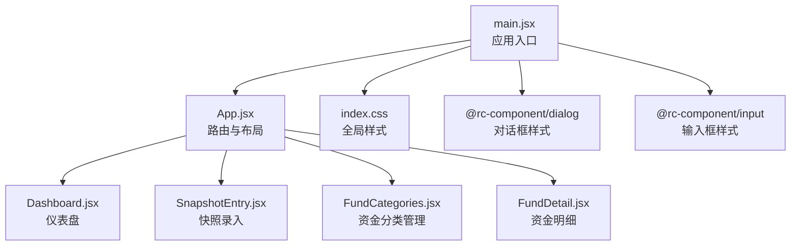
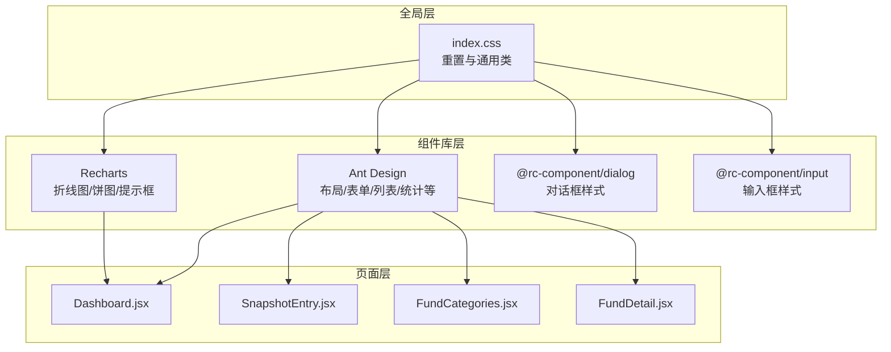
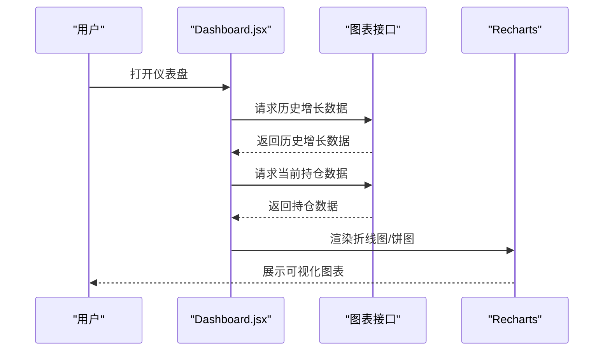
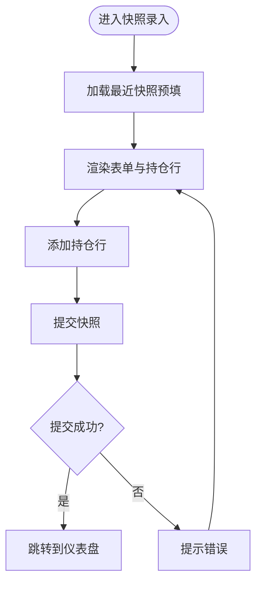
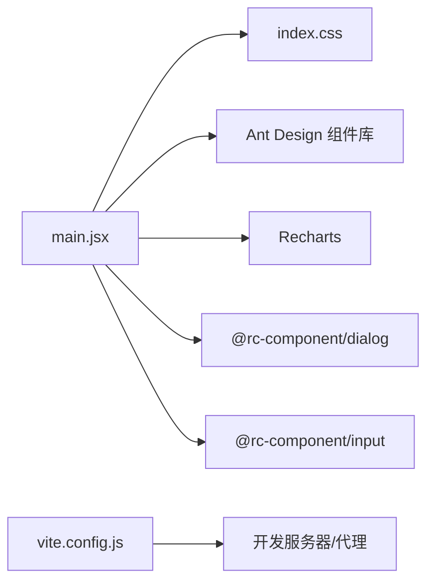

# 样式架构

<cite>
**本文引用的文件**
- [index.css](file://client/src/index.css)
- [main.jsx](file://client/src/main.jsx)
- [App.jsx](file://client/src/App.jsx)
- [Dashboard.jsx](file://client/src/pages/Dashboard.jsx)
- [FundCategories.jsx](file://client/src/pages/FundCategories.jsx)
- [FundDetail.jsx](file://client/src/pages/FundDetail.jsx)
- [SnapshotEntry.jsx](file://client/src/pages/SnapshotEntry.jsx)
- [index.css](file://client/node_modules/@rc-component/dialog/assets/index.css)
- [index.css](file://client/node_modules/@rc-component/input/assets/index.css)
- [vite.config.js](file://client/vite.config.js)
- [package.json](file://client/package.json)
</cite>

## 目录
1. [简介](#简介)
2. [项目结构](#项目结构)
3. [核心组件](#核心组件)
4. [架构总览](#架构总览)
5. [详细组件分析](#详细组件分析)
6. [依赖分析](#依赖分析)
7. [性能考虑](#性能考虑)
8. [故障排查指南](#故障排查指南)
9. [结论](#结论)
10. [附录](#附录)

## 简介
本文件面向个人投资追踪系统的样式架构，系统采用前端框架与UI库组合的方式：以 Ant Design 为主要视觉与交互基础，结合 Recharts 实现图表可视化，并通过 Vite 构建工具进行开发与打包。样式方面，全局基础样式由应用入口统一引入，页面内组件样式主要依赖 Ant Design 组件库提供的类名与主题变量；部分第三方组件（如对话框、输入框等）由其自带样式文件提供。

在本架构中，样式组织遵循“全局基础样式 + 组件库样式 + 页面级微调”的分层思路；命名规范以语义化类名为主，避免过度使用复杂选择器；组件样式隔离通过 Ant Design 的模块化类名与 CSS-in-JS 能力实现；响应式设计主要依赖 Ant Design 响应式栅格与图表容器的自适应能力；颜色系统与主题定制则通过 Ant Design 提供的主题变量与组件属性进行控制。

## 项目结构
客户端采用 React + Vite 架构，样式入口位于全局 CSS 文件，页面组件按功能划分在 pages 目录下，Ant Design 作为主要 UI 库，Recharts 用于数据可视化。

**图示来源**
- [main.jsx:1-13](file://client/src/main.jsx#L1-L13)
- [App.jsx:1-73](file://client/src/App.jsx#L1-L73)
- [Dashboard.jsx:1-101](file://client/src/pages/Dashboard.jsx#L1-L101)
- [SnapshotEntry.jsx:1-148](file://client/src/pages/SnapshotEntry.jsx#L1-L148)
- [FundCategories.jsx:1-184](file://client/src/pages/FundCategories.jsx#L1-L184)
- [FundDetail.jsx:1-60](file://client/src/pages/FundDetail.jsx#L1-L60)
- [index.css:1-158](file://client/src/index.css#L1-L158)
- [index.css:1-175](file://client/node_modules/@rc-component/dialog/assets/index.css#L1-L175)
- [index.css:1-28](file://client/node_modules/@rc-component/input/assets/index.css#L1-L28)

**章节来源**
- [main.jsx:1-13](file://client/src/main.jsx#L1-L13)
- [App.jsx:1-73](file://client/src/App.jsx#L1-L73)
- [index.css:1-158](file://client/src/index.css#L1-L158)

## 核心组件
- 全局样式与重置
  - 全局重置与基础排版：统一盒模型、字体族、背景色与文本色，确保跨组件一致性。
  - 页面容器与卡片样式：提供通用卡片、表单容器、网格布局、分隔线等基础样式类，便于页面快速搭建。
- Ant Design 组件库
  - 使用 Ant Design 的布局、菜单、卡片、统计信息、表单、列表、折叠面板、消息提示等组件，样式由组件库自动注入。
  - 图表组件：使用 Recharts 的折线图、饼图、坐标轴与提示框，配合 ResponsiveContainer 实现自适应。
- 第三方组件样式
  - @rc-component/dialog：提供对话框容器、遮罩、动画与媒体查询适配。
  - @rc-component/input：提供输入框的前缀后缀包装、清空图标与交互状态样式。

**章节来源**
- [index.css:1-158](file://client/src/index.css#L1-L158)
- [Dashboard.jsx:1-101](file://client/src/pages/Dashboard.jsx#L1-L101)
- [FundCategories.jsx:1-184](file://client/src/pages/FundCategories.jsx#L1-L184)
- [FundDetail.jsx:1-60](file://client/src/pages/FundDetail.jsx#L1-L60)
- [SnapshotEntry.jsx:1-148](file://client/src/pages/SnapshotEntry.jsx#L1-L148)
- [index.css:1-175](file://client/node_modules/@rc-component/dialog/assets/index.css#L1-L175)
- [index.css:1-28](file://client/node_modules/@rc-component/input/assets/index.css#L1-L28)

## 架构总览
样式架构采用“全局样式 + 组件库样式 + 页面微调”的分层模式。Ant Design 提供统一的视觉语言与交互行为，Recharts 负责数据可视化，第三方组件库提供必要的补充样式。页面通过语义化类名与组件属性实现一致的风格与良好的可维护性。

**图示来源**
- [index.css:1-158](file://client/src/index.css#L1-L158)
- [Dashboard.jsx:1-101](file://client/src/pages/Dashboard.jsx#L1-L101)
- [SnapshotEntry.jsx:1-148](file://client/src/pages/SnapshotEntry.jsx#L1-L148)
- [FundCategories.jsx:1-184](file://client/src/pages/FundCategories.jsx#L1-L184)
- [FundDetail.jsx:1-60](file://client/src/pages/FundDetail.jsx#L1-L60)
- [index.css:1-175](file://client/node_modules/@rc-component/dialog/assets/index.css#L1-L175)
- [index.css:1-28](file://client/node_modules/@rc-component/input/assets/index.css#L1-L28)

## 详细组件分析

### 全局样式与命名规范
- 命名策略
  - 采用语义化类名，如 chart-container、form-container、holding-item、top-category-grid 等，便于理解用途与职责。
  - 使用 BEM 风格的局部变体，如 category-row、category-child-row，增强可读性与可维护性。
- 样式隔离
  - 通过 Ant Design 的类名体系与 CSS-in-JS 能力，避免全局污染。
  - 页面内使用局部容器类包裹，减少样式冲突风险。
- 可复用性
  - 将通用布局与视觉元素抽象为可复用类，如 page-section-gap、divider、row-actions 等，提升开发效率。

**章节来源**
- [index.css:13-158](file://client/src/index.css#L13-L158)

### 仪表盘页面样式
- 数据可视化
  - 折线图与饼图通过 ResponsiveContainer 自适应容器宽度与高度，确保在不同屏幕尺寸下保持良好显示效果。
  - 图表颜色通过组件属性与固定色板控制，保证一致性。
- 卡片与栅格
  - 使用 Ant Design 的 Card 与 Grid/Col 组件，结合语义化类名实现卡片标题、统计数值与网格布局的统一风格。
- 响应式断点
  - 使用 Ant Design 的栅格断点（xs/sm/md）在不同屏幕宽度下调整列数与间距，提升移动端体验。

**图示来源**
- [Dashboard.jsx:17-35](file://client/src/pages/Dashboard.jsx#L17-L35)
- [Dashboard.jsx:65-98](file://client/src/pages/Dashboard.jsx#L65-L98)

**章节来源**
- [Dashboard.jsx:1-101](file://client/src/pages/Dashboard.jsx#L1-L101)

### 快照录入页面样式
- 表单布局
  - 使用 Ant Design 的 Form 与 Input/DatePicker/InputNumber 组件，结合语义化类名实现表单容器与字段组的统一风格。
  - 通过 Row/Col 实现多列输入的对齐与间距控制。
- 动态行管理
  - 持仓行通过数组动态渲染，每行使用 Card 进行分组，按钮与输入框按列排列，提升可读性与操作效率。
- 响应式适配
  - 列宽随屏幕尺寸变化，移动端紧凑布局，桌面端更宽松。

**图示来源**
- [SnapshotEntry.jsx:14-29](file://client/src/pages/SnapshotEntry.jsx#L14-L29)
- [SnapshotEntry.jsx:37-68](file://client/src/pages/SnapshotEntry.jsx#L37-L68)

**章节来源**
- [SnapshotEntry.jsx:1-148](file://client/src/pages/SnapshotEntry.jsx#L1-L148)

### 资金分类管理页面样式
- 树形结构展示
  - 使用 Collapse 与 List 展示父子层级关系，语义化类名控制头部、标签与操作按钮的样式。
- 表单与交互
  - 表单使用 Ant Design 的 Form/Select/InputNumber/Button，结合 loading 与消息提示提升用户体验。
- 响应式与可访问性
  - 通过 Ant Design 的响应式属性与语义化标签，确保在不同设备上的可用性。

**章节来源**
- [FundCategories.jsx:1-184](file://client/src/pages/FundCategories.jsx#L1-L184)

### 资金明细页面样式
- 折叠面板与列表
  - 使用 Collapse 与 List 展示层级数据，语义化类名控制头部与描述信息的样式。
- 空状态处理
  - 使用 Empty 组件与语义化类名，提供简洁的空状态提示。

**章节来源**
- [FundDetail.jsx:1-60](file://client/src/pages/FundDetail.jsx#L1-L60)

### 第三方组件样式
- 对话框样式
  - @rc-component/dialog 提供容器、遮罩、关闭按钮、动画与媒体查询适配，确保在不同设备上的一致体验。
- 输入框样式
  - @rc-component/input 提供输入框包装、交互状态与清空图标样式，增强输入体验。

**章节来源**
- [index.css:1-175](file://client/node_modules/@rc-component/dialog/assets/index.css#L1-L175)
- [index.css:1-28](file://client/node_modules/@rc-component/input/assets/index.css#L1-L28)

## 依赖分析
- 样式依赖链
  - 应用入口引入全局样式，Ant Design 与 Recharts 通过组件库自动注入样式。
  - 第三方组件库样式来自其内置资源文件，无需额外配置。
- 构建与代理
  - Vite 作为构建工具，提供开发服务器与代理配置，便于前后端联调。

**图示来源**
- [main.jsx:1-13](file://client/src/main.jsx#L1-L13)
- [vite.config.js:1-12](file://client/vite.config.js#L1-L12)
- [package.json:11-26](file://client/package.json#L11-L26)

**章节来源**
- [main.jsx:1-13](file://client/src/main.jsx#L1-L13)
- [vite.config.js:1-12](file://client/vite.config.js#L1-L12)
- [package.json:1-26](file://client/package.json#L1-L26)

## 性能考虑
- 样式体积控制
  - 优先使用 Ant Design 组件库提供的样式，减少重复定义；仅在必要时扩展或覆盖少量类名。
- 渲染性能
  - 图表容器使用 ResponsiveContainer，避免强制固定尺寸导致的重排；合理拆分组件，减少不必要的重渲染。
- 构建优化
  - Vite 默认启用按需打包与模块热替换，建议在生产构建中开启压缩与 Tree Shaking。

[本节为通用指导，不直接分析具体文件]

## 故障排查指南
- 样式未生效
  - 检查全局样式是否正确引入；确认类名拼写与语义化命名是否一致。
- 组件样式冲突
  - 使用 Ant Design 的主题变量与组件属性进行覆盖；避免在页面内直接修改第三方组件库的内部样式。
- 响应式异常
  - 确认 Ant Design 的栅格断点与图表容器的自适应配置；检查媒体查询与视口设置。
- 动画与过渡问题
  - 检查第三方组件库的动画类名与播放状态；确保动画时序与触发条件正确。

[本节为通用指导，不直接分析具体文件]

## 结论
该样式架构以 Ant Design 为核心，结合 Recharts 与第三方组件库，形成统一、可维护且具有良好响应式表现的前端样式体系。通过语义化类名与组件库的模块化能力，实现了较好的样式隔离与复用。建议在后续迭代中进一步沉淀通用样式类与主题变量，持续优化图表与表单的交互细节，并完善移动端的微调与测试。

[本节为总结性内容，不直接分析具体文件]

## 附录
- 开发与调试建议
  - 使用浏览器开发者工具检查元素与样式来源，定位样式冲突与覆盖问题。
  - 在本地开发环境中模拟不同屏幕尺寸，验证响应式布局与图表自适应效果。
  - 对关键交互（如表单提交、图表渲染）增加日志与错误提示，提升可观测性。

[本节为通用指导，不直接分析具体文件]