# 资金分类组件

<cite>
**本文档引用的文件**
- [FundCategories.jsx](file://client/src/pages/FundCategories.jsx)
- [fundCategories.js](file://server/routes/fundCategories.js)
- [schema.sql](file://server/db/schema.sql)
- [index.js](file://server/db/index.js)
- [App.jsx](file://client/src/App.jsx)
- [Dashboard.jsx](file://client/src/pages/Dashboard.jsx)
- [FundDetail.jsx](file://client/src/pages/FundDetail.jsx)
- [index.js](file://server/index.js)
</cite>

## 目录
1. [简介](#简介)
2. [项目结构](#项目结构)
3. [核心组件](#核心组件)
4. [架构概览](#架构概览)
5. [详细组件分析](#详细组件分析)
6. [依赖关系分析](#依赖关系分析)
7. [性能考虑](#性能考虑)
8. [故障排除指南](#故障排除指南)
9. [结论](#结论)

## 简介

资金分类组件是个人投资追踪系统中的核心功能模块，负责管理用户的资金分类体系。该组件实现了完整的树形结构管理，支持两级分类（一级分类和二级分类），提供分类的增删改查操作，并通过独特的数据模型确保数据一致性。

系统采用前后端分离架构，前端使用React + Ant Design构建用户界面，后端基于Express.js和SQLite数据库提供RESTful API服务。资金分类组件特别设计了独特的数据结构：顶级分类用于汇总显示，二级分类用于具体记录，这种设计既满足了仪表盘的简洁展示需求，又保证了明细查询的完整性。

## 项目结构

资金分类组件位于客户端的页面目录中，与仪表盘、快照录入、资金明细等页面共同构成完整的投资追踪系统。

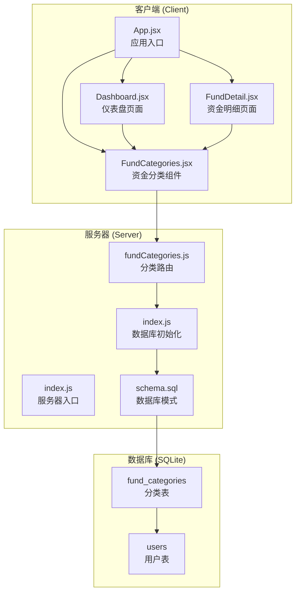

**图表来源**
- [App.jsx:1-73](file://client/src/App.jsx#L1-L73)
- [FundCategories.jsx:1-184](file://client/src/pages/FundCategories.jsx#L1-L184)
- [server/index.js:1-32](file://server/index.js#L1-L32)
- [server/routes/fundCategories.js:1-139](file://server/routes/fundCategories.js#L1-L139)

**章节来源**
- [App.jsx:1-73](file://client/src/App.jsx#L1-L73)
- [FundCategories.jsx:1-184](file://client/src/pages/FundCategories.jsx#L1-L184)
- [server/index.js:1-32](file://server/index.js#L1-L32)

## 核心组件

### 前端组件架构

资金分类组件采用函数式组件设计，使用React Hooks进行状态管理。组件内部维护三个主要状态：
- `tree`: 完整的树形结构数据
- `loading`: 加载状态指示器
- `form`: 表单数据状态

组件通过useMemo优化根节点选项的计算，避免不必要的重新渲染。

### 数据模型设计

系统采用两级分类模型，具有以下特点：

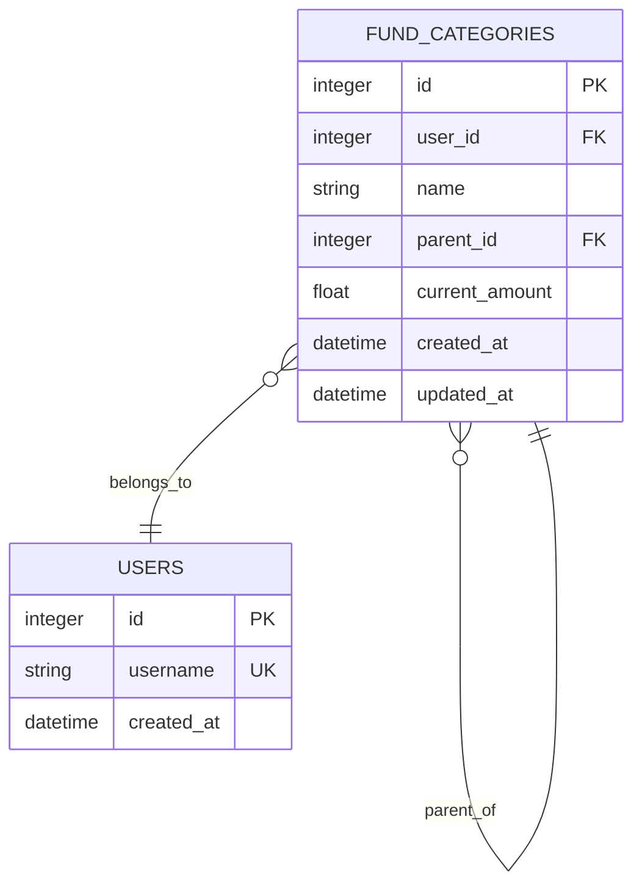

**图表来源**
- [schema.sql:47-68](file://server/db/schema.sql#L47-L68)

**章节来源**
- [FundCategories.jsx:8-33](file://client/src/pages/FundCategories.jsx#L8-L33)
- [schema.sql:47-68](file://server/db/schema.sql#L47-L68)

## 架构概览

资金分类组件遵循MVC架构模式，前端负责视图层和用户交互，后端提供数据访问层和业务逻辑。

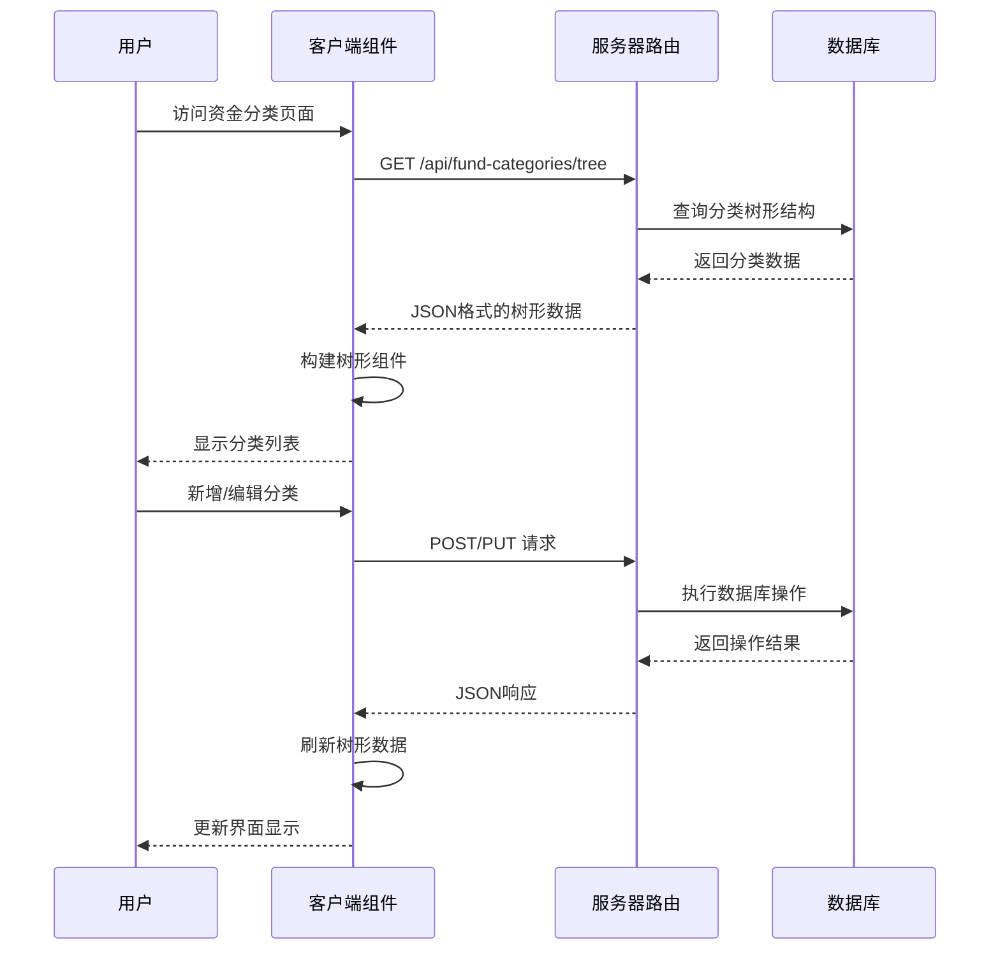

**图表来源**
- [FundCategories.jsx:20-67](file://client/src/pages/FundCategories.jsx#L20-L67)
- [fundCategories.js:29-43](file://server/routes/fundCategories.js#L29-L43)

**章节来源**
- [FundCategories.jsx:20-67](file://client/src/pages/FundCategories.jsx#L20-L67)
- [fundCategories.js:29-43](file://server/routes/fundCategories.js#L29-L43)

## 详细组件分析

### 树形结构管理实现

#### 数据获取流程

组件在挂载时自动加载树形结构数据，采用异步加载机制确保用户体验。

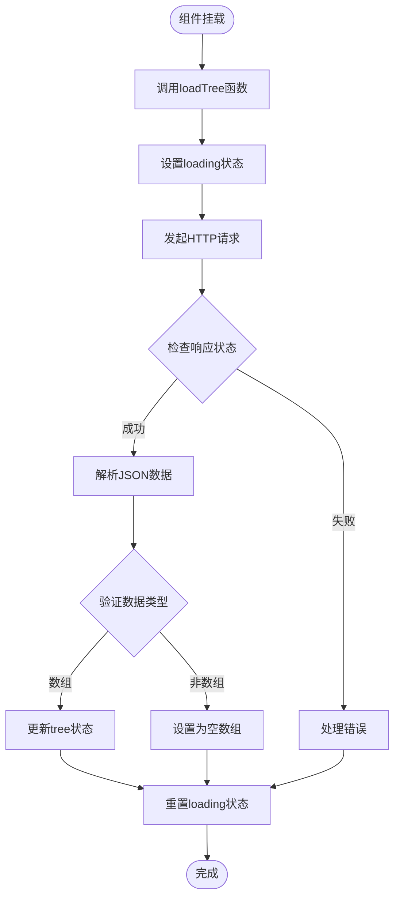

**图表来源**
- [FundCategories.jsx:20-29](file://client/src/pages/FundCategories.jsx#L20-L29)

#### 分类层级展示

系统采用两级分类结构，一级分类用于仪表盘汇总显示，二级分类用于具体资金记录。

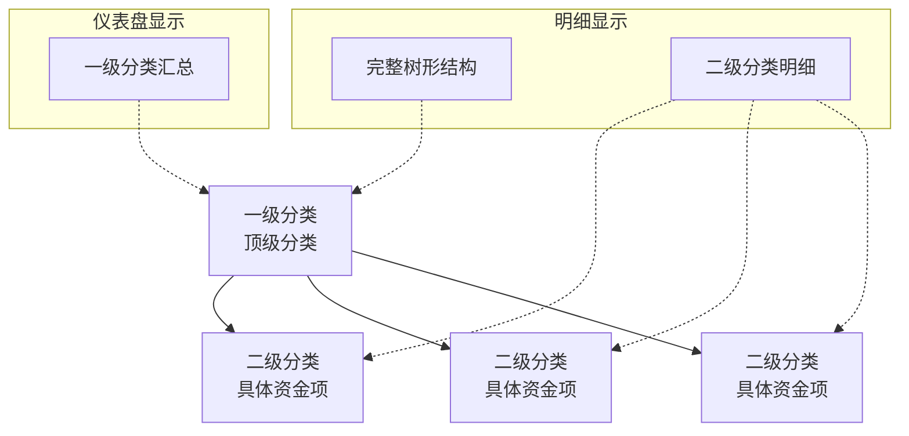

**图表来源**
- [FundCategories.jsx:127-179](file://client/src/pages/FundCategories.jsx#L127-L179)
- [Dashboard.jsx:30-62](file://client/src/pages/Dashboard.jsx#L30-L62)

#### CRUD操作实现

##### 创建操作

创建操作支持两种模式：创建一级分类和创建二级分类。

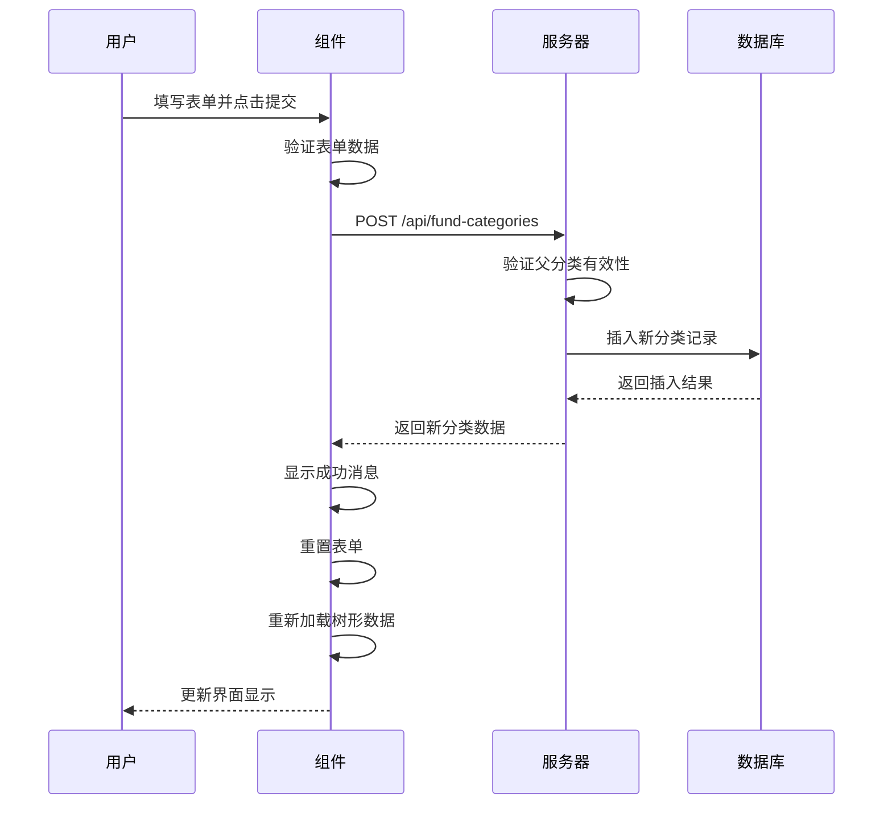

**图表来源**
- [FundCategories.jsx:39-67](file://client/src/pages/FundCategories.jsx#L39-L67)
- [fundCategories.js:45-81](file://server/routes/fundCategories.js#L45-L81)

##### 更新操作

更新操作支持分类名称、父分类和当前金额的修改。

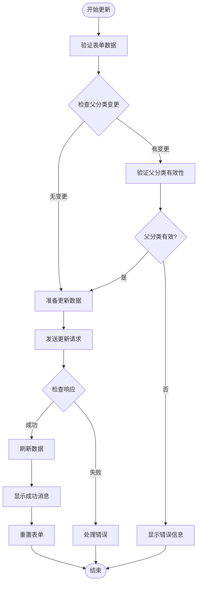

**图表来源**
- [FundCategories.jsx:39-67](file://client/src/pages/FundCategories.jsx#L39-L67)
- [fundCategories.js:83-136](file://server/routes/fundCategories.js#L83-L136)

#### 数据同步机制

系统采用客户端缓存和手动刷新的同步策略：

1. **实时性保证**: 每次CRUD操作后立即重新加载数据
2. **状态一致性**: 使用React状态管理确保UI与数据同步
3. **错误恢复**: 操作失败时保持原有数据状态

### 状态管理

组件使用React Hooks进行状态管理，包括useState和useEffect：

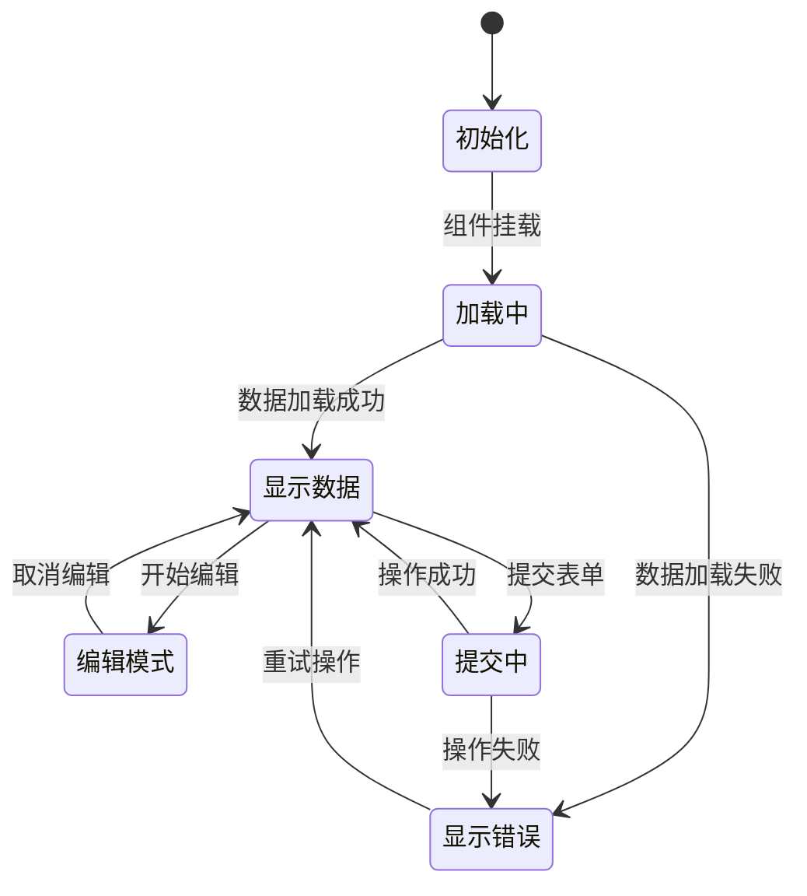

**图表来源**
- [FundCategories.jsx:8-33](file://client/src/pages/FundCategories.jsx#L8-L33)

**章节来源**
- [FundCategories.jsx:8-33](file://client/src/pages/FundCategories.jsx#L8-L33)

### 用户交互模式

#### 表单交互

组件提供直观的表单交互体验：

- **输入验证**: 实时验证必填字段和数值格式
- **选择器**: 动态生成父分类选项，过滤掉非顶级分类
- **按钮状态**: 根据表单状态动态调整按钮可用性

#### 树形组件交互

使用Ant Design的Collapse组件实现展开折叠功能：

- **一级分类**: 可展开查看二级分类
- **二级分类**: 显示具体的资金金额
- **编辑按钮**: 支持直接编辑分类信息

### 唯一性约束处理

系统通过数据库层面的唯一性约束确保数据完整性：

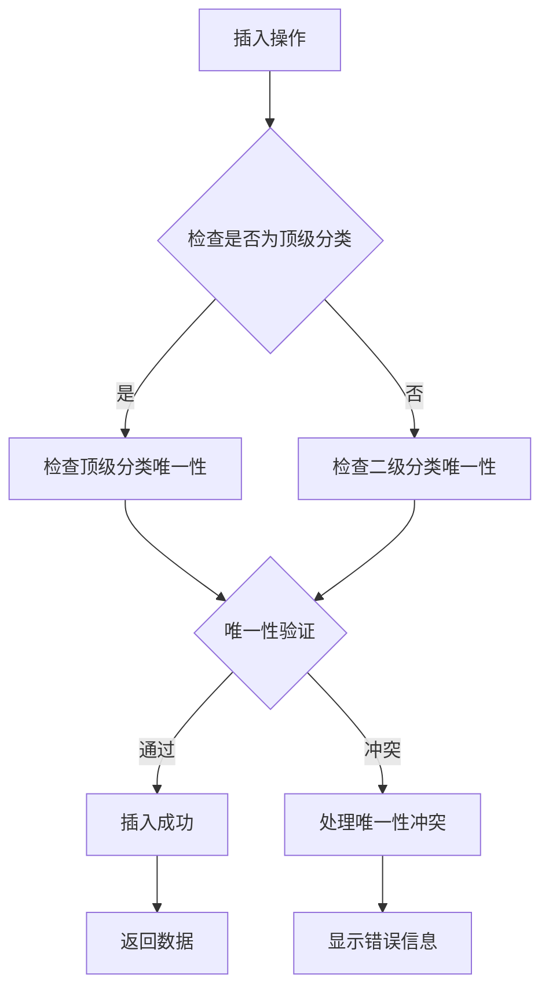

**图表来源**
- [schema.sql:60-68](file://server/db/schema.sql#L60-L68)
- [fundCategories.js:75-80](file://server/routes/fundCategories.js#L75-L80)

**章节来源**
- [schema.sql:60-68](file://server/db/schema.sql#L60-L68)
- [fundCategories.js:75-80](file://server/routes/fundCategories.js#L75-L80)

## 依赖关系分析

### 前端依赖

资金分类组件依赖于多个Ant Design组件和React生态系统：

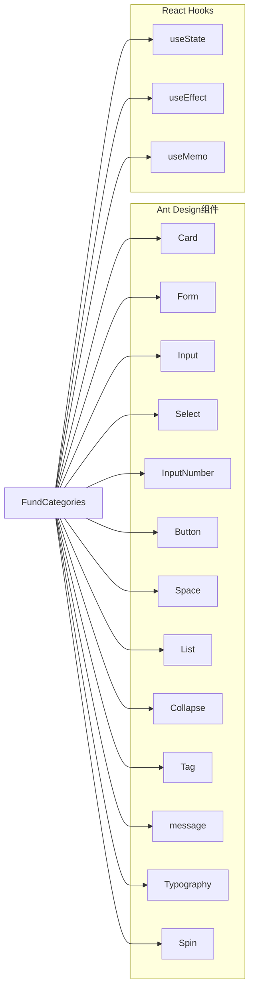

**图表来源**
- [FundCategories.jsx:1-6](file://client/src/pages/FundCategories.jsx#L1-L6)

### 后端依赖

服务器端路由依赖于Express.js和SQLite数据库：

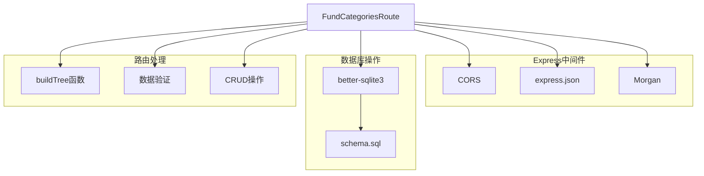

**图表来源**
- [server/index.js:13-21](file://server/index.js#L13-L21)
- [server/db/index.js:1-19](file://server/db/index.js#L1-L19)

**章节来源**
- [FundCategories.jsx:1-6](file://client/src/pages/FundCategories.jsx#L1-L6)
- [server/index.js:13-21](file://server/index.js#L13-L21)
- [server/db/index.js:1-19](file://server/db/index.js#L1-L19)

## 性能考虑

### 前端性能优化

1. **状态优化**: 使用useMemo避免不必要的树形结构计算
2. **条件渲染**: 仅在数据存在时渲染列表内容
3. **加载状态**: 使用Spin组件提供视觉反馈
4. **事件处理**: 使用事件委托减少DOM操作

### 后端性能优化

1. **索引优化**: 为常用查询字段建立索引
2. **查询优化**: 使用单次查询获取完整树形结构
3. **事务处理**: 在数据库操作中使用事务保证一致性
4. **连接池**: SQLite原生支持多连接并发

### 数据一致性保证

系统通过多种机制确保数据一致性：

1. **数据库约束**: 外键约束和唯一性约束
2. **业务逻辑验证**: 服务器端的数据验证
3. **事务处理**: 原子性操作保证
4. **错误回滚**: 异常情况下的数据恢复

## 故障排除指南

### 常见问题及解决方案

#### 数据加载失败

**症状**: 页面显示空白或错误信息
**原因**: 网络请求失败或服务器错误
**解决方案**: 
1. 检查网络连接状态
2. 验证服务器端点可用性
3. 查看浏览器开发者工具中的错误信息

#### 分类创建失败

**症状**: 创建分类时出现错误提示
**原因**: 唯一性约束冲突或数据验证失败
**解决方案**:
1. 检查分类名称是否已存在
2. 验证父分类的有效性
3. 确认输入数据格式正确

#### 树形结构显示异常

**症状**: 分类层级显示错误或数据不完整
**原因**: 数据库查询结果异常或前端渲染问题
**解决方案**:
1. 检查数据库中的分类关系
2. 验证buildTree函数的执行逻辑
3. 确认前端状态更新机制正常

**章节来源**
- [fundCategories.js:40-42](file://server/routes/fundCategories.js#L40-L42)
- [FundCategories.jsx:59-62](file://client/src/pages/FundCategories.jsx#L59-L62)

## 结论

资金分类组件是一个设计精良的投资追踪系统核心功能模块。它通过清晰的两级分类架构、完善的CRUD操作、严格的数据约束和优雅的用户界面，为用户提供了一个强大而易用的资金分类管理工具。

组件的主要优势包括：

1. **架构清晰**: 前后端分离，职责明确
2. **数据安全**: 多层次的数据验证和约束
3. **用户体验**: 直观的界面和流畅的操作流程
4. **扩展性强**: 模块化设计便于功能扩展

未来可以考虑的功能增强包括：
- 支持拖拽排序功能
- 添加批量操作支持
- 实现分类移动到不同父级的能力
- 增加分类删除前的确认机制