# 资金明细组件

<cite>
**本文档引用的文件**
- [FundDetail.jsx](file://client/src/pages/FundDetail.jsx)
- [FundCategories.jsx](file://client/src/pages/FundCategories.jsx)
- [funds.js](file://server/routes/funds.js)
- [fundCategories.js](file://server/routes/fundCategories.js)
- [schema.sql](file://server/db/schema.sql)
- [index.js](file://server/db/index.js)
- [App.jsx](file://client/src/App.jsx)
- [Dashboard.jsx](file://client/src/pages/Dashboard.jsx)
</cite>

## 目录
1. [简介](#简介)
2. [项目结构](#项目结构)
3. [核心组件](#核心组件)
4. [架构概览](#架构概览)
5. [详细组件分析](#详细组件分析)
6. [依赖分析](#依赖分析)
7. [性能考虑](#性能考虑)
8. [故障排除指南](#故障排除指南)
9. [结论](#结论)

## 简介

资金明细组件是个人投资追踪系统中的核心功能模块，负责展示用户的资金明细信息。该组件实现了多层次的资金分类展示，支持一级和二级分类的递归渲染，提供完整的金额计算和汇总统计功能。

本组件采用前后端分离架构，前端使用React + Ant Design构建用户界面，后端基于Express.js和SQLite数据库提供数据服务。系统支持两级资金分类结构，每个用户只能看到自己的数据，并且具有完善的权限控制和数据验证机制。

## 项目结构

项目采用模块化的文件组织方式，主要分为客户端和服务器端两个部分：

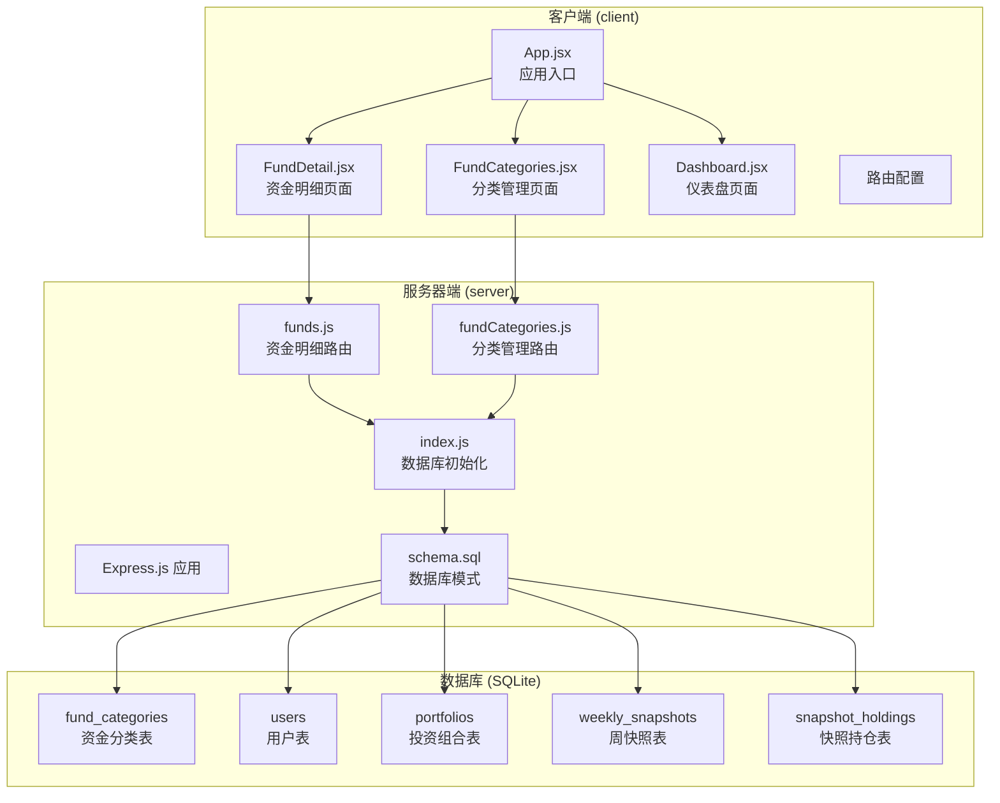

**图表来源**
- [App.jsx:1-73](file://client/src/App.jsx#L1-L73)
- [FundDetail.jsx:1-60](file://client/src/pages/FundDetail.jsx#L1-L60)
- [FundCategories.jsx:1-184](file://client/src/pages/FundCategories.jsx#L1-L184)
- [funds.js:1-95](file://server/routes/funds.js#L1-L95)
- [fundCategories.js:1-139](file://server/routes/fundCategories.js#L1-L139)
- [schema.sql:1-79](file://server/db/schema.sql#L1-L79)

**章节来源**
- [App.jsx:1-73](file://client/src/App.jsx#L1-L73)
- [schema.sql:1-79](file://server/db/schema.sql#L1-L79)

## 核心组件

### 前端组件架构

资金明细组件由多个相互协作的组件构成：

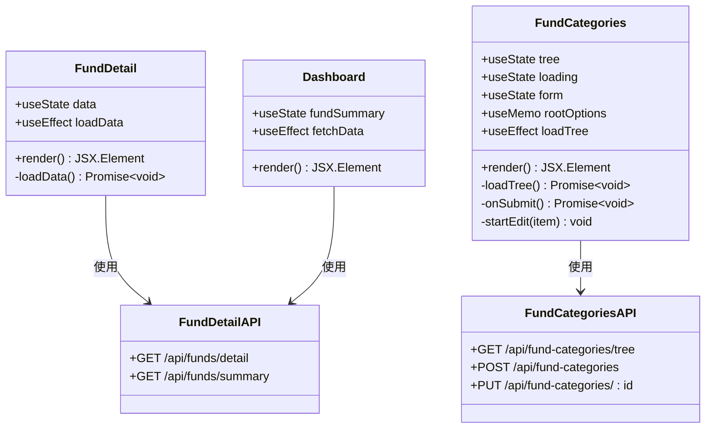

**图表来源**
- [FundDetail.jsx:7-60](file://client/src/pages/FundDetail.jsx#L7-L60)
- [FundCategories.jsx:8-184](file://client/src/pages/FundCategories.jsx#L8-L184)
- [Dashboard.jsx:11-101](file://client/src/pages/Dashboard.jsx#L11-L101)

### 数据模型设计

系统采用两级资金分类结构，支持无限层级的嵌套分类：

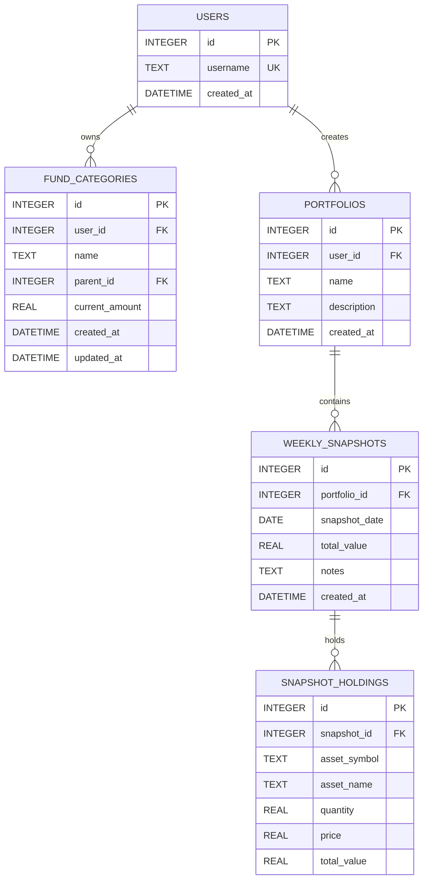

**图表来源**
- [schema.sql:47-79](file://server/db/schema.sql#L47-L79)

**章节来源**
- [schema.sql:47-79](file://server/db/schema.sql#L47-L79)
- [funds.js:47-92](file://server/routes/funds.js#L47-L92)

## 架构概览

### 前后端交互流程

资金明细组件遵循RESTful API设计原则，通过HTTP请求与后端进行数据交换：

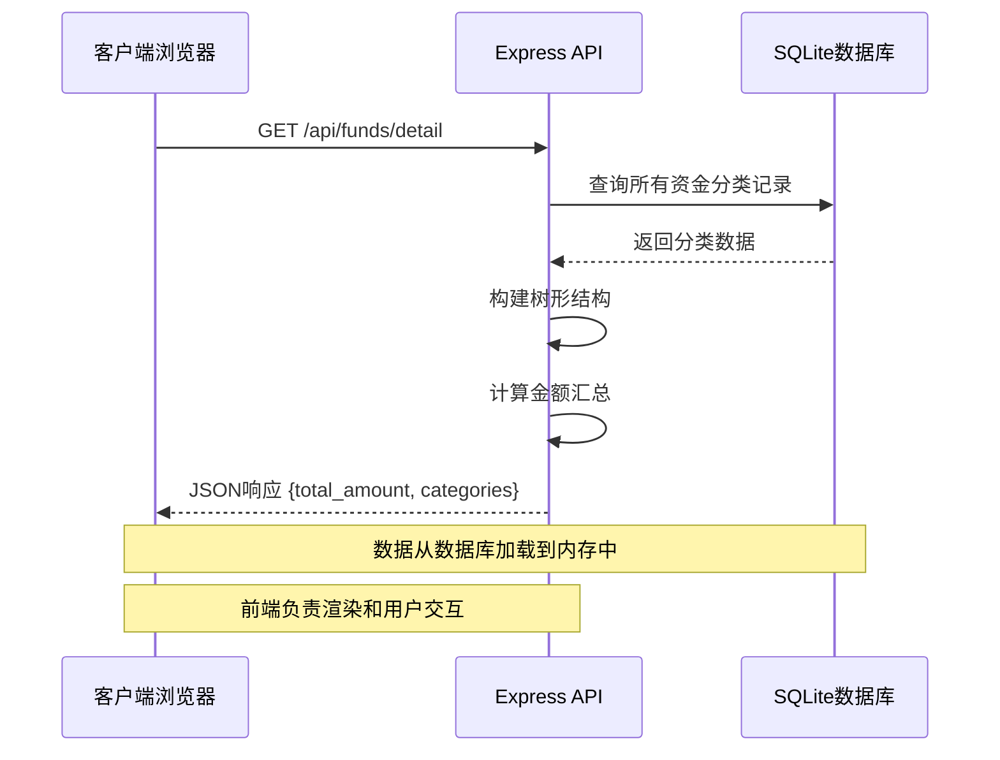

**图表来源**
- [FundDetail.jsx:10-18](file://client/src/pages/FundDetail.jsx#L10-L18)
- [funds.js:49-92](file://server/routes/funds.js#L49-L92)

### 状态管理模式

组件采用React的本地状态管理机制：

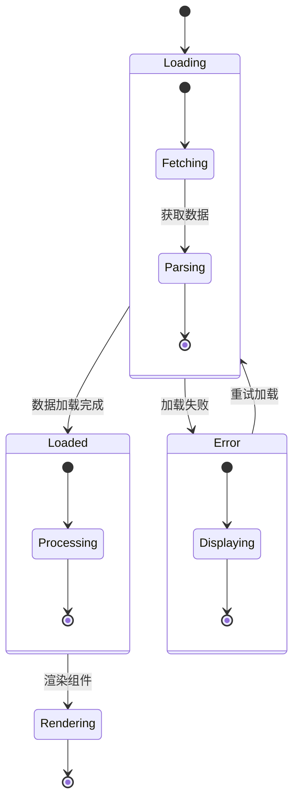

**图表来源**
- [FundDetail.jsx:8-18](file://client/src/pages/FundDetail.jsx#L8-L18)

**章节来源**
- [FundDetail.jsx:1-60](file://client/src/pages/FundDetail.jsx#L1-L60)
- [funds.js:1-95](file://server/routes/funds.js#L1-L95)

## 详细组件分析

### FundDetail 组件深度解析

#### 数据结构设计

FundDetail组件接收标准化的数据结构，包含总金额和分类数组：

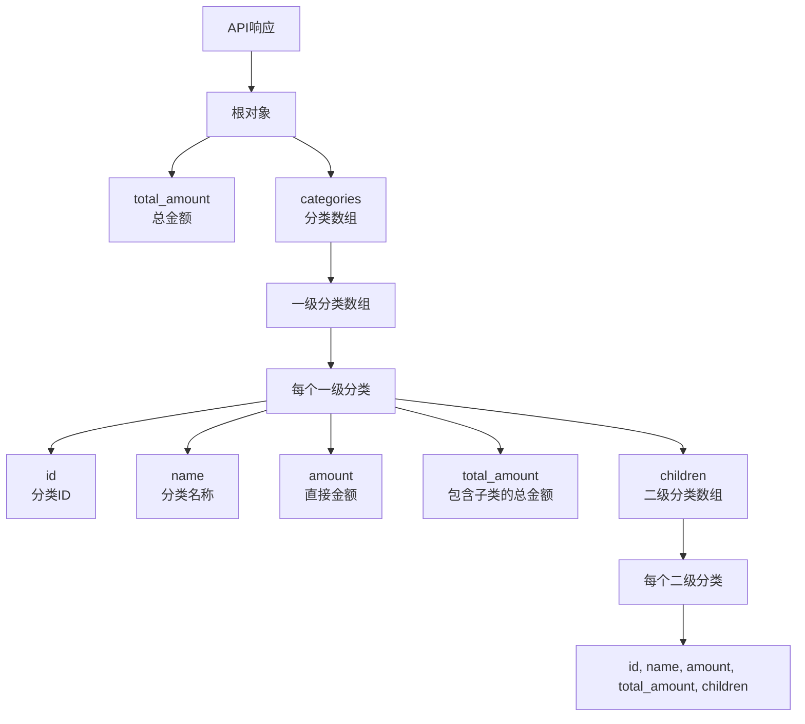

**图表来源**
- [funds.js:85-88](file://server/routes/funds.js#L85-L88)

#### 递归渲染实现

组件使用Ant Design的Collapse和List组件实现递归渲染：

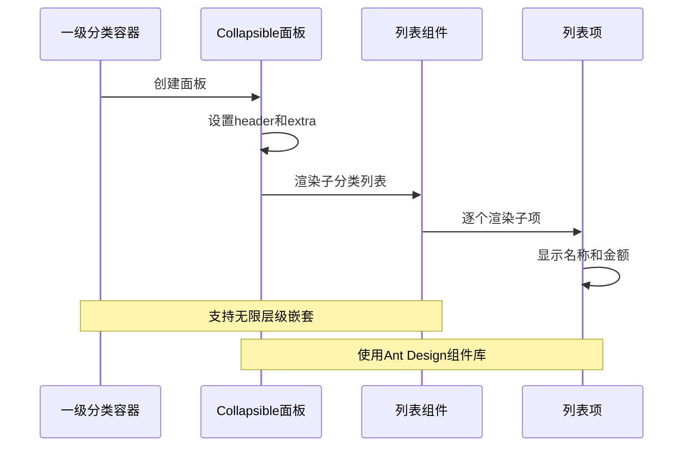

**图表来源**
- [FundDetail.jsx:31-56](file://client/src/pages/FundDetail.jsx#L31-L56)

#### 金额计算和汇总算法

后端实现了高效的金额聚合算法：

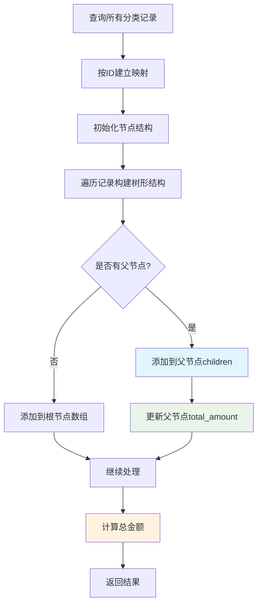

**图表来源**
- [funds.js:58-83](file://server/routes/funds.js#L58-L83)

**章节来源**
- [FundDetail.jsx:1-60](file://client/src/pages/FundDetail.jsx#L1-L60)
- [funds.js:47-92](file://server/routes/funds.js#L47-L92)

### FundCategories 组件分析

#### 分类管理功能

该组件提供了完整的分类管理界面：

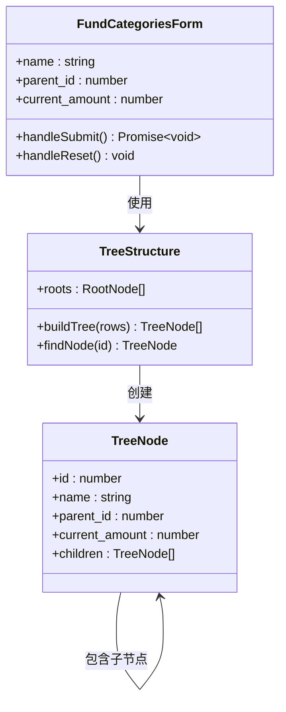

**图表来源**
- [FundCategories.jsx:8-184](file://client/src/pages/FundCategories.jsx#L8-L184)
- [fundCategories.js:6-27](file://server/routes/fundCategories.js#L6-L27)

#### 数据验证和约束

系统实现了严格的数据库约束和业务规则：

**章节来源**
- [FundCategories.jsx:1-184](file://client/src/pages/FundCategories.jsx#L1-L184)
- [fundCategories.js:45-139](file://server/routes/fundCategories.js#L45-L139)

### 数据库设计和优化

#### 索引策略

数据库采用了多层索引策略来优化查询性能：

| 索引类型 | 目标表 | 字段 | 作用 |
|---------|--------|------|------|
| 唯一索引 | fund_categories | (user_id, name) WHERE parent_id IS NULL | 限制顶级分类名称唯一性 |
| 唯一索引 | fund_categories | (user_id, parent_id, name) WHERE parent_id IS NOT NULL | 限制二级分类在同一父分类下的唯一性 |
| 外键约束 | fund_categories | parent_id | 维护分类层级关系 |

#### 初始化数据

系统在首次启动时自动创建默认的顶级分类：

**章节来源**
- [schema.sql:60-79](file://server/db/schema.sql#L60-L79)

## 依赖分析

### 前端依赖关系

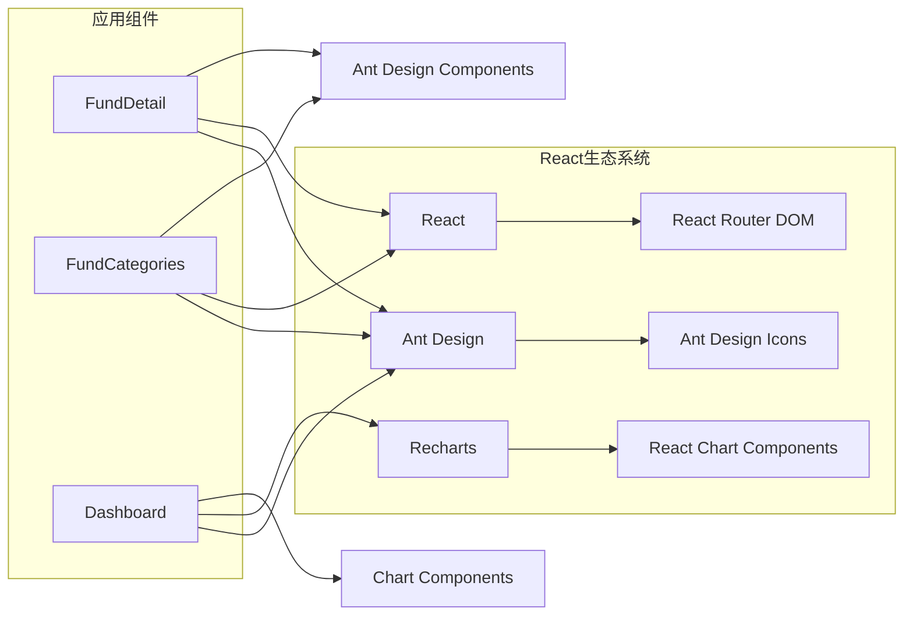

**图表来源**
- [FundDetail.jsx:1-60](file://client/src/pages/FundDetail.jsx#L1-L60)
- [FundCategories.jsx:1-184](file://client/src/pages/FundCategories.jsx#L1-L184)
- [Dashboard.jsx:1-101](file://client/src/pages/Dashboard.jsx#L1-L101)

### 后端依赖关系

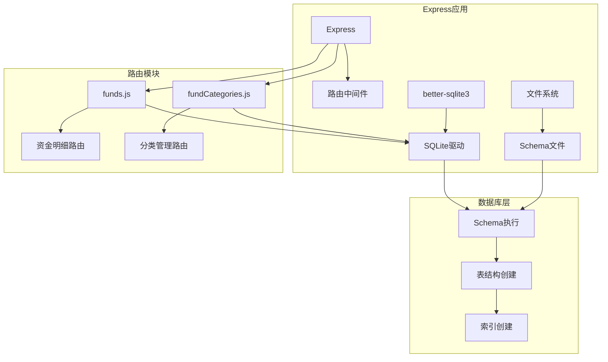

**图表来源**
- [funds.js:1-95](file://server/routes/funds.js#L1-L95)
- [fundCategories.js:1-139](file://server/routes/fundCategories.js#L1-L139)
- [index.js:1-19](file://server/db/index.js#L1-L19)

**章节来源**
- [App.jsx:1-73](file://client/src/App.jsx#L1-L73)
- [index.js:1-19](file://server/db/index.js#L1-L19)

## 性能考虑

### 前端性能优化

#### 渲染优化策略

1. **虚拟滚动**: 对于大量数据的场景，建议实现虚拟滚动以减少DOM节点数量
2. **懒加载**: 只在用户展开面板时才加载子分类数据
3. **状态缓存**: 缓存已加载的数据，避免重复请求
4. **防抖处理**: 对频繁的用户操作进行防抖处理

#### 内存管理

```javascript
// 推荐的优化模式
const [data, setData] = useState(null);

useEffect(() => {
  let isCancelled = false;
  
  const loadData = async () => {
    const response = await fetch('/api/funds/detail');
    const result = await response.json();
    
    if (!isCancelled) {
      setData(result);
    }
  };
  
  loadData();
  
  return () => {
    isCancelled = true;
  };
}, []);
```

### 后端性能优化

#### 查询优化

1. **索引利用**: 确保按user_id和parent_id字段的查询使用了适当的索引
2. **单次查询**: 使用一次查询获取所有需要的数据，避免N+1查询问题
3. **数据预处理**: 在数据库层面完成必要的聚合计算

#### 数据结构优化

```sql
-- 优化后的查询计划
SELECT id, name, parent_id, current_amount, updated_at
FROM fund_categories
WHERE user_id = ?
ORDER BY parent_id IS NOT NULL, id ASC
```

### 大数据量处理方案

#### 分页策略

对于超过1000条记录的情况，建议实现分页功能：

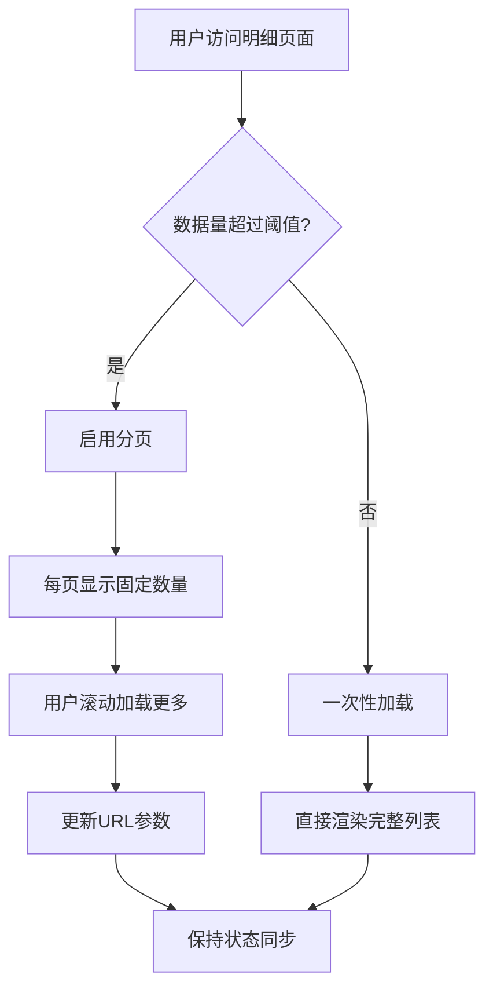

#### 缓存策略

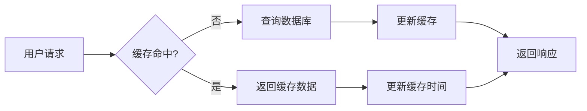

## 故障排除指南

### 常见问题诊断

#### 数据加载失败

**症状**: 页面显示空白或错误信息

**可能原因**:
1. API接口不可用
2. 数据库连接失败
3. 用户认证失败

**解决方案**:
1. 检查网络连接和API可用性
2. 验证数据库服务状态
3. 确认用户登录状态

#### 数据显示异常

**症状**: 金额显示不正确或分类层级混乱

**可能原因**:
1. 数据库约束冲突
2. 前端渲染逻辑错误
3. 缓存数据过期

**解决方案**:
1. 检查数据库唯一性约束
2. 验证前端数据结构
3. 清除浏览器缓存

### 错误处理机制

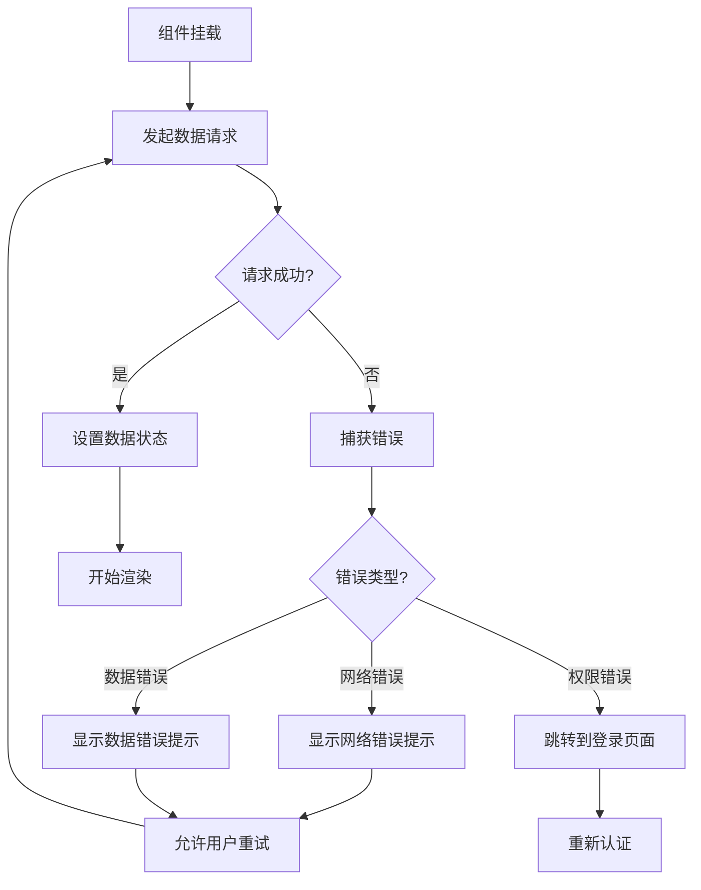

**图表来源**
- [FundDetail.jsx:10-18](file://client/src/pages/FundDetail.jsx#L10-L18)

### 调试工具和技巧

1. **浏览器开发者工具**: 使用Network标签监控API请求
2. **数据库调试**: 使用SQLite命令行工具检查数据一致性
3. **日志记录**: 在关键路径添加console.log输出
4. **单元测试**: 为关键函数编写测试用例

**章节来源**
- [funds.js:89-91](file://server/routes/funds.js#L89-L91)
- [fundCategories.js:75-80](file://server/routes/fundCategories.js#L75-L80)

## 结论

资金明细组件是一个设计精良的两级分类管理系统，具有以下特点：

### 技术优势

1. **清晰的架构设计**: 前后端职责明确，接口规范统一
2. **高效的数据处理**: 后端一次性聚合计算，前端专注渲染
3. **良好的扩展性**: 支持无限层级分类，易于功能扩展
4. **完善的错误处理**: 全面的错误捕获和用户反馈机制

### 改进建议

1. **性能优化**: 实现虚拟滚动和懒加载，提升大数据量场景下的用户体验
2. **功能增强**: 添加搜索过滤、排序功能，支持更灵活的数据浏览
3. **数据导出**: 提供CSV/Excel导出功能，便于数据分析和备份
4. **实时更新**: 集成WebSocket，实现实时数据同步

### 最佳实践

1. **状态管理**: 保持组件状态简单，避免过度复杂的状态逻辑
2. **错误处理**: 为所有异步操作提供完善的错误处理
3. **代码复用**: 将通用的UI组件和工具函数提取为可复用模块
4. **测试覆盖**: 为关键功能编写单元测试和集成测试

该组件为个人投资追踪系统提供了坚实的基础，通过持续的优化和改进，可以满足用户不断增长的需求。