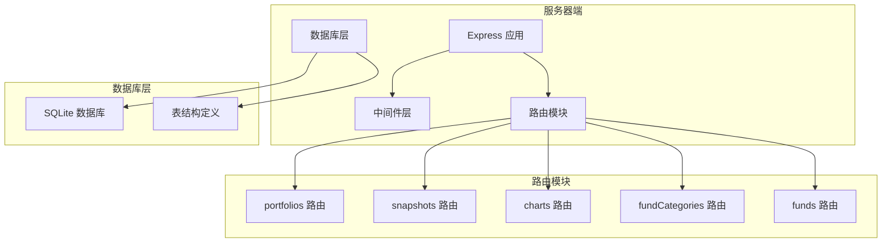
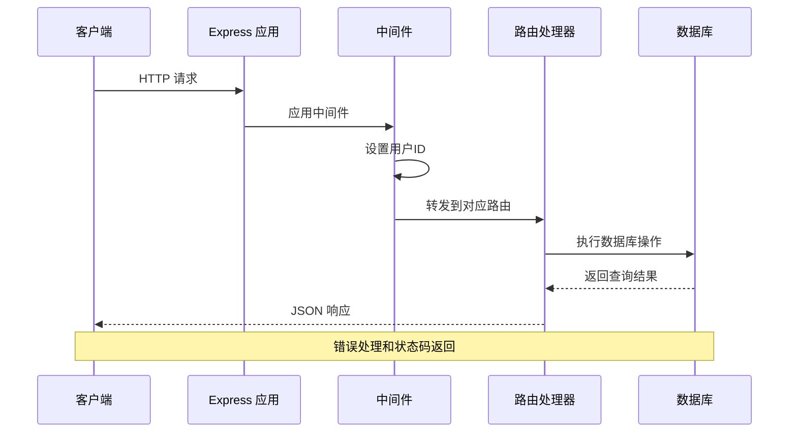
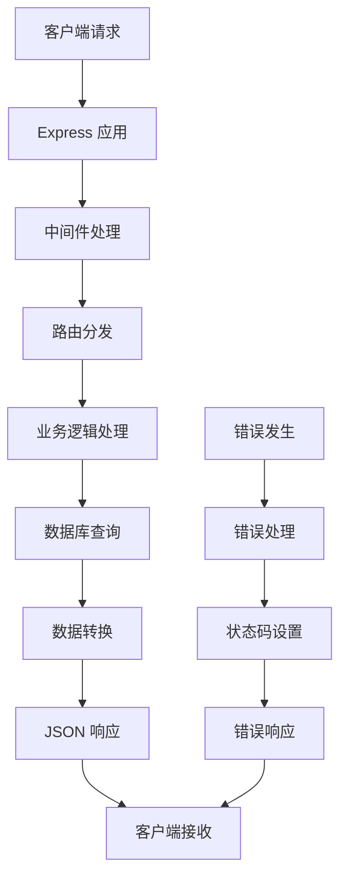
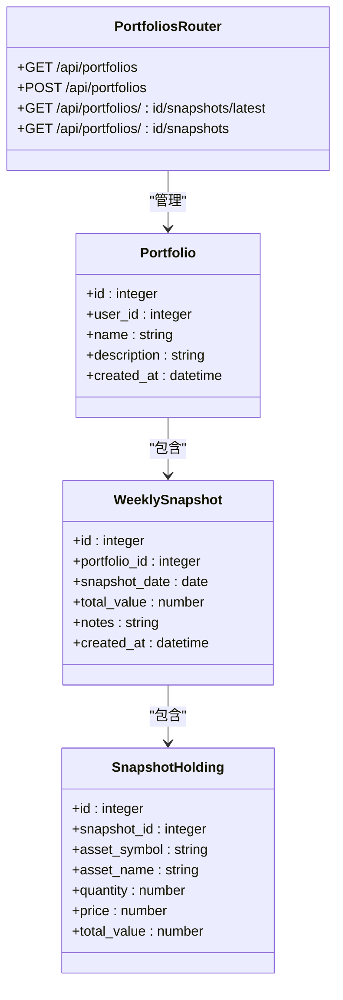
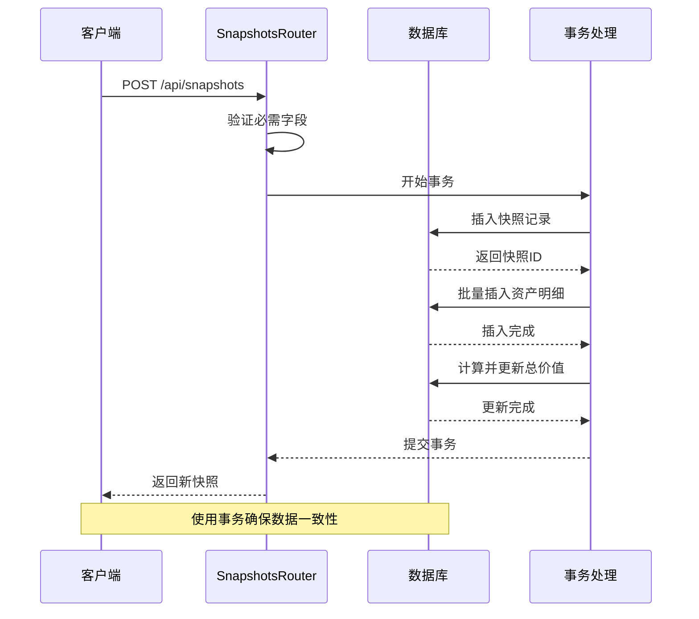
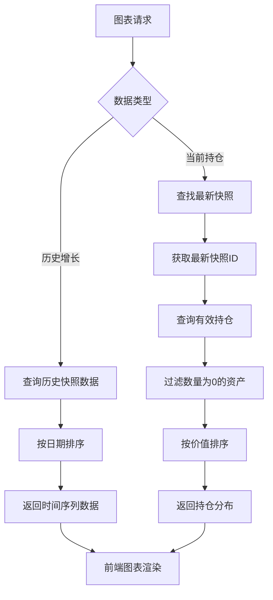
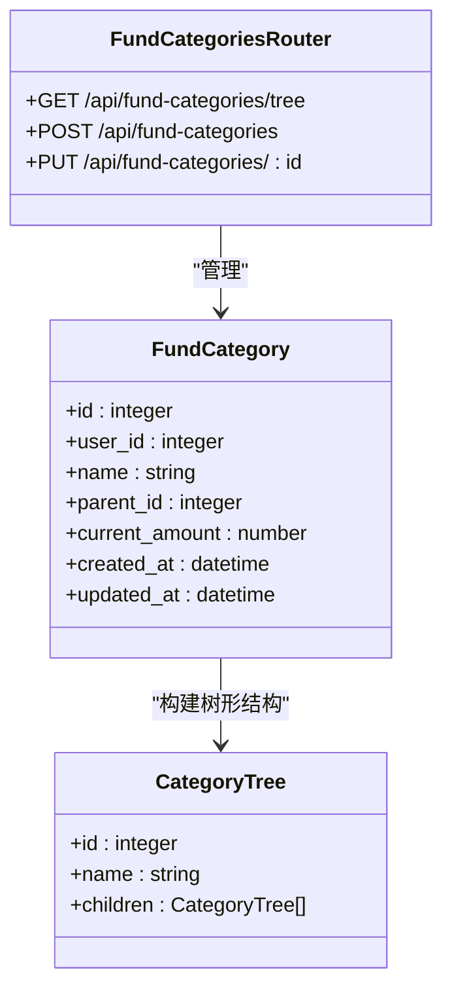
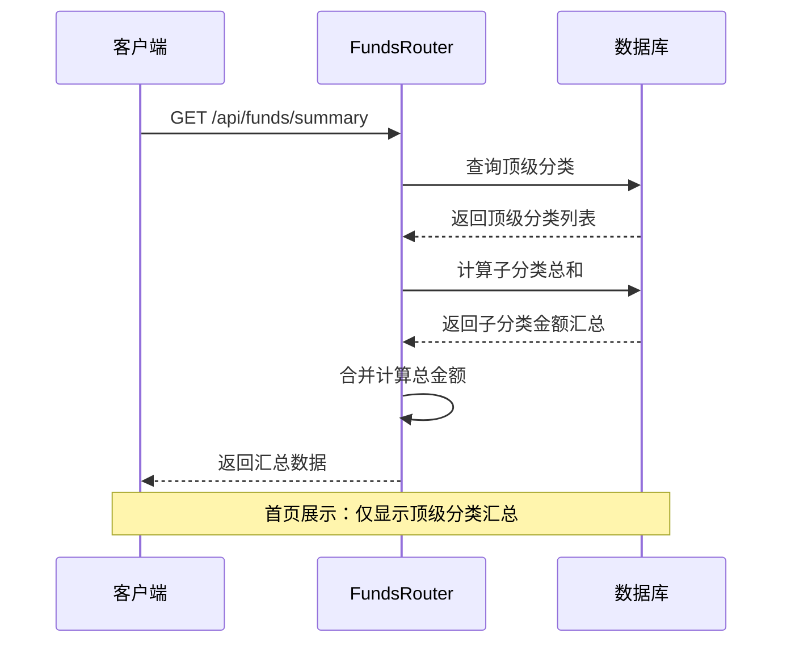
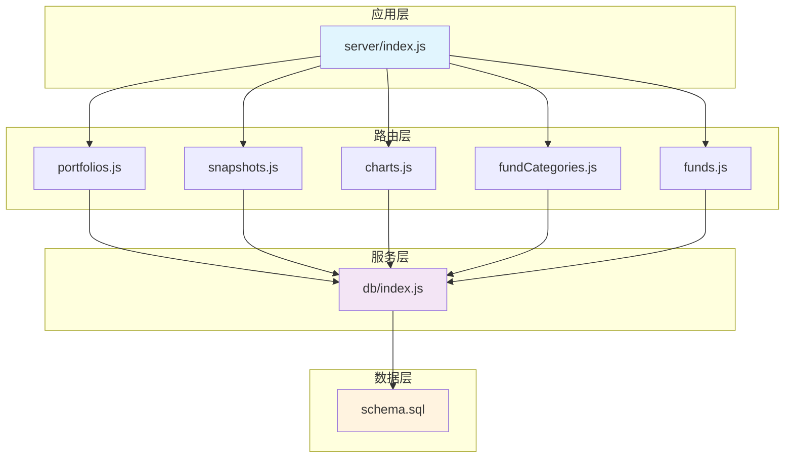

# API路由实现

<cite>
**本文档引用的文件**
- [server/index.js](file://server/index.js)
- [server/db/index.js](file://server/db/index.js)
- [server/db/schema.sql](file://server/db/schema.sql)
- [server/routes/portfolios.js](file://server/routes/portfolios.js)
- [server/routes/snapshots.js](file://server/routes/snapshots.js)
- [server/routes/charts.js](file://server/routes/charts.js)
- [server/routes/fundCategories.js](file://server/routes/fundCategories.js)
- [server/routes/funds.js](file://server/routes/funds.js)
</cite>

## 目录
1. [简介](#简介)
2. [项目结构](#项目结构)
3. [核心组件](#核心组件)
4. [架构概览](#架构概览)
5. [详细组件分析](#详细组件分析)
6. [依赖关系分析](#依赖关系分析)
7. [性能考虑](#性能考虑)
8. [故障排除指南](#故障排除指南)
9. [结论](#结论)

## 简介

个人投资追踪系统是一个基于Node.js和SQLite的全栈应用，提供了完整的投资组合管理功能。该系统通过RESTful API接口实现了投资组合查询、快照管理、数据图表、资金分类管理和资金汇总等核心功能。

系统采用Express.js作为Web框架，使用better-sqlite3作为数据库驱动，通过SQLite数据库存储所有投资相关数据。为了简化开发，系统使用了硬编码的用户认证机制（固定用户ID为1），在生产环境中需要替换为真实的认证机制。

## 项目结构

系统采用模块化设计，主要分为以下几个核心部分：

**图表来源**
- [server/index.js:1-32](file://server/index.js#L1-L32)
- [server/routes/portfolios.js:1-81](file://server/routes/portfolios.js#L1-L81)
- [server/routes/snapshots.js:1-124](file://server/routes/snapshots.js#L1-L124)
- [server/routes/charts.js:1-74](file://server/routes/charts.js#L1-L74)
- [server/routes/fundCategories.js:1-139](file://server/routes/fundCategories.js#L1-L139)
- [server/routes/funds.js:1-95](file://server/routes/funds.js#L1-L95)

**章节来源**
- [server/index.js:1-32](file://server/index.js#L1-L32)
- [server/db/index.js:1-19](file://server/db/index.js#L1-L19)

## 核心组件

系统的核心组件包括五个主要的路由模块，每个模块负责特定的功能领域：

### 投资组合模块 (portfolios.js)
负责投资组合的CRUD操作，包括：
- 查询用户的全部投资组合
- 创建新的投资组合
- 获取投资组合的最新快照
- 获取投资组合的所有快照记录

### 快照模块 (snapshots.js)
管理投资组合的快照数据，包括：
- 创建新的快照记录
- 更新现有的快照
- 获取单个快照的详细信息
- 自动计算快照中的资产价值

### 图表模块 (charts.js)
提供数据可视化相关的API，包括：
- 获取投资组合的历史增长数据
- 获取投资组合最新的持仓分布

### 资金分类模块 (fundCategories.js)
管理资金分类体系，支持两级分类结构：
- 获取分类树形结构
- 创建新的分类
- 更新现有分类
- 支持两级分类限制

### 资金汇总模块 (funds.js)
提供资金相关的汇总统计功能：
- 获取首页展示的资金汇总
- 获取详情页展示的完整分类明细

**章节来源**
- [server/routes/portfolios.js:1-81](file://server/routes/portfolios.js#L1-L81)
- [server/routes/snapshots.js:1-124](file://server/routes/snapshots.js#L1-L124)
- [server/routes/charts.js:1-74](file://server/routes/charts.js#L1-L74)
- [server/routes/fundCategories.js:1-139](file://server/routes/fundCategories.js#L1-L139)
- [server/routes/funds.js:1-95](file://server/routes/funds.js#L1-L95)

## 架构概览

系统采用分层架构设计，确保了良好的代码组织和可维护性：

**图表来源**
- [server/index.js:17-21](file://server/index.js#L17-L21)
- [server/index.js:24-28](file://server/index.js#L24-L28)

### 数据流架构

**图表来源**
- [server/index.js:13-16](file://server/index.js#L13-L16)
- [server/routes/portfolios.js:7-15](file://server/routes/portfolios.js#L7-L15)

## 详细组件分析

### 投资组合路由 (portfolios.js)

#### 功能职责
投资组合路由模块负责管理用户的投资组合信息，提供完整的CRUD操作：

**图表来源**
- [server/routes/portfolios.js:6-81](file://server/routes/portfolios.js#L6-L81)
- [server/db/schema.sql:13-45](file://server/db/schema.sql#L13-L45)

#### HTTP端点定义

| 方法 | 路径 | 描述 | 请求参数 | 响应格式 |
|------|------|------|----------|----------|
| GET | `/api/portfolios` | 获取当前用户的所有投资组合 | 无 | `Portfolio[]` |
| POST | `/api/portfolios` | 创建新的投资组合 | `{name, description}` | `Portfolio` |
| GET | `/api/portfolios/:id/snapshots/latest` | 获取投资组合的最新快照 | `:id` | `LatestSnapshot` |
| GET | `/api/portfolios/:id/snapshots` | 获取投资组合的所有快照 | `:id` | `WeeklySnapshot[]` |

#### 数据验证与错误处理
- 使用用户ID进行数据隔离，确保每个用户只能访问自己的数据
- 对快照查询进行空值检查，当没有快照时返回null
- 统一的错误处理机制，捕获数据库异常并返回适当的HTTP状态码

**章节来源**
- [server/routes/portfolios.js:6-81](file://server/routes/portfolios.js#L6-L81)

### 快照路由 (snapshots.js)

#### 功能职责
快照路由模块专门处理投资组合快照数据的管理，包括快照的创建、更新和查询：

**图表来源**
- [server/routes/snapshots.js:34-72](file://server/routes/snapshots.js#L34-L72)

#### HTTP端点定义

| 方法 | 路径 | 描述 | 请求参数 | 响应格式 |
|------|------|------|----------|----------|
| POST | `/api/snapshots` | 创建新的快照 | `{portfolio_id, snapshot_date, notes, holdings[]}` | `Snapshot` |
| PUT | `/api/snapshots/:id` | 更新现有快照 | `{snapshot_date, notes, holdings[]}` | `UpdatedSnapshot` |
| GET | `/api/snapshots/:id` | 获取单个快照详情 | `:id` | `SnapshotWithHoldings` |

#### 业务逻辑实现
- **事务处理**: 使用SQLite事务确保快照创建的原子性
- **资产计算**: 自动计算每个资产的总价值（数量×价格）
- **唯一性约束**: 通过数据库唯一约束防止同一天重复创建快照
- **数据完整性**: 删除旧快照后重新插入新快照，确保数据一致性

#### 错误处理策略
- **400错误**: 缺少必需字段或数据格式不正确
- **409冲突**: 同一天已有快照存在
- **404错误**: 未找到指定的快照
- **500错误**: 数据库操作失败

**章节来源**
- [server/routes/snapshots.js:10-31](file://server/routes/snapshots.js#L10-L31)
- [server/routes/snapshots.js:34-124](file://server/routes/snapshots.js#L34-L124)

### 图表路由 (charts.js)

#### 功能职责
图表路由模块提供数据可视化所需的数据接口：

**图表来源**
- [server/routes/charts.js:10-72](file://server/routes/charts.js#L10-L72)

#### HTTP端点定义

| 方法 | 路径 | 描述 | 请求参数 | 响应格式 |
|------|------|------|----------|----------|
| GET | `/api/charts/portfolios/:portfolioId/historical-growth` | 获取历史增长数据 | `:portfolioId` | `HistoricalGrowth[]` |
| GET | `/api/charts/portfolios/:portfolioId/current-holdings` | 获取当前持仓分布 | `:portfolioId` | `CurrentHoldings` |

#### 数据处理逻辑
- **历史增长**: 返回按日期排序的时间序列数据，用于绘制增长曲线
- **当前持仓**: 过滤掉已清仓的资产，只显示当前有效的持仓
- **数据聚合**: 自动计算每个资产的总价值并按价值降序排列

**章节来源**
- [server/routes/charts.js:6-74](file://server/routes/charts.js#L6-L74)

### 资金分类路由 (fundCategories.js)

#### 功能职责
资金分类路由模块管理两级分类的资金结构：

**图表来源**
- [server/routes/fundCategories.js:29-139](file://server/routes/fundCategories.js#L29-L139)
- [server/db/schema.sql:47-68](file://server/db/schema.sql#L47-L68)

#### HTTP端点定义

| 方法 | 路径 | 描述 | 请求参数 | 响应格式 |
|------|------|------|----------|----------|
| GET | `/api/fund-categories/tree` | 获取分类树形结构 | 无 | `CategoryTree[]` |
| POST | `/api/fund-categories` | 创建新的分类 | `{name, parent_id, current_amount}` | `FundCategory` |
| PUT | `/api/fund-categories/:id` | 更新现有分类 | `:id` | `FundCategory` |

#### 分类管理策略
- **两级限制**: 系统仅支持顶级分类和二级分类两级结构
- **唯一性约束**: 同一用户下顶级分类名称唯一，二级分类在同一父分类下名称唯一
- **树形构建**: 将扁平的分类数据转换为树形结构供前端渲染

**章节来源**
- [server/routes/fundCategories.js:29-139](file://server/routes/fundCategories.js#L29-L139)

### 资金汇总路由 (funds.js)

#### 功能职责
资金汇总路由模块提供不同页面的资金统计功能：

**图表来源**
- [server/routes/funds.js:6-45](file://server/routes/funds.js#L6-L45)

#### HTTP端点定义

| 方法 | 路径 | 描述 | 请求参数 | 响应格式 |
|------|------|------|----------|----------|
| GET | `/api/funds/summary` | 获取首页资金汇总 | 无 | `FundsSummary` |
| GET | `/api/funds/detail` | 获取详情页资金明细 | 无 | `FundsDetail` |

#### 数据聚合逻辑
- **首页汇总**: 只显示顶级分类及其子分类的总和，不显示二级分类的详细信息
- **详情展示**: 显示完整的两级分类结构，包括每个节点的累计金额
- **金额计算**: 自动计算每个节点的累计金额（自身金额+所有子节点金额）

**章节来源**
- [server/routes/funds.js:6-95](file://server/routes/funds.js#L6-L95)

## 依赖关系分析

系统采用模块化的依赖关系设计，确保各组件之间的松耦合：

**图表来源**
- [server/index.js:4-8](file://server/index.js#L4-L8)
- [server/db/index.js:1-19](file://server/db/index.js#L1-L19)

### 外部依赖

系统的主要外部依赖包括：

- **Express.js**: Web应用框架，提供路由、中间件等功能
- **better-sqlite3**: SQLite数据库驱动，提供高性能的数据库操作
- **cors**: 跨域资源共享中间件
- **morgan**: HTTP请求日志中间件

### 内部依赖关系

- **路由模块**依赖于数据库模块进行数据持久化
- **数据库模块**负责连接和初始化SQLite数据库
- **中间件**为所有路由提供统一的用户认证和数据处理

**章节来源**
- [server/index.js:1-32](file://server/index.js#L1-L32)
- [server/db/index.js:1-19](file://server/db/index.js#L1-L19)

## 性能考虑

### 数据库优化策略

1. **索引优化**: 在关键查询字段上建立适当的索引
2. **事务处理**: 使用事务确保数据一致性，减少数据库锁竞争
3. **批量操作**: 对于快照资产的插入使用批量操作提高性能

### 缓存策略

- **查询缓存**: 对于频繁访问的静态数据可以考虑添加缓存层
- **会话缓存**: 在应用层缓存用户会话信息减少数据库查询

### 并发处理

- **连接池**: 使用SQLite的连接池机制处理并发请求
- **事务隔离**: 通过事务确保并发场景下的数据一致性

## 故障排除指南

### 常见错误及解决方案

#### 数据库连接问题
- **症状**: 应用启动时报数据库连接错误
- **原因**: 数据库文件路径配置错误或权限不足
- **解决**: 检查数据库文件路径和文件权限

#### 用户认证问题
- **症状**: API返回401未授权错误
- **原因**: 用户ID设置为null或无效
- **解决**: 检查中间件中用户ID的设置逻辑

#### 数据完整性错误
- **症状**: 快照创建失败，提示数据冲突
- **原因**: 同一天重复创建快照或外键约束违反
- **解决**: 检查快照日期的唯一性约束

#### 数据库迁移问题
- **症状**: 新增字段无法识别或表结构不匹配
- **原因**: 数据库版本与代码不一致
- **解决**: 运行数据库迁移脚本或重新初始化数据库

**章节来源**
- [server/routes/snapshots.js:66-71](file://server/routes/snapshots.js#L66-L71)
- [server/db/schema.sql:60-68](file://server/db/schema.sql#L60-L68)

## 结论

个人投资追踪系统的API路由实现展现了良好的模块化设计和清晰的职责分离。通过五个核心路由模块，系统提供了完整的企业级投资组合管理功能。

### 主要优势

1. **模块化设计**: 每个路由模块职责明确，便于维护和扩展
2. **数据一致性**: 使用事务处理确保关键操作的数据完整性
3. **错误处理**: 统一的错误处理机制提供良好的用户体验
4. **性能优化**: 合理的数据库设计和查询优化

### 改进建议

1. **认证机制**: 替换硬编码的用户认证为标准的身份验证方案
2. **输入验证**: 添加更严格的输入验证和数据清理
3. **缓存策略**: 实现适当的缓存机制提升性能
4. **监控告警**: 添加应用性能监控和错误告警机制

该系统为个人投资管理提供了一个坚实的技术基础，通过持续的优化和改进，可以满足更复杂的投资管理需求。