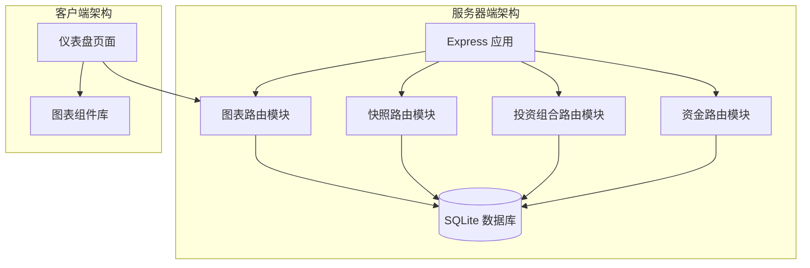
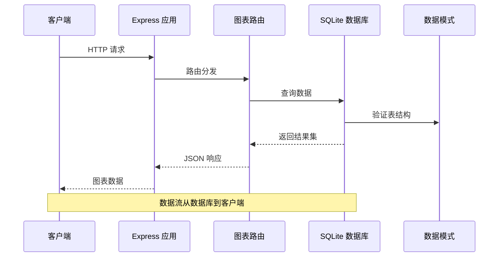
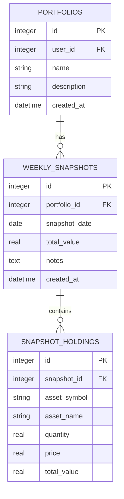
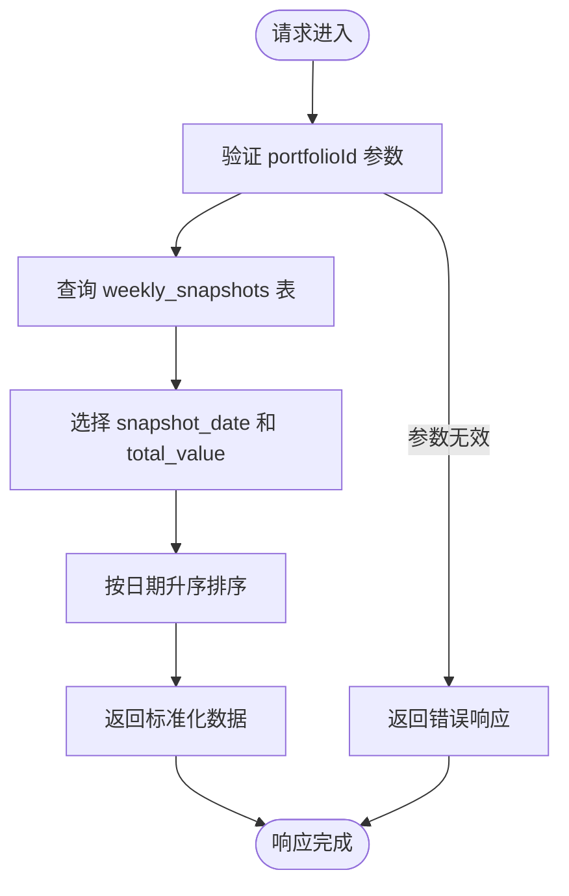
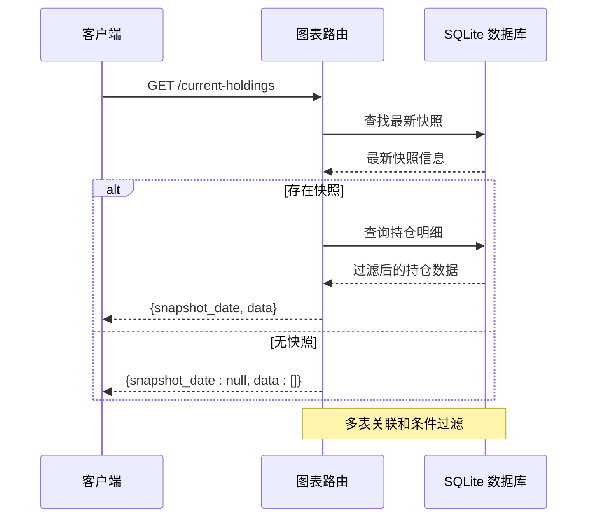
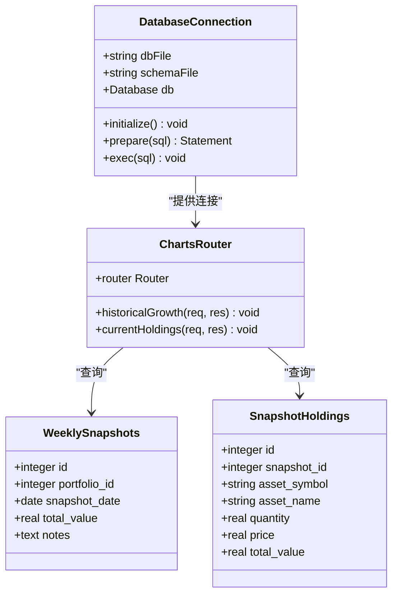
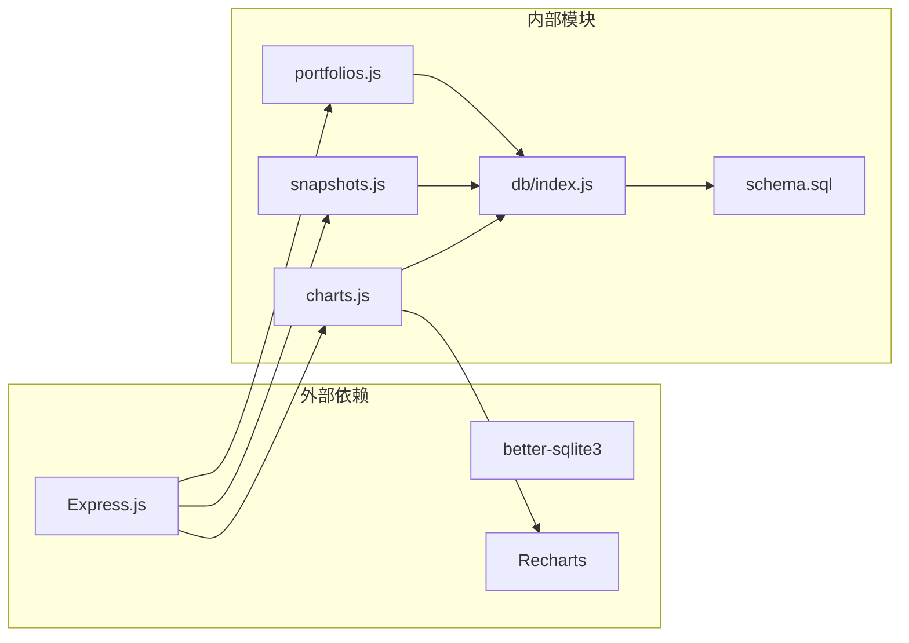
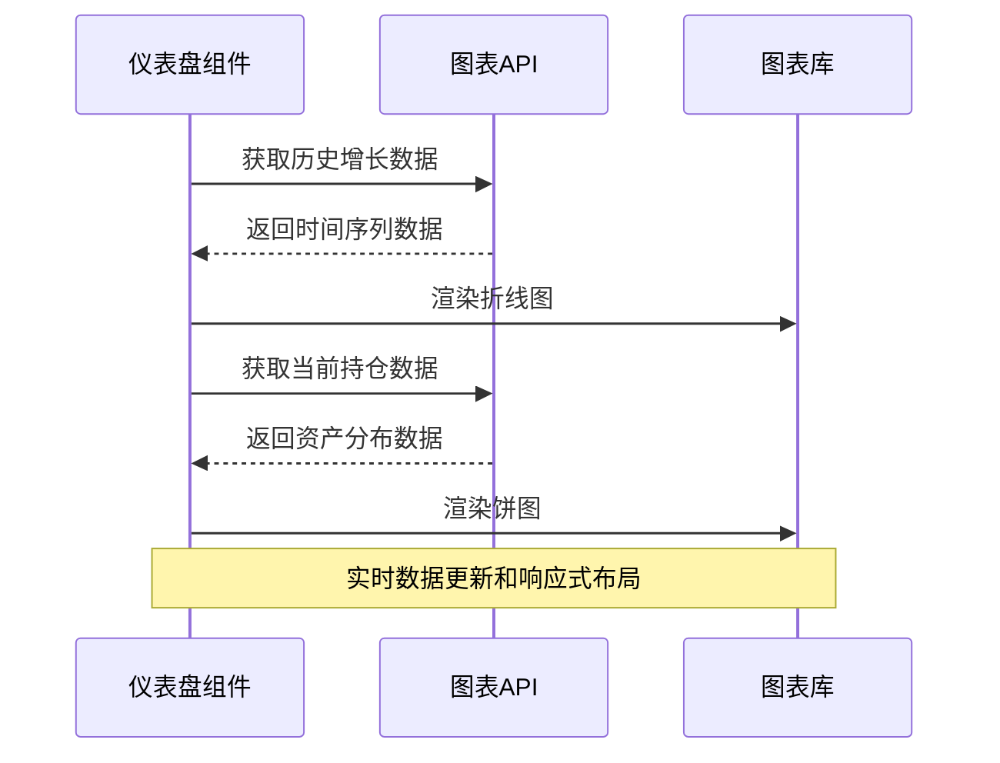

# 图表数据路由

<cite>
**本文档引用的文件**
- [server/routes/charts.js](file://server/routes/charts.js)
- [server/db/index.js](file://server/db/index.js)
- [server/db/schema.sql](file://server/db/schema.sql)
- [server/index.js](file://server/index.js)
- [client/src/pages/Dashboard.jsx](file://client/src/pages/Dashboard.jsx)
- [server/routes/snapshots.js](file://server/routes/snapshots.js)
- [server/routes/portfolios.js](file://server/routes/portfolios.js)
- [server/routes/funds.js](file://server/routes/funds.js)
- [client/src/App.jsx](file://client/src/App.jsx)
</cite>

## 目录
1. [简介](#简介)
2. [项目结构](#项目结构)
3. [核心组件](#核心组件)
4. [架构概览](#架构概览)
5. [详细组件分析](#详细组件分析)
6. [依赖关系分析](#依赖关系分析)
7. [性能考虑](#性能考虑)
8. [故障排除指南](#故障排除指南)
9. [结论](#结论)
10. [附录](#附录)

## 简介

图表数据路由模块是投资组合管理系统中的核心数据服务层，负责为前端可视化组件提供经过聚合和格式化的图表数据。该模块实现了两种主要的图表数据聚合功能：历史增长数据的获取和当前持仓分布的计算。

系统采用Express.js作为Web框架，使用SQLite数据库存储投资组合快照数据，通过RESTful API为前端React应用提供数据服务。图表数据路由模块直接操作数据库表weekly_snapshots和snapshot_holdings，实现对投资组合价值变化趋势和资产配置情况的实时分析。

## 项目结构

图表数据路由模块位于服务器端的路由目录中，与数据库连接和主应用入口紧密集成：



**图表来源**
- [server/index.js:1-32](file://server/index.js#L1-L32)
- [server/routes/charts.js:1-74](file://server/routes/charts.js#L1-L74)

**章节来源**
- [server/index.js:1-32](file://server/index.js#L1-L32)
- [server/routes/charts.js:1-74](file://server/routes/charts.js#L1-L74)

## 核心组件

图表数据路由模块包含两个核心API端点，每个都针对特定的图表需求进行了优化：

### 历史增长数据接口
- **端点**: `GET /api/charts/portfolios/:portfolioId/historical-growth`
- **功能**: 返回指定投资组合在时间序列上的总资产价值变化
- **数据源**: weekly_snapshots表的snapshot_date和total_value字段
- **排序**: 按snapshot_date升序排列

### 当前持仓分布接口
- **端点**: `GET /api/charts/portfolios/:portfolioId/current-holdings`
- **功能**: 返回最新快照期的投资组合资产配置分布
- **数据源**: weekly_snapshots和snapshot_holdings表的关联查询
- **过滤**: 自动过滤数量为0或总值为0的已清仓资产
- **排序**: 按total_value降序排列

**章节来源**
- [server/routes/charts.js:6-27](file://server/routes/charts.js#L6-L27)
- [server/routes/charts.js:29-72](file://server/routes/charts.js#L29-L72)

## 架构概览

图表数据路由模块采用分层架构设计，确保数据获取、处理和传输的高效性：



**图表来源**
- [server/index.js:23-28](file://server/index.js#L23-L28)
- [server/routes/charts.js:10-27](file://server/routes/charts.js#L10-L27)

### 数据模型关系



**图表来源**
- [server/db/schema.sql:23-45](file://server/db/schema.sql#L23-L45)

**章节来源**
- [server/db/schema.sql:1-79](file://server/db/schema.sql#L1-L79)

## 详细组件分析

### 历史增长数据聚合器

历史增长数据聚合器专门处理时间序列数据的获取和格式化：



**图表来源**
- [server/routes/charts.js:10-27](file://server/routes/charts.js#L10-L27)

#### 数据格式规范
- **输入参数**: portfolioId (路径参数)
- **输出格式**: 数组对象，每个对象包含：
  - `date`: 快照日期 (字符串)
  - `total_value`: 总资产价值 (数值)

#### 聚合算法特点
- 直接从数据库表读取预聚合数据
- 无需额外计算，提高查询性能
- 支持任意时间范围的历史数据

**章节来源**
- [server/routes/charts.js:10-27](file://server/routes/charts.js#L10-L27)

### 当前持仓分布处理器

当前持仓分布处理器执行复杂的多表关联查询和数据过滤：



**图表来源**
- [server/routes/charts.js:33-72](file://server/routes/charts.js#L33-L72)

#### 数据处理流程
1. **查找最新快照**: 通过ORDER BY和LIMIT 1获取最近的快照
2. **数据过滤**: 排除quantity为0或total_value为0的已清仓资产
3. **排序处理**: 按资产价值降序排列
4. **格式化输出**: 包含快照日期和资产明细数组

#### 输出数据结构
- **根对象属性**:
  - `snapshot_date`: 最新快照日期 (字符串或null)
  - `data`: 资产明细数组
- **资产明细对象**:
  - `asset_symbol`: 资产代码
  - `asset_name`: 资产名称
  - `quantity`: 持有数量
  - `price`: 当前价格
  - `total_value`: 总市值

**章节来源**
- [server/routes/charts.js:33-72](file://server/routes/charts.js#L33-L72)

### 数据库集成机制

图表路由模块通过统一的数据库连接进行数据访问：



**图表来源**
- [server/db/index.js:1-19](file://server/db/index.js#L1-L19)
- [server/routes/charts.js:1-2](file://server/routes/charts.js#L1-L2)

**章节来源**
- [server/db/index.js:1-19](file://server/db/index.js#L1-L19)
- [server/db/schema.sql:23-45](file://server/db/schema.sql#L23-L45)

## 依赖关系分析

图表数据路由模块与其他系统组件存在明确的依赖关系：



**图表来源**
- [server/index.js:1-32](file://server/index.js#L1-L32)
- [server/routes/charts.js:1-2](file://server/routes/charts.js#L1-L2)

### 关键依赖特性

1. **数据库依赖**: 使用better-sqlite3实现高性能的本地数据库访问
2. **路由依赖**: 通过Express中间件系统集成到主应用
3. **前端依赖**: 与Recharts图表库无缝集成，支持响应式数据绑定

**章节来源**
- [server/index.js:1-32](file://server/index.js#L1-L32)
- [server/routes/charts.js:1-2](file://server/routes/charts.js#L1-L2)

## 性能考虑

图表数据路由模块在设计时充分考虑了性能优化：

### 查询优化策略
- **索引利用**: weekly_snapshots表的(portfolio_id, snapshot_date)联合索引支持快速查询
- **预聚合数据**: 直接使用total_value字段避免运行时计算
- **最小化数据传输**: 只选择必要的字段减少网络开销

### 缓存机制
当前实现采用无状态设计，但具备良好的缓存优化基础：
- **数据库层面**: SQLite自动缓存常用查询结果
- **应用层面**: 可扩展添加Redis缓存支持
- **前端层面**: React组件可实现本地状态缓存

### 大数据量处理
- **分页支持**: 可扩展添加limit和offset参数
- **增量更新**: 支持只获取新增或修改的数据
- **数据压缩**: 可在传输层启用Gzip压缩

## 故障排除指南

### 常见问题及解决方案

#### 数据查询失败
**症状**: API返回500错误
**原因**: 数据库连接异常或SQL语法错误
**解决**: 检查数据库文件权限和schema.sql执行状态

#### 无数据返回
**症状**: 返回空数组或null
**原因**: 投资组合不存在或快照数据缺失
**解决**: 验证portfolioId参数正确性和快照数据完整性

#### 性能问题
**症状**: API响应时间过长
**原因**: 数据库查询未使用索引
**解决**: 检查weekly_snapshots表的索引状态

**章节来源**
- [server/routes/charts.js:23-26](file://server/routes/charts.js#L23-L26)
- [server/routes/charts.js:68-71](file://server/routes/charts.js#L68-L71)

## 结论

图表数据路由模块成功实现了投资组合数据的高效聚合和格式化，为前端可视化提供了稳定可靠的数据服务。模块设计简洁明了，性能表现良好，具备良好的扩展性。

主要优势包括：
- 清晰的职责分离和模块化设计
- 高效的数据库查询和数据处理
- 与前端框架的良好集成
- 完善的错误处理和调试支持

未来可以考虑的功能增强：
- 添加数据缓存层提升性能
- 实现更灵活的时间范围查询
- 增加数据导出功能
- 扩展更多图表类型的API支持

## 附录

### API规范

#### 历史增长数据接口
- **方法**: GET
- **路径**: `/api/charts/portfolios/{portfolioId}/historical-growth`
- **参数**: 
  - `portfolioId` (路径参数): 投资组合ID
- **响应**: 
  ```javascript
  [
    { date: "YYYY-MM-DD", total_value: number },
    // ...
  ]
  ```

#### 当前持仓分布接口
- **方法**: GET
- **路径**: `/api/charts/portfolios/{portfolioId}/current-holdings`
- **参数**: `portfolioId` (路径参数)
- **响应**:
  ```javascript
  {
    snapshot_date: "YYYY-MM-DD",
    data: [
      {
        asset_symbol: string,
        asset_name: string,
        quantity: number,
        price: number,
        total_value: number
      }
    ]
  }
  ```

### 前端集成示例

仪表盘页面展示了如何在React应用中集成图表数据API：



**图表来源**
- [client/src/pages/Dashboard.jsx:17-35](file://client/src/pages/Dashboard.jsx#L17-L35)

**章节来源**
- [client/src/pages/Dashboard.jsx:17-35](file://client/src/pages/Dashboard.jsx#L17-L35)