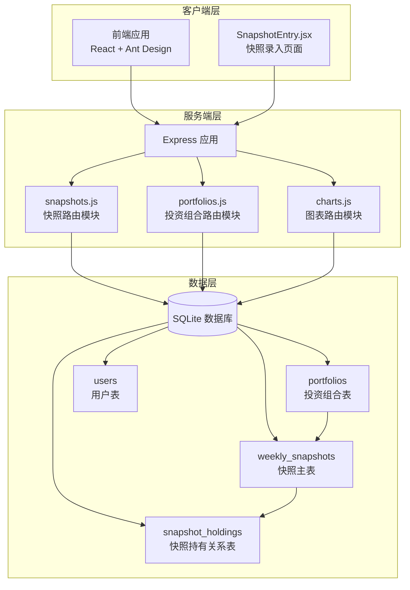
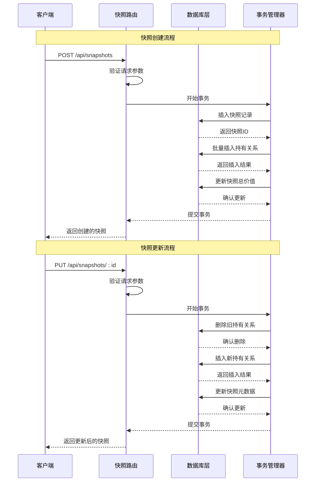
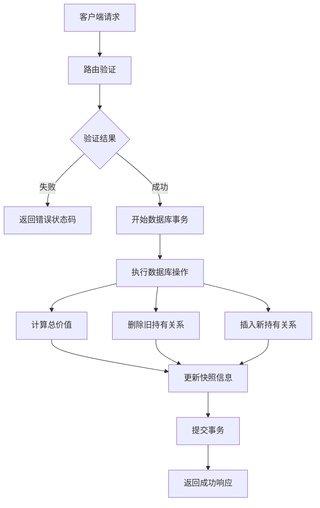
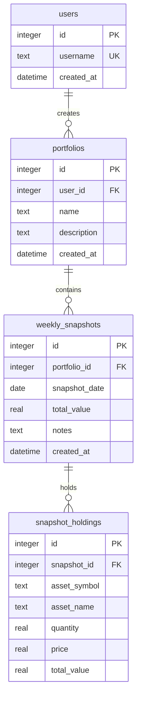
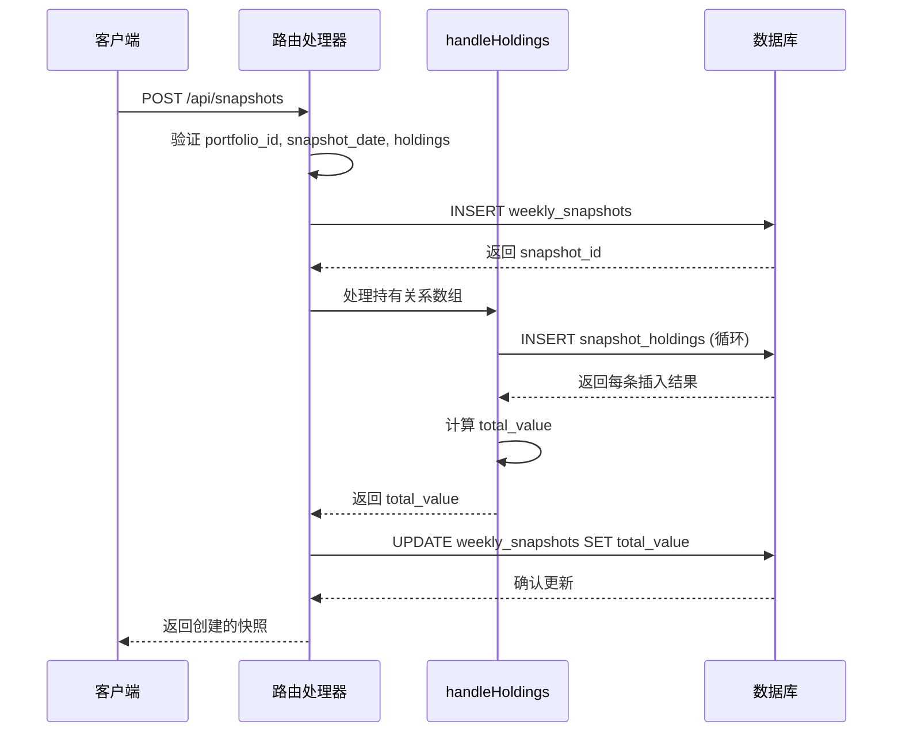
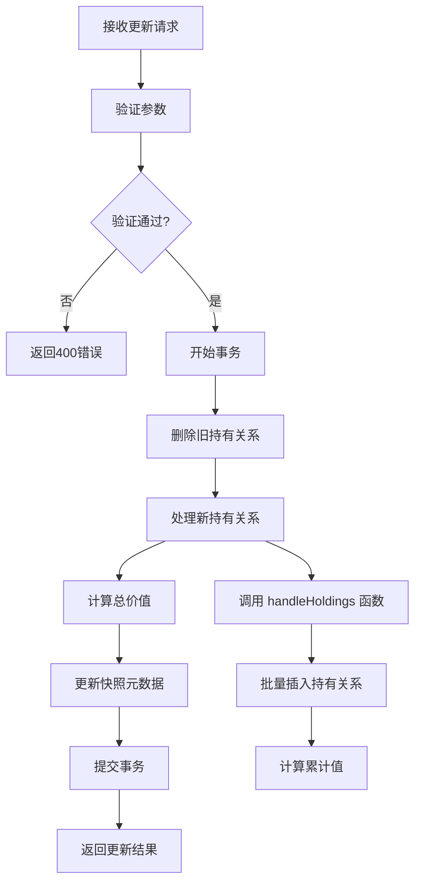
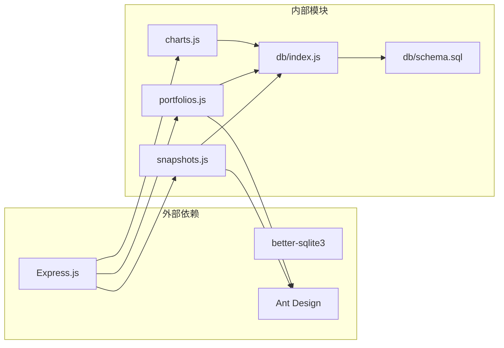
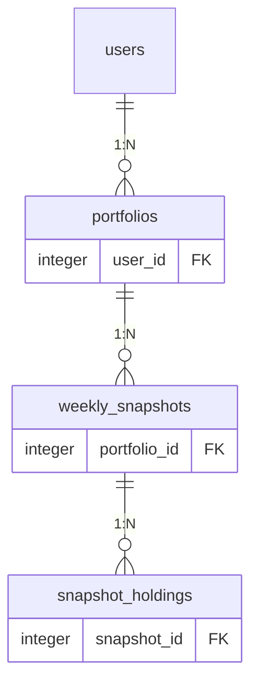

# 快照管理路由

<cite>
**本文档引用的文件**
- [server/routes/snapshots.js](file://server/routes/snapshots.js)
- [server/db/schema.sql](file://server/db/schema.sql)
- [server/db/index.js](file://server/db/index.js)
- [server/index.js](file://server/index.js)
- [server/routes/portfolios.js](file://server/routes/portfolios.js)
- [client/src/pages/SnapshotEntry.jsx](file://client/src/pages/SnapshotEntry.jsx)
</cite>

## 目录
1. [简介](#简介)
2. [项目结构](#项目结构)
3. [核心组件](#核心组件)
4. [架构概览](#架构概览)
5. [详细组件分析](#详细组件分析)
6. [依赖关系分析](#依赖关系分析)
7. [性能考虑](#性能考虑)
8. [故障排除指南](#故障排除指南)
9. [结论](#结论)

## 简介

快照管理路由模块是投资组合管理系统中的核心功能模块，负责处理每周快照数据的完整生命周期管理。该模块实现了快照数据的创建、读取、更新等CRUD操作，并通过事务机制确保数据一致性，同时维护快照与其持有的资产之间的关联关系。

本模块采用Express.js框架构建RESTful API，使用SQLite数据库存储快照数据，通过外键约束和唯一性约束保证数据完整性。系统支持快照的批量创建、单个查询、更新操作，并提供了与投资组合管理系统的无缝集成。

## 项目结构

快照管理路由模块位于服务器端的路由层，与数据库层和前端客户端形成清晰的分层架构：

**图表来源**
- [server/index.js:1-32](file://server/index.js#L1-L32)
- [server/routes/snapshots.js:1-124](file://server/routes/snapshots.js#L1-L124)
- [server/db/schema.sql:1-79](file://server/db/schema.sql#L1-L79)

**章节来源**
- [server/index.js:1-32](file://server/index.js#L1-L32)
- [server/routes/snapshots.js:1-124](file://server/routes/snapshots.js#L1-L124)
- [server/db/schema.sql:1-79](file://server/db/schema.sql#L1-L79)

## 核心组件

快照管理路由模块包含以下核心组件：

### 主要路由处理器
- **POST /api/snapshots** - 创建新的快照记录
- **PUT /api/snapshots/:id** - 更新现有快照记录  
- **GET /api/snapshots/:id** - 获取单个快照详情

### 辅助组件
- **handleHoldings函数** - 处理快照持有关系的计算和插入
- **事务管理器** - 确保快照创建和更新的原子性
- **数据验证器** - 验证请求参数的完整性和有效性

### 数据模型
- **weekly_snapshots表** - 存储快照基本信息和汇总数据
- **snapshot_holdings表** - 存储快照与具体资产的关联关系
- **外键约束** - 维护数据间的引用完整性

**章节来源**
- [server/routes/snapshots.js:33-121](file://server/routes/snapshots.js#L33-L121)
- [server/db/schema.sql:23-45](file://server/db/schema.sql#L23-L45)

## 架构概览

快照管理模块采用分层架构设计，实现了清晰的关注点分离：

**图表来源**
- [server/routes/snapshots.js:34-106](file://server/routes/snapshots.js#L34-L106)

### 数据流架构

**图表来源**
- [server/routes/snapshots.js:10-31](file://server/routes/snapshots.js#L10-L31)
- [server/routes/snapshots.js:42-61](file://server/routes/snapshots.js#L42-L61)

## 详细组件分析

### 快照数据模型

快照系统采用两级数据模型设计，通过外键关系维护数据完整性：

**图表来源**
- [server/db/schema.sql:5-45](file://server/db/schema.sql#L5-L45)

### 快照创建流程

快照创建过程通过事务确保数据一致性，包含以下关键步骤：

1. **参数验证**：检查必需字段的存在性和有效性
2. **事务启动**：开始数据库事务以确保原子性
3. **快照记录插入**：向weekly_snapshots表插入基础信息
4. **持有关系处理**：调用handleHoldings函数处理资产明细
5. **总价值计算**：遍历所有持有关系计算总资产价值
6. **快照更新**：更新快照的总价值字段
7. **事务提交**：提交所有更改

**图表来源**
- [server/routes/snapshots.js:34-72](file://server/routes/snapshots.js#L34-L72)
- [server/routes/snapshots.js:10-31](file://server/routes/snapshots.js#L10-L31)

### 快照更新流程

快照更新采用"全量替换"策略，确保数据一致性：

1. **参数验证**：验证更新必需字段
2. **事务启动**：开始数据库事务
3. **旧数据清理**：删除原有的持有关系
4. **新数据插入**：重新插入更新后的持有关系
5. **快照信息更新**：更新快照的元数据和总价值
6. **事务提交**：提交所有更改

**图表来源**
- [server/routes/snapshots.js:74-106](file://server/routes/snapshots.js#L74-L106)
- [server/routes/snapshots.js:10-31](file://server/routes/snapshots.js#L10-L31)

### 数据验证和完整性约束

系统通过多层验证确保数据质量：

#### 前端验证
- 快照日期格式验证
- 持有关系数组验证
- 数值字段的精度控制

#### 后端验证
- 必需字段检查
- 数据类型验证
- 业务规则验证

#### 数据库约束
- 外键约束确保引用完整性
- 唯一性约束防止重复快照
- 默认值确保数据完整性

**章节来源**
- [server/routes/snapshots.js:37-39](file://server/routes/snapshots.js#L37-L39)
- [server/routes/snapshots.js:79-81](file://server/routes/snapshots.js#L79-L81)
- [server/db/schema.sql:32](file://server/db/schema.sql#L32)

## 依赖关系分析

快照管理模块与其他系统组件存在紧密的依赖关系：

**图表来源**
- [server/index.js:4-8](file://server/index.js#L4-L8)
- [server/routes/snapshots.js:1-2](file://server/routes/snapshots.js#L1-L2)
- [server/db/index.js:1-19](file://server/db/index.js#L1-L19)

### 数据库依赖关系

**图表来源**
- [server/db/schema.sql:24-45](file://server/db/schema.sql#L24-L45)

**章节来源**
- [server/index.js:1-32](file://server/index.js#L1-L32)
- [server/db/schema.sql:1-79](file://server/db/schema.sql#L1-L79)

## 性能考虑

快照管理模块在设计时充分考虑了性能优化：

### 数据库优化
- **批量操作**：使用批量插入减少数据库往返次数
- **索引利用**：通过外键和唯一性索引提高查询性能
- **事务优化**：将相关操作封装在事务中减少锁竞争

### 内存管理
- **流式处理**：对大量持有关系采用流式处理避免内存溢出
- **数值计算**：使用精确的数值计算避免精度损失

### 缓存策略
- **最近快照缓存**：通过专门的查询接口缓存最近的快照数据
- **预加载机制**：前端自动加载上次快照数据减少输入工作量

## 故障排除指南

### 常见错误及解决方案

#### 数据库约束错误
- **唯一性冲突**：同一投资组合同一天重复创建快照
- **外键约束失败**：引用不存在的投资组合或快照
- **数据类型错误**：数值字段传入非数字类型

#### 事务回滚问题
- **部分提交**：事务中间环节失败导致的数据不一致
- **死锁情况**：并发操作导致的锁等待

#### 前端交互问题
- **数据格式错误**：前端传递的数据结构不符合后端要求
- **网络超时**：大量持有关系导致的请求超时

**章节来源**
- [server/routes/snapshots.js:66-71](file://server/routes/snapshots.js#L66-L71)
- [server/routes/snapshots.js:104](file://server/routes/snapshots.js#L104)

## 结论

快照管理路由模块通过精心设计的架构和严格的约束机制，为投资组合管理系统提供了可靠的数据快照功能。模块的主要优势包括：

1. **数据一致性**：通过事务机制确保快照创建和更新的原子性
2. **完整性保障**：利用外键约束和唯一性约束维护数据完整性
3. **扩展性设计**：清晰的分层架构便于功能扩展和维护
4. **用户体验**：前后端协作提供流畅的快照录入体验

该模块为后续的功能扩展（如快照历史查询、批量导入导出等）奠定了坚实的基础，是整个投资组合管理系统的重要组成部分。