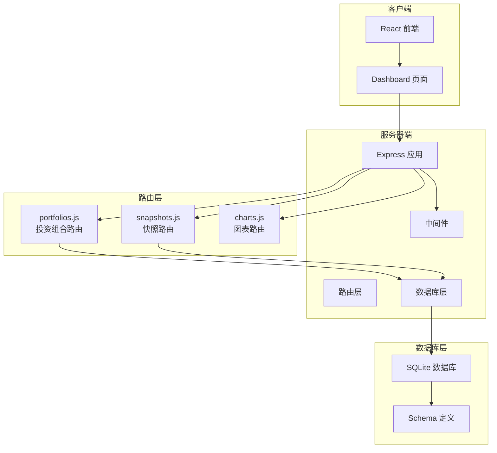
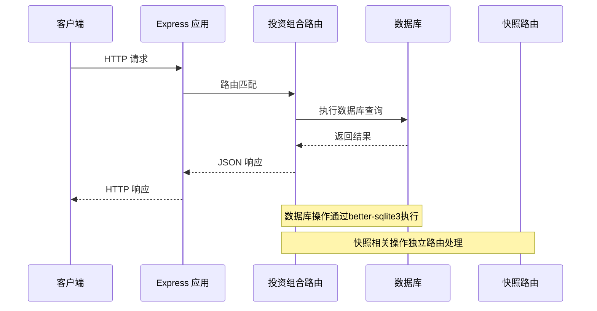
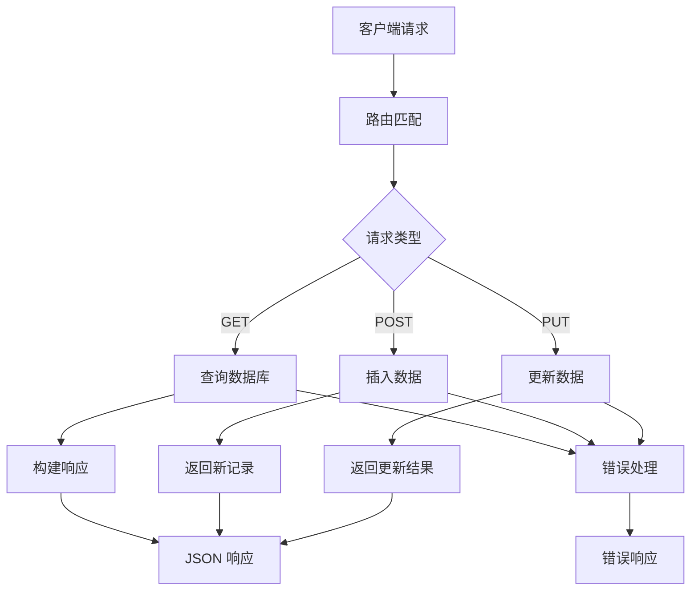
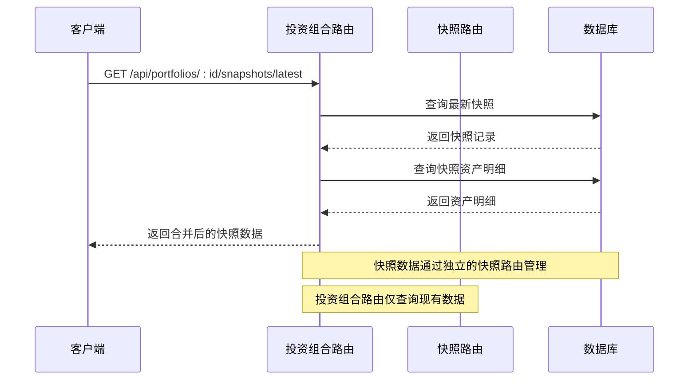
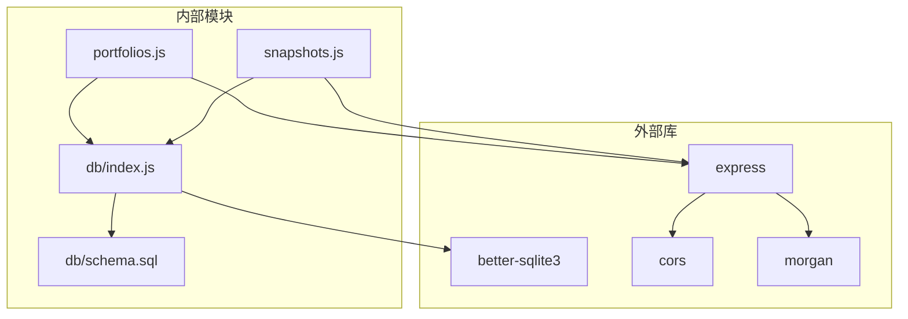
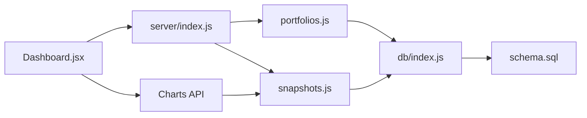
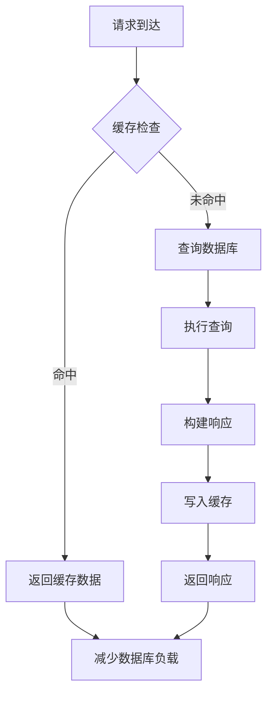
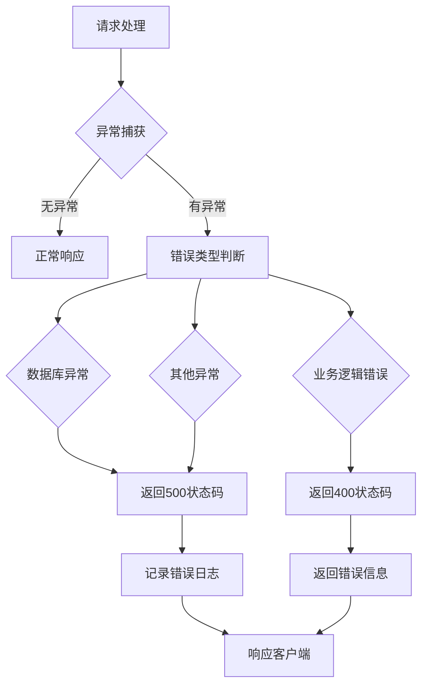

# 投资组合路由

<cite>
**本文档引用的文件**
- [server/routes/portfolios.js](file://server/routes/portfolios.js)
- [server/db/index.js](file://server/db/index.js)
- [server/db/schema.sql](file://server/db/schema.sql)
- [server/index.js](file://server/index.js)
- [server/routes/snapshots.js](file://server/routes/snapshots.js)
- [client/src/pages/Dashboard.jsx](file://client/src/pages/Dashboard.jsx)
</cite>

## 目录
1. [简介](#简介)
2. [项目结构](#项目结构)
3. [核心组件](#核心组件)
4. [架构概览](#架构概览)
5. [详细组件分析](#详细组件分析)
6. [依赖关系分析](#依赖关系分析)
7. [性能考虑](#性能考虑)
8. [故障排除指南](#故障排除指南)
9. [结论](#结论)

## 简介

投资组合路由模块是投资管理系统的核心功能模块，负责管理用户的投资组合及其相关的快照数据。该模块提供了完整的RESTful API接口，支持用户查询、创建投资组合以及获取投资组合的历史快照信息。

本模块基于Express.js框架构建，使用SQLite作为数据存储，通过better-sqlite3库进行数据库操作。系统采用硬编码的用户认证机制，所有API请求都假设用户ID为1。

## 项目结构

投资组合路由模块位于服务器端的路由层，与数据库层和前端客户端形成清晰的分层架构：



**图表来源**
- [server/index.js:1-32](file://server/index.js#L1-L32)
- [server/routes/portfolios.js:1-81](file://server/routes/portfolios.js#L1-L81)
- [server/db/index.js:1-19](file://server/db/index.js#L1-L19)

**章节来源**
- [server/index.js:1-32](file://server/index.js#L1-L32)
- [server/routes/portfolios.js:1-81](file://server/routes/portfolios.js#L1-L81)
- [server/db/index.js:1-19](file://server/db/index.js#L1-L19)

## 核心组件

投资组合路由模块包含以下核心组件：

### 路由路由器
- **portfolios.js**: 主要的投资组合管理路由
- **snapshots.js**: 快照数据管理路由
- **数据库连接**: better-sqlite3数据库连接管理

### 数据模型
- **投资组合表**: 存储用户的投资组合信息
- **快照表**: 存储投资组合的定期快照数据
- **快照资产明细表**: 存储快照中的具体资产持有情况

### 中间件层
- **用户认证中间件**: 硬编码用户ID为1的认证机制
- **CORS中间件**: 跨域资源共享支持
- **JSON解析中间件**: 请求体JSON解析

**章节来源**
- [server/routes/portfolios.js:1-81](file://server/routes/portfolios.js#L1-L81)
- [server/db/schema.sql:1-79](file://server/db/schema.sql#L1-L79)
- [server/index.js:17-21](file://server/index.js#L17-L21)

## 架构概览

投资组合路由模块采用经典的三层架构设计：



**图表来源**
- [server/index.js:24-28](file://server/index.js#L24-L28)
- [server/routes/portfolios.js:6-15](file://server/routes/portfolios.js#L6-L15)
- [server/db/index.js:13-17](file://server/db/index.js#L13-L17)

### 数据流架构



**图表来源**
- [server/routes/portfolios.js:6-81](file://server/routes/portfolios.js#L6-L81)
- [server/routes/snapshots.js:33-124](file://server/routes/snapshots.js#L33-L124)

## 详细组件分析

### 投资组合路由分析

#### GET /api/portfolios
**功能**: 获取当前用户的所有投资组合

**HTTP 方法**: GET
**URL 参数**: 无
**请求头**: Content-Type: application/json
**响应状态码**: 
- 200: 成功获取投资组合列表
- 500: 服务器内部错误

**请求示例**:
```javascript
fetch('/api/portfolios')
  .then(response => response.json())
  .then(data => console.log(data))
```

**响应格式**:
```json
[
  {
    "id": 1,
    "user_id": 1,
    "name": "主要投资组合",
    "description": "核心资产配置",
    "created_at": "2024-01-15 10:30:00"
  },
  {
    "id": 2,
    "user_id": 1,
    "name": "退休储蓄",
    "description": "长期投资计划",
    "created_at": "2024-01-20 14:15:00"
  }
]
```

**数据库查询逻辑**:
- SQL: `SELECT * FROM portfolios WHERE user_id = ?`
- 参数绑定: req.userId (硬编码为1)
- 结果处理: 直接返回查询结果

**错误处理机制**:
- 捕获数据库异常并返回500状态码
- 记录详细的错误日志

**章节来源**
- [server/routes/portfolios.js:6-15](file://server/routes/portfolios.js#L6-L15)
- [server/index.js:17-21](file://server/index.js#L17-L21)

#### POST /api/portfolios
**功能**: 创建新的投资组合

**HTTP 方法**: POST
**URL 参数**: 无
**请求头**: Content-Type: application/json
**请求体字段**:
- name (必需): 投资组合名称
- description (可选): 投资组合描述

**请求示例**:
```javascript
fetch('/api/portfolios', {
  method: 'POST',
  headers: {
    'Content-Type': 'application/json'
  },
  body: JSON.stringify({
    name: "新投资组合",
    description: "测试用的投资组合"
  })
})
.then(response => response.json())
.then(data => console.log(data))
```

**响应格式**:
```json
{
  "id": 3,
  "user_id": 1,
  "name": "新投资组合",
  "description": "测试用的投资组合",
  "created_at": "2024-01-25 09:45:00"
}
```

**业务验证规则**:
- name 字段必须存在且非空
- description 字段可为空，将存储为NULL

**数据库操作流程**:
1. 插入新记录到 portfolios 表
2. 使用 lastInsertRowid 获取新记录ID
3. 查询刚插入的完整记录
4. 返回完整的投资组合信息

**错误处理机制**:
- 捕获数据库异常并返回500状态码
- 记录详细的错误日志

**章节来源**
- [server/routes/portfolios.js:17-30](file://server/routes/portfolios.js#L17-L30)

#### GET /api/portfolios/:id/snapshots/latest
**功能**: 获取指定投资组合的最新快照详情

**HTTP 方法**: GET
**URL 参数**:
- id: 投资组合ID

**请求示例**:
```javascript
fetch('/api/portfolios/1/snapshots/latest')
  .then(response => response.json())
  .then(data => console.log(data))
```

**响应格式**:
```json
{
  "id": 5,
  "portfolio_id": 1,
  "snapshot_date": "2024-01-24",
  "total_value": 150000.00,
  "notes": "季度评估",
  "created_at": "2024-01-25 10:00:00",
  "holdings": [
    {
      "id": 10,
      "snapshot_id": 5,
      "asset_symbol": "AAPL",
      "asset_name": "苹果公司",
      "quantity": 50,
      "price": 150.00,
      "total_value": 7500.00
    }
  ]
}
```

**数据库查询逻辑**:
1. 查询最新的快照记录 (按snapshot_date降序取第一条)
2. 如果没有快照，返回null
3. 如果有快照，查询对应的资产持有明细
4. 将快照信息和资产明细合并返回

**业务逻辑处理**:
- 支持无快照的情况，返回null而不是错误
- 自动关联快照与其资产明细

**错误处理机制**:
- 捕获数据库异常并返回500状态码
- 记录详细的错误日志

**章节来源**
- [server/routes/portfolios.js:32-62](file://server/routes/portfolios.js#L32-L62)

#### GET /api/portfolios/:id/snapshots
**功能**: 获取指定投资组合的所有快照记录

**HTTP 方法**: GET
**URL 参数**:
- id: 投资组合ID

**请求示例**:
```javascript
fetch('/api/portfolios/1/snapshots')
  .then(response => response.json())
  .then(data => console.log(data))
```

**响应格式**:
```json
[
  {
    "id": 5,
    "portfolio_id": 1,
    "snapshot_date": "2024-01-24",
    "total_value": 150000.00,
    "notes": "季度评估",
    "created_at": "2024-01-25 10:00:00"
  },
  {
    "id": 4,
    "portfolio_id": 1,
    "snapshot_date": "2024-01-17",
    "total_value": 145000.00,
    "notes": "上周调整",
    "created_at": "2024-01-18 16:30:00"
  }
]
```

**数据库查询逻辑**:
- SQL: `SELECT * FROM weekly_snapshots WHERE portfolio_id = ? ORDER BY snapshot_date DESC`
- 参数绑定: 投资组合ID
- 结果排序: 按快照日期降序排列

**业务逻辑处理**:
- 返回所有历史快照记录
- 按时间顺序从新到旧排列

**错误处理机制**:
- 捕获数据库异常并返回500状态码
- 记录详细的错误日志

**章节来源**
- [server/routes/portfolios.js:64-79](file://server/routes/portfolios.js#L64-L79)

### 数据库架构分析

#### 表结构设计

```mermaid
erDiagram
USERS {
INTEGER id PK
TEXT username UK
DATETIME created_at
}
PORTFOLIOS {
INTEGER id PK
INTEGER user_id FK
TEXT name
TEXT description
DATETIME created_at
}
WEEKLY_SNAPSHOTS {
INTEGER id PK
INTEGER portfolio_id FK
DATE snapshot_date
REAL total_value
TEXT notes
DATETIME created_at
UNIQUE portfolio_id, snapshot_date
}
SNAPSHOT_HOLDINGS {
INTEGER id PK
INTEGER snapshot_id FK
TEXT asset_symbol
TEXT asset_name
REAL quantity
REAL price
REAL total_value
}
USERS ||--o{ PORTFOLIOS : "owns"
PORTFOLIOS ||--o{ WEEKLY_SNAPSHOTS : "has"
WEEKLY_SNAPSHOTS ||--o{ SNAPSHOT_HOLDINGS : "contains"
```

**图表来源**
- [server/db/schema.sql:14-45](file://server/db/schema.sql#L14-L45)

#### 外键约束和关系
- portfolios 表通过 user_id 外键关联到 users 表
- weekly_snapshots 表通过 portfolio_id 外键关联到 portfolios 表
- snapshot_holdings 表通过 snapshot_id 外键关联到 weekly_snapshots 表

#### 约束条件
- 用户名唯一性约束
- 投资组合名称非空约束
- 快照日期在同一个投资组合内唯一性约束

**章节来源**
- [server/db/schema.sql:1-79](file://server/db/schema.sql#L1-L79)

### 快照路由集成分析

投资组合路由与快照路由之间存在紧密的数据关联：



**图表来源**
- [server/routes/portfolios.js:32-62](file://server/routes/portfolios.js#L32-L62)
- [server/routes/snapshots.js:108-121](file://server/routes/snapshots.js#L108-L121)

**章节来源**
- [server/routes/portfolios.js:32-62](file://server/routes/portfolios.js#L32-L62)
- [server/routes/snapshots.js:108-121](file://server/routes/snapshots.js#L108-L121)

## 依赖关系分析

### 外部依赖



**图表来源**
- [server/package.json](file://server/package.json)
- [server/routes/portfolios.js:1](file://server/routes/portfolios.js#L1)
- [server/routes/snapshots.js:1](file://server/routes/snapshots.js#L1)
- [server/db/index.js:1](file://server/db/index.js#L1)

### 内部依赖关系



**图表来源**
- [server/index.js:4-8](file://server/index.js#L4-L8)
- [server/routes/portfolios.js:2](file://server/routes/portfolios.js#L2)
- [server/routes/snapshots.js:2](file://server/routes/snapshots.js#L2)
- [server/db/index.js:1](file://server/db/index.js#L1)

**章节来源**
- [server/index.js:1-32](file://server/index.js#L1-L32)
- [server/package.json](file://server/package.json)

## 性能考虑

### 数据库优化建议

1. **索引优化**
   - 在 portfolios 表的 user_id 列上建立索引（已通过外键自动创建）
   - 在 weekly_snapshots 表的 portfolio_id 和 snapshot_date 列上建立复合索引

2. **查询优化**
   - 使用 LIMIT 1 限制最新快照查询结果
   - 对于大量快照的查询，考虑分页机制

3. **连接池管理**
   - better-sqlite3 默认支持多线程访问
   - 避免在单个请求中执行过多数据库操作

### 缓存策略



### 并发处理

- Express 应用默认单进程模式
- better-sqlite3 支持多线程读取
- 写操作使用事务确保数据一致性

## 故障排除指南

### 常见错误类型

#### 数据库连接错误
**症状**: 所有API请求返回500错误
**原因**: 数据库文件不存在或权限不足
**解决方案**: 
1. 检查数据库文件路径
2. 确认数据库文件权限
3. 验证schema.sql正确执行

#### 用户认证问题
**症状**: 投资组合查询返回空数组
**原因**: 硬编码用户ID不匹配
**解决方案**:
1. 检查中间件设置的用户ID
2. 确认用户表中存在对应用户记录

#### 数据完整性错误
**症状**: 快照创建返回409错误
**原因**: 同一日期的快照重复提交
**解决方案**:
1. 检查快照日期是否唯一
2. 修改快照日期或删除重复记录

### 错误处理机制



**图表来源**
- [server/routes/portfolios.js:8-14](file://server/routes/portfolios.js#L8-L14)
- [server/routes/snapshots.js:65-71](file://server/routes/snapshots.js#L65-L71)

**章节来源**
- [server/routes/portfolios.js:8-14](file://server/routes/portfolios.js#L8-L14)
- [server/routes/snapshots.js:65-71](file://server/routes/snapshots.js#L65-L71)

## 结论

投资组合路由模块是一个设计合理、功能完整的API模块，具有以下特点：

### 优势
1. **清晰的架构设计**: 采用分层架构，职责分离明确
2. **完善的错误处理**: 全面的异常捕获和错误响应机制
3. **简洁的API设计**: 符合RESTful规范，易于理解和使用
4. **数据完整性保证**: 通过外键约束和事务处理确保数据一致性

### 改进建议
1. **添加输入验证**: 对请求参数进行更严格的验证
2. **实现分页功能**: 对于大量快照数据提供分页支持
3. **增加缓存机制**: 提升高频查询的性能
4. **完善用户认证**: 替换硬编码用户ID为真实的认证机制

### 扩展方向
1. **快照版本控制**: 支持快照的版本管理和比较功能
2. **投资组合分析**: 添加更多的分析和报告功能
3. **实时数据更新**: 支持实时市场数据的集成
4. **多用户支持**: 实现真正的多用户认证和权限管理

该模块为投资管理系统提供了坚实的基础，能够满足基本的投资组合管理需求，并为未来的功能扩展奠定了良好的技术基础。