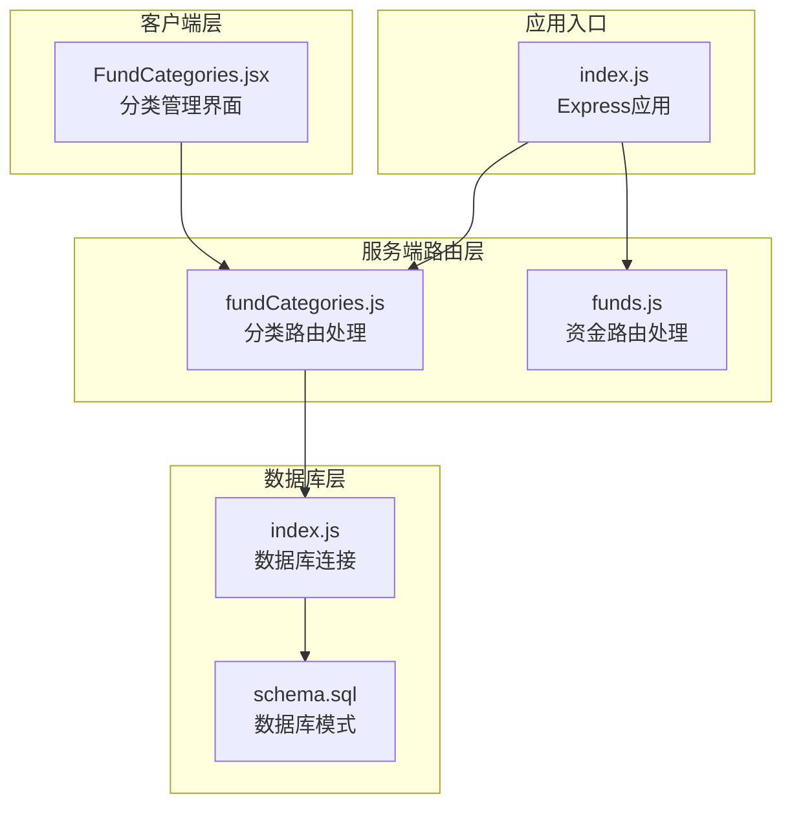
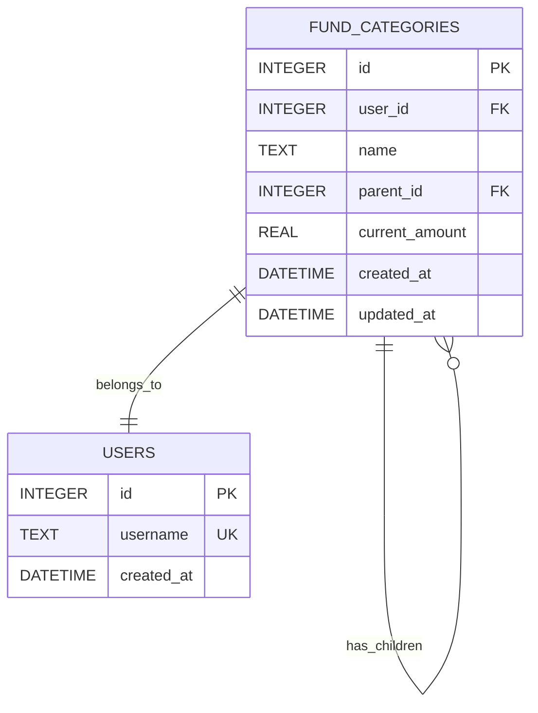
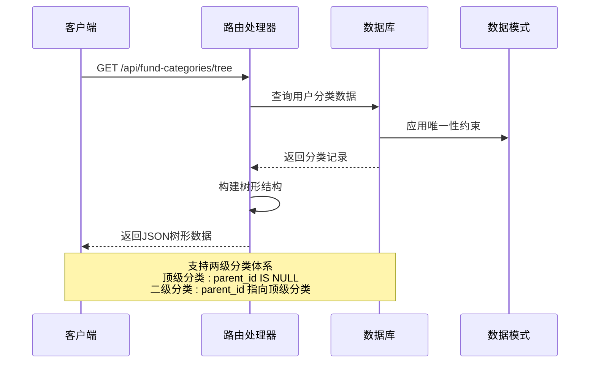
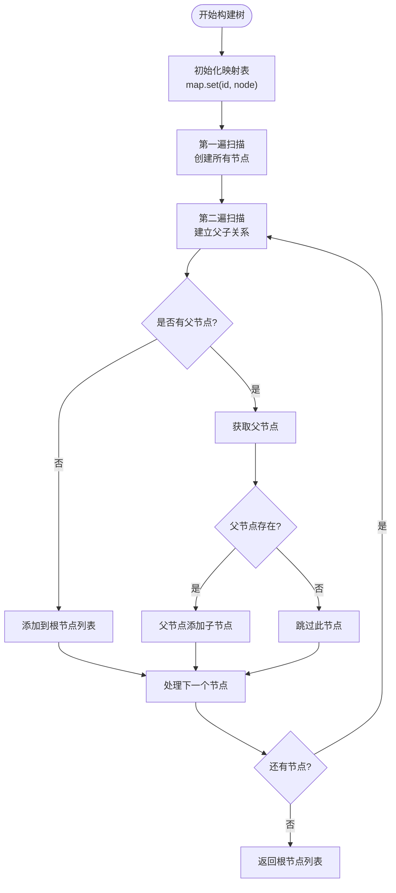
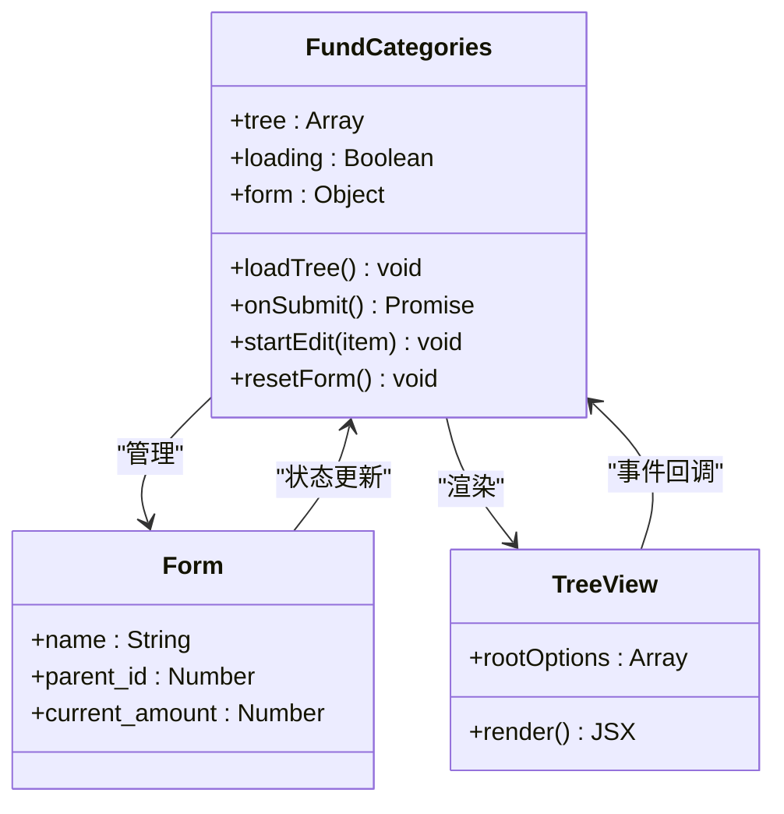
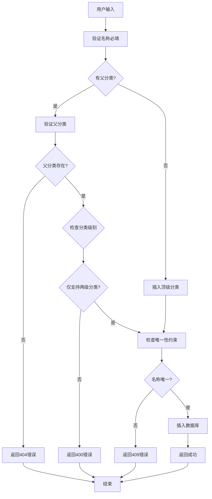
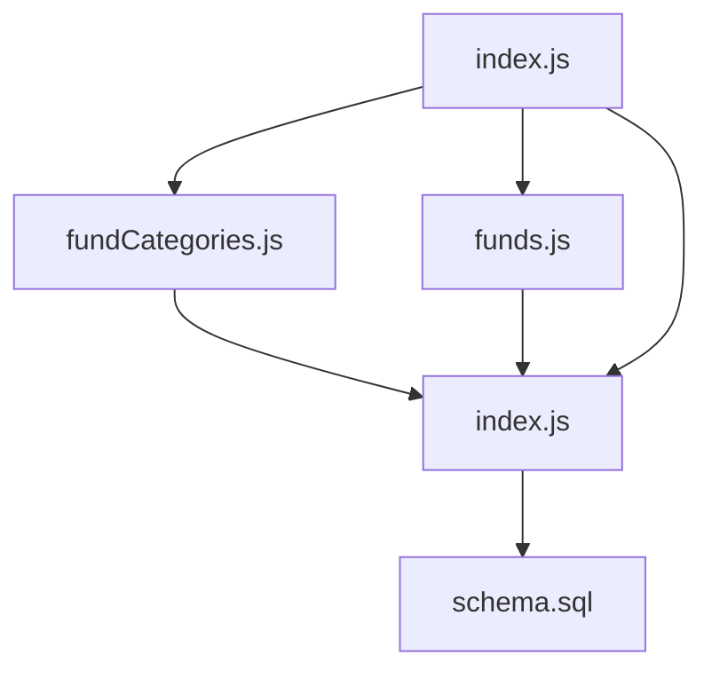

# 资金分类路由

<cite>
**本文档引用的文件**
- [server/routes/fundCategories.js](file://server/routes/fundCategories.js)
- [server/db/schema.sql](file://server/db/schema.sql)
- [client/src/pages/FundCategories.jsx](file://client/src/pages/FundCategories.jsx)
- [server/db/index.js](file://server/db/index.js)
- [server/index.js](file://server/index.js)
- [server/routes/funds.js](file://server/routes/funds.js)
</cite>

## 目录
1. [简介](#简介)
2. [项目结构](#项目结构)
3. [核心组件](#核心组件)
4. [架构概览](#架构概览)
5. [详细组件分析](#详细组件分析)
6. [依赖分析](#依赖分析)
7. [性能考虑](#性能考虑)
8. [故障排除指南](#故障排除指南)
9. [结论](#结论)

## 简介

资金分类路由模块是个人财务管理系统中的核心功能模块，负责管理两级资金分类体系。该模块实现了完整的树形结构管理，支持分类的创建、更新、删除和查询操作，采用SQLite数据库存储，提供RESTful API接口供前端调用。

系统采用两级分类体系：一级分类（顶级分类）和二级分类（子分类），通过parent_id字段建立父子关系。每个用户只能看到自己的分类数据，确保数据隔离。

## 项目结构

资金分类路由模块位于服务器端的路由层，与数据库层和客户端界面紧密集成：



**图表来源**
- [server/routes/fundCategories.js:1-139](file://server/routes/fundCategories.js#L1-L139)
- [server/db/schema.sql:1-79](file://server/db/schema.sql#L1-L79)
- [client/src/pages/FundCategories.jsx:1-184](file://client/src/pages/FundCategories.jsx#L1-L184)

**章节来源**
- [server/routes/fundCategories.js:1-139](file://server/routes/fundCategories.js#L1-L139)
- [server/db/schema.sql:1-79](file://server/db/schema.sql#L1-L79)
- [client/src/pages/FundCategories.jsx:1-184](file://client/src/pages/FundCategories.jsx#L1-L184)

## 核心组件

### 数据模型设计

资金分类采用两级树形结构，使用SQLite数据库进行持久化存储：



**图表来源**
- [server/db/schema.sql:47-68](file://server/db/schema.sql#L47-L68)

### 唯一性约束

系统通过数据库索引实现严格的唯一性约束：
- 顶级分类名称在同一用户下唯一
- 二级分类名称在同一父分类下唯一

**章节来源**
- [server/db/schema.sql:60-68](file://server/db/schema.sql#L60-L68)

## 架构概览

资金分类模块采用经典的三层架构设计：



**图表来源**
- [server/routes/fundCategories.js:29-43](file://server/routes/fundCategories.js#L29-L43)
- [server/db/schema.sql:47-68](file://server/db/schema.sql#L47-L68)

## 详细组件分析

### 树形构建算法

系统实现了高效的树形结构构建算法，时间复杂度为O(n)，空间复杂度为O(n)：



**图表来源**
- [server/routes/fundCategories.js:6-27](file://server/routes/fundCategories.js#L6-L27)

**章节来源**
- [server/routes/fundCategories.js:6-27](file://server/routes/fundCategories.js#L6-L27)

### 分类管理API规范

#### GET /api/fund-categories/tree
- **功能**：获取用户的完整分类树形结构
- **请求参数**：无
- **响应数据**：树形结构数组，包含根节点及其子节点
- **排序规则**：先顶级分类，后二级分类，按ID升序排列

#### POST /api/fund-categories
- **功能**：创建新的分类
- **请求体参数**：
  - name: 分类名称（必填）
  - parent_id: 父分类ID（可选，默认null）
  - current_amount: 当前金额（可选，默认0）
- **响应**：创建成功的分类对象

#### PUT /api/fund-categories/:id
- **功能**：更新指定分类
- **路径参数**：id - 分类ID
- **请求体参数**：name、parent_id、current_amount（可选）
- **响应**：更新后的分类对象

**章节来源**
- [server/routes/fundCategories.js:29-136](file://server/routes/fundCategories.js#L29-L136)

### 前端界面实现

前端使用React和Ant Design实现分类管理界面：



**图表来源**
- [client/src/pages/FundCategories.jsx:8-184](file://client/src/pages/FundCategories.jsx#L8-L184)

**章节来源**
- [client/src/pages/FundCategories.jsx:1-184](file://client/src/pages/FundCategories.jsx#L1-L184)

### 数据库约束与验证

系统通过多层验证确保数据完整性：



**图表来源**
- [server/routes/fundCategories.js:45-81](file://server/routes/fundCategories.js#L45-L81)
- [server/routes/fundCategories.js:83-136](file://server/routes/fundCategories.js#L83-L136)

**章节来源**
- [server/routes/fundCategories.js:45-136](file://server/routes/fundCategories.js#L45-L136)

## 依赖分析

### 外部依赖

系统使用以下关键依赖：

```mermaid
graph LR
subgraph "核心依赖"
Express[express@^4.19.2]
BetterSqlite[better-sqlite3@^11.0.0]
Cors[cors@^2.8.5]
Morgan[morgan@^1.10.0]
end
subgraph "应用模块"
FundCategories[fundCategories.js]
Funds[funds.js]
Schema[schema.sql]
DbIndex[index.js]
end
Express --> FundCategories
Express --> Funds
FundCategories --> DbIndex
Funds --> DbIndex
DbIndex --> Schema
BetterSqlite --> DbIndex
```

**图表来源**
- [server/package.json](file://server/package.json)
- [server/index.js:1-32](file://server/index.js#L1-L32)

### 内部模块依赖



**图表来源**
- [server/index.js:7-28](file://server/index.js#L7-L28)
- [server/db/index.js:1-19](file://server/db/index.js#L1-L19)

**章节来源**
- [server/index.js:1-32](file://server/index.js#L1-L32)
- [server/db/index.js:1-19](file://server/db/index.js#L1-L19)

## 性能考虑

### 查询优化

系统采用以下优化策略：

1. **索引优化**：为用户ID和父分类ID建立索引
2. **唯一性约束**：通过数据库约束避免重复查询
3. **单次查询**：树形结构构建仅需两次数据库扫描

### 内存优化

- 使用Map数据结构实现O(1)节点查找
- 一次性构建完整树形结构，避免重复计算
- 合理的数据结构设计减少内存占用

### 并发处理

- SQLite数据库支持基本的并发读取
- 唯一性约束在数据库层面保证数据一致性
- 错误处理机制确保异常情况下的数据安全

## 故障排除指南

### 常见错误类型

| 错误代码 | 错误原因 | 解决方案 |
|---------|---------|---------|
| 400 | 分类名称为空 | 确保name字段必填 |
| 400 | 分类级别不正确 | 仅支持两级分类，父分类必须为顶级分类 |
| 400 | 循环引用 | 不能将分类设置为其自身的父分类 |
| 404 | 父分类不存在 | 检查父分类ID是否有效 |
| 409 | 名称冲突 | 确保同级分类名称唯一 |
| 500 | 数据库错误 | 检查数据库连接和约束条件 |

### 调试建议

1. **启用日志**：使用Morgan中间件查看请求日志
2. **检查数据库**：验证schema.sql中索引和约束是否正确
3. **测试API**：使用curl或Postman测试各个端点
4. **验证数据**：检查数据库中的分类数据是否符合预期

**章节来源**
- [server/routes/fundCategories.js:49-80](file://server/routes/fundCategories.js#L49-L80)
- [server/routes/fundCategories.js:99-135](file://server/routes/fundCategories.js#L99-L135)

## 结论

资金分类路由模块实现了完整的两级分类管理体系，具有以下特点：

1. **清晰的架构设计**：采用分层架构，职责分离明确
2. **高效的算法实现**：树形结构构建算法时间复杂度为O(n)
3. **严格的数据约束**：通过数据库约束确保数据完整性
4. **良好的用户体验**：前端界面简洁直观，支持实时数据更新
5. **完善的错误处理**：提供详细的错误信息和状态码

该模块为个人财务管理系统提供了坚实的基础，支持用户对资金分类进行灵活管理，满足日常财务管理需求。