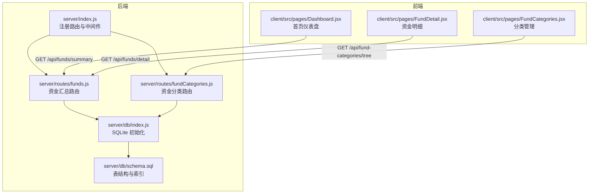
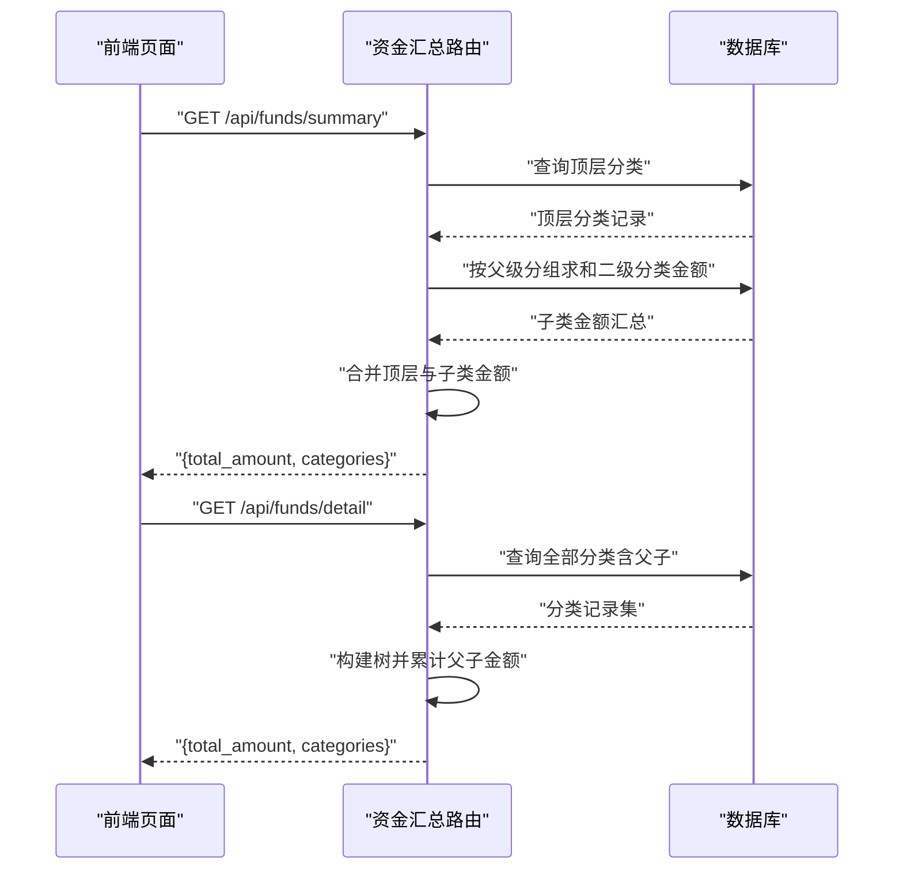
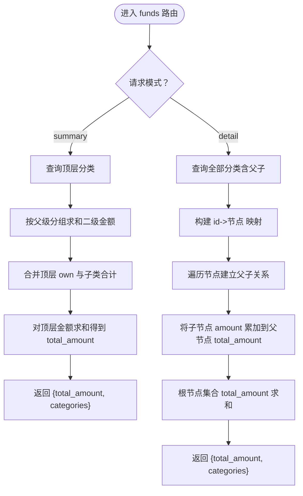
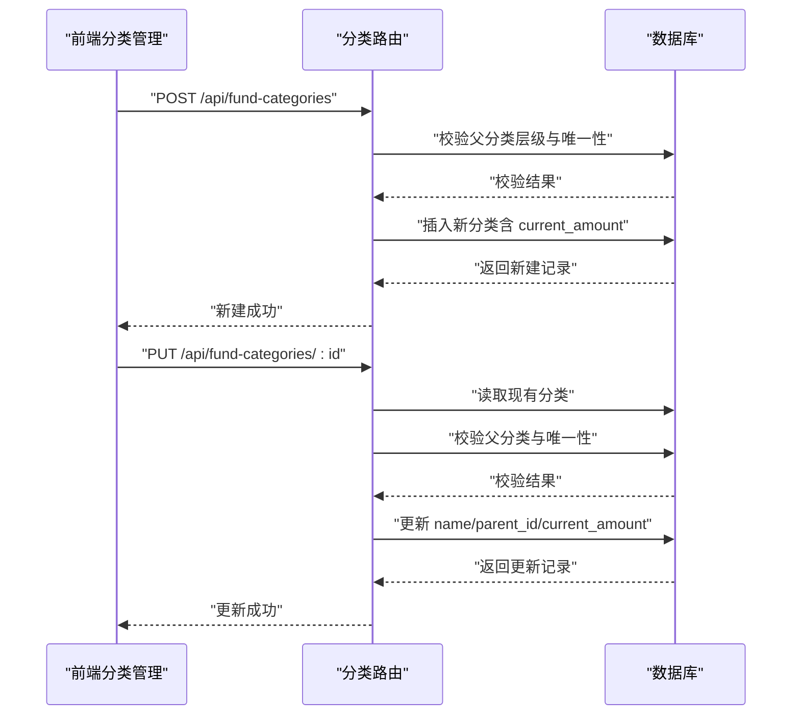
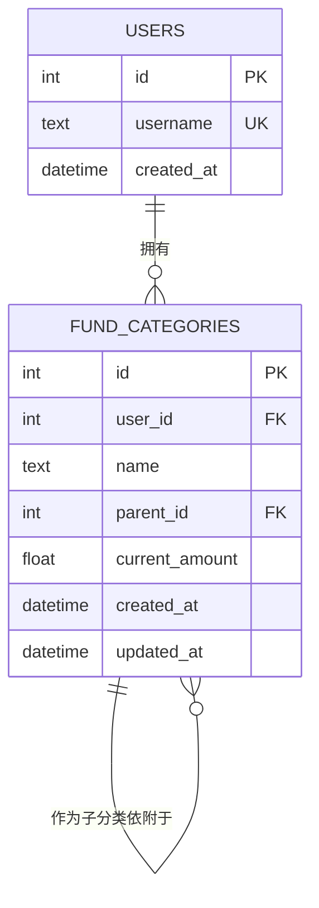
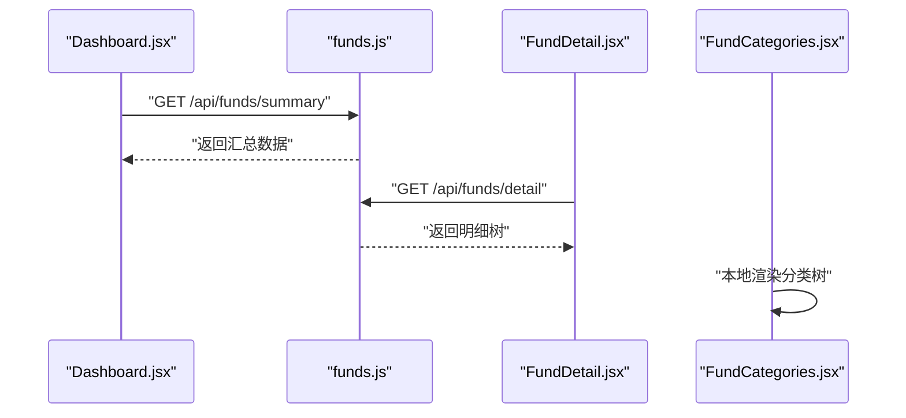
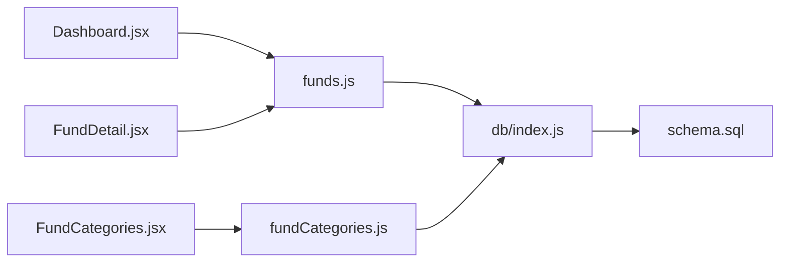

# 资金汇总路由

<cite>
**本文引用的文件**
- [server/routes/funds.js](file://server/routes/funds.js)
- [server/db/index.js](file://server/db/index.js)
- [server/db/schema.sql](file://server/db/schema.sql)
- [server/routes/fundCategories.js](file://server/routes/fundCategories.js)
- [server/index.js](file://server/index.js)
- [client/src/pages/Dashboard.jsx](file://client/src/pages/Dashboard.jsx)
- [client/src/pages/FundDetail.jsx](file://client/src/pages/FundDetail.jsx)
- [client/src/pages/FundCategories.jsx](file://client/src/pages/FundCategories.jsx)
- [server/routes/charts.js](file://server/routes/charts.js)
</cite>

## 目录
1. [简介](#简介)
2. [项目结构](#项目结构)
3. [核心组件](#核心组件)
4. [架构概览](#架构概览)
5. [详细组件分析](#详细组件分析)
6. [依赖分析](#依赖分析)
7. [性能考虑](#性能考虑)
8. [故障排查指南](#故障排查指南)
9. [结论](#结论)
10. [附录](#附录)

## 简介
本技术文档聚焦于资金汇总路由模块，系统性解析后端 funds 路由在“首页汇总”和“详情明细”两类场景中的金额计算与汇总逻辑，覆盖以下关键主题：
- 金额计算与汇总：顶层分类与二级分类的自动求和、父子金额累加、总计计算。
- 分类统计与实时更新：基于数据库中 current_amount 字段的实时汇总，以及分类树结构的构建与更新。
- 计算规则与一致性：通过数据库索引与约束保障同级分类唯一性，确保汇总结果一致可靠。
- 多维度查询与前端集成：与仪表盘、资金分类管理页面的联动调用。
- 性能优化与缓存策略：当前实现未引入缓存，建议结合业务热点与访问模式进行优化。

## 项目结构
资金汇总路由位于后端 server/routes/funds.js，配合数据库初始化与 schema 定义，服务于前端仪表盘与资金明细页面。

**图示来源**
- [server/index.js:1-32](file://server/index.js#L1-L32)
- [server/routes/funds.js:1-95](file://server/routes/funds.js#L1-L95)
- [server/routes/fundCategories.js:1-139](file://server/routes/fundCategories.js#L1-L139)
- [server/db/index.js:1-19](file://server/db/index.js#L1-L19)
- [server/db/schema.sql:1-79](file://server/db/schema.sql#L1-L79)
- [client/src/pages/Dashboard.jsx:1-101](file://client/src/pages/Dashboard.jsx#L1-L101)
- [client/src/pages/FundDetail.jsx:1-60](file://client/src/pages/FundDetail.jsx#L1-L60)
- [client/src/pages/FundCategories.jsx:1-184](file://client/src/pages/FundCategories.jsx#L1-L184)

**章节来源**
- [server/index.js:1-32](file://server/index.js#L1-L32)
- [server/routes/funds.js:1-95](file://server/routes/funds.js#L1-L95)
- [server/db/index.js:1-19](file://server/db/index.js#L1-L19)
- [server/db/schema.sql:1-79](file://server/db/schema.sql#L1-L79)
- [client/src/pages/Dashboard.jsx:1-101](file://client/src/pages/Dashboard.jsx#L1-L101)
- [client/src/pages/FundDetail.jsx:1-60](file://client/src/pages/FundDetail.jsx#L1-L60)
- [client/src/pages/FundCategories.jsx:1-184](file://client/src/pages/FundCategories.jsx#L1-L184)

## 核心组件
- 资金汇总路由（/api/funds）
  - GET /api/funds/summary：首页展示，仅返回顶层分类及其直接子类合计后的金额，形成“顶层汇总”视图。
  - GET /api/funds/detail：详情页展示，返回顶层分类及所有二级分类的完整树形明细，并对每个父节点累计其子节点金额，形成“完整明细”视图。
- 数据库与模型
  - fund_categories 表包含 user_id、name、parent_id、current_amount、updated_at 等字段，支持两级分类。
  - 通过唯一索引保证同级分类名称唯一性，避免重复。
- 前端集成
  - 仪表盘页面调用 /api/funds/summary 获取首页汇总数据。
  - 资金明细页面调用 /api/funds/detail 获取完整树形明细。
  - 分类管理页面调用 /api/fund-categories/tree 获取分类树，用于新增/编辑分类时选择父分类。

**章节来源**
- [server/routes/funds.js:6-95](file://server/routes/funds.js#L6-L95)
- [server/db/schema.sql:47-79](file://server/db/schema.sql#L47-L79)
- [client/src/pages/Dashboard.jsx:30-35](file://client/src/pages/Dashboard.jsx#L30-L35)
- [client/src/pages/FundDetail.jsx:10-18](file://client/src/pages/FundDetail.jsx#L10-L18)
- [client/src/pages/FundCategories.jsx:20-33](file://client/src/pages/FundCategories.jsx#L20-L33)

## 架构概览
资金汇总路由的调用链路如下：

**图示来源**
- [server/routes/funds.js:8-45](file://server/routes/funds.js#L8-L45)
- [server/routes/funds.js:49-92](file://server/routes/funds.js#L49-L92)

## 详细组件分析

### 组件A：资金汇总路由（/api/funds）
- 设计要点
  - 顶层汇总（summary）：先查询顶层分类，再对二级分类按 parent_id 分组求和，最后将子类合计与顶层 own 金额相加，得到每个顶层的最终金额，再对所有顶层求和得到 total_amount。
  - 完整明细（detail）：查询所有分类，构建父子映射，将每个子节点的 amount 累加到父节点 total_amount，形成树形结构，根节点集合的 total_amount 之和即为 total_amount。
- 错误处理
  - 对数据库异常统一捕获并返回 500 与错误信息。
- 数据一致性
  - 通过数据库唯一索引与约束保证同级分类名称唯一，避免重复导致的汇总偏差。
- 前端集成
  - 仪表盘使用 summary 接口；明细页使用 detail 接口。

**图示来源**
- [server/routes/funds.js:8-45](file://server/routes/funds.js#L8-L45)
- [server/routes/funds.js:49-92](file://server/routes/funds.js#L49-L92)

**章节来源**
- [server/routes/funds.js:6-95](file://server/routes/funds.js#L6-L95)

### 组件B：资金分类路由（/api/fund-categories）
- 设计要点
  - 支持两级分类：父分类必须为顶层（parent_id 为空），子分类必须依附于顶层。
  - 新增与更新接口均校验父分类存在性与层级限制，并维护 current_amount 字段。
  - 提供树形查询接口，便于前端选择父分类。
- 与资金汇总的关系
  - 分类树是资金汇总的基础数据来源；分类变更会直接影响汇总结果。

**图示来源**
- [server/routes/fundCategories.js:45-81](file://server/routes/fundCategories.js#L45-L81)
- [server/routes/fundCategories.js:83-136](file://server/routes/fundCategories.js#L83-L136)

**章节来源**
- [server/routes/fundCategories.js:1-139](file://server/routes/fundCategories.js#L1-L139)

### 组件C：数据库与模型
- 表结构与索引
  - fund_categories：支持 user_id、parent_id、current_amount、updated_at 等字段。
  - 唯一索引：顶层分类名称唯一；二级分类在同一父类下名称唯一。
- 初始化
  - 启用外键约束，初始化默认顶级分类（投资理财、公积金、活期资金）。

**图示来源**
- [server/db/schema.sql:47-79](file://server/db/schema.sql#L47-L79)

**章节来源**
- [server/db/schema.sql:1-79](file://server/db/schema.sql#L1-L79)
- [server/db/index.js:1-19](file://server/db/index.js#L1-L19)

### 组件D：前端集成与调用
- 仪表盘（Dashboard）
  - 调用 /api/funds/summary 获取首页汇总数据，渲染总资金与各顶层分类卡片。
- 资金明细（FundDetail）
  - 调用 /api/funds/detail 获取完整树形明细，展示父级与子级金额。
- 分类管理（FundCategories）
  - 调用 /api/fund-categories/tree 获取分类树，用于新增/编辑时选择父分类。

**图示来源**
- [client/src/pages/Dashboard.jsx:30-35](file://client/src/pages/Dashboard.jsx#L30-L35)
- [client/src/pages/FundDetail.jsx:10-18](file://client/src/pages/FundDetail.jsx#L10-L18)
- [client/src/pages/FundCategories.jsx:20-33](file://client/src/pages/FundCategories.jsx#L20-L33)

**章节来源**
- [client/src/pages/Dashboard.jsx:1-101](file://client/src/pages/Dashboard.jsx#L1-L101)
- [client/src/pages/FundDetail.jsx:1-60](file://client/src/pages/FundDetail.jsx#L1-L60)
- [client/src/pages/FundCategories.jsx:1-184](file://client/src/pages/FundCategories.jsx#L1-L184)

## 依赖分析
- 组件耦合
  - funds 路由依赖 db/index.js 提供的 SQLite 连接与 schema 初始化。
  - fundCategories 路由同样依赖 db/index.js 与 schema。
  - 前端页面通过 /api/funds 与 /api/fund-categories 与后端交互。
- 外部依赖
  - Express、better-sqlite3、cors、morgan、Ant Design（前端）。
- 可能的循环依赖
  - 当前模块间无循环导入，耦合度低，职责清晰。

**图示来源**
- [server/routes/funds.js:1-95](file://server/routes/funds.js#L1-L95)
- [server/routes/fundCategories.js:1-139](file://server/routes/fundCategories.js#L1-L139)
- [server/db/index.js:1-19](file://server/db/index.js#L1-L19)
- [server/db/schema.sql:1-79](file://server/db/schema.sql#L1-L79)
- [client/src/pages/Dashboard.jsx:1-101](file://client/src/pages/Dashboard.jsx#L1-L101)
- [client/src/pages/FundDetail.jsx:1-60](file://client/src/pages/FundDetail.jsx#L1-L60)
- [client/src/pages/FundCategories.jsx:1-184](file://client/src/pages/FundCategories.jsx#L1-L184)

**章节来源**
- [server/index.js:1-32](file://server/index.js#L1-L32)
- [server/routes/funds.js:1-95](file://server/routes/funds.js#L1-L95)
- [server/routes/fundCategories.js:1-139](file://server/routes/fundCategories.js#L1-L139)
- [server/db/index.js:1-19](file://server/db/index.js#L1-L19)
- [server/db/schema.sql:1-79](file://server/db/schema.sql#L1-L79)
- [client/src/pages/Dashboard.jsx:1-101](file://client/src/pages/Dashboard.jsx#L1-L101)
- [client/src/pages/FundDetail.jsx:1-60](file://client/src/pages/FundDetail.jsx#L1-L60)
- [client/src/pages/FundCategories.jsx:1-184](file://client/src/pages/FundCategories.jsx#L1-L184)

## 性能考虑
- 当前实现
  - summary：两次查询 + 一次 Map 构建 + 一次 reduce，时间复杂度 O(n)。
  - detail：一次查询 + 两次遍历（映射与父子累计），时间复杂度 O(n)。
- 优化建议
  - 查询层面：为 user_id、parent_id 建立合适索引（当前 schema 已有唯一索引，可评估是否需要复合索引）。
  - 内存层面：对于大体量数据，可考虑服务端分页或流式输出。
  - 缓存策略：针对高频读取的 summary 接口，可在应用层引入短期缓存（如内存缓存或 Redis），设置 TTL 并在分类写入时主动失效。
  - 前端优化：对 detail 的树构建与渲染进行虚拟化处理，减少 DOM 压力。
- 一致性与并发
  - 使用数据库事务在批量更新分类金额时保证一致性。
  - 对于高并发写入，建议在分类更新接口增加乐观锁或版本号控制。

[本节为通用性能指导，无需特定文件引用]

## 故障排查指南
- 常见错误与定位
  - 数据库异常：funds 路由在 try/catch 中捕获并返回 500，检查数据库连接与 SQL 执行日志。
  - 分类唯一性冲突：新增/更新分类时若违反唯一索引，返回 409 与明确错误信息，检查同级分类名称是否重复。
  - 父分类不存在：更新分类时若指定的父分类不存在或层级非法，返回 404/400，检查 parent_id 是否正确。
- 建议排查步骤
  - 后端：开启 morgan 日志，观察请求路径与状态码；检查数据库 schema 是否正确加载。
  - 前端：确认调用 /api/funds/summary 与 /api/funds/detail 的响应结构与字段名一致。
  - 数据一致性：核对 fund_categories 表中 current_amount 是否按预期更新，是否存在脏数据。

**章节来源**
- [server/routes/funds.js:42-44](file://server/routes/funds.js#L42-L44)
- [server/routes/funds.js:89-91](file://server/routes/funds.js#L89-L91)
- [server/routes/fundCategories.js:76-80](file://server/routes/fundCategories.js#L76-L80)
- [server/routes/fundCategories.js:131-135](file://server/routes/fundCategories.js#L131-L135)
- [server/db/index.js:15-17](file://server/db/index.js#L15-L17)

## 结论
资金汇总路由通过简洁高效的 SQL 查询与内存计算，实现了对两级分类体系的实时汇总与明细展示。其设计遵循“数据即事实”的原则，依靠数据库唯一索引与约束保障一致性。当前实现满足中小规模数据的实时需求，建议在高并发与大数据量场景下引入缓存与索引优化，以进一步提升性能与稳定性。

[本节为总结性内容，无需特定文件引用]

## 附录

### API 规范：资金汇总
- GET /api/funds/summary
  - 描述：首页展示的资金汇总，仅包含顶层分类及其直接子类合计后的金额。
  - 查询参数：无
  - 返回数据：
    - total_amount: number（总金额）
    - categories: 数组，元素包含 id、name、amount
- GET /api/funds/detail
  - 描述：详情页展示的完整树形明细，包含顶层与二级分类，父节点 total_amount 为子节点 amount 之和。
  - 查询参数：无
  - 返回数据：
    - total_amount: number（总金额）
    - categories: 树形数组，元素包含 id、name、parent_id、amount、total_amount、children（数组）

**章节来源**
- [server/routes/funds.js:6-95](file://server/routes/funds.js#L6-L95)

### 与分类系统的集成
- 分类树查询
  - GET /api/fund-categories/tree：返回完整的两层分类树，用于前端选择父分类与展示。
- 分类增删改
  - POST /api/fund-categories：新增分类，校验层级与唯一性。
  - PUT /api/fund-categories/:id：更新分类，校验层级与唯一性。
- 影响关系
  - 分类树与金额字段（current_amount）是资金汇总的数据基础；任何分类的新增、删除或金额变更都会影响汇总结果。

**章节来源**
- [server/routes/fundCategories.js:29-43](file://server/routes/fundCategories.js#L29-L43)
- [server/routes/fundCategories.js:45-81](file://server/routes/fundCategories.js#L45-L81)
- [server/routes/fundCategories.js:83-136](file://server/routes/fundCategories.js#L83-L136)