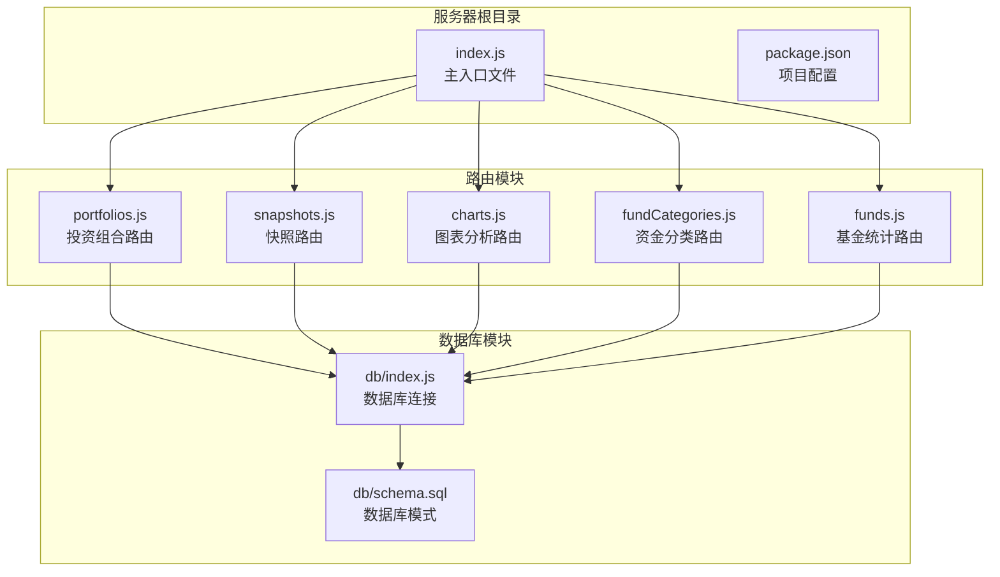
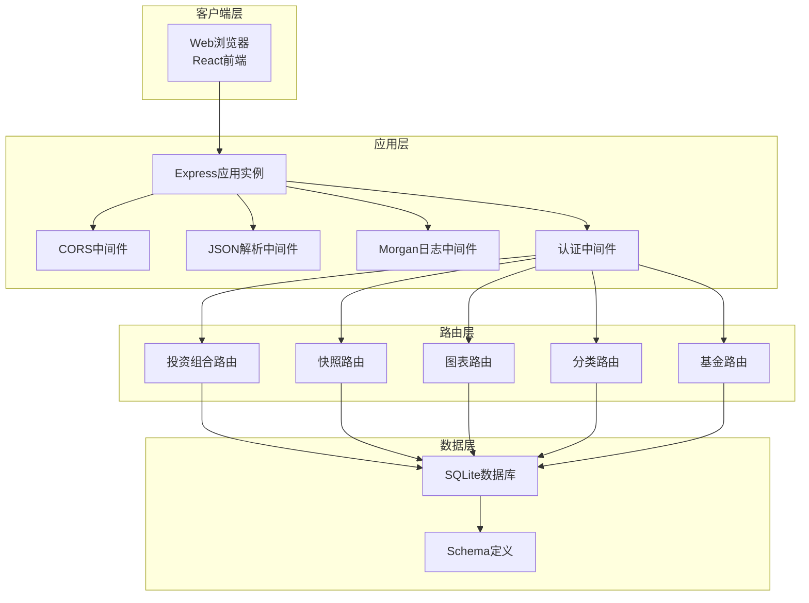
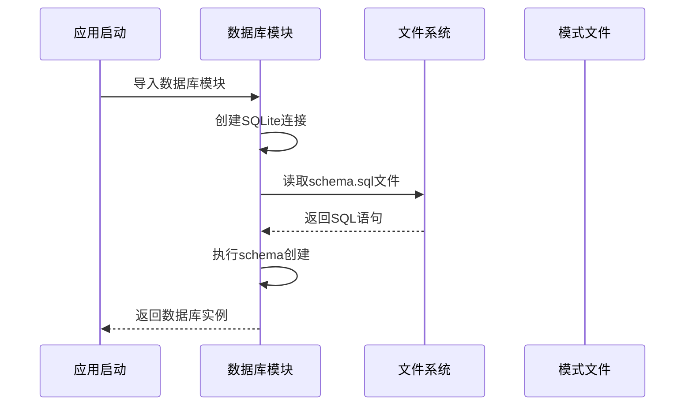
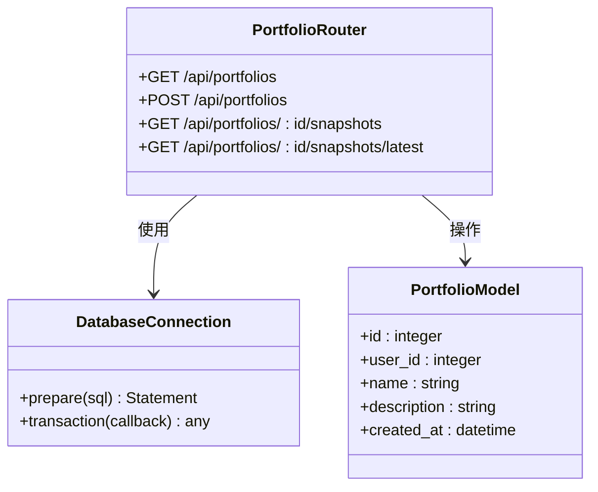
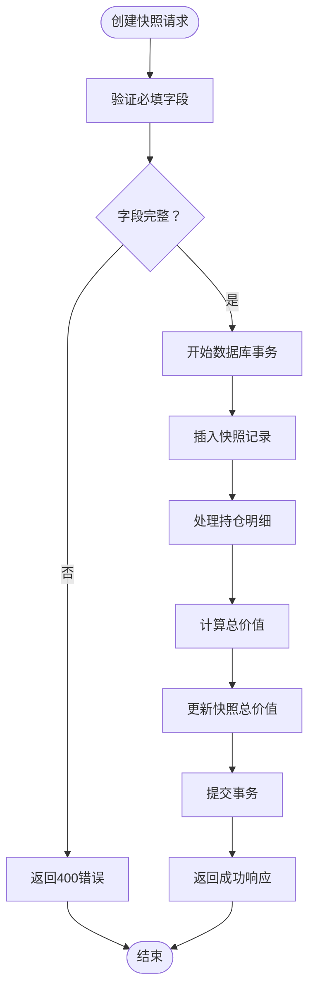
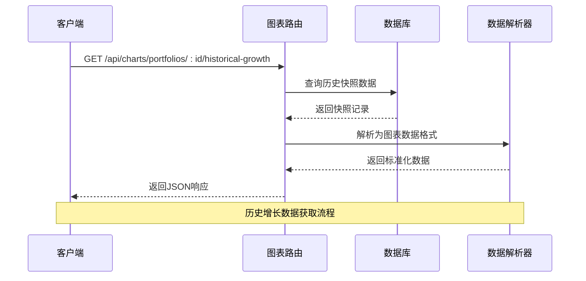
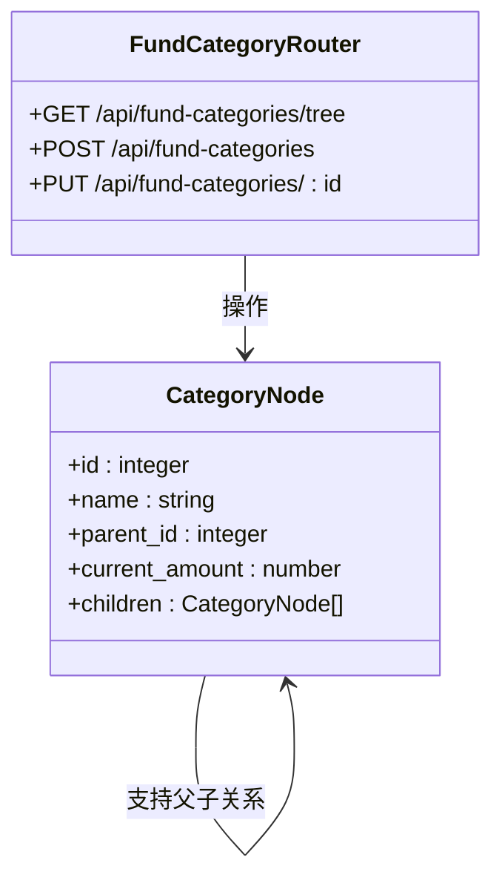
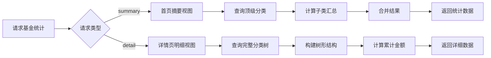
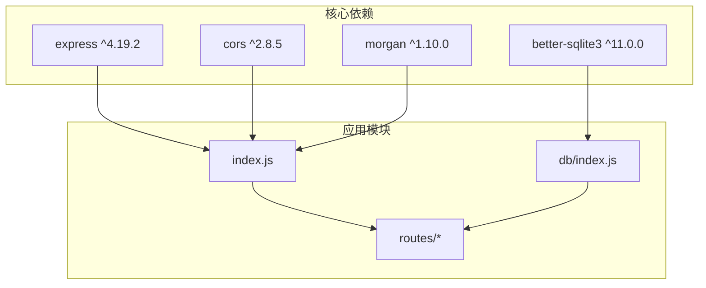

# Express服务器配置

<cite>
**本文档引用的文件**
- [server/index.js](file://server/index.js)
- [server/package.json](file://server/package.json)
- [server/routes/funds.js](file://server/routes/funds.js)
- [server/routes/portfolios.js](file://server/routes/portfolios.js)
- [server/routes/snapshots.js](file://server/routes/snapshots.js)
- [server/routes/charts.js](file://server/routes/charts.js)
- [server/routes/fundCategories.js](file://server/routes/fundCategories.js)
- [server/db/index.js](file://server/db/index.js)
- [server/db/schema.sql](file://server/db/schema.sql)
</cite>

## 目录
1. [简介](#简介)
2. [项目结构](#项目结构)
3. [核心组件](#核心组件)
4. [架构概览](#架构概览)
5. [详细组件分析](#详细组件分析)
6. [依赖关系分析](#依赖关系分析)
7. [性能考虑](#性能考虑)
8. [故障排除指南](#故障排除指南)
9. [结论](#结论)

## 简介

个人投资追踪系统是一个基于Express.js构建的后端API服务器，专门为个人投资者提供投资组合管理和财务追踪功能。该系统采用模块化设计，使用SQLite数据库存储投资相关信息，包含五个主要业务模块：投资组合管理、快照记录、图表分析、资金分类和基金统计。

系统的核心特性包括：
- 实时投资组合价值追踪
- 历史快照功能，支持多期数据对比
- 可视化图表展示，包括历史增长趋势和持仓分布
- 两级资金分类体系，支持父子关系管理
- 模拟用户认证机制，简化开发和测试流程

## 项目结构

该项目采用清晰的分层架构，将不同功能模块分离到独立的目录中：

**图表来源**
- [server/index.js:1-32](file://server/index.js#L1-L32)
- [server/db/index.js:1-19](file://server/db/index.js#L1-L19)

**章节来源**
- [server/index.js:1-32](file://server/index.js#L1-L32)
- [server/package.json:1-18](file://server/package.json#L1-L18)

## 核心组件

### Express应用实例创建

服务器通过标准的Express应用实例创建模式启动，采用ES模块语法确保现代JavaScript兼容性。应用实例在内存中创建，不直接绑定到特定的网络接口，为后续的中间件配置和路由注册提供基础。

### 中间件配置体系

系统实现了三层中间件配置，每层都有明确的功能分工：

1. **CORS中间件**：启用跨域资源共享，允许前端应用从不同源访问API
2. **JSON解析中间件**：处理JSON格式的请求体，支持RESTful API通信
3. **日志中间件**：提供详细的请求日志，便于调试和监控

### 端口配置机制

服务器支持灵活的端口配置，优先使用环境变量指定的端口号，如果未设置则回退到默认的5000端口。这种设计使得服务器可以在不同的部署环境中灵活调整端口配置。

### 模拟用户认证中间件

系统实现了一个简化的用户认证机制，通过硬编码的方式为所有请求分配固定的用户ID（值为1）。这种设计主要用于演示目的，简化了开发和测试流程，避免了复杂的认证流程对核心功能的影响。

**章节来源**
- [server/index.js:10-21](file://server/index.js#L10-L21)

## 架构概览

系统采用经典的MVC架构模式，将业务逻辑、数据访问和路由处理分离到不同的模块中：

**图表来源**
- [server/index.js:13-28](file://server/index.js#L13-L28)
- [server/db/index.js:12-17](file://server/db/index.js#L12-L17)

## 详细组件分析

### 数据库连接与初始化

数据库模块负责建立SQLite连接并确保数据库模式的正确初始化：

**图表来源**
- [server/db/index.js:12-17](file://server/db/index.js#L12-L17)
- [server/db/schema.sql:1-79](file://server/db/schema.sql#L1-L79)

数据库初始化过程确保了所有必需的表都已创建，并包含了必要的约束和索引。特别地，系统预置了三个顶级资金分类，为新用户提供开箱即用的功能体验。

### 投资组合管理模块

投资组合模块提供了完整的CRUD操作，支持投资组合的创建、查询和管理：

**图表来源**
- [server/routes/portfolios.js:6-81](file://server/routes/portfolios.js#L6-L81)
- [server/db/index.js:12-17](file://server/db/index.js#L12-L17)

该模块的核心功能包括：
- **查询所有投资组合**：按用户ID过滤，确保数据隔离
- **创建新投资组合**：支持名称和描述字段的创建
- **获取快照列表**：按日期倒序排列，最新快照在前
- **获取最新快照**：自动查找指定投资组合的最新数据

### 快照管理系统

快照模块实现了复杂的数据管理功能，支持投资组合价值的历史追踪：

**图表来源**
- [server/routes/snapshots.js:34-72](file://server/routes/snapshots.js#L34-L72)

快照处理流程体现了数据一致性的要求：
- **原子性操作**：使用数据库事务确保数据完整性
- **批量处理**：一次性处理所有持仓明细，提高效率
- **重复约束**：防止同一天重复创建快照
- **级联删除**：当快照更新时，自动清理旧的持仓数据

### 图表分析模块

图表模块提供了丰富的数据分析功能，支持多种可视化需求：

**图表来源**
- [server/routes/charts.js:10-27](file://server/routes/charts.js#L10-L27)

图表模块支持两种主要的数据分析：
- **历史增长趋势**：按时间顺序返回总资产价值变化
- **当前持仓分布**：返回最新快照的有效持仓比例

### 资金分类管理

资金分类模块实现了两级分类体系，支持父子关系的管理：

**图表来源**
- [server/routes/fundCategories.js:29-139](file://server/routes/fundCategories.js#L29-L139)

分类管理的关键特性：
- **树形结构**：支持父子节点的层级关系
- **唯一性约束**：顶级分类名称在同一用户下唯一
- **二级限制**：强制只允许两级分类结构
- **动态构建**：运行时从扁平数据构建树形结构

### 基金统计模块

基金统计模块提供了首页和详情页的不同视图：

**图表来源**
- [server/routes/funds.js:8-45](file://server/routes/funds.js#L8-L45)
- [server/routes/funds.js:49-92](file://server/routes/funds.js#L49-L92)

**章节来源**
- [server/routes/portfolios.js:1-81](file://server/routes/portfolios.js#L1-L81)
- [server/routes/snapshots.js:1-124](file://server/routes/snapshots.js#L1-L124)
- [server/routes/charts.js:1-74](file://server/routes/charts.js#L1-L74)
- [server/routes/fundCategories.js:1-139](file://server/routes/fundCategories.js#L1-L139)
- [server/routes/funds.js:1-95](file://server/routes/funds.js#L1-L95)

## 依赖关系分析

系统依赖关系清晰明确，遵循单一职责原则：

**图表来源**
- [server/package.json:11-16](file://server/package.json#L11-L16)
- [server/index.js:1-8](file://server/index.js#L1-L8)

依赖关系特点：
- **轻量级设计**：仅使用必要的核心依赖
- **模块化路由**：每个路由模块独立，降低耦合度
- **统一数据库访问**：所有路由共享同一个数据库连接实例

**章节来源**
- [server/package.json:1-18](file://server/package.json#L1-L18)

## 性能考虑

### 数据库优化策略

系统采用了多项数据库优化措施：
- **索引优化**：为常用查询字段建立索引，提高查询性能
- **事务批处理**：使用数据库事务确保数据一致性，减少锁竞争
- **连接池管理**：better-sqlite3内置连接池，自动管理连接复用

### 内存使用优化

- **流式处理**：对于大量数据的查询，采用流式处理避免内存溢出
- **延迟加载**：树形结构在需要时才构建，减少不必要的计算开销
- **对象复用**：使用Map和数组进行数据缓存，提高访问速度

### 缓存策略建议

虽然当前实现没有专门的缓存层，但可以考虑以下优化：
- **查询结果缓存**：对频繁访问的统计数据进行缓存
- **路由级别缓存**：针对静态或低频变更的数据设置缓存头
- **数据库查询缓存**：利用better-sqlite3的查询计划缓存

## 故障排除指南

### 常见问题诊断

1. **数据库连接失败**
   - 检查数据库文件权限和路径
   - 确认schema.sql文件存在且可读
   - 验证SQLite扩展是否正确安装

2. **路由访问异常**
   - 确认中间件按正确的顺序注册
   - 检查路由前缀是否匹配
   - 验证用户ID中间件是否正常工作

3. **数据一致性问题**
   - 检查事务是否正确提交或回滚
   - 验证外键约束是否满足
   - 确认唯一性约束是否被违反

### 日志分析技巧

系统使用Morgan中间件提供详细的请求日志，可以通过以下方式分析：
- **开发模式**：使用`dev`格式获取详细的请求信息
- **生产模式**：考虑使用`combined`格式获取完整的访问日志
- **错误追踪**：关注HTTP状态码异常和响应时间过长的请求

### 性能监控指标

建议监控以下关键指标：
- **响应时间**：数据库查询和API响应的平均耗时
- **并发连接数**：同时活跃的数据库连接数量
- **错误率**：HTTP 5xx错误的比例
- **内存使用**：进程内存占用情况

**章节来源**
- [server/index.js:30-32](file://server/index.js#L30-L32)
- [server/db/index.js:12-17](file://server/db/index.js#L12-L17)

## 结论

个人投资追踪系统的Express服务器配置展现了现代Node.js应用的最佳实践。系统通过清晰的模块化设计、合理的中间件配置和简洁的数据库架构，为个人投资者提供了一个功能完整、易于扩展的投资追踪解决方案。

**主要优势**：
- **架构清晰**：模块化设计便于维护和扩展
- **开发友好**：简化的认证机制降低了开发复杂度
- **性能可靠**：SQLite数据库提供了良好的性能表现
- **易于部署**：单一可执行文件，部署简单

**改进建议**：
- **增强认证**：实现真正的用户认证和授权机制
- **添加缓存**：引入Redis等缓存层提升性能
- **完善测试**：增加单元测试和集成测试覆盖率
- **监控告警**：添加应用性能监控和错误告警系统

该系统为个人财务管理和投资追踪提供了一个坚实的技术基础，可以根据实际需求进一步扩展和完善。