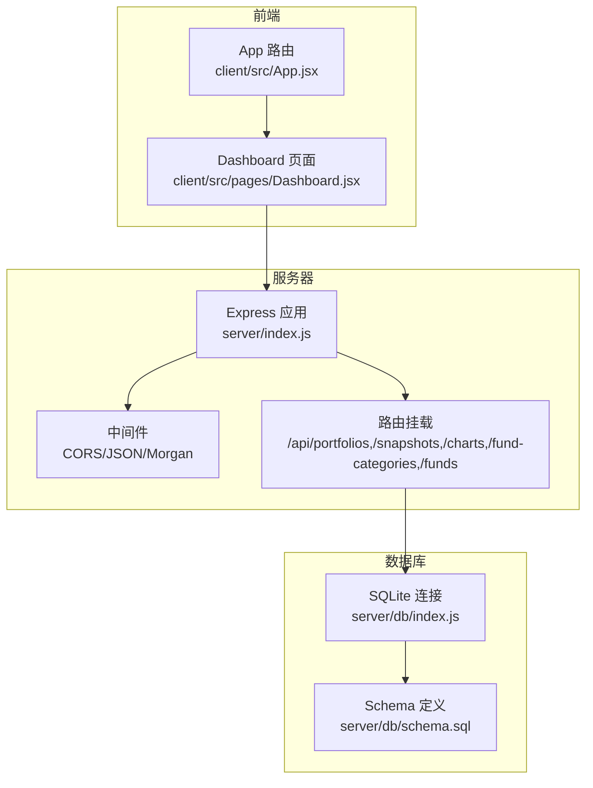
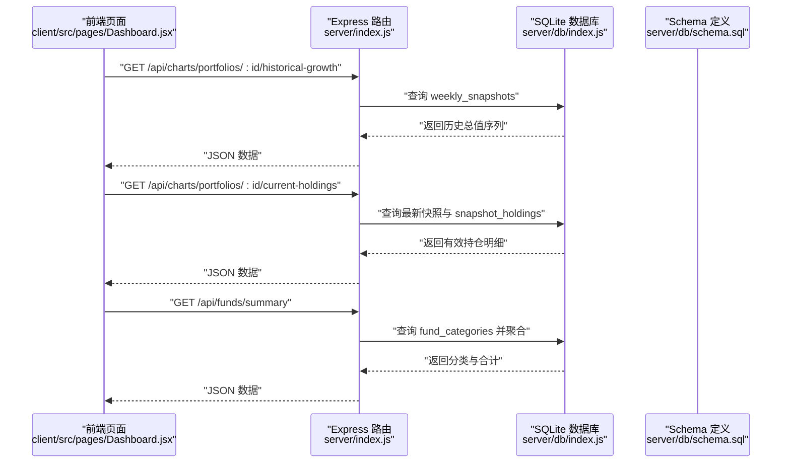
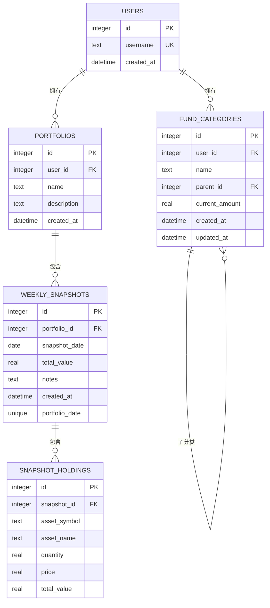
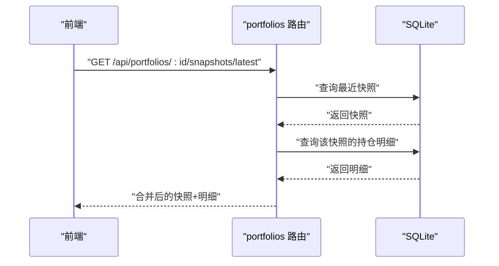
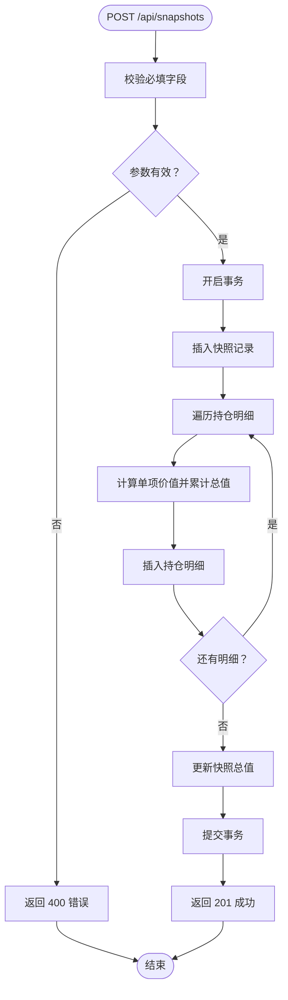
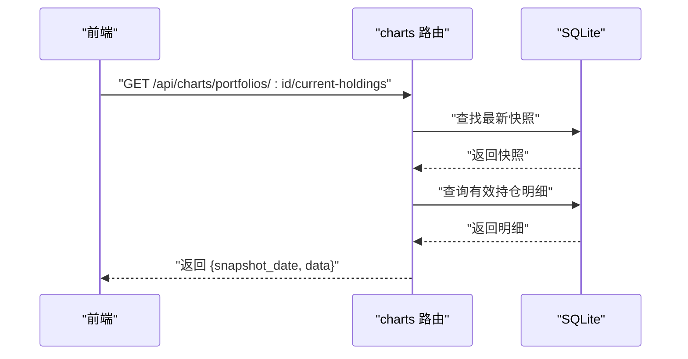
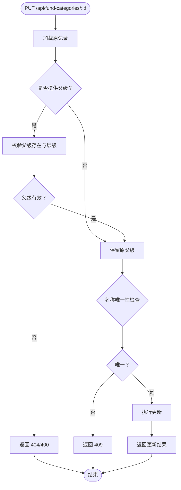
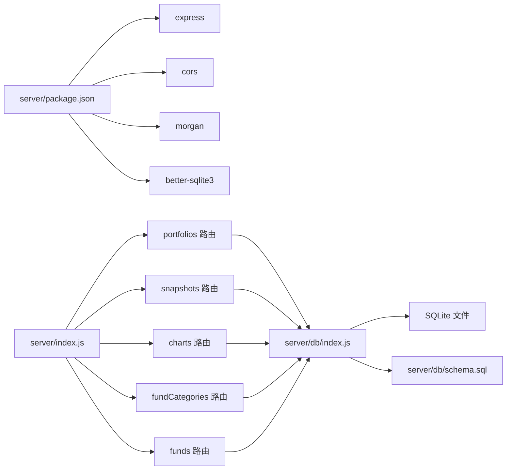

# 后端架构

<cite>
**本文引用的文件**
- [server/index.js](file://server/index.js)
- [server/package.json](file://server/package.json)
- [server/db/index.js](file://server/db/index.js)
- [server/db/schema.sql](file://server/db/schema.sql)
- [server/routes/funds.js](file://server/routes/funds.js)
- [server/routes/portfolios.js](file://server/routes/portfolios.js)
- [server/routes/snapshots.js](file://server/routes/snapshots.js)
- [server/routes/charts.js](file://server/routes/charts.js)
- [server/routes/fundCategories.js](file://server/routes/fundCategories.js)
- [client/src/App.jsx](file://client/src/App.jsx)
- [client/src/pages/Dashboard.jsx](file://client/src/pages/Dashboard.jsx)
</cite>

## 目录
1. [简介](#简介)
2. [项目结构](#项目结构)
3. [核心组件](#核心组件)
4. [架构总览](#架构总览)
5. [详细组件分析](#详细组件分析)
6. [依赖分析](#依赖分析)
7. [性能考虑](#性能考虑)
8. [故障排查指南](#故障排查指南)
9. [结论](#结论)
10. [附录](#附录)

## 简介
本项目是一个个人投资追踪系统的后端服务，采用 Node.js + Express 构建，使用 SQLite 数据库存储数据。系统围绕“投资组合”“快照”“资金分类”三大业务域组织 API，提供历史增长曲线、当前持仓分布等可视化数据接口，并通过前端页面进行展示与交互。

## 项目结构
后端采用按功能模块划分的路由组织方式：
- 服务器入口负责中间件注册、路由挂载与启动监听
- 数据库模块负责 SQLite 连接初始化与表结构迁移
- 路由模块分别处理投资组合、快照、图表、资金分类与资金汇总等业务

图示来源
- [server/index.js:1-32](file://server/index.js#L1-L32)
- [server/db/index.js:1-19](file://server/db/index.js#L1-L19)
- [server/db/schema.sql:1-79](file://server/db/schema.sql#L1-L79)
- [client/src/App.jsx:1-28](file://client/src/App.jsx#L1-L28)
- [client/src/pages/Dashboard.jsx:1-96](file://client/src/pages/Dashboard.jsx#L1-L96)

章节来源
- [server/index.js:1-32](file://server/index.js#L1-L32)
- [server/package.json:1-18](file://server/package.json#L1-L18)

## 核心组件
- Express 应用与中间件
  - 注册 CORS、JSON 解析、日志中间件
  - 自定义认证中间件：为每个请求注入固定用户 ID（便于演示）
- 路由模块
  - 投资组合：查询、创建、获取最新快照、获取历史快照列表
  - 快照：创建、修改、查询详情；内部使用事务保证一致性
  - 图表：历史增长、当前持仓分布
  - 资金分类：树形结构查询、增删改
  - 资金：首页汇总、详情树形
- 数据库模块
  - better-sqlite3 连接
  - Schema 初始化与外键启用
  - 唯一性约束与索引策略

章节来源
- [server/index.js:10-32](file://server/index.js#L10-L32)
- [server/db/index.js:1-19](file://server/db/index.js#L1-L19)
- [server/db/schema.sql:1-79](file://server/db/schema.sql#L1-L79)

## 架构总览
系统采用“轻量级单体后端 + 前端直连”的架构：
- 后端仅提供 RESTful 接口，无复杂中间层
- 前端通过 fetch 直接调用 /api/* 接口
- 数据库为本地 SQLite 文件，适合开发与小规模使用

图示来源
- [server/index.js:23-28](file://server/index.js#L23-L28)
- [server/routes/charts.js:10-27](file://server/routes/charts.js#L10-L27)
- [server/routes/charts.js:33-72](file://server/routes/charts.js#L33-L72)
- [server/routes/funds.js:8-45](file://server/routes/funds.js#L8-L45)
- [server/db/index.js:13-17](file://server/db/index.js#L13-L17)
- [server/db/schema.sql:24-45](file://server/db/schema.sql#L24-L45)

## 详细组件分析

### Express 服务器与中间件
- 中间件
  - CORS：允许跨域请求
  - JSON：解析请求体
  - Morgan：开发环境日志输出
  - 自定义认证中间件：在请求对象上注入固定用户 ID，简化后续权限控制
- 路由挂载
  - 将各模块路由挂载至 /api/* 前缀，统一管理
- 启动监听
  - 默认端口 5000，控制台输出启动信息

章节来源
- [server/index.js:13-32](file://server/index.js#L13-L32)

### 数据库连接与 Schema 设计
- 连接与初始化
  - 使用 better-sqlite3 连接本地 SQLite 文件
  - 启动时读取 schema.sql 并执行，确保表存在
- 外键与约束
  - 启用外键约束
  - 投资组合与快照、快照与持仓明细之间建立级联删除
  - 资金分类支持两级父子关系，父级唯一性约束
- 索引策略
  - 资金分类顶级与子级名称唯一索引，提升查询效率
- 初始数据
  - 插入默认顶级分类（投资理财、公积金、活期资金）

图示来源
- [server/db/schema.sql:4-79](file://server/db/schema.sql#L4-L79)

章节来源
- [server/db/index.js:13-17](file://server/db/index.js#L13-L17)
- [server/db/schema.sql:1-79](file://server/db/schema.sql#L1-L79)

### 投资组合模块（portfolios）
- 查询全部投资组合
- 新建投资组合（自动绑定当前用户）
- 获取指定投资组合的最新快照详情（含持仓明细）
- 获取指定投资组合的历史快照列表

图示来源
- [server/routes/portfolios.js:32-62](file://server/routes/portfolios.js#L32-L62)
- [server/routes/snapshots.js:108-121](file://server/routes/snapshots.js#L108-L121)

章节来源
- [server/routes/portfolios.js:6-81](file://server/routes/portfolios.js#L6-L81)

### 快照模块（snapshots）
- 创建快照
  - 参数校验：必须包含投资组合 ID、快照日期、资产明细数组
  - 使用事务：先插入快照占位，再批量插入持仓明细并计算总值，最后更新快照总值
  - 冲突处理：若同一天已有快照则返回 409
- 更新快照
  - 删除旧明细，重新插入新明细并计算总值，更新元数据
- 查询快照详情
  - 返回快照元数据及明细

图示来源
- [server/routes/snapshots.js:33-72](file://server/routes/snapshots.js#L33-L72)

章节来源
- [server/routes/snapshots.js:33-124](file://server/routes/snapshots.js#L33-L124)

### 图表模块（charts）
- 历史增长
  - 按日期升序返回每周快照的总资产值
- 当前持仓
  - 获取最新快照的有效持仓（数量与总值均大于 0），按总值降序排列

图示来源
- [server/routes/charts.js:33-72](file://server/routes/charts.js#L33-L72)

章节来源
- [server/routes/charts.js:6-74](file://server/routes/charts.js#L6-L74)

### 资金分类模块（fundCategories）
- 树形查询
  - 按用户过滤，按父子顺序排序，构建树形结构返回
- 新增分类
  - 校验名称必填；若指定父级，需满足两级限制与存在性校验；唯一性冲突返回 409
- 更新分类
  - 支持部分字段更新；禁止自指；校验父级有效性与层级限制；唯一性冲突返回 409

图示来源
- [server/routes/fundCategories.js:83-136](file://server/routes/fundCategories.js#L83-L136)

章节来源
- [server/routes/fundCategories.js:29-139](file://server/routes/fundCategories.js#L29-L139)

### 资金模块（funds）
- 首页汇总
  - 查询顶级分类与子分类金额并聚合，返回合计与分类列表
- 详情树形
  - 返回带子节点的树形结构，包含自身与子项合计

章节来源
- [server/routes/funds.js:6-95](file://server/routes/funds.js#L6-L95)

## 依赖分析
- 服务器运行时依赖
  - express、cors、morgan、better-sqlite3
- 模块耦合
  - 路由模块依赖数据库模块（db/index.js）
  - 服务器入口依赖各路由模块
- 可能的循环依赖
  - 未发现直接循环依赖
- 外部集成点
  - 前端通过 /api/* 直接调用后端接口

图示来源
- [server/package.json:11-16](file://server/package.json#L11-L16)
- [server/db/index.js:13-17](file://server/db/index.js#L13-L17)
- [server/index.js:4-8](file://server/index.js#L4-L8)

章节来源
- [server/package.json:1-18](file://server/package.json#L1-L18)
- [server/index.js:1-32](file://server/index.js#L1-L32)

## 性能考虑
- 查询优化
  - 资金分类使用唯一索引避免重复名称，提升插入与更新效率
  - 快照按日期唯一约束，避免重复写入
- 事务使用
  - 快照创建/更新使用事务，保证数据一致性
- 日志与监控
  - 开发环境使用 morgan 输出请求日志，便于问题定位
- 前端缓存
  - 前端可对静态数据进行本地缓存，减少重复请求

## 故障排查指南
- 常见错误与处理
  - 400 参数缺失：检查请求体字段完整性
  - 404 资源不存在：确认 ID 是否正确或已被删除
  - 409 唯一性冲突：检查名称唯一性或日期唯一性
  - 500 服务器内部错误：查看后端日志与数据库状态
- 日志定位
  - 开启 morgan 后可在控制台看到请求方法、路径与响应状态
- 数据库健康
  - 确认 schema 已成功执行，外键约束已启用
  - 检查 SQLite 文件是否存在且可读写

章节来源
- [server/routes/snapshots.js:66-71](file://server/routes/snapshots.js#L66-L71)
- [server/routes/fundCategories.js:76-80](file://server/routes/fundCategories.js#L76-L80)
- [server/index.js:15](file://server/index.js#L15)
- [server/db/schema.sql:1-2](file://server/db/schema.sql#L1-L2)

## 结论
本后端以简洁清晰的方式实现了个人投资追踪的核心能力：投资组合与快照的全生命周期管理、资金分类的两级树形结构、以及基于快照的可视化数据接口。通过 better-sqlite3 与 SQLite 的组合，系统具备良好的开发体验与较低的运维成本。建议后续可扩展为多用户模型、引入鉴权中间件与更完善的错误码体系。

## 附录

### API 接口清单与使用示例
- 投资组合
  - GET /api/portfolios：获取当前用户的所有投资组合
  - POST /api/portfolios：新建投资组合
  - GET /api/portfolios/:id/snapshots/latest：获取指定投资组合的最新快照（含持仓）
  - GET /api/portfolios/:id/snapshots：获取指定投资组合的历史快照列表
- 快照
  - POST /api/snapshots：创建快照（请求体包含 portfolio_id、snapshot_date、notes、holdings 数组）
  - PUT /api/snapshots/:id：更新快照（请求体包含 snapshot_date、holdings 数组）
  - GET /api/snapshots/:id：获取快照详情（含持仓明细）
- 图表
  - GET /api/charts/portfolios/:portfolioId/historical-growth：历史增长数据（按日期升序）
  - GET /api/charts/portfolios/:portfolioId/current-holdings：当前持仓分布（过滤清仓资产）
- 资金分类
  - GET /api/fund-categories/tree：树形结构查询
  - POST /api/fund-categories：新增分类（name、parent_id、current_amount）
  - PUT /api/fund-categories/:id：更新分类（name、parent_id、current_amount）
- 资金
  - GET /api/funds/summary：首页汇总（顶级分类与合计）
  - GET /api/funds/detail：详情树形（含子分类合计）

章节来源
- [server/routes/portfolios.js:6-81](file://server/routes/portfolios.js#L6-L81)
- [server/routes/snapshots.js:33-124](file://server/routes/snapshots.js#L33-L124)
- [server/routes/charts.js:6-74](file://server/routes/charts.js#L6-L74)
- [server/routes/fundCategories.js:29-139](file://server/routes/fundCategories.js#L29-L139)
- [server/routes/funds.js:6-95](file://server/routes/funds.js#L6-L95)