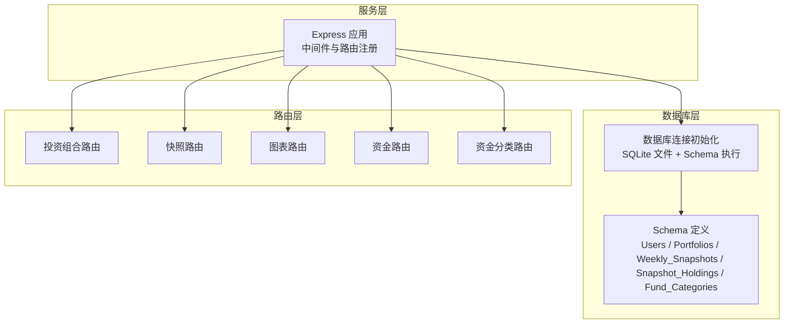
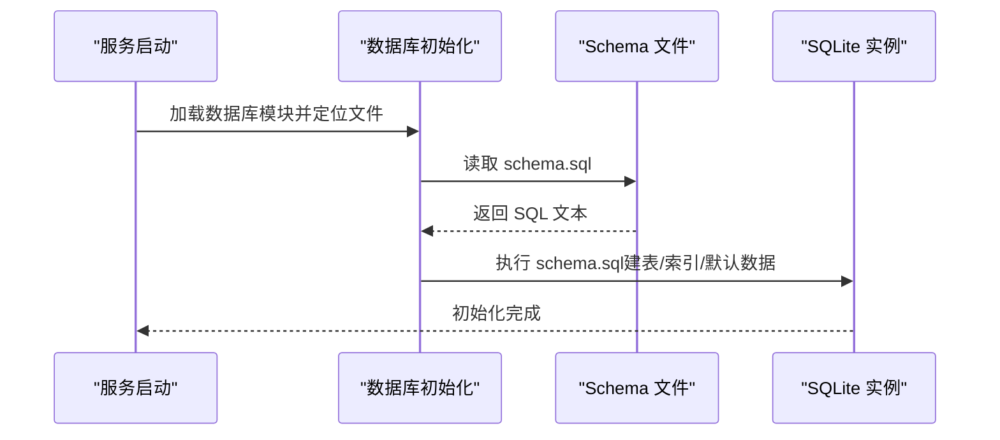
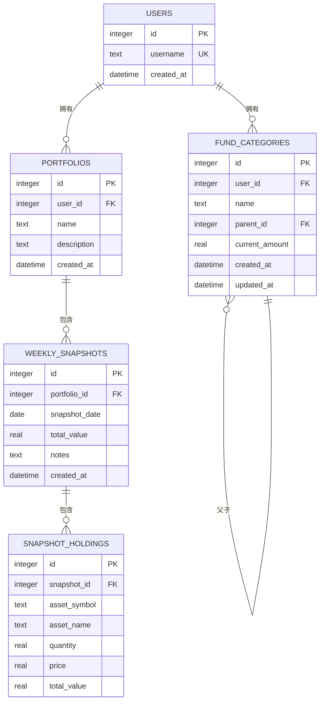
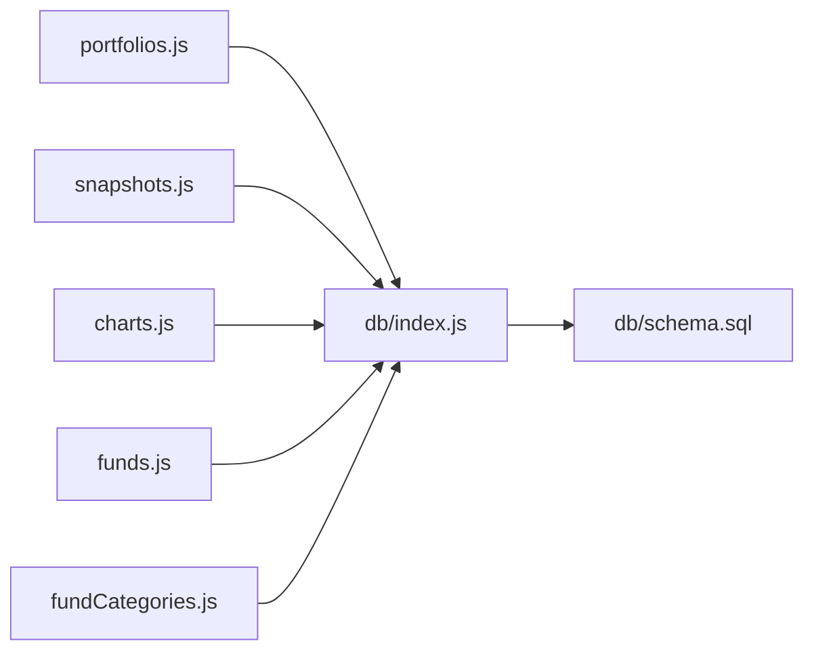
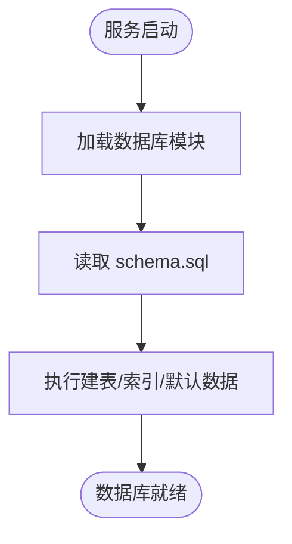

# 数据库设计

<cite>
**本文引用的文件**
- [schema.sql](file://server/db/schema.sql)
- [index.js](file://server/db/index.js)
- [portfolios.js](file://server/routes/portfolios.js)
- [snapshots.js](file://server/routes/snapshots.js)
- [charts.js](file://server/routes/charts.js)
- [funds.js](file://server/routes/funds.js)
- [fundCategories.js](file://server/routes/fundCategories.js)
- [index.js](file://server/index.js)
</cite>

## 目录
1. [简介](#简介)
2. [项目结构](#项目结构)
3. [核心组件](#核心组件)
4. [架构总览](#架构总览)
5. [详细组件分析](#详细组件分析)
6. [依赖分析](#依赖分析)
7. [性能考量](#性能考量)
8. [故障排查指南](#故障排查指南)
9. [结论](#结论)
10. [附录](#附录)

## 简介
本文件面向个人投资追踪系统，围绕数据库层进行系统化技术文档梳理，重点覆盖以下方面：
- 五个核心表的结构设计与字段语义
- 表间关系、外键约束与引用完整性
- 索引策略与性能优化建议
- 数据访问层实现（连接管理、事务与查询）
- 数据库初始化脚本与 ER 图解释
- 常见问题与排障建议

## 项目结构
后端采用 Express + better-sqlite3 的轻量架构，数据库初始化在服务启动时完成，路由层通过预编译语句与事务保证一致性与性能。

**图表来源**
- [index.js:1-32](file://server/index.js#L1-L32)
- [index.js:1-19](file://server/db/index.js#L1-L19)
- [schema.sql:1-79](file://server/db/schema.sql#L1-L79)

**章节来源**
- [index.js:1-32](file://server/index.js#L1-L32)
- [index.js:1-19](file://server/db/index.js#L1-L19)
- [schema.sql:1-79](file://server/db/schema.sql#L1-L79)

## 核心组件
本系统围绕五张核心表构建：
- Users：用户主体
- Portfolios：用户的投资组合
- Weekly_Snapshots：按周生成的资产快照
- Snapshot_Holdings：快照下的资产明细
- Fund_Categories：资金分类树（支持两级）

每张表均包含主键自增 id；除特殊说明外，其余字段均为非空或带默认值，确保数据一致性与可查询性。

**章节来源**
- [schema.sql:4-58](file://server/db/schema.sql#L4-L58)

## 架构总览
数据库初始化流程与路由访问路径如下：

**图表来源**
- [index.js:1-19](file://server/db/index.js#L1-L19)
- [schema.sql:1-79](file://server/db/schema.sql#L1-L79)

## 详细组件分析

### Users 表
- 字段与约束
  - id：整型主键，自增
  - username：文本，非空且唯一
  - created_at：时间戳，默认当前时间
- 设计要点
  - 当前版本硬编码一个管理员用户，便于演示与测试
- 访问示例
  - 路由中通过用户 ID 进行资源隔离（例如查询某用户的组合）

**章节来源**
- [schema.sql:4-11](file://server/db/schema.sql#L4-L11)
- [index.js:17-21](file://server/index.js#L17-L21)

### Portfolios 表
- 字段与约束
  - id：整型主键，自增
  - user_id：整型，非空，外键引用 users(id)，删除时级联删除
  - name：文本，非空
  - description：文本，可空
  - created_at：时间戳，默认当前时间
- 关系与完整性
  - 外键约束保证每个组合属于一个有效用户
  - 级联删除确保用户被删时其组合一并清理

**章节来源**
- [schema.sql:13-21](file://server/db/schema.sql#L13-L21)
- [portfolios.js:6-15](file://server/routes/portfolios.js#L6-L15)

### Weekly_Snapshots 表
- 字段与约束
  - id：整型主键，自增
  - portfolio_id：整型，非空，外键引用 portfolios(id)，删除时级联删除
  - snapshot_date：日期，非空
  - total_value：实数，默认 0
  - notes：文本，可空
  - created_at：时间戳，默认当前时间
  - 唯一约束：(portfolio_id, snapshot_date)
- 设计要点
  - 唯一约束防止同组合同日重复快照
  - total_value 在创建快照时由明细计算并回填

**章节来源**
- [schema.sql:23-33](file://server/db/schema.sql#L23-L33)
- [snapshots.js:33-72](file://server/routes/snapshots.js#L33-L72)

### Snapshot_Holdings 表
- 字段与约束
  - id：整型主键，自增
  - snapshot_id：整型，非空，外键引用 weekly_snapshots(id)，删除时级联删除
  - asset_symbol：文本，非空
  - asset_name：文本，可空
  - quantity：实数，默认 0
  - price：实数，默认 0
  - total_value：实数，默认 0
- 设计要点
  - 通过 snapshot_id 与快照建立一对多关系
  - quantity、price、total_value 默认 0，避免空值参与计算

**章节来源**
- [schema.sql:35-45](file://server/db/schema.sql#L35-L45)
- [snapshots.js:10-31](file://server/routes/snapshots.js#L10-L31)

### Fund_Categories 表
- 字段与约束
  - id：整型主键，自增
  - user_id：整型，非空，外键引用 users(id)，删除时级联删除
  - name：文本，非空
  - parent_id：整型，可空，自引用外键，删除时设为空
  - current_amount：实数，默认 0
  - created_at：时间戳，默认当前时间
  - updated_at：时间戳，默认当前时间
- 约束与索引
  - 唯一索引：顶级分类（parent_id IS NULL）下 name 唯一
  - 唯一索引：二级分类（parent_id IS NOT NULL）下 (user_id, parent_id, name) 唯一
- 设计要点
  - 支持两级分类树，parent_id 为空为顶级，非空为二级
  - 初始化默认顶级分类：投资理财、公积金、活期资金

**章节来源**
- [schema.sql:47-78](file://server/db/schema.sql#L47-L78)
- [fundCategories.js:29-43](file://server/routes/fundCategories.js#L29-L43)

### 表关系与外键设计

**图表来源**
- [schema.sql:4-58](file://server/db/schema.sql#L4-L58)

**章节来源**
- [schema.sql:4-58](file://server/db/schema.sql#L4-L58)

### 数据访问层实现
- 连接管理
  - 使用 better-sqlite3 创建本地 SQLite 文件数据库
  - 启动时读取 schema.sql 并一次性执行，确保表与索引存在
- 查询执行
  - 路由层使用预编译语句（prepare/run）提升性能与安全性
  - 对于原子性要求高的写入，使用事务包裹（如创建/更新快照）
- 错误处理
  - 统一捕获异常并返回 JSON 错误信息
  - 对唯一约束冲突进行状态码区分（如 409）

**章节来源**
- [index.js:1-19](file://server/db/index.js#L1-L19)
- [snapshots.js:42-61](file://server/routes/snapshots.js#L42-L61)
- [portfolios.js:8-14](file://server/routes/portfolios.js#L8-L14)
- [charts.js:10-27](file://server/routes/charts.js#L10-L27)

### 数据库初始化脚本说明
- 外键约束启用：PRAGMA foreign_keys = ON
- 建表与索引
  - users：硬编码管理员用户
  - portfolios：外键 user_id，级联删除
  - weekly_snapshots：外键 portfolio_id，唯一约束 (portfolio_id, snapshot_date)
  - snapshot_holdings：外键 snapshot_id，级联删除
  - fund_categories：外键 user_id 与自引用 parent_id，唯一索引保障分类层级唯一性
- 默认数据
  - 初始化三条顶级分类：投资理财、公积金、活期资金

**章节来源**
- [schema.sql:1-79](file://server/db/schema.sql#L1-L79)

## 依赖分析
- 组件耦合
  - 路由层仅依赖数据库模块导出的连接实例
  - 数据库模块负责 schema 初始化，避免路由层直接处理建表逻辑
- 外部依赖
  - better-sqlite3：本地 SQLite 访问
  - morgan/cors：开发调试与跨域支持
- 可能的循环依赖
  - 无显式循环导入，模块职责清晰

**图表来源**
- [portfolios.js:1-81](file://server/routes/portfolios.js#L1-L81)
- [snapshots.js:1-124](file://server/routes/snapshots.js#L1-L124)
- [charts.js:1-74](file://server/routes/charts.js#L1-L74)
- [funds.js:1-95](file://server/routes/funds.js#L1-L95)
- [fundCategories.js:1-139](file://server/routes/fundCategories.js#L1-L139)
- [index.js:1-19](file://server/db/index.js#L1-L19)

**章节来源**
- [portfolios.js:1-81](file://server/routes/portfolios.js#L1-L81)
- [snapshots.js:1-124](file://server/routes/snapshots.js#L1-L124)
- [charts.js:1-74](file://server/routes/charts.js#L1-L74)
- [funds.js:1-95](file://server/routes/funds.js#L1-L95)
- [fundCategories.js:1-139](file://server/routes/fundCategories.js#L1-L139)
- [index.js:1-19](file://server/db/index.js#L1-L19)

## 性能考量
- 预编译语句
  - 路由层普遍使用 prepare/run，减少 SQL 解析开销，提高重复查询效率
- 事务封装
  - 快照创建/更新使用事务，保证数据一致性，同时减少多次往返
- 索引与唯一约束
  - weekly_snapshots 的 (portfolio_id, snapshot_date) 唯一索引，避免重复快照并加速查询
  - fund_categories 的两级唯一索引，确保分类命名唯一性，便于树形构建
- 时间序列查询
  - 历史增长与最新持仓查询按日期排序，建议在 snapshot_date 上保持良好统计分布，避免极端稀疏

**章节来源**
- [snapshots.js:42-61](file://server/routes/snapshots.js#L42-L61)
- [charts.js:10-27](file://server/routes/charts.js#L10-L27)
- [schema.sql:31-33](file://server/db/schema.sql#L31-L33)
- [schema.sql:61-68](file://server/db/schema.sql#L61-L68)

## 故障排查指南
- 快照重复创建
  - 现象：返回 409，提示“该日期已有快照”
  - 原因：唯一约束冲突
  - 处理：修改 snapshot_date 或删除旧快照
- 分类名称冲突
  - 现象：返回 409，提示“分类名称在该层级已存在”
  - 原因：唯一索引冲突
  - 处理：调整 name 或检查父级是否正确
- 父级不存在或层级非法
  - 现象：返回 404 或 400
  - 原因：父级不存在或尝试创建超过两级
  - 处理：确认 parent_id 存在且为顶级分类
- 外键删除失败
  - 现象：删除用户/组合时报外键约束错误
  - 原因：存在子记录未清理
  - 处理：确认级联删除生效或手动清理子记录

**章节来源**
- [snapshots.js:66-71](file://server/routes/snapshots.js#L66-L71)
- [fundCategories.js:59-66](file://server/routes/fundCategories.js#L59-L66)
- [schema.sql:20-21](file://server/db/schema.sql#L20-L21)
- [schema.sql:31-33](file://server/db/schema.sql#L31-L33)
- [schema.sql:56-58](file://server/db/schema.sql#L56-L58)

## 结论
本数据库设计以 SQLite 为基础，结合 better-sqlite3 的高效访问与预编译语句，实现了从用户、组合、快照到资产明细与资金分类的完整闭环。通过外键约束与唯一索引保障了数据完整性，配合事务与中间件机制提升了可靠性与可维护性。对于后续扩展，可在查询热点字段上评估索引策略，并根据业务增长选择合适的分页与缓存方案。

## 附录

### 数据模型与初始化流程（流程图）

**图表来源**
- [index.js:1-19](file://server/db/index.js#L1-L19)
- [schema.sql:1-79](file://server/db/schema.sql#L1-L79)