# 开发者指南

<cite>
**本文引用的文件**
- [client/package.json](file://client/package.json)
- [client/vite.config.js](file://client/vite.config.js)
- [client/src/main.jsx](file://client/src/main.jsx)
- [client/src/App.jsx](file://client/src/App.jsx)
- [client/src/pages/Dashboard.jsx](file://client/src/pages/Dashboard.jsx)
- [client/src/pages/SnapshotEntry.jsx](file://client/src/pages/SnapshotEntry.jsx)
- [client/src/pages/FundCategories.jsx](file://client/src/pages/FundCategories.jsx)
- [client/src/pages/FundDetail.jsx](file://client/src/pages/FundDetail.jsx)
- [server/package.json](file://server/package.json)
- [server/index.js](file://server/index.js)
- [server/db/index.js](file://server/db/index.js)
- [server/db/schema.sql](file://server/db/schema.sql)
- [server/routes/portfolios.js](file://server/routes/portfolios.js)
- [server/routes/charts.js](file://server/routes/charts.js)
- [server/routes/funds.js](file://server/routes/funds.js)
</cite>

## 目录
1. [简介](#简介)
2. [项目结构](#项目结构)
3. [核心组件](#核心组件)
4. [架构总览](#架构总览)
5. [详细组件分析](#详细组件分析)
6. [依赖分析](#依赖分析)
7. [性能考虑](#性能考虑)
8. [故障排查指南](#故障排查指南)
9. [结论](#结论)
10. [附录](#附录)

## 简介
本指南面向参与“个人投资追踪系统”的开发者，覆盖从开发环境搭建、代码规范、调试与性能优化，到前后端协作、Git 工作流、代码审查与测试策略、常见问题排查、性能监控与错误处理模式、扩展点与自定义选项，以及部署前检查清单与质量保证流程。系统采用 Vite + React 前端与 Express + better-sqlite3 后端，通过本地代理实现跨域请求转发。

## 项目结构
- 前端 client
  - 使用 Vite 构建，React 18 + React Router DOM + Recharts
  - 页面组件位于 src/pages，入口在 src/main.jsx，应用根组件在 src/App.jsx
  - 通过 vite.config.js 将 /api 前缀代理至后端服务
- 后端 server
  - Express 应用，启用 CORS、JSON 解析、 Morgan 日志中间件
  - 中间件伪造用户身份（硬编码 user_id = 1）
  - 路由模块化：portfolios、snapshots、charts、fund-categories、funds
  - 数据库使用 better-sqlite3，初始化脚本在 db/schema.sql，连接在 db/index.js

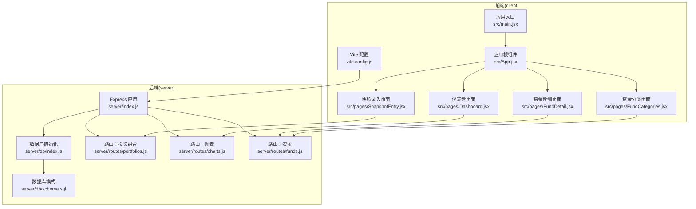

**图示来源**
- [client/vite.config.js:1-12](file://client/vite.config.js#L1-L12)
- [client/src/main.jsx:1-13](file://client/src/main.jsx#L1-L13)
- [client/src/App.jsx:1-28](file://client/src/App.jsx#L1-L28)
- [client/src/pages/Dashboard.jsx:1-96](file://client/src/pages/Dashboard.jsx#L1-L96)
- [client/src/pages/SnapshotEntry.jsx:1-132](file://client/src/pages/SnapshotEntry.jsx#L1-L132)
- [client/src/pages/FundCategories.jsx:1-156](file://client/src/pages/FundCategories.jsx#L1-L156)
- [client/src/pages/FundDetail.jsx:1-46](file://client/src/pages/FundDetail.jsx#L1-L46)
- [server/index.js:1-32](file://server/index.js#L1-L32)
- [server/db/index.js:1-19](file://server/db/index.js#L1-L19)
- [server/db/schema.sql:1-79](file://server/db/schema.sql#L1-L79)
- [server/routes/portfolios.js:1-81](file://server/routes/portfolios.js#L1-L81)
- [server/routes/charts.js:1-74](file://server/routes/charts.js#L1-L74)
- [server/routes/funds.js:1-95](file://server/routes/funds.js#L1-L95)

**章节来源**
- [client/package.json:1-24](file://client/package.json#L1-L24)
- [client/vite.config.js:1-12](file://client/vite.config.js#L1-L12)
- [server/package.json:1-18](file://server/package.json#L1-L18)
- [server/index.js:1-32](file://server/index.js#L1-L32)

## 核心组件
- 前端应用
  - 入口与路由：在入口文件中挂载 Router 并渲染 App；App 定义导航与页面路由
  - 页面职责
    - 仪表盘：拉取历史增长与当前持仓，渲染折线图与饼图
    - 快照录入：按周录入资产数量与价格，提交到后端
    - 资金分类：树形展示与增删改操作
    - 资金明细：展示顶层与子级分类的汇总与明细
- 后端服务
  - 中间件：CORS、JSON、日志；伪造用户身份中间件
  - 路由
    - 投资组合：查询、创建、读取最新快照及历史快照
    - 图表：历史增长、当前持仓
    - 资金：首页汇总、详情树形
  - 数据库：SQLite 文件 + 初始化 SQL；通过 better-sqlite3 连接

**章节来源**
- [client/src/main.jsx:1-13](file://client/src/main.jsx#L1-L13)
- [client/src/App.jsx:1-28](file://client/src/App.jsx#L1-L28)
- [client/src/pages/Dashboard.jsx:1-96](file://client/src/pages/Dashboard.jsx#L1-L96)
- [client/src/pages/SnapshotEntry.jsx:1-132](file://client/src/pages/SnapshotEntry.jsx#L1-L132)
- [client/src/pages/FundCategories.jsx:1-156](file://client/src/pages/FundCategories.jsx#L1-L156)
- [client/src/pages/FundDetail.jsx:1-46](file://client/src/pages/FundDetail.jsx#L1-L46)
- [server/index.js:1-32](file://server/index.js#L1-L32)
- [server/routes/portfolios.js:1-81](file://server/routes/portfolios.js#L1-L81)
- [server/routes/charts.js:1-74](file://server/routes/charts.js#L1-L74)
- [server/routes/funds.js:1-95](file://server/routes/funds.js#L1-L95)
- [server/db/index.js:1-19](file://server/db/index.js#L1-L19)
- [server/db/schema.sql:1-79](file://server/db/schema.sql#L1-L79)

## 架构总览
系统采用前后端分离架构：前端通过浏览器发起 /api 请求，Vite 开发服务器以代理方式将请求转发到后端服务，后端使用 better-sqlite3 访问本地 SQLite 数据库。

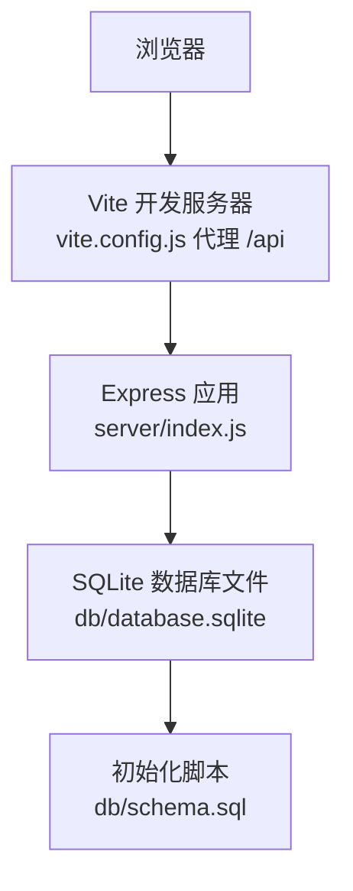

**图示来源**
- [client/vite.config.js:1-12](file://client/vite.config.js#L1-L12)
- [server/index.js:1-32](file://server/index.js#L1-L32)
- [server/db/index.js:1-19](file://server/db/index.js#L1-L19)
- [server/db/schema.sql:1-79](file://server/db/schema.sql#L1-L79)

## 详细组件分析

### 前端组件与页面

#### 仪表盘页面（Dashboard）
- 功能要点
  - 在挂载时并行拉取历史增长与当前持仓数据
  - 渲染历史净值折线图与最新持仓饼图
  - 展示资金总量与各顶级分类汇总
- 关键调用链
  - 历史增长：GET /api/charts/portfolios/{id}/historical-growth
  - 当前持仓：GET /api/charts/portfolios/{id}/current-holdings
  - 资金汇总：GET /api/funds/summary

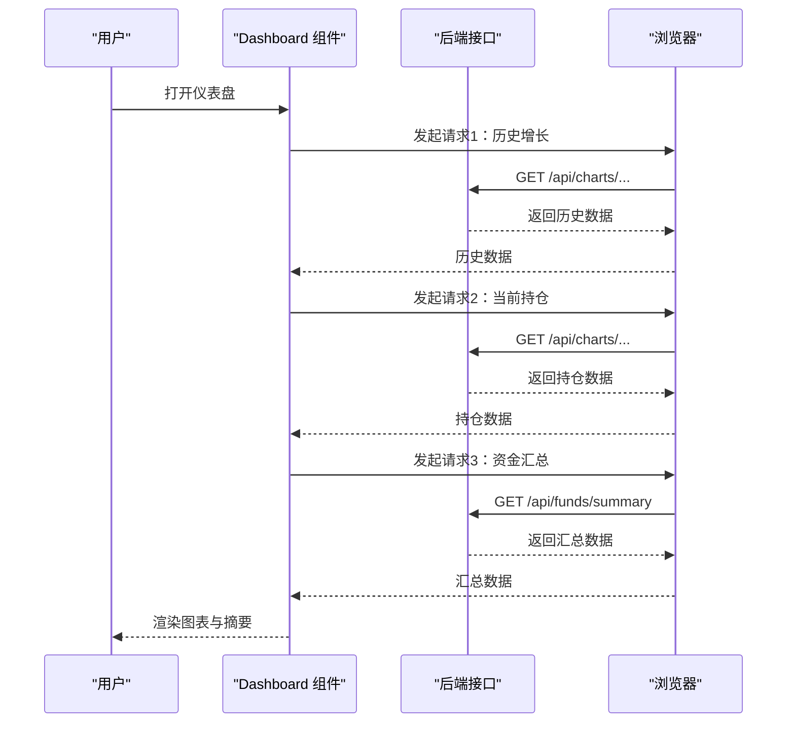

**图示来源**
- [client/src/pages/Dashboard.jsx:14-32](file://client/src/pages/Dashboard.jsx#L14-L32)
- [server/routes/charts.js:10-27](file://server/routes/charts.js#L10-L27)
- [server/routes/funds.js:8-45](file://server/routes/funds.js#L8-L45)

**章节来源**
- [client/src/pages/Dashboard.jsx:1-96](file://client/src/pages/Dashboard.jsx#L1-L96)
- [server/routes/charts.js:1-74](file://server/routes/charts.js#L1-L74)
- [server/routes/funds.js:1-95](file://server/routes/funds.js#L1-L95)

#### 快照录入页面（SnapshotEntry）
- 功能要点
  - 加载上一周快照用于预填
  - 支持添加行、清零某项、提交快照
  - 提交时向 /api/snapshots 发送 POST
- 关键调用链
  - 获取最新快照：GET /api/portfolios/{id}/snapshots/latest
  - 创建快照：POST /api/snapshots

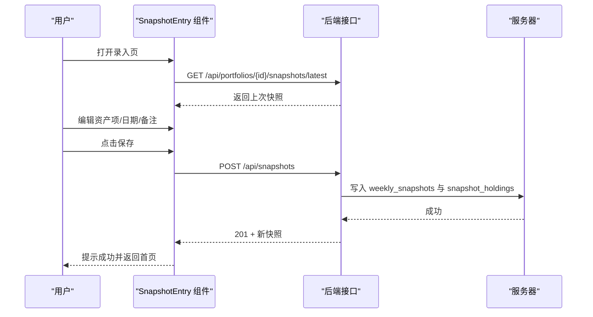

**图示来源**
- [client/src/pages/SnapshotEntry.jsx:11-26](file://client/src/pages/SnapshotEntry.jsx#L11-L26)
- [client/src/pages/SnapshotEntry.jsx:42-66](file://client/src/pages/SnapshotEntry.jsx#L42-L66)
- [server/routes/portfolios.js:32-62](file://server/routes/portfolios.js#L32-L62)
- [server/routes/portfolios.js:17-30](file://server/routes/portfolios.js#L17-L30)

**章节来源**
- [client/src/pages/SnapshotEntry.jsx:1-132](file://client/src/pages/SnapshotEntry.jsx#L1-L132)
- [server/routes/portfolios.js:1-81](file://server/routes/portfolios.js#L1-L81)

#### 资金分类页面（FundCategories）
- 功能要点
  - 加载树形分类：GET /api/fund-categories/tree
  - 支持新增/编辑一级/二级分类
  - 表单提交时根据是否存在 id 判断 PUT 或 POST
- 关键调用链
  - 获取树：GET /api/fund-categories/tree
  - 新增/编辑：POST /api/fund-categories 或 PUT /api/fund-categories/{id}

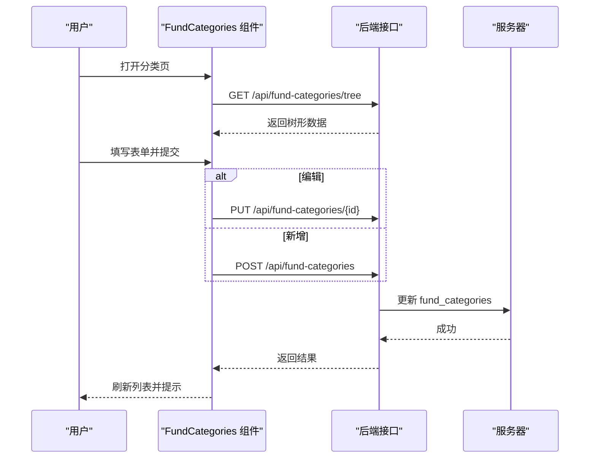

**图示来源**
- [client/src/pages/FundCategories.jsx:16-29](file://client/src/pages/FundCategories.jsx#L16-L29)
- [client/src/pages/FundCategories.jsx:35-65](file://client/src/pages/FundCategories.jsx#L35-L65)

**章节来源**
- [client/src/pages/FundCategories.jsx:1-156](file://client/src/pages/FundCategories.jsx#L1-L156)

#### 资金明细页面（FundDetail）
- 功能要点
  - 加载完整树形明细：GET /api/funds/detail
  - 展示顶层与子级分类的金额
- 关键调用链
  - GET /api/funds/detail

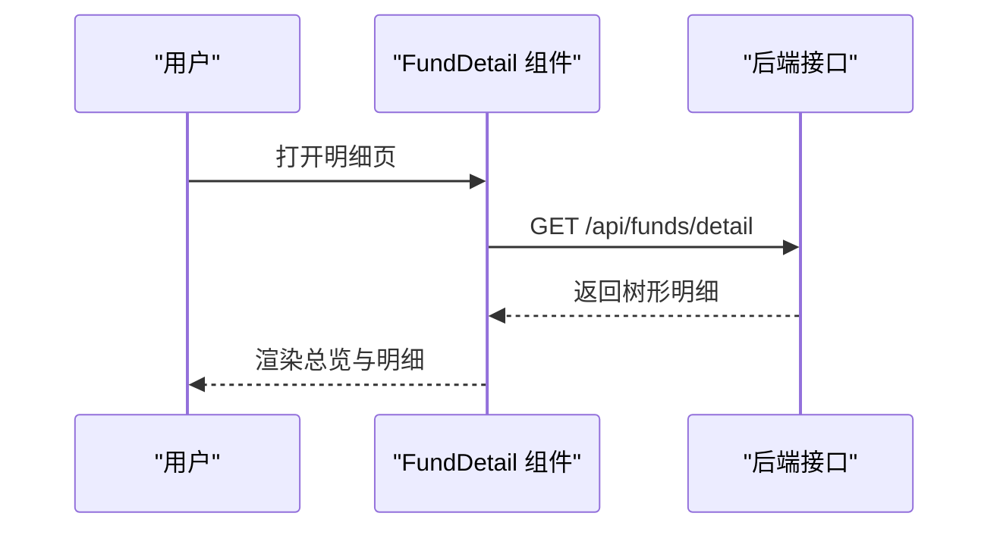

**图示来源**
- [client/src/pages/FundDetail.jsx:6-14](file://client/src/pages/FundDetail.jsx#L6-L14)
- [server/routes/funds.js:47-92](file://server/routes/funds.js#L47-L92)

**章节来源**
- [client/src/pages/FundDetail.jsx:1-46](file://client/src/pages/FundDetail.jsx#L1-L46)
- [server/routes/funds.js:1-95](file://server/routes/funds.js#L1-L95)

### 后端组件与路由

#### Express 应用与中间件
- 中间件
  - CORS、JSON、Morgan 日志
  - 伪造用户身份中间件：注入 req.userId = 1
- 路由注册
  - /api/portfolios、/api/snapshots、/api/charts、/api/fund-categories、/api/funds

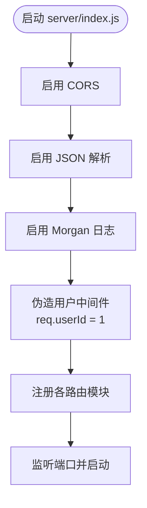

**图示来源**
- [server/index.js:13-32](file://server/index.js#L13-L32)

**章节来源**
- [server/index.js:1-32](file://server/index.js#L1-L32)

#### 数据库初始化与模式
- 初始化
  - 通过 better-sqlite3 打开 db/database.sqlite
  - 读取并执行 db/schema.sql，确保表存在
- 模式要点
  - users、portfolios、weekly_snapshots、snapshot_holdings、fund_categories
  - 外键约束与唯一索引（如顶级分类名称唯一）

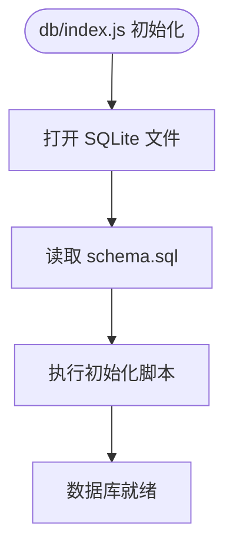

**图示来源**
- [server/db/index.js:12-19](file://server/db/index.js#L12-L19)
- [server/db/schema.sql:1-79](file://server/db/schema.sql#L1-L79)

**章节来源**
- [server/db/index.js:1-19](file://server/db/index.js#L1-L19)
- [server/db/schema.sql:1-79](file://server/db/schema.sql#L1-L79)

#### 投资组合路由（portfolios）
- 接口
  - GET /api/portfolios：按用户查询投资组合
  - POST /api/portfolios：创建新组合
  - GET /api/portfolios/:id/snapshots/latest：获取最新快照及持仓
  - GET /api/portfolios/:id/snapshots：获取历史快照列表

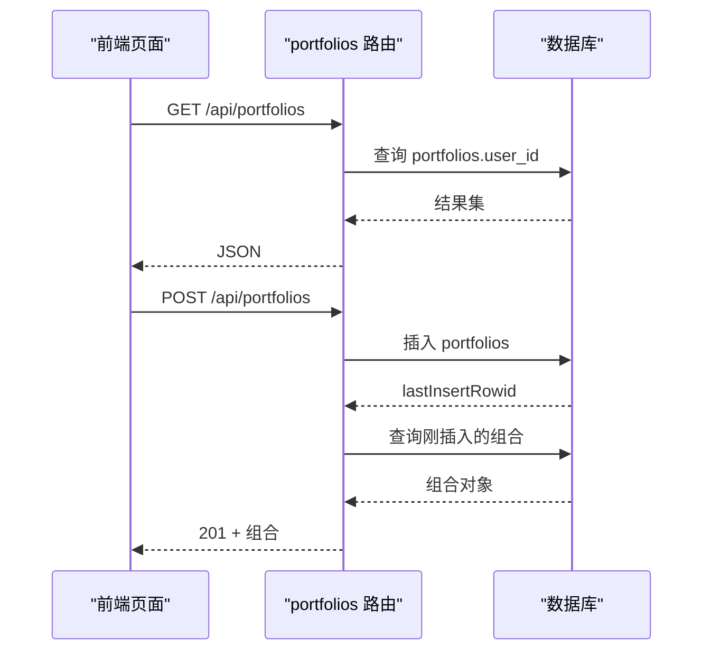

**图示来源**
- [server/routes/portfolios.js:6-30](file://server/routes/portfolios.js#L6-L30)
- [server/routes/portfolios.js:32-79](file://server/routes/portfolios.js#L32-L79)

**章节来源**
- [server/routes/portfolios.js:1-81](file://server/routes/portfolios.js#L1-L81)

#### 图表路由（charts）
- 接口
  - GET /api/charts/portfolios/:portfolioId/historical-growth：历史净值
  - GET /api/charts/portfolios/:portfolioId/current-holdings：最新有效持仓

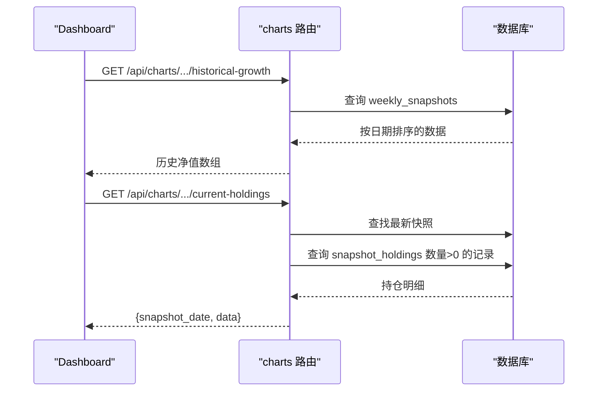

**图示来源**
- [server/routes/charts.js:10-27](file://server/routes/charts.js#L10-L27)
- [server/routes/charts.js:33-72](file://server/routes/charts.js#L33-L72)

**章节来源**
- [server/routes/charts.js:1-74](file://server/routes/charts.js#L1-L74)

#### 资金路由（funds）
- 接口
  - GET /api/funds/summary：首页汇总（顶级分类合计）
  - GET /api/funds/detail：详情树形（含子级）

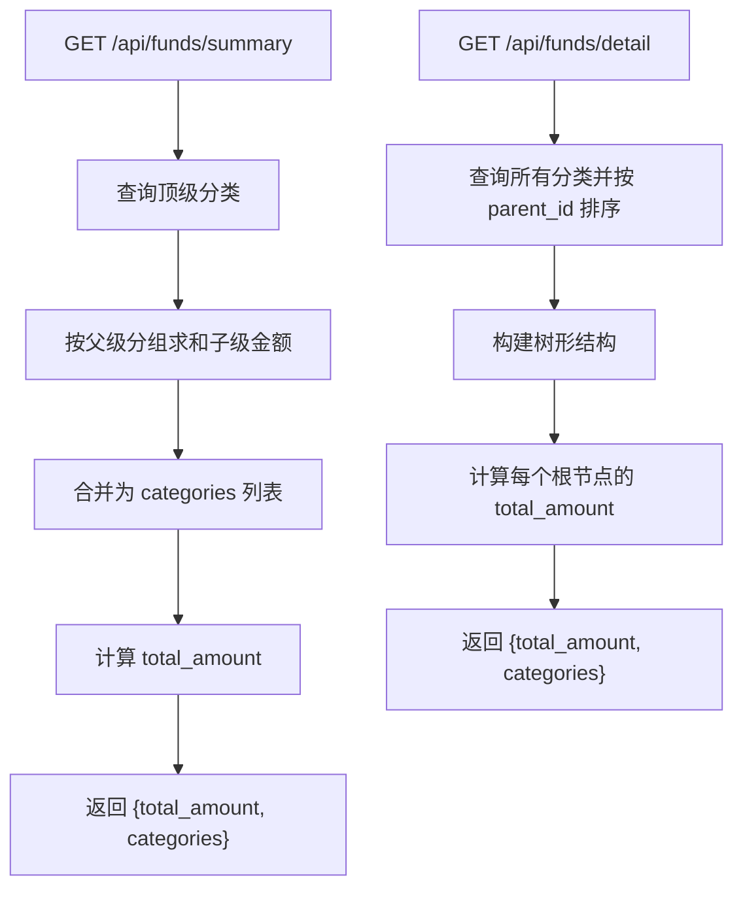

**图示来源**
- [server/routes/funds.js:8-45](file://server/routes/funds.js#L8-L45)
- [server/routes/funds.js:49-92](file://server/routes/funds.js#L49-L92)

**章节来源**
- [server/routes/funds.js:1-95](file://server/routes/funds.js#L1-L95)

## 依赖分析
- 前端依赖
  - React 生态：react、react-dom、react-router-dom
  - 可视化：recharts
  - 构建与开发：vite、@vitejs/plugin-react
- 后端依赖
  - Web 框架：express
  - 跨域与日志：cors、morgan
  - 数据库：better-sqlite3

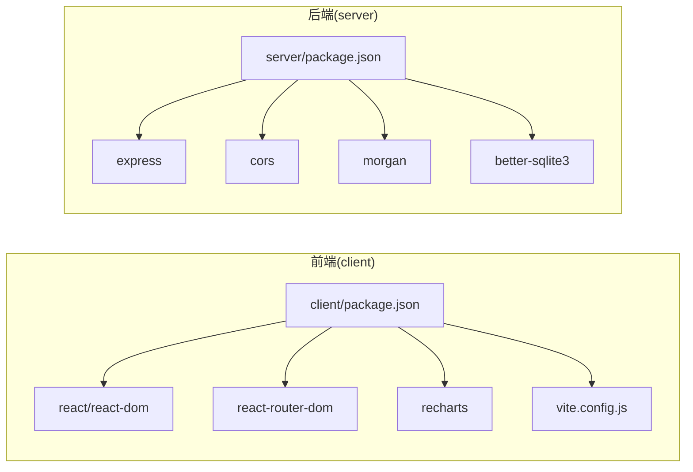

**图示来源**
- [client/package.json:11-22](file://client/package.json#L11-L22)
- [server/package.json:11-16](file://server/package.json#L11-L16)

**章节来源**
- [client/package.json:1-24](file://client/package.json#L1-L24)
- [server/package.json:1-18](file://server/package.json#L1-L18)

## 性能考虑
- 前端
  - 使用响应式图表容器提升移动端体验
  - 在仪表盘中并行发起多个请求，减少等待时间
  - 控制列表渲染规模，避免一次性渲染大量节点
- 后端
  - 使用 better-sqlite3 本地文件数据库，适合小中型数据
  - 为高频查询建立合适索引（如 weekly_snapshots 的 portfolio_id + snapshot_date 唯一索引）
  - 对于复杂聚合查询，可考虑在应用层缓存或分页
- 构建与开发
  - Vite 默认启用按需编译与热更新，保持开发体验流畅
  - 生产构建时关注包体积与懒加载策略（当前页面已按路由拆分）

[本节为通用指导，无需特定文件引用]

## 故障排查指南
- 常见问题
  - 无法访问 /api 接口
    - 检查 Vite 代理是否正确指向后端地址
    - 确认后端服务已启动且端口未被占用
  - 数据库未初始化
    - 确认 db/schema.sql 已被执行
    - 检查 db/database.sqlite 是否生成
  - 用户权限相关错误
    - 当前中间件固定 user_id = 1，若业务需要多用户，请在此处扩展
- 调试技巧
  - 前端：在页面组件中打印 fetch 请求与响应，确认数据结构
  - 后端：开启 Morgan 日志，观察请求路径与状态码；在路由中增加 try/catch 并输出错误堆栈
- 错误处理模式
  - 路由层统一捕获异常并返回 JSON 错误信息
  - 前端对 fetch 结果进行 res.ok 判断，错误时弹窗提示

**章节来源**
- [client/vite.config.js:7-11](file://client/vite.config.js#L7-L11)
- [server/index.js:17-21](file://server/index.js#L17-L21)
- [server/routes/portfolios.js:8-14](file://server/routes/portfolios.js#L8-L14)
- [server/routes/charts.js:10-27](file://server/routes/charts.js#L10-L27)
- [server/routes/funds.js:8-45](file://server/routes/funds.js#L8-L45)

## 结论
本指南提供了从开发环境到部署前质量保证的全流程说明。系统以简洁清晰的方式组织了前后端职责，前端通过 Vite 与后端 Express 协作，数据库采用 SQLite 便于本地开发与部署。建议在后续迭代中完善用户认证、测试覆盖与监控告警体系，以支撑更复杂的业务场景。

[本节为总结性内容，无需特定文件引用]

## 附录

### 开发环境配置
- 前端
  - 使用 npm/yarn/pnpm 安装依赖后运行 dev 脚本
  - 通过 vite.config.js 的代理将 /api 请求转发到后端
- 后端
  - 安装依赖后运行 dev 脚本进入监听模式
  - 数据库文件与初始化脚本自动完成

**章节来源**
- [client/package.json:6-10](file://client/package.json#L6-L10)
- [client/vite.config.js:5-12](file://client/vite.config.js#L5-L12)
- [server/package.json:7-10](file://server/package.json#L7-L10)

### Vite 构建与使用
- 开发：vite dev
- 构建：vite build
- 预览：vite preview
- 代理：/api -> http://localhost:5000

**章节来源**
- [client/package.json:6-10](file://client/package.json#L6-L10)
- [client/vite.config.js:5-12](file://client/vite.config.js#L5-L12)

### React 开发最佳实践
- 组件职责单一，页面组件负责数据拉取与渲染
- 使用受控组件处理表单输入
- 在 useEffect 中发起副作用请求，注意清理与依赖数组
- 对图表等第三方库进行按需引入与懒加载

**章节来源**
- [client/src/pages/Dashboard.jsx:14-32](file://client/src/pages/Dashboard.jsx#L14-L32)
- [client/src/pages/SnapshotEntry.jsx:42-66](file://client/src/pages/SnapshotEntry.jsx#L42-L66)
- [client/src/pages/FundCategories.jsx:35-65](file://client/src/pages/FundCategories.jsx#L35-L65)

### Express 服务器调试方法
- 启动参数：dev 脚本启用 --watch
- 中间件：CORS、JSON、Morgan 日志
- 自定义中间件：伪造用户身份 req.userId

**章节来源**
- [server/package.json:8-10](file://server/package.json#L8-L10)
- [server/index.js:13-21](file://server/index.js#L13-L21)

### Git 工作流程与代码审查
- 分支策略：主分支保护，功能开发在特性分支，变更通过 Pull Request 合并
- 提交规范：语义化提交，简明描述变更内容
- 代码审查：至少一名维护者批准，关注安全性、性能与可维护性

[本节为通用流程建议，无需特定文件引用]

### 测试策略
- 单元测试：针对纯函数与工具方法
- 集成测试：模拟数据库与路由行为
- 端到端测试：使用真实浏览器环境验证关键流程（如快照录入、资金分类）

[本节为通用策略建议，无需特定文件引用]

### 性能监控方法
- 前端：监控首屏时间、交互延迟、图表渲染耗时
- 后端：记录慢查询、错误率与响应时间

[本节为通用方法建议，无需特定文件引用]

### 错误处理模式
- 统一异常捕获与错误响应
- 前端对非 2xx 状态进行提示与回退

**章节来源**
- [server/routes/portfolios.js:8-14](file://server/routes/portfolios.js#L8-L14)
- [server/routes/charts.js:23-26](file://server/routes/charts.js#L23-L26)
- [server/routes/funds.js:42-44](file://server/routes/funds.js#L42-L44)

### 扩展点与自定义选项
- 用户系统：替换伪造中间件为真实鉴权
- 数据源：切换数据库驱动或接入远程数据库
- 图表：替换或扩展可视化方案
- 路由：新增业务模块并注册路由

[本节为概念性扩展建议，无需特定文件引用]

### 部署前检查清单
- 依赖安装与版本锁定
- 数据库初始化脚本执行
- 代理与跨域配置验证
- 端口占用与防火墙放行
- 日志与错误监控可用性

[本节为通用检查清单，无需特定文件引用]