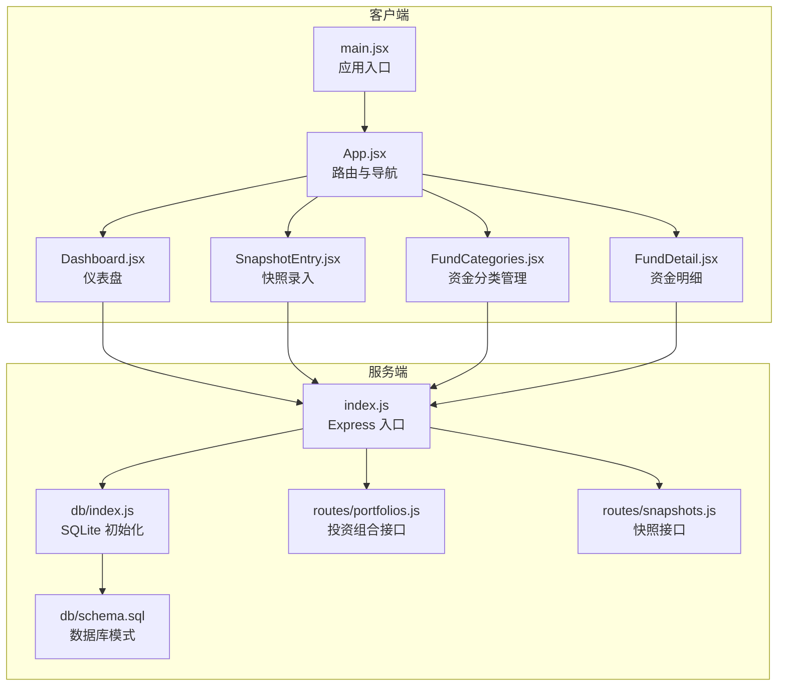
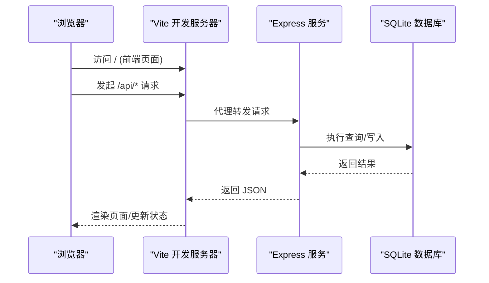
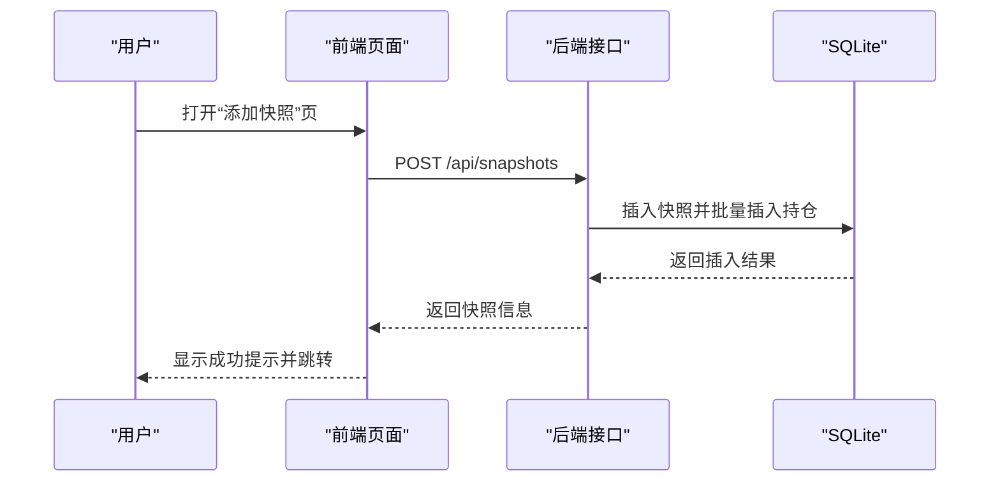
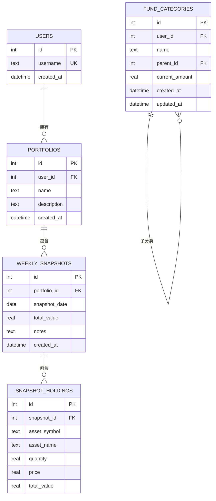
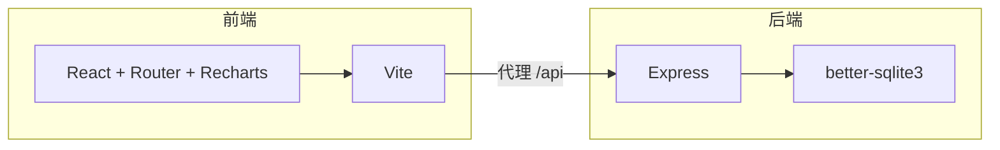

# 快速开始

<cite>
**本文引用的文件**
- [server/package.json](file://server/package.json)
- [client/package.json](file://client/package.json)
- [server/db/schema.sql](file://server/db/schema.sql)
- [server/db/index.js](file://server/db/index.js)
- [server/index.js](file://server/index.js)
- [client/vite.config.js](file://client/vite.config.js)
- [client/src/main.jsx](file://client/src/main.jsx)
- [client/src/App.jsx](file://client/src/App.jsx)
- [client/src/pages/Dashboard.jsx](file://client/src/pages/Dashboard.jsx)
- [client/src/pages/SnapshotEntry.jsx](file://client/src/pages/SnapshotEntry.jsx)
- [client/src/pages/FundCategories.jsx](file://client/src/pages/FundCategories.jsx)
- [client/src/pages/FundDetail.jsx](file://client/src/pages/FundDetail.jsx)
- [server/routes/portfolios.js](file://server/routes/portfolios.js)
- [server/routes/snapshots.js](file://server/routes/snapshots.js)
</cite>

## 目录
1. [简介](#简介)
2. [项目结构](#项目结构)
3. [核心组件](#核心组件)
4. [架构总览](#架构总览)
5. [详细组件分析](#详细组件分析)
6. [依赖分析](#依赖分析)
7. [性能考虑](#性能考虑)
8. [故障排除指南](#故障排除指南)
9. [结论](#结论)
10. [附录](#附录)

## 简介
本指南面向希望快速搭建并运行“个人投资追踪系统”的开发者。系统采用前后端分离架构：前端使用 React + Vite，后端基于 Express + better-sqlite3 的轻量级数据库。通过本指南，你将完成环境准备、依赖安装、数据库初始化与本地开发服务器启动，并能快速体验核心功能。

## 项目结构
- 前端(client)
  - 使用 Vite 构建工具，开发时通过代理将 /api 请求转发至后端服务
  - 页面包括仪表盘、快照录入、资金分类管理、资金明细等
- 后端(server)
  - Express 应用，提供 RESTful 接口
  - better-sqlite3 作为数据存储，数据库文件与模式在启动时自动初始化
- 数据库
  - SQLite 文件位于 server/db/database.sqlite
  - 初始模式与默认顶级分类在 server/db/schema.sql 中定义

**图表来源**
- [client/src/main.jsx:1-13](file://client/src/main.jsx#L1-L13)
- [client/src/App.jsx:1-28](file://client/src/App.jsx#L1-L28)
- [client/src/pages/Dashboard.jsx:1-96](file://client/src/pages/Dashboard.jsx#L1-L96)
- [client/src/pages/SnapshotEntry.jsx:1-132](file://client/src/pages/SnapshotEntry.jsx#L1-L132)
- [client/src/pages/FundCategories.jsx:1-156](file://client/src/pages/FundCategories.jsx#L1-L156)
- [client/src/pages/FundDetail.jsx:1-46](file://client/src/pages/FundDetail.jsx#L1-L46)
- [server/index.js:1-32](file://server/index.js#L1-L32)
- [server/db/index.js:1-19](file://server/db/index.js#L1-L19)
- [server/db/schema.sql:1-79](file://server/db/schema.sql#L1-L79)
- [server/routes/portfolios.js:1-81](file://server/routes/portfolios.js#L1-L81)
- [server/routes/snapshots.js:1-124](file://server/routes/snapshots.js#L1-L124)

**章节来源**
- [client/src/main.jsx:1-13](file://client/src/main.jsx#L1-L13)
- [client/src/App.jsx:1-28](file://client/src/App.jsx#L1-L28)
- [server/index.js:1-32](file://server/index.js#L1-L32)
- [server/db/index.js:1-19](file://server/db/index.js#L1-L19)
- [server/db/schema.sql:1-79](file://server/db/schema.sql#L1-L79)

## 核心组件
- 前端应用入口与路由
  - 应用入口负责挂载 React 并启用路由
  - App 组件定义导航与页面路由
- 前端页面
  - 仪表盘：拉取历史增长曲线与最新持仓饼图数据
  - 快照录入：提交当周投资组合快照与持仓明细
  - 资金分类管理：树形结构的一级/二级分类维护
  - 资金明细：按分类层级展示资金汇总
- 后端服务
  - Express 应用，统一开启 CORS、JSON 解析与日志中间件
  - 硬编码注入用户上下文（固定 user_id）
  - 路由模块化：投资组合、快照、图表、资金分类、资金接口
- 数据库
  - better-sqlite3 自动读取 SQL 模式并创建表
  - 预置默认顶级资金分类

**章节来源**
- [client/src/main.jsx:1-13](file://client/src/main.jsx#L1-L13)
- [client/src/App.jsx:1-28](file://client/src/App.jsx#L1-L28)
- [client/src/pages/Dashboard.jsx:1-96](file://client/src/pages/Dashboard.jsx#L1-L96)
- [client/src/pages/SnapshotEntry.jsx:1-132](file://client/src/pages/SnapshotEntry.jsx#L1-L132)
- [client/src/pages/FundCategories.jsx:1-156](file://client/src/pages/FundCategories.jsx#L1-L156)
- [client/src/pages/FundDetail.jsx:1-46](file://client/src/pages/FundDetail.jsx#L1-L46)
- [server/index.js:1-32](file://server/index.js#L1-L32)
- [server/db/index.js:1-19](file://server/db/index.js#L1-L19)
- [server/db/schema.sql:1-79](file://server/db/schema.sql#L1-L79)

## 架构总览
系统采用前后端分离，前端通过 /api 前缀调用后端接口，开发时由 Vite 代理转发到后端服务。后端使用 better-sqlite3 作为持久化存储，启动时自动执行数据库初始化脚本。

**图表来源**
- [client/vite.config.js:1-12](file://client/vite.config.js#L1-L12)
- [server/index.js:1-32](file://server/index.js#L1-L32)
- [server/db/index.js:1-19](file://server/db/index.js#L1-L19)

## 详细组件分析

### 环境与依赖准备
- 环境要求
  - Node.js：建议使用长期支持版本（LTS），确保兼容性
  - 包管理器：npm（与 package.json 配置一致）
- 依赖安装
  - 进入 server 目录安装后端依赖
  - 进入 client 目录安装前端依赖
- 数据库初始化
  - 后端启动时会自动读取数据库模式并创建表
  - 默认生成 SQLite 文件位于 server/db/database.sqlite

预期输出（示例）
- 安装完成后，可在 server 与 client 目录看到 node_modules
- 启动后端服务时，控制台打印“Server running on http://localhost:5000”
- 启动前端开发服务器时，Vite 在本地端口提供页面

**章节来源**
- [server/package.json:1-18](file://server/package.json#L1-L18)
- [client/package.json:1-24](file://client/package.json#L1-L24)
- [server/db/index.js:1-19](file://server/db/index.js#L1-L19)
- [server/db/schema.sql:1-79](file://server/db/schema.sql#L1-L79)
- [server/index.js:1-32](file://server/index.js#L1-L32)

### 本地开发服务器启动
- 启动后端服务
  - 进入 server 目录，执行开发脚本
  - 预期输出：服务监听在本地端口（默认 5000）
- 启动前端开发服务器
  - 进入 client 目录，执行开发脚本
  - 预期输出：Vite 在本地端口提供页面（默认 5173），并配置 /api 代理到后端
- 访问应用
  - 浏览器访问前端地址，即可看到仪表盘与导航菜单

命令示例
- 后端启动：在 server 目录执行开发脚本
- 前端启动：在 client 目录执行开发脚本
- 预览构建：在 client 目录执行预览脚本

**章节来源**
- [server/package.json:7-10](file://server/package.json#L7-L10)
- [client/package.json:6-10](file://client/package.json#L6-L10)
- [client/vite.config.js:7-11](file://client/vite.config.js#L7-L11)
- [server/index.js:30-32](file://server/index.js#L30-L32)

### 首次使用示例
- 新增投资组合
  - 在仪表盘或相关页面提交新建请求，携带名称与描述
  - 成功后返回新投资组合信息
- 录入当周快照
  - 在“添加快照”页面填写日期、备注与持仓明细
  - 提交后弹出保存成功提示并跳转回首页
- 查看历史与图表
  - 仪表盘会自动拉取历史增长与最新持仓饼图数据
- 资金分类管理
  - 支持新增/编辑一级/二级分类，并查看树形结构
- 资金明细
  - 展示按分类层级的资金汇总

交互流程（序列图）

**图表来源**
- [client/src/pages/SnapshotEntry.jsx:42-66](file://client/src/pages/SnapshotEntry.jsx#L42-L66)
- [server/routes/snapshots.js:33-72](file://server/routes/snapshots.js#L33-L72)

**章节来源**
- [client/src/pages/SnapshotEntry.jsx:1-132](file://client/src/pages/SnapshotEntry.jsx#L1-L132)
- [server/routes/snapshots.js:1-124](file://server/routes/snapshots.js#L1-L124)

### 数据模型与初始化
- 数据库模式
  - 启用外键约束
  - 用户表、投资组合表、周快照表、快照持仓明细表、资金分类表
  - 预置默认顶级资金分类
- 初始化流程
  - 后端启动时读取 SQL 文件并执行
  - 自动生成 SQLite 文件与表结构

**图表来源**
- [server/db/schema.sql:1-79](file://server/db/schema.sql#L1-L79)

**章节来源**
- [server/db/schema.sql:1-79](file://server/db/schema.sql#L1-L79)
- [server/db/index.js:1-19](file://server/db/index.js#L1-L19)

## 依赖分析
- 前端依赖
  - React 生态与路由、可视化图表库
  - Vite 构建工具与 React 插件
- 后端依赖
  - Express Web 框架、CORS、日志中间件、better-sqlite3
- 代理关系
  - 前端开发服务器通过代理将 /api 请求转发到后端

**图表来源**
- [client/package.json:11-22](file://client/package.json#L11-L22)
- [server/package.json:11-16](file://server/package.json#L11-L16)
- [client/vite.config.js:8-10](file://client/vite.config.js#L8-L10)
- [server/index.js:1-32](file://server/index.js#L1-L32)

**章节来源**
- [client/package.json:1-24](file://client/package.json#L1-L24)
- [server/package.json:1-18](file://server/package.json#L1-L18)
- [client/vite.config.js:1-12](file://client/vite.config.js#L1-L12)
- [server/index.js:1-32](file://server/index.js#L1-L32)

## 性能考虑
- 数据库事务
  - 快照创建与更新使用事务保证一致性，减少多次往返
- 查询优化
  - 关键查询使用索引（如资金分类唯一索引）
- 前端渲染
  - 图表组件按需渲染，避免不必要的重绘
- 开发与生产差异
  - 开发环境使用 Vite 热更新与代理
  - 生产环境可将前端构建产物部署至静态服务器，后端提供纯 API

[本节为通用指导，无需特定文件引用]

## 故障排除指南
- 启动后端报错：找不到模块
  - 确认已安装 server 目录下的依赖
  - 确认 Node.js 版本满足要求
- 启动前端报错：端口占用
  - 修改 Vite 服务器端口或释放占用端口
- 无法访问 /api 接口
  - 检查 Vite 代理配置是否指向正确的后端地址
  - 确认后端服务已启动且未报错
- 数据库初始化失败
  - 检查 server/db/schema.sql 是否存在语法错误
  - 确认运行目录正确，数据库文件可写
- 快照重复提交
  - 后端对重复快照日期返回冲突错误，需修改日期或删除旧快照

**章节来源**
- [server/package.json:1-18](file://server/package.json#L1-L18)
- [client/package.json:1-24](file://client/package.json#L1-L24)
- [client/vite.config.js:1-12](file://client/vite.config.js#L1-L12)
- [server/routes/snapshots.js:66-71](file://server/routes/snapshots.js#L66-L71)

## 结论
通过本指南，你可以完成从环境准备到本地运行的全流程。系统以 SQLite 为基础，结合 React/Vite 与 Express，提供了清晰的前后端分层与模块化路由。建议在开发阶段充分利用代理与热更新，在生产阶段将前端构建产物与后端 API 分离部署，以获得更稳定的运行环境。

[本节为总结性内容，无需特定文件引用]

## 附录

### 开发与生产配置要点
- 开发环境
  - 前端：Vite 开发服务器 + 代理 /api → 后端
  - 后端：监听本地端口，便于调试
- 生产环境
  - 前端：构建产物部署至静态服务器，后端提供纯 API
  - 后端：使用稳定进程管理器（如 PM2）守护进程

[本节为通用指导，无需特定文件引用]