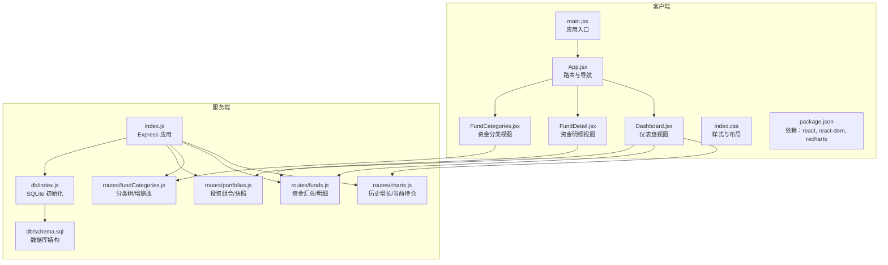
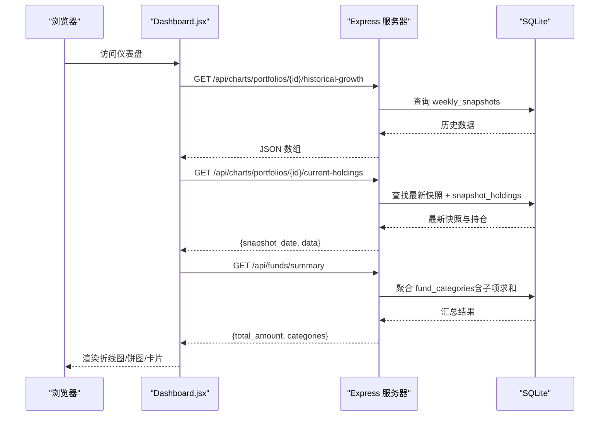
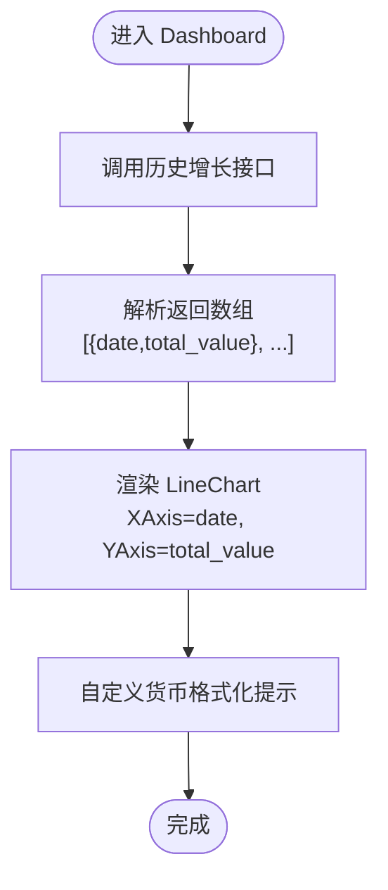
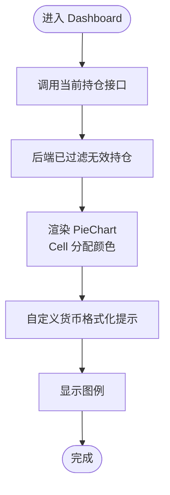
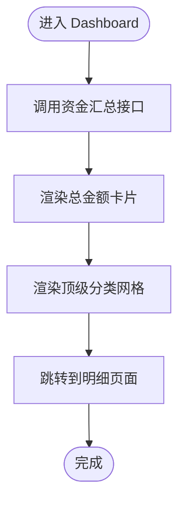
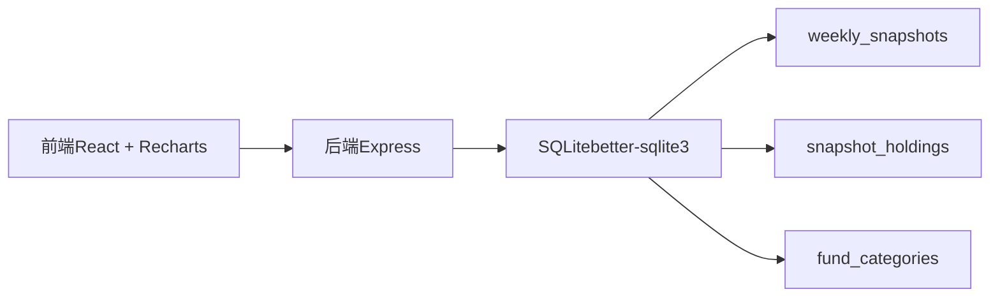

# 数据可视化

<cite>
**本文引用的文件**
- [client/src/pages/Dashboard.jsx](file://client/src/pages/Dashboard.jsx)
- [client/src/pages/FundDetail.jsx](file://client/src/pages/FundDetail.jsx)
- [client/src/pages/FundCategories.jsx](file://client/src/pages/FundCategories.jsx)
- [client/src/App.jsx](file://client/src/App.jsx)
- [client/src/main.jsx](file://client/src/main.jsx)
- [client/src/index.css](file://client/src/index.css)
- [client/package.json](file://client/package.json)
- [server/index.js](file://server/index.js)
- [server/db/index.js](file://server/db/index.js)
- [server/db/schema.sql](file://server/db/schema.sql)
- [server/routes/charts.js](file://server/routes/charts.js)
- [server/routes/funds.js](file://server/routes/funds.js)
- [server/routes/fundCategories.js](file://server/routes/fundCategories.js)
- [server/routes/portfolios.js](file://server/routes/portfolios.js)
</cite>

## 目录
1. [简介](#简介)
2. [项目结构](#项目结构)
3. [核心组件](#核心组件)
4. [架构总览](#架构总览)
5. [详细组件分析](#详细组件分析)
6. [依赖分析](#依赖分析)
7. [性能考虑](#性能考虑)
8. [故障排查指南](#故障排查指南)
9. [结论](#结论)
10. [附录](#附录)

## 简介
本文件面向个人投资追踪系统中的数据可视化功能，聚焦于 Recharts 图表库在前端的集成与配置，涵盖以下方面：
- 历史增长折线图：展示投资组合总资产随时间变化的趋势
- 当前持仓饼图：展示最新快照下各资产的占比
- 资金汇总卡片：首页顶部的资金总量与顶级分类汇总
- 数据格式化与图表配置：数据键位映射、单位与货币格式化、交互提示与图例
- 响应式设计与样式定制：容器尺寸适配与主题风格
- 交互与状态管理：组件状态、数据更新与页面导航
- 性能优化策略：请求并发、数据缓存与渲染优化
- 可复用模式与扩展指南：组件封装、自定义图表类型与最佳实践
- 与后端 API 的数据交互与更新机制：接口契约、错误处理与开发时的认证中间件

## 项目结构
前端采用 React + Vite 构建，使用 Recharts 实现图表；后端基于 Express + better-sqlite3 提供 REST API。

**图表来源**
- [client/src/main.jsx:1-13](file://client/src/main.jsx#L1-L13)
- [client/src/App.jsx:1-28](file://client/src/App.jsx#L1-L28)
- [client/src/pages/Dashboard.jsx:1-96](file://client/src/pages/Dashboard.jsx#L1-L96)
- [client/src/pages/FundDetail.jsx:1-46](file://client/src/pages/FundDetail.jsx#L1-L46)
- [client/src/pages/FundCategories.jsx:1-156](file://client/src/pages/FundCategories.jsx#L1-L156)
- [client/src/index.css:1-196](file://client/src/index.css#L1-L196)
- [client/package.json:1-24](file://client/package.json#L1-L24)
- [server/index.js:1-32](file://server/index.js#L1-L32)
- [server/db/index.js:1-19](file://server/db/index.js#L1-L19)
- [server/db/schema.sql:1-79](file://server/db/schema.sql#L1-L79)
- [server/routes/charts.js:1-74](file://server/routes/charts.js#L1-L74)
- [server/routes/funds.js:1-95](file://server/routes/funds.js#L1-L95)
- [server/routes/fundCategories.js:1-139](file://server/routes/fundCategories.js#L1-L139)
- [server/routes/portfolios.js:1-81](file://server/routes/portfolios.js#L1-L81)

**章节来源**
- [client/src/main.jsx:1-13](file://client/src/main.jsx#L1-L13)
- [client/src/App.jsx:1-28](file://client/src/App.jsx#L1-L28)
- [client/src/pages/Dashboard.jsx:1-96](file://client/src/pages/Dashboard.jsx#L1-L96)
- [client/src/pages/FundDetail.jsx:1-46](file://client/src/pages/FundDetail.jsx#L1-L46)
- [client/src/pages/FundCategories.jsx:1-156](file://client/src/pages/FundCategories.jsx#L1-L156)
- [client/src/index.css:1-196](file://client/src/index.css#L1-L196)
- [client/package.json:1-24](file://client/package.json#L1-L24)
- [server/index.js:1-32](file://server/index.js#L1-L32)
- [server/db/index.js:1-19](file://server/db/index.js#L1-L19)
- [server/db/schema.sql:1-79](file://server/db/schema.sql#L1-L79)
- [server/routes/charts.js:1-74](file://server/routes/charts.js#L1-L74)
- [server/routes/funds.js:1-95](file://server/routes/funds.js#L1-L95)
- [server/routes/fundCategories.js:1-139](file://server/routes/fundCategories.js#L1-L139)
- [server/routes/portfolios.js:1-81](file://server/routes/portfolios.js#L1-L81)

## 核心组件
- 仪表盘视图（Dashboard）
  - 负责拉取历史增长、当前持仓与资金汇总三类数据，并以 Recharts 绘制折线图与饼图
  - 使用响应式容器保证图表在不同屏幕尺寸下的可读性
  - 通过 Link 导航至明细页面
- 资金明细视图（FundDetail）
  - 展示资金分类树形结构的明细与合计
- 资金分类视图（FundCategories）
  - 支持两级分类的增删改查与树形展示
- 样式与布局（index.css）
  - 定义图表容器、卡片网格、分组与按钮等通用样式
- 应用入口与路由（main.jsx、App.jsx）
  - 配置路由与导航，承载各页面组件

**章节来源**
- [client/src/pages/Dashboard.jsx:1-96](file://client/src/pages/Dashboard.jsx#L1-L96)
- [client/src/pages/FundDetail.jsx:1-46](file://client/src/pages/FundDetail.jsx#L1-L46)
- [client/src/pages/FundCategories.jsx:1-156](file://client/src/pages/FundCategories.jsx#L1-L156)
- [client/src/index.css:1-196](file://client/src/index.css#L1-L196)
- [client/src/main.jsx:1-13](file://client/src/main.jsx#L1-L13)
- [client/src/App.jsx:1-28](file://client/src/App.jsx#L1-L28)

## 架构总览
前后端通过 REST API 通信，前端负责数据请求与图表渲染，后端负责数据持久化与查询聚合。

**图表来源**
- [client/src/pages/Dashboard.jsx:14-32](file://client/src/pages/Dashboard.jsx#L14-L32)
- [server/routes/charts.js:10-27](file://server/routes/charts.js#L10-L27)
- [server/routes/charts.js:33-72](file://server/routes/charts.js#L33-L72)
- [server/routes/funds.js:6-45](file://server/routes/funds.js#L6-L45)

## 详细组件分析

### 历史增长折线图（Dashboard）
- 数据来源
  - 接口：GET /api/charts/portfolios/{id}/historical-growth
  - 返回字段：日期与总资产值，用于折线图的 X/Y 轴映射
- 图表配置
  - 响应式容器：ResponsiveContainer 占满宽度并固定高度
  - 坐标轴：XAxis 使用日期键，YAxis 默认数值
  - 提示：LineTooltip 自定义格式化为货币字符串
  - 线条：Monotone 折线，设置颜色与描边宽度
- 数据格式化
  - 日期字段：date
  - 金额字段：total_value
  - 前端格式化：货币千分位显示
- 交互与样式
  - 网格线：虚线背景网格增强可读性
  - 图例：通过 name 字段显示系列名称
- 复用建议
  - 将折线图封装为独立组件，传入 dataKey、formatter、colors 等属性
  - 在父组件中仅负责数据获取与状态管理

**图表来源**
- [client/src/pages/Dashboard.jsx:59-67](file://client/src/pages/Dashboard.jsx#L59-L67)
- [client/src/pages/Dashboard.jsx:64](file://client/src/pages/Dashboard.jsx#L64)
- [server/routes/charts.js:10-27](file://server/routes/charts.js#L10-L27)

**章节来源**
- [client/src/pages/Dashboard.jsx:56-68](file://client/src/pages/Dashboard.jsx#L56-L68)
- [server/routes/charts.js:10-27](file://server/routes/charts.js#L10-L27)

### 当前持仓饼图（Dashboard）
- 数据来源
  - 接口：GET /api/charts/portfolios/{id}/current-holdings
  - 返回结构：包含 snapshot_date 与 data 数组
  - data 数组元素：资产符号、名称、数量、单价、总值
- 图表配置
  - 响应式容器：同上
  - 饼图：Pie 组件绑定 data 与 dataKey、nameKey
  - 颜色：通过 Cell 逐个分配颜色数组
  - 提示：PieTooltip 自定义货币格式化
  - 图例：Legend 显示系列名称
- 数据过滤
  - 后端已过滤 quantity > 0 且 total_value > 0 的持仓
- 交互与样式
  - 饼半径：outerRadius 控制大小
  - 中心点：cx/cy 居中
  - 标签：开启饼图标签显示
- 复用建议
  - 将饼图封装为通用组件，支持自定义 dataKey、nameKey、colors 与 tooltipFormatter

**图表来源**
- [client/src/pages/Dashboard.jsx:70-92](file://client/src/pages/Dashboard.jsx#L70-L92)
- [client/src/pages/Dashboard.jsx:84-86](file://client/src/pages/Dashboard.jsx#L84-L86)
- [client/src/pages/Dashboard.jsx:88-89](file://client/src/pages/Dashboard.jsx#L88-L89)
- [server/routes/charts.js:33-72](file://server/routes/charts.js#L33-L72)

**章节来源**
- [client/src/pages/Dashboard.jsx:70-92](file://client/src/pages/Dashboard.jsx#L70-L92)
- [server/routes/charts.js:33-72](file://server/routes/charts.js#L33-L72)

### 资金汇总卡片（Dashboard）
- 数据来源
  - 接口：GET /api/funds/summary
  - 返回结构：total_amount 与 categories 数组
  - categories 为顶级分类汇总（含子项求和）
- 呈现方式
  - 顶部卡片：展示 total_amount 与“查看明细”链接
  - 顶部分类网格：grid 布局展示每个顶级分类的名称与金额
- 数据格式化
  - 金额：前端进行千分位与货币格式化
- 复用建议
  - 将卡片与网格封装为独立组件，支持传入 categories 与 total_amount

**图表来源**
- [client/src/pages/Dashboard.jsx:36-54](file://client/src/pages/Dashboard.jsx#L36-L54)
- [client/src/pages/Dashboard.jsx:47-52](file://client/src/pages/Dashboard.jsx#L47-L52)
- [server/routes/funds.js:6-45](file://server/routes/funds.js#L6-L45)

**章节来源**
- [client/src/pages/Dashboard.jsx:36-54](file://client/src/pages/Dashboard.jsx#L36-L54)
- [server/routes/funds.js:6-45](file://server/routes/funds.js#L6-L45)

### 资金明细视图（FundDetail）
- 功能概述
  - 展示资金分类树形结构的明细与合计
  - 支持顶级与二级分类的层级展示
- 数据来源
  - 接口：GET /api/funds/detail
  - 返回结构：根节点集合，每个根节点包含 children 列表
- 呈现方式
  - 顶部总金额卡片
  - 分类区块：每块包含根节点信息与子项列表
- 复用建议
  - 将分类区块封装为可复用组件，支持传入节点与层级偏移

**章节来源**
- [client/src/pages/FundDetail.jsx:1-46](file://client/src/pages/FundDetail.jsx#L1-L46)
- [server/routes/funds.js:47-92](file://server/routes/funds.js#L47-L92)

### 资金分类视图（FundCategories）
- 功能概述
  - 支持新增与修改一级/二级分类
  - 展示分类树形列表，支持编辑操作
- 数据来源
  - 接口：GET /api/fund-categories/tree
  - 新增/修改：POST /api/fund-categories 与 PUT /api/fund-categories/:id
- 呈现方式
  - 表单：名称、父分类选择、当前金额
  - 列表：树形区块，支持编辑按钮
- 复用建议
  - 将表单与树形区块封装为独立组件，统一处理校验与提交

**章节来源**
- [client/src/pages/FundCategories.jsx:1-156](file://client/src/pages/FundCategories.jsx#L1-L156)
- [server/routes/fundCategories.js:29-43](file://server/routes/fundCategories.js#L29-L43)
- [server/routes/fundCategories.js:45-81](file://server/routes/fundCategories.js#L45-L81)
- [server/routes/fundCategories.js:83-136](file://server/routes/fundCategories.js#L83-L136)

## 依赖分析
- 前端依赖
  - react、react-dom：UI 框架
  - react-router-dom：路由导航
  - recharts：图表库
- 后端依赖
  - express：Web 框架
  - better-sqlite3：SQLite 驱动
  - cors、morgan：跨域与日志
- 数据库结构
  - weekly_snapshots：每周快照与总资产
  - snapshot_holdings：快照下的资产明细
  - fund_categories：资金分类树（支持二级）

**图表来源**
- [client/package.json:11-15](file://client/package.json#L11-L15)
- [server/package.json:11-15](file://server/package.json#L11-L15)
- [server/db/schema.sql:23-45](file://server/db/schema.sql#L23-L45)
- [server/db/schema.sql:47-58](file://server/db/schema.sql#L47-L58)

**章节来源**
- [client/package.json:1-24](file://client/package.json#L1-L24)
- [server/package.json:1-18](file://server/package.json#L1-L18)
- [server/db/schema.sql:1-79](file://server/db/schema.sql#L1-L79)

## 性能考虑
- 请求并发与去重
  - 当前在一次挂载中并行发起三项请求，建议在多页面或复杂场景中增加请求去重与缓存
- 渲染优化
  - 使用 React.memo 或 useMemo 缓存计算结果（如分类树构建）
  - 对大数据量图表使用虚拟化或采样策略
- 响应式与尺寸
  - 使用 ResponsiveContainer 与固定高度，避免频繁重排
- 样式与主题
  - 统一颜色变量与字体，减少重复样式声明
- 错误与降级
  - 对网络异常与数据为空的情况提供占位与提示

## 故障排查指南
- 常见问题
  - 图表不显示：检查数据键名是否匹配（date、total_value、asset_symbol 等）
  - 金额格式异常：确认前端格式化逻辑与后端数值类型一致
  - 接口 404/500：核对路由路径与 userId 中间件是否生效
- 调试步骤
  - 打开浏览器开发者工具 Network 面板，观察请求与响应
  - 在 Dashboard 中打印 fetched 数据结构，确认字段存在
  - 检查后端日志输出与数据库查询结果
- 错误处理
  - 前端：在 fetch 回调中添加错误日志
  - 后端：捕获异常并返回标准错误对象

**章节来源**
- [client/src/pages/Dashboard.jsx:14-32](file://client/src/pages/Dashboard.jsx#L14-L32)
- [server/index.js:17-21](file://server/index.js#L17-L21)

## 结论
本系统通过 Recharts 在前端实现了历史增长趋势与当前持仓分布的可视化，结合后端提供的聚合接口，完成了从数据采集、存储到可视化的完整闭环。通过模块化组件与统一的样式体系，具备良好的可维护性与扩展性。后续可在组件复用、数据缓存、实时更新与自定义图表类型等方面进一步优化。

## 附录

### 数据模型与接口契约
- 历史增长接口
  - 方法与路径：GET /api/charts/portfolios/{id}/historical-growth
  - 返回：数组，元素包含 date、total_value
- 当前持仓接口
  - 方法与路径：GET /api/charts/portfolios/{id}/current-holdings
  - 返回：对象，包含 snapshot_date 与 data 数组；data 元素包含 asset_symbol、asset_name、quantity、price、total_value
- 资金汇总接口
  - 方法与路径：GET /api/funds/summary
  - 返回：对象，包含 total_amount 与 categories 数组
- 资金明细接口
  - 方法与路径：GET /api/funds/detail
  - 返回：对象，包含 total_amount 与 categories 根节点树
- 分类树接口
  - 方法与路径：GET /api/fund-categories/tree
  - 返回：根节点树形结构数组
- 新增/修改分类接口
  - POST /api/fund-categories
  - PUT /api/fund-categories/:id

**章节来源**
- [server/routes/charts.js:6-27](file://server/routes/charts.js#L6-L27)
- [server/routes/charts.js:29-72](file://server/routes/charts.js#L29-L72)
- [server/routes/funds.js:6-45](file://server/routes/funds.js#L6-L45)
- [server/routes/funds.js:47-92](file://server/routes/funds.js#L47-L92)
- [server/routes/fundCategories.js:29-43](file://server/routes/fundCategories.js#L29-L43)
- [server/routes/fundCategories.js:45-81](file://server/routes/fundCategories.js#L45-L81)
- [server/routes/fundCategories.js:83-136](file://server/routes/fundCategories.js#L83-L136)

### 响应式与样式定制要点
- 响应式容器
  - 使用 ResponsiveContainer 包裹图表，设置 width="100%" 与固定高度
- 主题与配色
  - 通过 Cell 逐个填充颜色数组，保持一致性
  - Tooltip 与 Legend 的样式与位置可根据需要调整
- 卡片与网格
  - 顶部卡片与分类网格使用 CSS Grid 实现自适应布局

**章节来源**
- [client/src/pages/Dashboard.jsx:59-67](file://client/src/pages/Dashboard.jsx#L59-L67)
- [client/src/pages/Dashboard.jsx:72-92](file://client/src/pages/Dashboard.jsx#L72-L92)
- [client/src/pages/Dashboard.jsx:46-53](file://client/src/pages/Dashboard.jsx#L46-L53)
- [client/src/index.css:128-150](file://client/src/index.css#L128-L150)

### 与后端 API 的数据交互与实时更新机制
- 数据交互模式
  - 前端在 Dashboard 挂载时并行请求三类数据，分别用于历史增长、当前持仓与资金汇总
  - 资金明细与分类管理通过独立页面与对应接口实现
- 认证与用户上下文
  - 后端通过中间件注入 req.userId（开发时固定为 1），所有分类与汇总查询均基于该用户 ID
- 实时更新机制
  - 当前实现为静态数据请求；若需实时更新，可引入 WebSocket 或轮询策略，并在前端组件中订阅状态变更

**章节来源**
- [client/src/pages/Dashboard.jsx:14-32](file://client/src/pages/Dashboard.jsx#L14-L32)
- [server/index.js:17-21](file://server/index.js#L17-L21)
- [server/routes/funds.js:6-45](file://server/routes/funds.js#L6-L45)
- [server/routes/charts.js:10-27](file://server/routes/charts.js#L10-L27)
- [server/routes/charts.js:33-72](file://server/routes/charts.js#L33-L72)