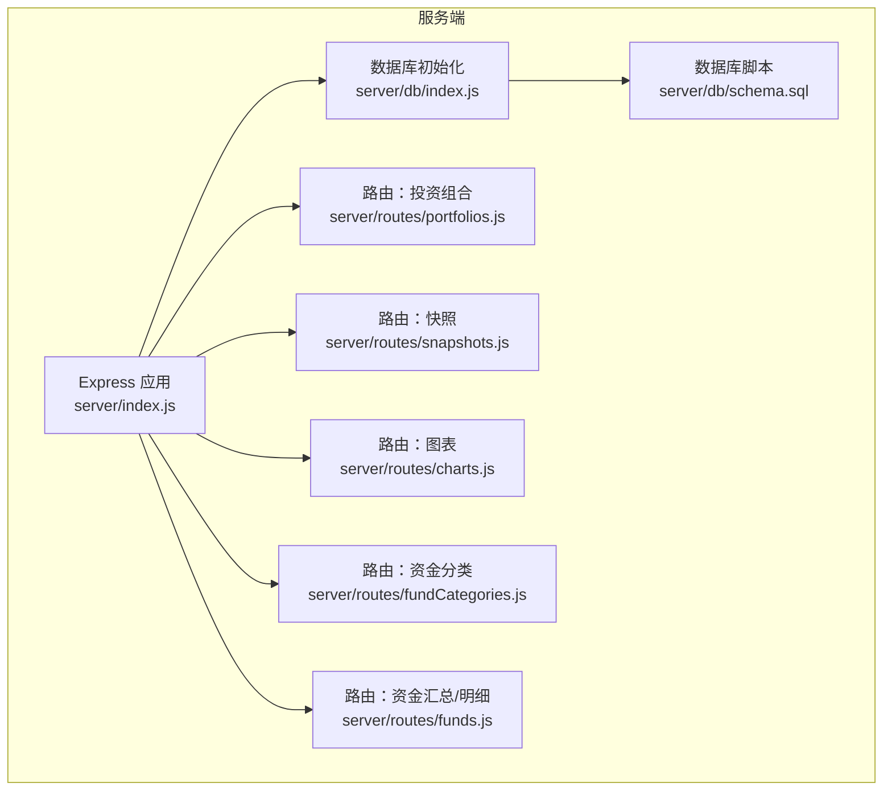
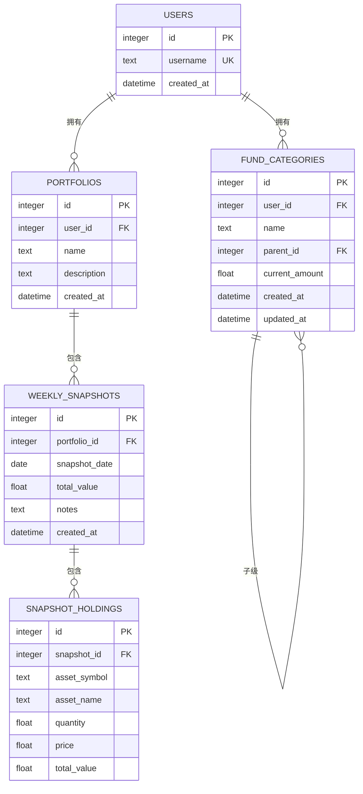
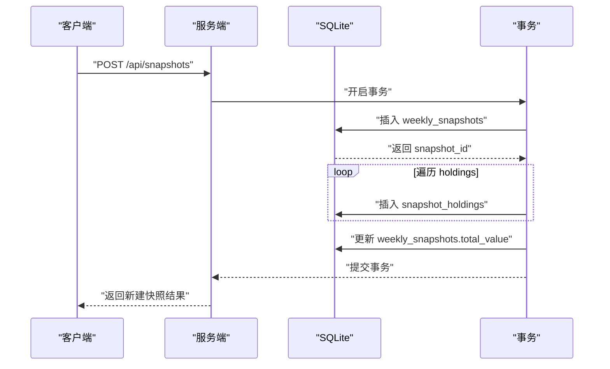
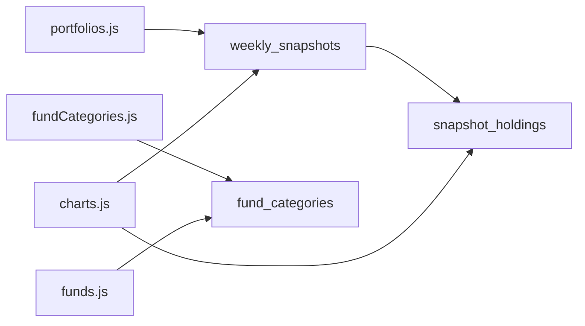

# 数据库设计

<cite>
**本文引用的文件**
- [schema.sql](file://server/db/schema.sql)
- [index.js](file://server/db/index.js)
- [portfolios.js](file://server/routes/portfolios.js)
- [snapshots.js](file://server/routes/snapshots.js)
- [charts.js](file://server/routes/charts.js)
- [fundCategories.js](file://server/routes/fundCategories.js)
- [funds.js](file://server/routes/funds.js)
- [index.js](file://server/index.js)
</cite>

## 目录
1. [简介](#简介)
2. [项目结构](#项目结构)
3. [核心组件](#核心组件)
4. [架构总览](#架构总览)
5. [详细组件分析](#详细组件分析)
6. [依赖分析](#依赖分析)
7. [性能考虑](#性能考虑)
8. [故障排查指南](#故障排查指南)
9. [结论](#结论)
10. [附录](#附录)

## 简介
本技术文档围绕个人投资追踪系统的核心数据库设计展开，重点分析以下五个表：
- Users 用户表
- Portfolios 投资组合表
- Weekly_Snapshots 每周快照表
- Snapshot_Holdings 快照持有表
- Fund_Categories 资金分类表

文档将从表结构、字段定义、数据类型、约束与索引策略入手，解释表间外键关系与引用完整性；随后给出数据模型的 ER 图与关系图；并结合后端路由对数据访问模式进行说明，提出查询优化策略与性能考量，最后总结数据迁移与版本管理的最佳实践。

## 项目结构
后端采用 Node.js + Express + better-sqlite3 的轻量架构，数据库初始化在启动时执行 SQL 脚本以确保表存在。路由层负责业务逻辑与数据访问，通过 SQLite 提供事务与外键约束保障数据一致性。

**图表来源**
- [index.js:1-32](file://server/index.js#L1-L32)
- [index.js:1-19](file://server/db/index.js#L1-L19)
- [schema.sql:1-79](file://server/db/schema.sql#L1-L79)

**章节来源**
- [index.js:1-32](file://server/index.js#L1-L32)
- [index.js:1-19](file://server/db/index.js#L1-L19)

## 核心组件
本节概述五个核心表的职责与关键字段，便于快速理解整体数据模型。

- Users 用户表
  - 存储系统用户信息，当前实现中硬编码一个用户用于演示。
- Portfolios 投资组合表
  - 记录用户的多个投资组合，每个组合与用户建立一对一关系。
- Weekly_Snapshots 每周快照表
  - 记录某个投资组合在特定日期的总资产价值与备注。
- Snapshot_Holdings 快照持有表
  - 记录某次快照中的具体资产明细（符号、名称、数量、单价、小计）。
- Fund_Categories 资金分类表
  - 支持两级分类（顶级与子级），用于资金归类与统计。

**章节来源**
- [schema.sql:4-58](file://server/db/schema.sql#L4-L58)

## 架构总览
下图展示了五张核心表之间的关系，以及外键约束与唯一性约束的作用范围。

**图表来源**
- [schema.sql:4-58](file://server/db/schema.sql#L4-L58)

## 详细组件分析

### Users 用户表
- 字段定义
  - id：自增主键
  - username：非空且唯一
  - created_at：默认当前时间戳
- 约束与索引
  - 主键：id
  - 唯一约束：username
- 外键关系
  - 无外键依赖
- 初始化
  - 启动时插入硬编码用户 admin_user（id=1）

**章节来源**
- [schema.sql:4-11](file://server/db/schema.sql#L4-L11)
- [index.js:13-17](file://server/db/index.js#L13-L17)

### Portfolios 投资组合表
- 字段定义
  - id：自增主键
  - user_id：非空，指向 users.id
  - name：非空
  - description：可空
  - created_at：默认当前时间戳
- 约束与索引
  - 主键：id
  - 外键：user_id 引用 users(id)，删除级联
- 关系
  - 与 users：一对多（一个用户可有多个组合）
  - 与 weekly_snapshots：一对多（一个组合可有多期快照）

**章节来源**
- [schema.sql:13-21](file://server/db/schema.sql#L13-L21)
- [portfolios.js:6-30](file://server/routes/portfolios.js#L6-L30)

### Weekly_Snapshots 每周快照表
- 字段定义
  - id：自增主键
  - portfolio_id：非空，指向 portfolios.id
  - snapshot_date：非空
  - total_value：非空，默认 0
  - notes：可空
  - created_at：默认当前时间戳
- 约束与索引
  - 主键：id
  - 外键：portfolio_id 引用 portfolios(id)，删除级联
  - 唯一索引：(portfolio_id, snapshot_date)
- 关系
  - 与 portfolios：一对多（一个组合的多期快照）
  - 与 snapshot_holdings：一对多（每期快照的多项资产明细）

**章节来源**
- [schema.sql:23-33](file://server/db/schema.sql#L23-L33)
- [snapshots.js:33-72](file://server/routes/snapshots.js#L33-L72)
- [charts.js:10-27](file://server/routes/charts.js#L10-L27)

### Snapshot_Holdings 快照持有表
- 字段定义
  - id：自增主键
  - snapshot_id：非空，指向 weekly_snapshots.id
  - asset_symbol：非空
  - asset_name：可空
  - quantity：非空，默认 0
  - price：非空，默认 0
  - total_value：非空，默认 0
- 约束与索引
  - 主键：id
  - 外键：snapshot_id 引用 weekly_snapshots(id)，删除级联
- 关系
  - 与 weekly_snapshots：多对一（多项资产明细属于一个快照）

**章节来源**
- [schema.sql:35-45](file://server/db/schema.sql#L35-L45)
- [snapshots.js:10-31](file://server/routes/snapshots.js#L10-L31)
- [charts.js:29-72](file://server/routes/charts.js#L29-L72)

### Fund_Categories 资金分类表
- 字段定义
  - id：自增主键
  - user_id：非空，指向 users.id
  - name：非空
  - parent_id：可空，指向自身 id（自引用）
  - current_amount：非空，默认 0
  - created_at：默认当前时间戳
  - updated_at：默认当前时间戳
- 约束与索引
  - 主键：id
  - 外键：user_id 引用 users(id)，删除级联
  - 外键：parent_id 引用自身 id，删除设为空
  - 唯一索引：
    - (user_id, name) 且 parent_id IS NULL（顶级分类名唯一）
    - (user_id, parent_id, name) 且 parent_id IS NOT NULL（同父下子级名唯一）
- 关系
  - 与 users：一对多（一个用户可有多个顶级/子级分类）
  - 自引用：parent_id -> id（父子层级）

**章节来源**
- [schema.sql:47-68](file://server/db/schema.sql#L47-L68)
- [fundCategories.js:29-43](file://server/routes/fundCategories.js#L29-L43)
- [funds.js:6-45](file://server/routes/funds.js#L6-L45)

### 数据访问模式与查询优化
- 投资组合相关
  - 查询当前用户的所有组合：按 user_id 过滤
  - 查询某组合的最新快照：按 portfolio_id 排序取第一条
  - 查询某组合的全部快照：按 snapshot_date 降序
- 快照相关
  - 新建快照：先插入快照记录，再批量插入持有明细，最后回写 total_value
  - 获取快照详情：先查快照，再查对应持有明细
  - 获取最新快照的持仓（过滤清仓资产）：按 total_value 降序
- 资金分类相关
  - 获取分类树：先取所有行，再构建父子关系
  - 资金汇总：顶级分类 + 子级小计求和
  - 资金明细：输出完整树形结构

**图表来源**
- [snapshots.js:33-72](file://server/routes/snapshots.js#L33-L72)

**章节来源**
- [portfolios.js:32-79](file://server/routes/portfolios.js#L32-L79)
- [snapshots.js:33-121](file://server/routes/snapshots.js#L33-L121)
- [charts.js:10-72](file://server/routes/charts.js#L10-L72)
- [fundCategories.js:29-136](file://server/routes/fundCategories.js#L29-L136)
- [funds.js:6-92](file://server/routes/funds.js#L6-L92)

## 依赖分析
- 组件耦合
  - weekly_snapshots 依赖 portfolios（外键）
  - snapshot_holdings 依赖 weekly_snapshots（外键）
  - fund_categories 依赖 users（外键），并自引用 parent_id
  - 以上外键均启用级联或设置为空，保证引用完整性
- 直接依赖链
  - snapshots.js -> weekly_snapshots
  - snapshots.js -> snapshot_holdings
  - portfolios.js -> weekly_snapshots
  - charts.js -> weekly_snapshots + snapshot_holdings
  - fundCategories.js -> fund_categories
  - funds.js -> fund_categories

**图表来源**
- [portfolios.js:1-81](file://server/routes/portfolios.js#L1-L81)
- [snapshots.js:1-124](file://server/routes/snapshots.js#L1-L124)
- [charts.js:1-74](file://server/routes/charts.js#L1-L74)
- [fundCategories.js:1-139](file://server/routes/fundCategories.js#L1-L139)
- [funds.js:1-95](file://server/routes/funds.js#L1-L95)

**章节来源**
- [schema.sql:13-58](file://server/db/schema.sql#L13-L58)

## 性能考虑
- 索引与唯一性
  - weekly_snapshots 上的 (portfolio_id, snapshot_date) 唯一索引，避免重复快照日期
  - fund_categories 上的两个唯一索引分别保证顶级与子级名称在各自层级内的唯一性
- 查询路径
  - 最新快照查询使用 ORDER BY + LIMIT，建议确保 portfolio_id 列上有索引（SQLite 会自动为主键与唯一列建立索引）
  - 分类树构建在应用侧完成，适合中小规模数据；若分类层级与数量增长，可考虑在数据库侧做递归查询或物化路径
- 写入路径
  - 快照创建使用事务包裹，减少中间状态，提升一致性与吞吐
- 数值精度
  - 使用 REAL 存储金额与价格，建议在业务层统一保留合理位数，避免浮点误差累积

[本节为通用性能建议，无需特定文件引用]

## 故障排查指南
- 外键约束错误
  - 当尝试插入不存在的 user_id 或 portfolio_id 时，会触发外键约束失败
- 唯一约束冲突
  - 快照日期重复或分类名称重复会导致唯一约束冲突，需调整输入或检查历史数据
- 删除行为
  - 删除用户会级联删除其所有组合与其快照；删除组合会级联删除其快照与明细；删除分类时子级会被置空 parent_id
- 常见错误定位
  - 快照创建：检查 portfolio_id、snapshot_date 是否重复、holding 数据是否合法
  - 分类操作：检查 parent_id 是否为顶级分类、名称是否在同级唯一

**章节来源**
- [schema.sql:20-57](file://server/db/schema.sql#L20-L57)
- [snapshots.js:66-71](file://server/routes/snapshots.js#L66-L71)
- [fundCategories.js:76-78](file://server/routes/fundCategories.js#L76-L78)

## 结论
该数据库设计以 SQLite 为基础，通过合理的主外键关系与唯一索引，实现了用户、投资组合、快照、明细与资金分类之间的清晰映射。配合后端路由的事务写入与树形构建逻辑，满足了个人投资追踪场景的核心需求。未来可在分类树规模扩大时引入更高效的树形存储策略或物化视图，以进一步提升查询性能。

[本节为总结性内容，无需特定文件引用]

## 附录

### 完整 SQL 创建语句与数据字典
- Users 用户表
  - 字段：id（主键，自增）、username（唯一）、created_at（默认当前时间）
  - 约束：主键、唯一
  - 初始化：插入硬编码用户 admin_user（id=1）
- Portfolios 投资组合表
  - 字段：id（主键，自增）、user_id（外键，引用 users.id，删除级联）、name（非空）、description（可空）、created_at（默认当前时间）
  - 约束：主键、外键（级联删除）
- Weekly_Snapshots 每周快照表
  - 字段：id（主键，自增）、portfolio_id（外键，引用 portfolios.id，删除级联）、snapshot_date（非空）、total_value（非空，默认 0）、notes（可空）、created_at（默认当前时间）
  - 约束：主键、外键（级联删除）、唯一索引 (portfolio_id, snapshot_date)
- Snapshot_Holdings 快照持有表
  - 字段：id（主键，自增）、snapshot_id（外键，引用 weekly_snapshots.id，删除级联）、asset_symbol（非空）、asset_name（可空）、quantity（非空，默认 0）、price（非空，默认 0）、total_value（非空，默认 0）
  - 约束：主键、外键（级联删除）
- Fund_Categories 资金分类表
  - 字段：id（主键，自增）、user_id（外键，引用 users.id，删除级联）、name（非空）、parent_id（自引用，删除设空）、current_amount（非空，默认 0）、created_at（默认当前时间）、updated_at（默认当前时间）
  - 约束：主键、外键（用户级联删除、父子级联设空）、唯一索引（顶级唯一、子级唯一）
  - 初始化：插入默认顶级分类“投资理财”、“公积金”、“活期资金”

**章节来源**
- [schema.sql:4-78](file://server/db/schema.sql#L4-L78)

### 数据模型与关系图
- ER 图与关系图已在“架构总览”与“详细组件分析”中给出，涵盖主键、外键、唯一性与层级关系

**图表来源**
- [schema.sql:4-58](file://server/db/schema.sql#L4-L58)

### 数据迁移与版本管理最佳实践
- 版本化迁移
  - 将每次结构变更拆分为独立 SQL 文件（如 schema_v1.sql、schema_v2.sql），并在启动时按顺序执行
- 外键与索引
  - 在迁移脚本中显式启用外键（PRAGMA foreign_keys = ON），确保一致性
  - 对高频查询列（如 portfolio_id、snapshot_date）保持索引策略清晰
- 数据一致性
  - 对于写入密集的操作（如快照批量插入），使用事务包裹，减少锁竞争
- 兼容性
  - 对于新增列，提供默认值或可空策略，避免破坏既有数据
- 回滚策略
  - 为关键迁移提供逆向脚本（如 DROP COLUMN 变更为 RENAME TABLE + 恢复旧表），并做好备份

[本节为通用最佳实践，无需特定文件引用]