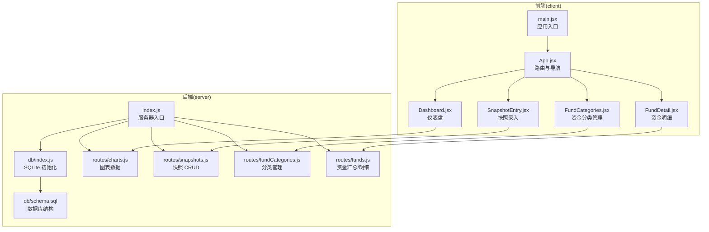
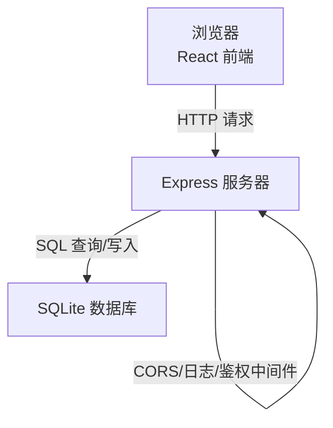
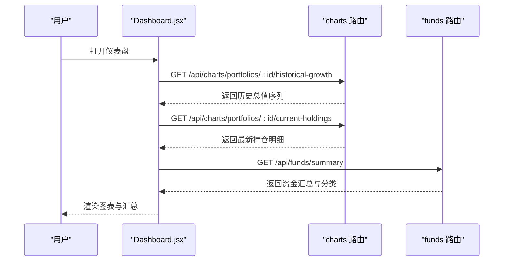
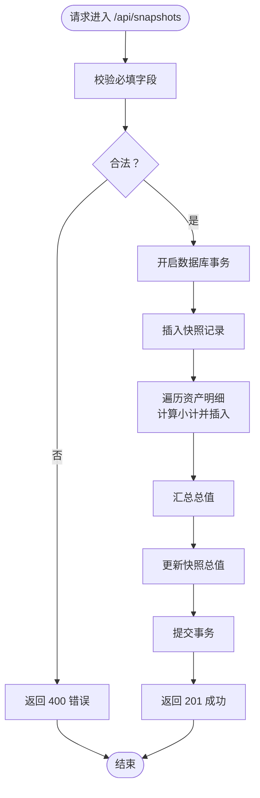
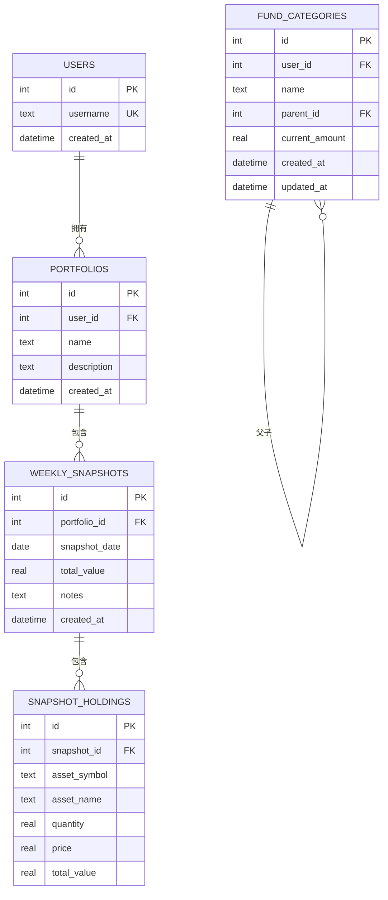
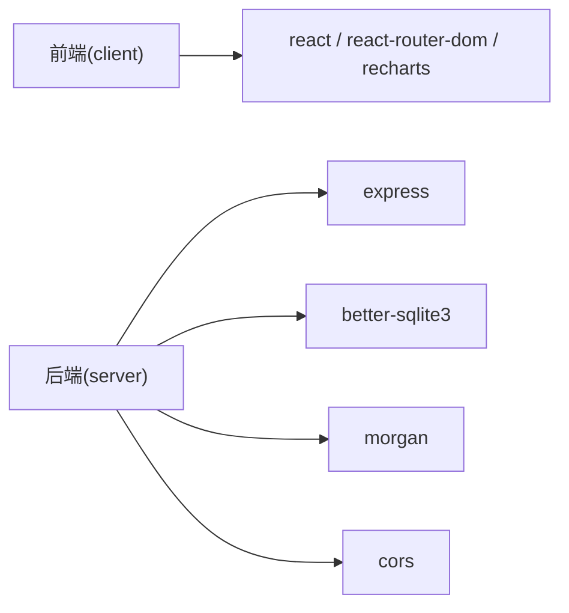

# 项目概述

<cite>
**本文引用的文件**
- [client/package.json](file://client/package.json)
- [server/package.json](file://server/package.json)
- [client/src/App.jsx](file://client/src/App.jsx)
- [client/src/main.jsx](file://client/src/main.jsx)
- [client/src/pages/Dashboard.jsx](file://client/src/pages/Dashboard.jsx)
- [client/src/pages/SnapshotEntry.jsx](file://client/src/pages/SnapshotEntry.jsx)
- [client/src/pages/FundCategories.jsx](file://client/src/pages/FundCategories.jsx)
- [client/src/pages/FundDetail.jsx](file://client/src/pages/FundDetail.jsx)
- [server/index.js](file://server/index.js)
- [server/db/index.js](file://server/db/index.js)
- [server/db/schema.sql](file://server/db/schema.sql)
- [server/routes/charts.js](file://server/routes/charts.js)
- [server/routes/snapshots.js](file://server/routes/snapshots.js)
- [server/routes/fundCategories.js](file://server/routes/fundCategories.js)
- [server/routes/funds.js](file://server/routes/funds.js)
</cite>

## 目录
1. [引言](#引言)
2. [项目结构](#项目结构)
3. [核心组件](#核心组件)
4. [架构总览](#架构总览)
5. [详细组件分析](#详细组件分析)
6. [依赖分析](#依赖分析)
7. [性能考虑](#性能考虑)
8. [故障排除指南](#故障排除指南)
9. [结论](#结论)
10. [附录](#附录)

## 引言
本项目是一个“个人投资追踪系统”，旨在帮助用户：
- 追踪投资组合的历史增长与当前持仓分布
- 管理资金分类（支持两级分类）
- 记录每周快照数据（含资产明细）
- 可视化财务状况（折线图、饼图）

系统采用前后端分离架构：前端使用 React + Vite 构建，后端基于 Express 提供 REST API，数据库采用 SQLite（better-sqlite3）。通过清晰的路由与数据模型，系统实现了从数据录入、存储到图表展示的完整闭环。

## 项目结构
项目分为两个子工程：
- 前端（client）：React 应用，负责页面渲染、用户交互与图表展示
- 后端（server）：Express 服务，提供 API、处理业务逻辑与数据库访问

**图表来源**
- [client/src/main.jsx:1-13](file://client/src/main.jsx#L1-L13)
- [client/src/App.jsx:1-28](file://client/src/App.jsx#L1-L28)
- [client/src/pages/Dashboard.jsx:1-96](file://client/src/pages/Dashboard.jsx#L1-L96)
- [client/src/pages/SnapshotEntry.jsx:1-132](file://client/src/pages/SnapshotEntry.jsx#L1-L132)
- [client/src/pages/FundCategories.jsx:1-156](file://client/src/pages/FundCategories.jsx#L1-L156)
- [client/src/pages/FundDetail.jsx:1-46](file://client/src/pages/FundDetail.jsx#L1-L46)
- [server/index.js:1-32](file://server/index.js#L1-L32)
- [server/db/index.js:1-19](file://server/db/index.js#L1-L19)
- [server/db/schema.sql:1-79](file://server/db/schema.sql#L1-L79)
- [server/routes/charts.js:1-74](file://server/routes/charts.js#L1-L74)
- [server/routes/snapshots.js:1-124](file://server/routes/snapshots.js#L1-L124)
- [server/routes/fundCategories.js:1-139](file://server/routes/fundCategories.js#L1-L139)
- [server/routes/funds.js:1-95](file://server/routes/funds.js#L1-L95)

**章节来源**
- [client/package.json:1-24](file://client/package.json#L1-L24)
- [server/package.json:1-18](file://server/package.json#L1-L18)
- [client/src/main.jsx:1-13](file://client/src/main.jsx#L1-L13)
- [client/src/App.jsx:1-28](file://client/src/App.jsx#L1-L28)
- [server/index.js:1-32](file://server/index.js#L1-L32)

## 核心组件
- 前端页面
  - 仪表盘：展示历史增长曲线与最新持仓饼图，聚合资金汇总信息
  - 快照录入：按周记录资产持有情况，支持自动填充上一周数据
  - 资金分类管理：维护两级资金分类树，支持增删改查
  - 资金明细：展示顶层与子级分类的累计金额
- 后端接口
  - 图表数据：历史增长、最新持仓
  - 快照：创建/修改/查询快照及明细
  - 分类：树形结构查询、创建/更新分类
  - 资金：首页汇总与详情树形展示

**章节来源**
- [client/src/pages/Dashboard.jsx:1-96](file://client/src/pages/Dashboard.jsx#L1-L96)
- [client/src/pages/SnapshotEntry.jsx:1-132](file://client/src/pages/SnapshotEntry.jsx#L1-L132)
- [client/src/pages/FundCategories.jsx:1-156](file://client/src/pages/FundCategories.jsx#L1-L156)
- [client/src/pages/FundDetail.jsx:1-46](file://client/src/pages/FundDetail.jsx#L1-L46)
- [server/routes/charts.js:1-74](file://server/routes/charts.js#L1-L74)
- [server/routes/snapshots.js:1-124](file://server/routes/snapshots.js#L1-L124)
- [server/routes/fundCategories.js:1-139](file://server/routes/fundCategories.js#L1-L139)
- [server/routes/funds.js:1-95](file://server/routes/funds.js#L1-L95)

## 架构总览
系统采用前后端分离设计：
- 前端：React 单页应用，使用 React Router 进行页面切换，Recharts 展示图表
- 后端：Express 中间件链路统一处理 CORS、JSON 解析、日志与用户上下文注入，路由模块化组织各领域 API
- 数据层：better-sqlite3 连接本地 SQLite 文件，启动时执行 schema 初始化

**图表来源**
- [server/index.js:1-32](file://server/index.js#L1-L32)
- [server/db/index.js:1-19](file://server/db/index.js#L1-L19)
- [client/src/main.jsx:1-13](file://client/src/main.jsx#L1-L13)

## 详细组件分析

### 前端组件分析
- 应用入口与路由
  - main.jsx 设置 BrowserRouter 并挂载 App
  - App.jsx 定义导航与路由，映射到 Dashboard、SnapshotEntry、FundCategories、FundDetail
- Dashboard
  - 通过图表路由获取历史增长与最新持仓数据，使用 Recharts 渲染折线图与饼图
  - 顶部展示资金汇总与各顶级分类小计
- SnapshotEntry
  - 支持日期选择、备注输入与多条资产明细（符号、名称、数量、价格）
  - 自动加载最近一次快照用于预填
  - 提交时调用快照接口，成功后跳转回仪表盘
- FundCategories
  - 加载分类树，支持新增/编辑分类（仅允许两级）
  - 提交时根据是否存在 id 判断新增或更新
- FundDetail
  - 展示顶层与子级分类的累计金额，形成树形结构

**图表来源**
- [client/src/pages/Dashboard.jsx:14-32](file://client/src/pages/Dashboard.jsx#L14-L32)
- [server/routes/charts.js:10-27](file://server/routes/charts.js#L10-L27)
- [server/routes/funds.js:6-45](file://server/routes/funds.js#L6-L45)

**章节来源**
- [client/src/main.jsx:1-13](file://client/src/main.jsx#L1-L13)
- [client/src/App.jsx:1-28](file://client/src/App.jsx#L1-L28)
- [client/src/pages/Dashboard.jsx:1-96](file://client/src/pages/Dashboard.jsx#L1-L96)
- [client/src/pages/SnapshotEntry.jsx:1-132](file://client/src/pages/SnapshotEntry.jsx#L1-L132)
- [client/src/pages/FundCategories.jsx:1-156](file://client/src/pages/FundCategories.jsx#L1-L156)
- [client/src/pages/FundDetail.jsx:1-46](file://client/src/pages/FundDetail.jsx#L1-L46)

### 后端组件分析
- 服务器入口
  - 注册 CORS、JSON、日志中间件
  - 注入用户上下文（硬编码 user_id=1）
  - 挂载各模块路由
- 数据库初始化
  - better-sqlite3 连接本地 sqlite 文件
  - 启动时读取 schema.sql 并执行，确保表存在
- 路由模块
  - charts：历史增长、最新持仓
  - snapshots：创建/更新快照、查询快照详情（事务保证一致性）
  - fundCategories：树形构建、创建/更新分类（唯一性约束）
  - funds：首页汇总（顶层+子级合计）、详情树形

**图表来源**
- [server/routes/snapshots.js:34-72](file://server/routes/snapshots.js#L34-L72)

**章节来源**
- [server/index.js:1-32](file://server/index.js#L1-L32)
- [server/db/index.js:1-19](file://server/db/index.js#L1-L19)
- [server/db/schema.sql:1-79](file://server/db/schema.sql#L1-L79)
- [server/routes/charts.js:1-74](file://server/routes/charts.js#L1-L74)
- [server/routes/snapshots.js:1-124](file://server/routes/snapshots.js#L1-L124)
- [server/routes/fundCategories.js:1-139](file://server/routes/fundCategories.js#L1-L139)
- [server/routes/funds.js:1-95](file://server/routes/funds.js#L1-L95)

### 数据模型与关系
系统围绕以下实体展开：
- 用户：硬编码用户（便于演示）
- 投资组合：属于用户，可有多期快照
- 快照：按日期唯一，记录当期总资产
- 快照资产明细：记录每只资产的数量、单价与小计
- 资金分类：支持父子关系，唯一性约束保证同级名称唯一

**图表来源**
- [server/db/schema.sql:4-79](file://server/db/schema.sql#L4-L79)

**章节来源**
- [server/db/schema.sql:1-79](file://server/db/schema.sql#L1-L79)

## 依赖分析
- 前端依赖
  - react、react-dom、react-router-dom：构建用户界面与路由
  - recharts：可视化图表
- 后端依赖
  - express：Web 框架
  - better-sqlite3：高性能 SQLite 驱动
  - cors、morgan：跨域与日志

**图表来源**
- [client/package.json:11-16](file://client/package.json#L11-L16)
- [server/package.json:11-16](file://server/package.json#L11-L16)

**章节来源**
- [client/package.json:1-24](file://client/package.json#L1-L24)
- [server/package.json:1-18](file://server/package.json#L1-L18)

## 性能考虑
- 前端
  - 使用响应式图表容器，适配不同屏幕尺寸
  - 在仪表盘中并发发起多个 API 请求，减少等待时间
- 后端
  - 快照创建使用事务，保证原子性与一致性
  - 查询路径尽量使用索引列（如按日期排序、唯一约束）
  - 日志中间件有助于定位性能瓶颈
- 数据库
  - 外键与唯一索引保障数据完整性
  - schema 初始化在进程启动时完成，避免运行时重复开销

[本节为通用建议，无需特定文件来源]

## 故障排除指南
- 常见错误类型与处理
  - 快照重复日期：后端对日期+组合唯一约束，返回 409
  - 缺少必填字段：返回 400
  - 分类名称冲突：同级唯一约束导致 409
  - 分类层级非法：仅支持两级，超过报 400
  - 未找到资源：返回 404
- 排查步骤
  - 检查网络面板确认请求是否到达后端
  - 查看后端控制台日志（morgan 输出）
  - 确认数据库文件存在且 schema 已初始化
  - 核对路由路径与请求体格式

**章节来源**
- [server/routes/snapshots.js:66-71](file://server/routes/snapshots.js#L66-L71)
- [server/routes/fundCategories.js:63-80](file://server/routes/fundCategories.js#L63-L80)
- [server/db/index.js:12-19](file://server/db/index.js#L12-L19)

## 结论
本项目以简洁的前后端分离架构，提供了从数据采集、存储到可视化的完整能力。通过两级资金分类与快照机制，用户可以持续追踪资产变化与资金分布。后端采用 SQLite 与事务保证数据一致性，前端以图表直观呈现趋势与结构，适合个人用户进行长期财务观察与复盘。

## 附录
- 技术选型说明
  - 前端：React 生态成熟、组件化开发体验好；Vite 构建快速；Recharts 轻量易用
  - 后端：Express 轻量灵活；better-sqlite3 本地部署简单、性能稳定；SQLite 适合中小规模数据
- 业务价值
  - 周期性记录与可视化，帮助识别资产配置与收益变化
  - 分类体系支撑预算与目标管理
- 差异化特点
  - 两级分类设计兼顾灵活性与可维护性
  - 快照与图表联动，既关注时点也关注趋势
  - 硬编码用户上下文简化部署，便于快速试用

[本节为总结性内容，无需特定文件来源]